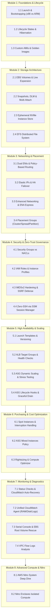

<div align="center">

# 🖥️ Amazon EC2 Master Hands-On Labs Curriculum

**[🏠 Back to AWS Labs Root](../README.md)**


*A complete, production-grade engineering curriculum covering every architectural, storage, networking, security, scaling, FinOps, disaster recovery, and hardware aspect of Amazon Elastic Compute Cloud (EC2).*

</div>


<div align="center">

[](https://cyber-cloud-security.github.io/aws-labs/)

*🚀 Experience step-by-step CLI execution, dynamic packet animations, active component flashing borders, and under-the-hood AWS control/data plane state transitions live in your browser.*

</div>

---

## 🧭 Curriculum Architecture Map

```mermaid
flowchart TD
    subgraph M1["Module 1: Foundations & Lifecycle"]
        L1_1["1.1 Launch & Bootstrapping (x86 vs ARM)"]
        L1_2["1.2 Lifecycle States & Hibernation"]
        L1_3["1.3 Custom AMIs & Golden Images"]
    end

    subgraph M2["Module 2: Storage Architecture"]
        L2_1["2.1 EBS Volumes & Live Expansion"]
        L2_2["2.2 Snapshots, DLM & Multi-Attach"]
        L2_3["2.3 Ephemeral NVMe Instance Store"]
        L2_4["2.4 EFS Distributed File System"]
    end

    subgraph M3["Module 3: Networking & Placement"]
        L3_1["3.1 Dual ENIs & Policy-Based Routing"]
        L3_2["3.2 Elastic IPs & HA Failover"]
        L3_3["3.3 Enhanced Networking & ENA Express"]
        L3_4["3.4 Placement Groups (Cluster/Spread/Partition)"]
    end

    subgraph M4["Module 4: Security & Zero-Trust Governance"]
        L4_1["4.1 Security Groups vs NACLs"]
        L4_2["4.2 IAM Roles & Instance Profiles"]
        L4_3["4.3 IMDSv2 Hardening & SSRF Defense"]
        L4_4["4.4 Zero-SSH via SSM Session Manager"]
    end

    subgraph M5["Module 5: High Availability & Scaling"]
        L5_1["5.1 Launch Templates & Versioning"]
        L5_2["5.2 ALB Target Groups & Health Checks"]
        L5_3["5.3 ASG Dynamic Scaling & Stress Testing"]
        L5_4["5.4 ASG Lifecycle Hooks & Graceful Drain"]
    end

    subgraph M6["Module 6: Purchasing & Cost Optimization"]
        L6_1["6.1 Spot Instances & Interruption Handling"]
        L6_2["6.2 ASG Mixed Instances Policy"]
        L6_3["6.3 Rightsizing & Compute Optimizer"]
    end

    subgraph M7["Module 7: Monitoring & Diagnostics"]
        L7_1["7.1 Status Checks & CloudWatch Auto-Recovery"]
        L7_2["7.2 Unified CloudWatch Agent (RAM/Disk/Logs)"]
        L7_3["7.3 Serial Console & EBS Root Volume Rescue"]
        L7_4["7.4 VPC Flow Logs Analysis"]
    end

    subgraph M8["Module 8: Advanced Compute & Nitro"]
        L8_1["8.1 AWS Nitro System Deep Dive"]
        L8_2["8.2 Nitro Enclaves Isolated Compute"]
    end

    M1 --> M2 --> M3 --> M4 --> M5 --> M6 --> M7 --> M8
```



<details>
<summary>📐 <b>View Mermaid Architecture Source (Click to Expand)</b></summary>



</details>

---

## 📚 Complete 8-Module & 28-Lab Directory

### 🧱 [Module 01: Foundations, Architectures & Lifecycle](./module-01-fundamentals-and-lifecycle/README.md)
_Master EC2 processor architectures (x86_64 vs AWS Graviton ARM64), automated User Data bootstrapping, instance lifecycle state transitions, encrypted RAM hibernation, and immutable Golden AMI pipelines._

| Lab # | Laboratory Guide | Duration | Cost Tier |
| :---: | :--- | :---: | :---: |
| **Lab 1.1** | **[Launching & Bootstrapping EC2 (x86_64 vs Graviton ARM64)](./module-01-fundamentals-and-lifecycle/lab-01-launch-and-bootstrap/README.md)** | `15 minutes` | ✅ Free Tier |
| **Lab 1.2** | **[Instance Lifecycle States & EC2 Hibernation](./module-01-fundamentals-and-lifecycle/lab-02-lifecycle-and-hibernation/README.md)** | `20 minutes` | ✅ Free Tier |
| **Lab 1.3** | **[Custom AMIs, Golden Images & Cross-Region Distribution](./module-01-fundamentals-and-lifecycle/lab-03-amis-and-image-builder/README.md)** | `20 minutes` | ✅ Free Tier |

### 💾 [Module 02: Storage Architecture (EBS, Ephemeral & EFS)](./module-02-storage-ebs-ephemeral-efs/README.md)
_Deep-dive into cloud block, ephemeral, and shared file storage: zero-downtime Elastic Volume resizing, Data Lifecycle Manager (DLM), io2 Multi-Attach clustering, local NVMe Instance Store benchmarking, and multi-AZ Amazon EFS._

| Lab # | Laboratory Guide | Duration | Cost Tier |
| :---: | :--- | :---: | :---: |
| **Lab 2.1** | **[EBS Volume Management & Online Elastic Volume Expansion](./module-02-storage-ebs-ephemeral-efs/lab-01-ebs-elastic-volumes/README.md)** | `20 minutes` | ✅ Free Tier |
| **Lab 2.2** | **[EBS Snapshots, Data Lifecycle Manager (DLM) & io2 Multi-Attach](./module-02-storage-ebs-ephemeral-efs/lab-02-snapshots-dlm-multiattach/README.md)** | `20 minutes` | ⚠️ Paid |
| **Lab 2.3** | **[Ephemeral Storage (Instance Store) & High-IOPS Benchmarking](./module-02-storage-ebs-ephemeral-efs/lab-03-instance-store-ephemeral/README.md)** | `15 minutes` | ⚠️ Paid |
| **Lab 2.4** | **[Multi-AZ Shared Storage with Amazon Elastic File System (EFS)](./module-02-storage-ebs-ephemeral-efs/lab-04-efs-shared-filesystem/README.md)** | `20 minutes` | ✅ Free Tier |

### 🌐 [Module 03: Networking, Addressing & Placement Strategies](./module-03-networking-eni-placement/README.md)
_Configure multi-homed EC2 instances with Linux policy-based routing (`ip rule`), automated Elastic IP failover, Enhanced Networking with ENA Express (SRD protocol), and hardware Placement Groups (Cluster, Spread, Partition)._

| Lab # | Laboratory Guide | Duration | Cost Tier |
| :---: | :--- | :---: | :---: |
| **Lab 3.1** | **[Dual Elastic Network Interfaces (ENI) & Linux Policy Routing](./module-03-networking-eni-placement/lab-01-dual-eni-routing/README.md)** | `20 minutes` | ✅ Free Tier |
| **Lab 3.2** | **[Elastic IP Addresses (EIP) & Automated High-Availability Failover](./module-03-networking-eni-placement/lab-02-elastic-ips-ha/README.md)** | `15 minutes` | ⚠️ Paid |
| **Lab 3.3** | **[Enhanced Networking & ENA Express (SRD Protocol)](./module-03-networking-eni-placement/lab-03-enhanced-networking-ena/README.md)** | `15 minutes` | ⚠️ Paid |
| **Lab 3.4** | **[EC2 Placement Groups (Cluster, Spread & Partition)](./module-03-networking-eni-placement/lab-04-placement-groups/README.md)** | `15 minutes` | ✅ Free Tier |

### 🛡️ [Module 04: Security, IAM & Zero-Trust Governance](./module-04-security-iam-ssm/README.md)
_Implement defense-in-depth network controls (stateful Security Groups vs stateless NACLs), zero-credential IAM Instance Profiles, IMDSv2 SSRF hardening, and zero-SSH administration via AWS Systems Manager Session Manager._

| Lab # | Laboratory Guide | Duration | Cost Tier |
| :---: | :--- | :---: | :---: |
| **Lab 4.1** | **[Security Groups vs Network ACLs (Stateless vs Stateful Deep Dive)](./module-04-security-iam-ssm/lab-01-security-groups-nacls/README.md)** | `20 minutes` | ✅ Free Tier |
| **Lab 4.2** | **[IAM Roles & Instance Profiles (Zero-Credential Architecture)](./module-04-security-iam-ssm/lab-02-iam-roles-instance-profiles/README.md)** | `15 minutes` | ✅ Free Tier |
| **Lab 4.3** | **[IMDSv2 Hardening & SSRF Threat Mitigation](./module-04-security-iam-ssm/lab-03-imdsv2-hardening/README.md)** | `15 minutes` | ✅ Free Tier |
| **Lab 4.4** | **[Zero-SSH Access via AWS Systems Manager (SSM) Session Manager](./module-04-security-iam-ssm/lab-04-ssm-session-manager/README.md)** | `20 minutes` | ✅ Free Tier |

### ⚖️ [Module 05: High Availability, Auto Scaling & Load Balancing](./module-05-ha-asg-alb/README.md)
_Architect self-healing, multi-AZ compute fleets using versioned Launch Templates, Application Load Balancers (ALB), Target Tracking dynamic scaling policies, and ASG Termination Lifecycle Hooks for graceful state drainage._

| Lab # | Laboratory Guide | Duration | Cost Tier |
| :---: | :--- | :---: | :---: |
| **Lab 5.1** | **[EC2 Launch Templates & Multi-Version Management](./module-05-ha-asg-alb/lab-01-launch-templates/README.md)** | `15 minutes` | ✅ Free Tier |
| **Lab 5.2** | **[Application Load Balancer (ALB), Target Groups & Health Checks](./module-05-ha-asg-alb/lab-02-alb-and-target-groups/README.md)** | `20 minutes` | ⚠️ Paid |
| **Lab 5.3** | **[Auto Scaling Groups (ASG) & Target Tracking Dynamic Scaling](./module-05-ha-asg-alb/lab-03-asg-dynamic-scaling/README.md)** | `25 minutes` | ✅ Free Tier |
| **Lab 5.4** | **[ASG Lifecycle Hooks & Graceful State Flushing](./module-05-ha-asg-alb/lab-04-asg-lifecycle-hooks/README.md)** | `20 minutes` | ✅ Free Tier |

### 💰 [Module 06: Purchasing Models & FinOps Cost Optimization](./module-06-purchasing-cost-optimization/README.md)
_Optimize cloud compute spend by up to 90% using Spot Instances with automated 2-minute interruption watchdogs, diversified Mixed-Instance Auto Scaling fleets, AWS Compute Optimizer rightsizing, and live gp2-to-gp3 storage modernization._

| Lab # | Laboratory Guide | Duration | Cost Tier |
| :---: | :--- | :---: | :---: |
| **Lab 6.1** | **[Spot Instances & Automated 2-Minute Interruption Warning Handling](./module-06-purchasing-cost-optimization/lab-01-spot-interruption-handling/README.md)** | `15 minutes` | ⚠️ Paid |
| **Lab 6.2** | **[Auto Scaling Groups with Mixed Instances Policy (Spot + On-Demand)](./module-06-purchasing-cost-optimization/lab-02-asg-mixed-instances/README.md)** | `15 minutes` | ✅ Free Tier |
| **Lab 6.3** | **[FinOps Rightsizing, Compute Optimizer & gp2-to-gp3 Modernization](./module-06-purchasing-cost-optimization/lab-03-cost-optimization-rightsizing/README.md)** | `15 minutes` | ✅ Free Tier |

### 🩺 [Module 07: Monitoring, Diagnostics & Disaster Recovery](./module-07-monitoring-and-troubleshooting/README.md)
_Build production observability and recovery workflows: EC2 System vs Instance Status Checks with automated hardware recovery, the Unified CloudWatch Agent (RAM, Disk & Logs), out-of-band Serial Console & EBS root volume rescue, and VPC Flow Logs forensics._

| Lab # | Laboratory Guide | Duration | Cost Tier |
| :---: | :--- | :---: | :---: |
| **Lab 7.1** | **[EC2 Status Checks & CloudWatch Automated Hardware Recovery](./module-07-monitoring-and-troubleshooting/lab-01-status-checks-autorecovery/README.md)** | `15 minutes` | ✅ Free Tier |
| **Lab 7.2** | **[Unified CloudWatch Agent (OS-Level RAM, Disk & Log Streaming)](./module-07-monitoring-and-troubleshooting/lab-02-cloudwatch-agent-metrics-logs/README.md)** | `20 minutes` | ✅ Free Tier |
| **Lab 7.3** | **[Disaster Recovery: EC2 Serial Console & EBS Root Volume Rescue](./module-07-monitoring-and-troubleshooting/lab-03-serial-console-ebs-rescue/README.md)** | `25 minutes` | ✅ Free Tier |
| **Lab 7.4** | **[VPC Flow Logs & Network Traffic Forensics](./module-07-monitoring-and-troubleshooting/lab-04-vpc-flow-logs/README.md)** | `20 minutes` | ✅ Free Tier |

### ⚡ [Module 08: Advanced Compute & AWS Nitro System](./module-08-advanced-nitro/README.md)
_Explore the hardware foundation of modern AWS compute: dedicated Nitro ASIC cards (VPC, EBS, Storage, Security Chip), bare-metal PCIe/NVMe pass-through inspection, and cryptographic confidential computing with AWS Nitro Enclaves._

| Lab # | Laboratory Guide | Duration | Cost Tier |
| :---: | :--- | :---: | :---: |
| **Lab 8.1** | **[AWS Nitro System Architecture & Hardware Offloading](./module-08-advanced-nitro/lab-01-nitro-architecture/README.md)** | `15 minutes` | ✅ Free Tier |
| **Lab 8.2** | **[AWS Nitro Enclaves & Cryptographic Confidential Computing](./module-08-advanced-nitro/lab-02-nitro-enclaves/README.md)** | `20 minutes` | ⚠️ Paid |


---

## 🛠️ Prerequisites & Environment Setup

> [!IMPORTANT]
> **Before Running Any Lab**: Ensure your local terminal is configured with AWS CLI v2 and valid IAM credentials.

1. **AWS Account**: An active AWS account with sandbox/administrator permissions.
2. **AWS CLI v2**: Configure your credentials and default region (e.g., `us-east-1` or `us-west-2`):
   ```bash
   aws configure
   ```
3. **Session Manager Plugin**: Install the AWS Systems Manager Session Manager plugin for zero-SSH interactive terminal sessions.
4. **Automated Pre-Flight Validation**:
   ```bash
   chmod +x ./scripts/setup_prereqs.sh
   ./scripts/setup_prereqs.sh
   ```

---

## 💰 Cost Control & Free Tier Guardrails

> [!CAUTION]
> **Prevent Unintended Cloud Billing**: Always run the `🧹 Teardown & Clean-up` section at the bottom of each lab immediately after completing your tests.

To scan your AWS account for any lingering lab instances, unattached Elastic IPs, or orphaned EBS volumes created during these exercises, run our global auditor script:

```bash
chmod +x ./scripts/cleanup_all.sh
./scripts/cleanup_all.sh
```
