```mermaid
flowchart TD
    subgraph M1["Module 1: Foundations & Lifecycle"]
        L1_1["1.1 Launch & Bootstrapping (x86 vs ARM)"]
        L1_2["1.2 Lifecycle States & Hibernation"]
        L1_3["1.3 Custom AMIs & Golden Images"]
    end

    subgraph M2["Module 2: Storage Architecture"]
        L2_1["2.1 EBS Volumes & Live Expansion"]
        L2_2["2.2 Snapshots, DLM & Multi-Attach"]
        L2_3["2.3 Ephemeral NVMe Instance Store"]
        L2_4["2.4 EFS Distributed File System"]
    end

    subgraph M3["Module 3: Networking & Placement"]
        L3_1["3.1 Dual ENIs & Policy-Based Routing"]
        L3_2["3.2 Elastic IPs & HA Failover"]
        L3_3["3.3 Enhanced Networking & ENA Express"]
        L3_4["3.4 Placement Groups (Cluster/Spread/Partition)"]
    end

    subgraph M4["Module 4: Security & Zero-Trust Governance"]
        L4_1["4.1 Security Groups vs NACLs"]
        L4_2["4.2 IAM Roles & Instance Profiles"]
        L4_3["4.3 IMDSv2 Hardening & SSRF Defense"]
        L4_4["4.4 Zero-SSH via SSM Session Manager"]
    end

    subgraph M5["Module 5: High Availability & Scaling"]
        L5_1["5.1 Launch Templates & Versioning"]
        L5_2["5.2 ALB Target Groups & Health Checks"]
        L5_3["5.3 ASG Dynamic Scaling & Stress Testing"]
        L5_4["5.4 ASG Lifecycle Hooks & Graceful Drain"]
    end

    subgraph M6["Module 6: Purchasing & Cost Optimization"]
        L6_1["6.1 Spot Instances & Interruption Handling"]
        L6_2["6.2 ASG Mixed Instances Policy"]
        L6_3["6.3 Rightsizing & Compute Optimizer"]
    end

    subgraph M7["Module 7: Monitoring & Diagnostics"]
        L7_1["7.1 Status Checks & CloudWatch Auto-Recovery"]
        L7_2["7.2 Unified CloudWatch Agent (RAM/Disk/Logs)"]
        L7_3["7.3 Serial Console & EBS Root Volume Rescue"]
        L7_4["7.4 VPC Flow Logs Analysis"]
    end

    subgraph M8["Module 8: Advanced Compute & Nitro"]
        L8_1["8.1 AWS Nitro System Deep Dive"]
        L8_2["8.2 Nitro Enclaves Isolated Compute"]
    end

    M1 --> M2 --> M3 --> M4 --> M5 --> M6 --> M7 --> M8
```

# AWS EC2 Master Hands-On Labs Curriculum

Welcome to the **AWS EC2 Master Labs** repository. This curriculum is designed to give cloud architects, DevOps engineers, and system administrators a deep, production-grade understanding of **every aspect of Amazon Elastic Compute Cloud (EC2)**.

---

## 🧭 Curriculum Map


<details>
<summary>Click to expand Mermaid diagram source</summary>


</details>

---

## 📚 Modules Directory

| Module | Directory | Key Concepts Covered |
| :--- | :--- | :--- |
| **01. Foundations & Lifecycle** | [`module-01-fundamentals-and-lifecycle/`](./module-01-fundamentals-and-lifecycle) | x86 vs Graviton ARM64 (`t4g`), User Data bootstrapping, EC2 Hibernation, Golden AMIs |
| **02. Storage Architecture** | [`module-02-storage-ebs-ephemeral-efs/`](./module-02-storage-ebs-ephemeral-efs) | EBS `gp3`/`io2`, Online Elastic Volume Resizing, NVMe Instance Store, Amazon EFS |
| **03. Networking & Placement** | [`module-03-networking-eni-placement/`](./module-03-networking-eni-placement) | Multi-ENI routing, Elastic IPs & HA failover, ENA Express (SRD), Cluster/Spread/Partition Groups |
| **04. Security & Zero-Trust** | [`module-04-security-iam-ssm/`](./module-04-security-iam-ssm) | Security Groups vs NACLs, IAM Instance Profiles, IMDSv2 Hardening, Zero-SSH SSM Session Manager |
| **05. HA, Scaling & Load Balancing** | [`module-05-ha-asg-alb/`](./module-05-ha-asg-alb) | Multi-version Launch Templates, Application Load Balancers, Dynamic Target Tracking ASG, Lifecycle Hooks |
| **06. Purchasing & Cost** | [`module-06-purchasing-cost-optimization/`](./module-06-purchasing-cost-optimization) | Spot Instances & 2-minute notice handling, Mixed ASG (Spot + On-Demand), Compute Optimizer, gp2-to-gp3 |
| **07. Monitoring & Troubleshooting**| [`module-07-monitoring-and-troubleshooting/`](./module-07-monitoring-and-troubleshooting) | Status Checks & Auto-Recovery, CloudWatch Unified Agent (RAM/Disk/Logs), Serial Console, EBS Rescue |
| **08. Advanced Nitro Architecture** | [`module-08-advanced-nitro/`](./module-08-advanced-nitro) | Nitro Cards, Nitro Hypervisor, Nitro Security Chip, Nitro Enclaves isolated compute |

---

## 🛠️ Prerequisites & Setup

1. **AWS Account**: An active AWS account with administrative or sandbox permissions.
2. **AWS CLI v2**: Run `aws configure` to set your access keys and target region (e.g. `us-east-1` or `us-west-2`).
3. **Session Manager Plugin**: Install the AWS Systems Manager Session Manager plugin locally if connecting to instances via CLI without SSH keys.
4. **Validation**: Run the pre-flight check script:
   ```bash
   chmod +x ./scripts/setup_prereqs.sh
   ./scripts/setup_prereqs.sh
   ```

---

## 💰 Cost Control & Free Tier Guardrails

- **Free Tier Awareness**: All labs utilize `t2.micro`, `t3.micro`, or `t4g.micro` where eligible.
- **Teardown Responsibility**: Always run the cleanup commands listed at the end of each lab.
- **Leftover Check**: To scan your account for running lab instances or unattached Elastic IPs, run:
   ```bash
   chmod +x ./scripts/cleanup_all.sh
   ./scripts/cleanup_all.sh
   ```
