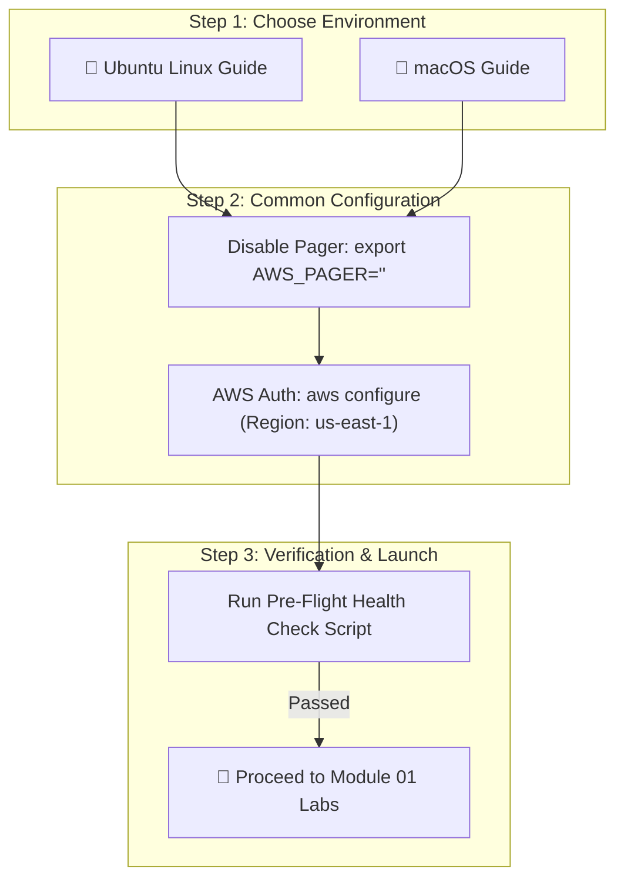

# ⚙️ Module 00: Global Prerequisites & AWS CLI Setup Hub

[🏠 EC2 Index](../README.md) &nbsp;•&nbsp; [🚀 Start Module 01: Foundations](../module-01-fundamentals-and-lifecycle/README.md) &nbsp;•&nbsp; [🎮 Live Interactive Simulator](https://cyber-cloud-security.github.io/aws-labs/)

---

## 📌 Overview & Purpose

This module establishes the **foundational workstation and cloud environment** required to successfully execute all 28 labs in the Amazon EC2 curriculum. 

Completing this one-time setup guarantees:
1. **AWS CLI v2** is installed and optimized for your operating system.
2. Terminal pagination issues (`AWS_PAGER=""`) are eliminated to prevent commands and scripts from hanging.
3. IAM credentials, default region (`us-east-1`), and permissions are verified via automated health checks.
4. An isolated Linux sandbox can be spun up in seconds if you are using Canonical Multipass.

---

## 🧭 Select Your Operating System Setup Guide

Choose your operating system to access its dedicated, step-by-step setup guide:

| Operating System | Target Environments | Guide Link |
| :--- | :--- | :---: |
| 🐧 **Ubuntu Linux** | Local Ubuntu, Multipass VMs, WSL2, or Cloud Bastions | 👉 **[Ubuntu Setup Guide](./prerequisites-ubuntu.md)** |
| 🍎 **macOS** | Apple Silicon (`M1`–`M4`) & Intel Macs (Homebrew or PKG) | 👉 **[macOS Setup Guide](./prerequisites-macos.md)** |

---

## 🔑 Baseline Requirements Summary

---

## ⏱️ Curriculum Cost & Free Tier Guardrails

> [!TIP]
> **Free Tier Strategy**:
> - All 28 labs are designed to maximize the **AWS Free Tier** (using `t3.micro` / `t4g.micro` instances and standard 8 GB root EBS volumes).
> - Every lab includes explicit, mandatory **Teardown & Clean-up scripts** to ensure no leftover billable resources remain running.

---

## 🚀 Get Started

1. 🐧 **[Open the Ubuntu Setup Guide](./prerequisites-ubuntu.md)**
2. 🍎 **[Open the macOS Setup Guide](./prerequisites-macos.md)**
