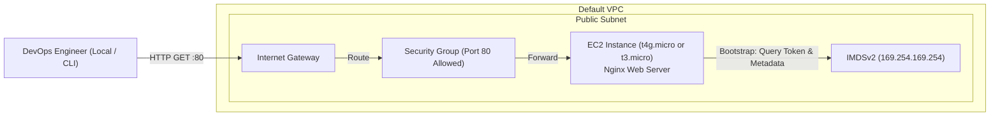

<div align="center">

# 🔬 Lab 1.1: Launching & Bootstrapping EC2 (x86_64 vs Graviton ARM64)

**[🏠 AWS Labs Root](../../../README.md)** &nbsp;•&nbsp; **[🖥️ EC2 Curriculum](../../README.md)** &nbsp;•&nbsp; **[📂 Module 01](../README.md)**

   

**⬅️ Previous Lab (Start)** &nbsp;|&nbsp; **[➡️ Next Lab](../../module-01-fundamentals-and-lifecycle/lab-02-lifecycle-and-hibernation/README.md)**

</div>

---

## 📌 Lab Objectives

- [x] Understand the difference between x86_64 (`Intel/AMD`) and ARM64 (`AWS Graviton`) EC2 architectures.
- [x] Launch an EC2 instance programmatically using the AWS CLI.
- [x] Bootstrap the instance with automated **User Data** (`cloud-init`) to install Nginx and query instance metadata.
- [x] Configure Security Groups with least-privilege ingress (HTTP port 80).
- [x] Query instance metadata using **IMDSv2** (Instance Metadata Service Version 2).

---

## 🏗️ Architecture Diagram


<details>
<summary>📐 <b>View Mermaid Architecture Source (Click to Expand)</b></summary>



</details>

---

## 💡 Key Architectural Concepts

1. **Instance Families & Generations**:
   - `t3.micro`: 2 vCPUs (Intel Xeon / AMD EPYC), x86_64, Burstable compute credits.
   - `t4g.micro`: 2 vCPUs (AWS Graviton2), ARM64 architecture, up to 40% better price/performance. Requires ARM64-compiled AMIs and binaries.
2. **User Data & cloud-init**:
   - Executes as `root` once during the first boot lifecycle of an EC2 instance.
   - Output logged to `/var/log/cloud-init-output.log` and `/var/log/user-data.log`.
3. **IMDSv2 (Session-Oriented Metadata)**:
   - Uses HTTP PUT requests with a TTL header to acquire a signed token, preventing Server-Side Request Forgery (SSRF) vulnerabilities found in legacy IMDSv1.

---

## ⏱️ Prerequisites & Cost

> [!TIP]
> **AWS Free Tier & Cost Guardrail**
> - **AWS Free Tier Eligible**: Yes (`t2.micro`, `t3.micro`, or `t4g.micro` free tier allocations).
> - **Estimated Duration**: 15 minutes.

---

## 🚀 Step-by-Step Instructions

### Step 1: Discover Available Default VPC & Subnet
Set your default environment variables:
```bash
export AWS_REGION=$(aws configure get region || echo "us-east-1")
export VPC_ID=$(aws ec2 describe-vpcs \
  --filters "Name=isDefault,Values=true" \
  --query "Vpcs[0].VpcId" \
  --output text)
export SUBNET_ID=$(aws ec2 describe-subnets \
  --filters "Name=vpc-id,Values=${VPC_ID}" \
  --query "Subnets[0].SubnetId" \
  --output text)

echo "Target VPC: ${VPC_ID}"
echo "Target Subnet: ${SUBNET_ID}"
```

### Step 2: Create a Security Group for HTTP Access
```bash
SG_ID=$(aws ec2 create-security-group \
  --group-name "ec2-master-lab-web-sg" \
  --description "Allow inbound HTTP traffic for Lab 1.1" \
  --vpc-id "${VPC_ID}" \
  --tag-specifications "ResourceType=security-group,Tags=[{Key=Project,Value=ec2-master-labs},{Key=Name,Value=web-sg}]" \
  --query "GroupId" --output text)

# Authorize Port 80 from anywhere (0.0.0.0/0)
aws ec2 authorize-security-group-ingress \
  --group-id "${SG_ID}" \
  --protocol tcp \
  --port 80 \
  --cidr 0.0.0.0/0

echo "Created Security Group: ${SG_ID}"
```

### Step 3: Fetch the Latest Amazon Linux 2023 AMI
Choose either **ARM64 (Graviton)** or **x86_64**:

**Option A: AWS Graviton (ARM64 - Recommended)**
```bash
AMI_ID=$(aws ssm get-parameter \
  --name "/aws/service/ami-amazon-linux-latest/al2023-ami-kernel-default-arm64" \
  --query "Parameter.Value" --output text)
INSTANCE_TYPE="t4g.micro"
echo "Resolved ARM64 AMI: ${AMI_ID}"
```

**Option B: Intel/AMD (x86_64)**
```bash
# AMI_ID=$(aws ssm get-parameter \
#   --name "/aws/service/ami-amazon-linux-latest/al2023-ami-kernel-default-x86_64" \
#   --query "Parameter.Value" --output text)
# INSTANCE_TYPE="t3.micro"
```

### Step 4: Launch the EC2 Instance with User Data
We will pass `userdata.sh` into `--user-data` and enforce **IMDSv2**:
```bash
INSTANCE_ID=$(aws ec2 run-instances \
  --image-id "${AMI_ID}" \
  --instance-type "${INSTANCE_TYPE}" \
  --subnet-id "${SUBNET_ID}" \
  --security-group-ids "${SG_ID}" \
  --user-data file://userdata.sh \
  --metadata-options "HttpEndpoint=enabled,HttpTokens=required,HttpPutResponseHopLimit=1" \
  --tag-specifications "ResourceType=instance,Tags=[{Key=Project,Value=ec2-master-labs},{Key=Name,Value=ec2-lab-01-web}]" \
  --query "Instances[0].InstanceId" --output text)

echo "Launched Instance ID: ${INSTANCE_ID}"
```

Wait for the instance to reach `running` state:
```bash
aws ec2 wait instance-running --instance-ids "${INSTANCE_ID}"
echo "Instance ${INSTANCE_ID} is now RUNNING."
```

---

## 🔍 Verification & Testing

### 1. Fetch Public IP
```bash
PUBLIC_IP=$(aws ec2 describe-instances \
  --instance-ids "${INSTANCE_ID}" \
  --query "Reservations[0].Instances[0].PublicIpAddress" --output text)

echo "Instance Public IP: ${PUBLIC_IP}"
```

### 2. Query the Web Server
Wait 30-60 seconds for `cloud-init` to finish package installation, then run:
```bash
curl -i "http://${PUBLIC_IP}"
```
You should receive an HTTP `200 OK` response with an HTML document displaying your instance ID, availability zone, and CPU architecture.

### 3. Inspect the System Log (Console Output)
To see the bootstrap logs directly from AWS without SSH:
```bash
aws ec2 get-console-output --instance-id "${INSTANCE_ID}" --query "Output" --output text | tail -n 30
```

---

## 📘 Deep-Dive Command & Flag Reference

> [!TIP]
> **Line-by-Line Production Analysis**: Every command executed in this lab is dissected below, explaining each CLI flag, JMESPath query, Linux kernel parameter, and why it is critical in production automation.

<details open>
<summary>📘 <b>Command 1: Resolving the Target AWS Region</b></summary>

```bash
export AWS_REGION=$(aws configure get region || echo "us-east-1")
```

#### 🔍 Parameter & Component Breakdown

- **`export AWS_REGION=...`** — Sets the `AWS_REGION` environment variable in the current shell session. Because it is exported, any subshell or subsequent CLI command spawned in this terminal inherits this variable. The AWS CLI automatically detects `AWS_REGION` and uses it as the default target region.

- **`$( ... )` (Command Substitution)** — Executes the command inside the parentheses in a subshell, captures its standard output (`stdout`), strips trailing newlines, and assigns that output to the variable.

- **`aws configure get region`** — Reads your local AWS CLI configuration file (`~/.aws/config`). It inspects the active profile (or the `[default]` profile) and retrieves the value of the `region` setting (e.g., `us-east-1`, `us-west-2`, `ap-south-1`).

- **`||` (Bash Logical OR / Short-Circuit)** — If `aws configure get region` exits with a non-zero exit code (which happens if no region has been configured yet via `aws configure`), bash short-circuits to the right-hand side of the `||` operator.

- **`echo "us-east-1"`** — Outputs `"us-east-1"` as a safe, predictable fallback value. This guarantees that `AWS_REGION` will never be an empty string, preventing commands downstream from crashing with:
`You must specify a region. You can also configure your region by running "aws configure".`

> 🏭 **Why This Matters in Production Automation**
> Almost all Amazon EC2 APIs are region-scoped. Unlike global services (like IAM or Route 53), resources in EC2 (AMIs, VPCs, Subnets, Instances) exist solely within a specific AWS geographic region. If your scripts do not explicitly resolve or assert an active region, automation scripts can fail silently or deploy resources into unintended regions, creating security silos, orphaned resources, and unexpected billing.

</details>

<details open>
<summary>📘 <b>Command 2: Querying the Default VPC Identifier</b></summary>

```bash
export VPC_ID=$(aws ec2 describe-vpcs \
  --filters "Name=isDefault,Values=true" \
  --query "Vpcs[0].VpcId" \
  --output text)
```

#### 🔍 Parameter & Component Breakdown

- **`aws ec2 describe-vpcs`** — Invokes the EC2 `DescribeVpcs` API call to list virtual private clouds in the selected region.

- **`--filters "Name=isDefault,Values=true"`** — Performs server-side filtering on AWS before data is transmitted over the wire. Instead of downloading all VPC records, AWS evaluates whether the VPC attribute `isDefault` equals `true`.

- **`--query "Vpcs[0].VpcId"`** — Applies a client-side JMESPath expression to the JSON returned by AWS.
  - **`Vpcs`** — Accesses the top-level array of VPC objects.
  - **`[0]`** — Selects the first VPC matching the filter.
  - **`.VpcId`** — Extracts only the VPC ID string (e.g. `vpc-0123456789abcdef0`).

- **`--output text`** — Instructs the AWS CLI to strip away JSON formatting, quotes, and brackets, returning a raw plaintext string suitable for assigning directly into a shell variable.

> 🏭 **Why This Matters in Production Automation**
> Every AWS account comes with a pre-configured Default VPC in each region designed for rapid testing. Using `--filters` combined with `--query` is a core enterprise scripting pattern: server-side filtering minimizes network bandwidth and payload parsing overhead, while `--output text` eliminates the need for external parsing utilities like `jq` or `sed`, creating portable and resilient CI/CD pipelines.

</details>

<details open>
<summary>📘 <b>Command 3: Querying the Target Subnet Identifier</b></summary>

```bash
export SUBNET_ID=$(aws ec2 describe-subnets \
  --filters "Name=vpc-id,Values=${VPC_ID}" \
  --query "Subnets[0].SubnetId" \
  --output text)
```

#### 🔍 Parameter & Component Breakdown

- **`aws ec2 describe-subnets`** — Calls the EC2 `DescribeSubnets` API endpoint.

- **`--filters "Name=vpc-id,Values=${VPC_ID}"`** — Restricts the subnet query to only those subnets that physically reside inside the VPC resolved in Command 2. The shell interpolates `${VPC_ID}` before passing the string to the AWS CLI.

- **`--query "Subnets[0].SubnetId"`** — JMESPath filter navigating the JSON response to grab the `SubnetId` of the first available subnet in the VPC.

- **`--output text`** — Emits the subnet identifier as a raw string (e.g. `subnet-0a1b2c3d4e5f6g7h8`).

> 🏭 **Why This Matters in Production Automation**
> An EC2 instance cannot be launched in a VPC generally—it must be bound to a specific Subnet, which in turn fixes the instance to a specific physical Availability Zone (AZ). Dynamically resolving the subnet ensures that scripts remain agnostic of hardcoded IDs across different AWS accounts.

</details>

<details open>
<summary>📘 <b>Command 4: Creating a Dedicated Security Group</b></summary>

```bash
SG_ID=$(aws ec2 create-security-group \
  --group-name "ec2-master-lab-web-sg" \
  --description "Allow inbound HTTP traffic for Lab 1.1" \
  --vpc-id "${VPC_ID}" \
  --tag-specifications "ResourceType=security-group,Tags=[{Key=Project,Value=ec2-master-labs},{Key=Name,Value=web-sg}]" \
  --query "GroupId" --output text)
```

#### 🔍 Parameter & Component Breakdown

- **`aws ec2 create-security-group`** — Invokes the EC2 `CreateSecurityGroup` API call, which acts as a stateful virtual firewall at the Elastic Network Interface (ENI) level.

- **`--group-name "ec2-master-lab-web-sg"`** — Assigns a human-readable identifier to the security group. Group names must be unique within a given VPC.

- **`--description "..."`** — Provides mandatory metadata describing the purpose of the security group. In AWS, description cannot be left blank.

- **`--vpc-id "${VPC_ID}"`** — Binds the security group to the target VPC. Security groups are strictly isolated to the VPC they are created in.

- **`--tag-specifications "ResourceType=security-group,Tags=[...]"`** — Applies tags atomically upon creation. The JSON structure binds metadata tags (`Project=ec2-master-labs`, `Name=web-sg`) to the newly provisioned resource.

- **`--query "GroupId" --output text`** — Directly extracts the generated security group ID (e.g. `sg-0123456789abcdef0`) without requiring a secondary query.

> 🏭 **Why This Matters in Production Automation**
> Tagging at resource creation time (`--tag-specifications`) is an AWS security and governance best practice. It enables AWS Organizations Service Control Policies (SCPs) and cost allocation tags to track, allocate, or restrict resources from the exact millisecond they are initialized.

</details>

<details open>
<summary>📘 <b>Command 5: Authorizing Inbound HTTP Traffic</b></summary>

```bash
aws ec2 authorize-security-group-ingress \
  --group-id "${SG_ID}" \
  --protocol tcp \
  --port 80 \
  --cidr 0.0.0.0/0
```

#### 🔍 Parameter & Component Breakdown

- **`aws ec2 authorize-security-group-ingress`** — Calls the `AuthorizeSecurityGroupIngress` API to append an allow rule to the inbound firewall table.

- **`--group-id "${SG_ID}"`** — Identifies the target security group to modify using the variable assigned in Command 4.

- **`--protocol tcp`** — Specifies Layer 4 transport protocol. Valid options include `tcp`, `udp`, `icmp`, or `-1` (all).

- **`--port 80`** — Defines the destination port for HTTP traffic. For single ports, passing `--port 80` sets both `FromPort=80` and `ToPort=80`.

- **`--cidr 0.0.0.0/0`** — Defines the source IPv4 CIDR range. `0.0.0.0/0` represents all IP addresses on the public Internet (unrestricted ingress).

> 🏭 **Why This Matters in Production Automation**
> AWS Security Groups are **deny-by-default**. When a new security group is created, all inbound traffic is blocked. This command explicitly opens port 80 while leaving administrative ports (like SSH port 22) closed, adhering to the principle of least privilege.

</details>

<details open>
<summary>📘 <b>Command 6: Resolving the Latest Amazon Linux 2023 AMI via SSM</b></summary>

```bash
AMI_ID=$(aws ssm get-parameter \
  --name "/aws/service/ami-amazon-linux-latest/al2023-ami-kernel-default-arm64" \
  --query "Parameter.Value" --output text)
```

#### 🔍 Parameter & Component Breakdown

- **`aws ssm get-parameter`** — Queries AWS Systems Manager Parameter Store.

- **`--name "/aws/service/ami-amazon-linux-latest/al2023-ami-kernel-default-arm64"`** — References an AWS public alias pathway maintained by the official Amazon Linux team. Whenever AWS releases kernel patches or security updates, this parameter automatically points to the latest certified AMI ID.

- **`--query "Parameter.Value" --output text`** — Extracts the raw AMI string (e.g. `ami-0abcdef1234567890`) from the parameter object.

> 🏭 **Why This Matters in Production Automation**
> Hardcoding AMI IDs in infrastructure scripts is an anti-pattern: AMI IDs are unique per region and become obsolete when deprecated or superseded by security patches. Querying the SSM Parameter Store dynamic alias ensures your automation always provisions hardened, up-to-date operating systems.

</details>

<details open>
<summary>📘 <b>Command 7: Launching the EC2 Instance with Hardened IMDSv2</b></summary>

```bash
INSTANCE_ID=$(aws ec2 run-instances \
  --image-id "${AMI_ID}" \
  --instance-type "${INSTANCE_TYPE}" \
  --subnet-id "${SUBNET_ID}" \
  --security-group-ids "${SG_ID}" \
  --user-data file://userdata.sh \
  --metadata-options "HttpEndpoint=enabled,HttpTokens=required,HttpPutResponseHopLimit=1" \
  --tag-specifications "ResourceType=instance,Tags=[{Key=Project,Value=ec2-master-labs},{Key=Name,Value=ec2-lab-01-web}]" \
  --query "Instances[0].InstanceId" --output text)
```

#### 🔍 Parameter & Component Breakdown

- **`aws ec2 run-instances`** — Invokes the core `RunInstances` API to provision and boot virtual machines.

- **`--image-id "${AMI_ID}"` & `--instance-type "${INSTANCE_TYPE}"`** — Selects the base OS image and the instance hardware size (`t4g.micro` for Graviton ARM or `t3.micro` for x86_64).

- **`--subnet-id "${SUBNET_ID}"` & `--security-group-ids "${SG_ID}"`** — Attaches the instance's primary network interface (`eth0`) to the designated subnet and security group.

- **`--user-data file://userdata.sh`** — Uploads the local bootstrap shell script. The `file://` prefix tells the AWS CLI to read the file from disk, base64-encode it, and pass it to EC2.

- **`--metadata-options "HttpEndpoint=enabled,HttpTokens=required,HttpPutResponseHopLimit=1"`** — Security hardening parameters for the Instance Metadata Service:
  - **`HttpEndpoint=enabled`** — Activates local metadata at `169.254.169.254`.
  - **`HttpTokens=required`** — **Enforces IMDSv2**. Unauthenticated GET requests (IMDSv1) are rejected with HTTP 401.
  - **`HttpPutResponseHopLimit=1`** — Sets the IP packet Time-To-Live (TTL) to 1. This blocks reverse proxies, containers, or WAFs from forwarding metadata tokens outside the instance.

- **`--query "Instances[0].InstanceId" --output text`** — Retrieves the newly provisioned instance ID (e.g. `i-0123456789abcdef0`).

> 🏭 **Why This Matters in Production Automation**
> This single command establishes compute, networking, security controls, automated bootstrapping, and cryptographic SSRF protection simultaneously. Enforcing `HttpTokens=required` is mandatory under modern cloud compliance frameworks (CIS AWS Foundations Benchmark).

</details>

<details open>
<summary>📘 <b>Command 8: Waiting for the Instance to Enter the Running State</b></summary>

```bash
aws ec2 wait instance-running --instance-ids "${INSTANCE_ID}"
```

#### 🔍 Parameter & Component Breakdown

- **`aws ec2 wait instance-running`** — A client-side polling utility built into the AWS CLI. It repeatedly queries `DescribeInstances` with exponential backoff until the instance transitions from `pending` to `running`.

- **`--instance-ids "${INSTANCE_ID}"`** — Identifies the specific virtual machine to monitor.

> 🏭 **Why This Matters in Production Automation**
> EC2 provisioning is asynchronous. If a script attempts to attach volumes, query public IPs, or execute remote commands immediately after `run-instances`, the script will crash because the instance is still in the `pending` state. The `wait` command introduces synchronous determinism into asynchronous cloud workflows.

</details>

<details open>
<summary>📘 <b>Command 9: Querying the Public IP Address</b></summary>

```bash
PUBLIC_IP=$(aws ec2 describe-instances \
  --instance-ids "${INSTANCE_ID}" \
  --query "Reservations[0].Instances[0].PublicIpAddress" --output text)
```

#### 🔍 Parameter & Component Breakdown

- **`aws ec2 describe-instances`** — Retrieves full runtime state and networking metadata for the instance.

- **`--query "Reservations[0].Instances[0].PublicIpAddress"`** — Navigates the reservation hierarchy to extract the dynamically assigned public IPv4 address.

> 🏭 **Why This Matters in Production Automation**
> In public subnets with auto-assign public IP enabled, the public IP is assigned only after the hypervisor completes initial interface attachment. Capturing this value programmatically allows automated integration tests, health probes, or DNS record updates (e.g. Route 53) to proceed without manual intervention.

</details>

<details open>
<summary>📘 <b>Command 10: Fetching System Console Output (Headless Diagnostics)</b></summary>

```bash
aws ec2 get-console-output --instance-id "${INSTANCE_ID}" --query "Output" --output text | tail -n 30
```

#### 🔍 Parameter & Component Breakdown

- **`aws ec2 get-console-output`** — Calls `GetConsoleOutput` to pull the buffered serial console log (the raw text printed to `/dev/console` during Linux boot).

- **`--query "Output" --output text`** — Extracts the decoded text buffer.

- **`| tail -n 30`** — Standard Linux pipe piping the output to `tail`, displaying only the final 30 lines containing the completion status of `cloud-init`.

> 🏭 **Why This Matters in Production Automation**
> In zero-trust or headless environments where SSH (port 22) is disabled, `get-console-output` is the primary non-intrusive diagnostic vector to verify that `user-data` scripts succeeded and kernel modules loaded without errors.

</details>

<details open>
<summary>📘 <b>Commands 11, 12 & 13: Orderly Teardown and Resource Clean-up</b></summary>

```bash
aws ec2 terminate-instances --instance-ids "${INSTANCE_ID}"
aws ec2 wait instance-terminated --instance-ids "${INSTANCE_ID}"
aws ec2 delete-security-group --group-id "${SG_ID}"
```

#### 🔍 Parameter & Component Breakdown

- **`aws ec2 terminate-instances`** — Instructs the hypervisor to deallocate the virtual machine, release its IP addresses, and delete root EBS volumes tagged with `DeleteOnTermination=true`.

- **`aws ec2 wait instance-terminated`** — Blocks execution until the instance reaches the terminal `terminated` state.

- **`aws ec2 delete-security-group`** — Deletes the virtual firewall rule set.

> 🏭 **Why This Matters in Production Automation**
> **Dependency Ordering**: You cannot delete a security group while an instance is still attached to it or in the process of shutting down (`DependencyViolation` error). Running `wait instance-terminated` before `delete-security-group` guarantees reliable, zero-error CI/CD cleanup.

</details>

---

## 🧹 Teardown & Clean-up


> [!CAUTION]
> **Always Tear Down Lab Resources**: Execute the cleanup commands below immediately after completing the verification steps to prevent unintended AWS billing.

Execute the following commands to delete all created resources:
```bash
# 1. Terminate EC2 instance
aws ec2 terminate-instances --instance-ids "${INSTANCE_ID}"
aws ec2 wait instance-terminated --instance-ids "${INSTANCE_ID}"

# 2. Delete Security Group
aws ec2 delete-security-group --group-id "${SG_ID}"

echo "Lab 1.1 clean-up completed successfully."
```

---

<div align="center">

**⬅️ Previous Lab (Start)** &nbsp;•&nbsp; **[⬆️ Back to Module 01](../README.md)** &nbsp;•&nbsp; **[🏠 EC2 Index](../../README.md)** &nbsp;•&nbsp; **[➡️ Next Lab](../../module-01-fundamentals-and-lifecycle/lab-02-lifecycle-and-hibernation/README.md)**

</div>
