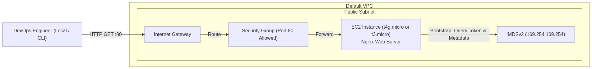
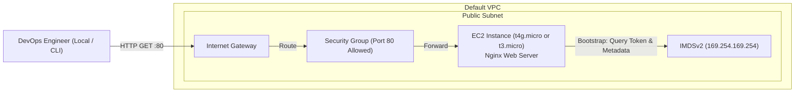

<div align="center">

# 🔬 Lab 1.1: Launching & Bootstrapping EC2 (x86_64 vs Graviton ARM64)

**[🏠 AWS Labs Root](../../../README.md)** &nbsp;•&nbsp; **[🖥️ EC2 Curriculum](../../README.md)** &nbsp;•&nbsp; **[📂 Module 01](../README.md)**

   

<br/>

[](https://cyber-cloud-security.github.io/aws-labs/)

**⬅️ Previous Lab (Start)** &nbsp;|&nbsp; **[➡️ Next Lab](../../module-01-fundamentals-and-lifecycle/lab-02-lifecycle-and-hibernation/README.md)**

</div>

---

## 📌 Lab Objectives

- [x] Understand the difference between x86_64 (`Intel/AMD`) and ARM64 (`AWS Graviton`) EC2 architectures.
- [x] Launch an EC2 instance programmatically using the AWS CLI.
- [x] Bootstrap the instance with automated **User Data** (`cloud-init`) to install Nginx and query instance metadata.
- [x] Configure Security Groups with least-privilege ingress (HTTP port 80).
- [x] Query instance metadata using **IMDSv2** (Instance Metadata Service Version 2).

---

## 🏗️ Architecture Diagram



<details>
<summary>📐 <b>View Mermaid Architecture Source (Click to Expand)</b></summary>



</details>

---

## 💡 Key Architectural Concepts

1. **Instance Families & Generations**:
   - `t3.micro`: 2 vCPUs (Intel Xeon / AMD EPYC), x86_64, Burstable compute credits.
   - `t4g.micro`: 2 vCPUs (AWS Graviton2), ARM64 architecture, up to 40% better price/performance. Requires ARM64-compiled AMIs and binaries.
2. **User Data & cloud-init**:
   - Executes as `root` once during the first boot lifecycle of an EC2 instance.
   - Output logged to `/var/log/cloud-init-output.log` and `/var/log/user-data.log`.
3. **IMDSv2 (Session-Oriented Metadata)**:
   - Uses HTTP PUT requests with a TTL header to acquire a signed token, preventing Server-Side Request Forgery (SSRF) vulnerabilities found in legacy IMDSv1.

---

## ⏱️ Prerequisites & Cost

> [!TIP]
> **AWS Free Tier & Cost Guardrail**
> - **AWS Free Tier Eligible**: Yes (`t2.micro`, `t3.micro`, or `t4g.micro` free tier allocations).
> - **Estimated Duration**: 15 minutes.

---

## 🚀 Step-by-Step Instructions

### Step 1: Discover Available Default VPC & Subnet
Set your default environment variables:
```bash
export AWS_REGION=$(aws configure get region || echo "us-east-1")
export VPC_ID=$(aws ec2 describe-vpcs \
  --filters "Name=isDefault,Values=true" \
  --query "Vpcs[0].VpcId" \
  --output text)
export SUBNET_ID=$(aws ec2 describe-subnets \
  --filters "Name=vpc-id,Values=${VPC_ID}" \
  --query "Subnets[0].SubnetId" \
  --output text)

echo "Target VPC: ${VPC_ID}"
echo "Target Subnet: ${SUBNET_ID}"
```

### Step 2: Create a Security Group for HTTP Access
```bash
SG_ID=$(aws ec2 create-security-group \
  --group-name "ec2-master-lab-web-sg" \
  --description "Allow inbound HTTP traffic for Lab 1.1" \
  --vpc-id "${VPC_ID}" \
  --tag-specifications "ResourceType=security-group,Tags=[{Key=Project,Value=ec2-master-labs},{Key=Name,Value=web-sg}]" \
  --query "GroupId" --output text)

# Authorize Port 80 from anywhere (0.0.0.0/0)
aws ec2 authorize-security-group-ingress \
  --group-id "${SG_ID}" \
  --protocol tcp \
  --port 80 \
  --cidr 0.0.0.0/0

echo "Created Security Group: ${SG_ID}"
```

### Step 3: Fetch the Latest Amazon Linux 2023 AMI
Choose either **ARM64 (Graviton)** or **x86_64**:

**Option A: AWS Graviton (ARM64 - Recommended)**
```bash
AMI_ID=$(aws ssm get-parameter \
  --name "/aws/service/ami-amazon-linux-latest/al2023-ami-kernel-default-arm64" \
  --query "Parameter.Value" --output text)
INSTANCE_TYPE="t4g.micro"
echo "Resolved ARM64 AMI: ${AMI_ID}"
```

**Option B: Intel/AMD (x86_64)**
```bash
# AMI_ID=$(aws ssm get-parameter \
#   --name "/aws/service/ami-amazon-linux-latest/al2023-ami-kernel-default-x86_64" \
#   --query "Parameter.Value" --output text)
# INSTANCE_TYPE="t3.micro"
```

### Step 4: Launch the EC2 Instance with User Data
We will pass `userdata.sh` into `--user-data` and enforce **IMDSv2**:
```bash
INSTANCE_ID=$(aws ec2 run-instances \
  --image-id "${AMI_ID}" \
  --instance-type "${INSTANCE_TYPE}" \
  --subnet-id "${SUBNET_ID}" \
  --security-group-ids "${SG_ID}" \
  --user-data file://userdata.sh \
  --metadata-options "HttpEndpoint=enabled,HttpTokens=required,HttpPutResponseHopLimit=1" \
  --tag-specifications "ResourceType=instance,Tags=[{Key=Project,Value=ec2-master-labs},{Key=Name,Value=ec2-lab-01-web}]" \
  --query "Instances[0].InstanceId" --output text)

echo "Launched Instance ID: ${INSTANCE_ID}"
```

Wait for the instance to reach `running` state:
```bash
aws ec2 wait instance-running --instance-ids "${INSTANCE_ID}"
echo "Instance ${INSTANCE_ID} is now RUNNING."
```

---

## 🔍 Verification & Testing

### 1. Fetch Public IP
```bash
PUBLIC_IP=$(aws ec2 describe-instances \
  --instance-ids "${INSTANCE_ID}" \
  --query "Reservations[0].Instances[0].PublicIpAddress" --output text)

echo "Instance Public IP: ${PUBLIC_IP}"
```

### 2. Query the Web Server
Wait 30-60 seconds for `cloud-init` to finish package installation, then run:
```bash
curl -i "http://${PUBLIC_IP}"
```
You should receive an HTTP `200 OK` response with an HTML document displaying your instance ID, availability zone, and CPU architecture.

### 3. Inspect the System Log (Console Output)
To see the bootstrap logs directly from AWS without SSH:
```bash
aws ec2 get-console-output --instance-id "${INSTANCE_ID}" --query "Output" --output text | tail -n 30
```

---

## 🧹 Teardown & Clean-up


> [!CAUTION]
> **Always Tear Down Lab Resources**: Execute the cleanup commands below immediately after completing the verification steps to prevent unintended AWS billing.

Execute the following commands to delete all created resources:
```bash
# 1. Terminate EC2 instance
aws ec2 terminate-instances --instance-ids "${INSTANCE_ID}"
aws ec2 wait instance-terminated --instance-ids "${INSTANCE_ID}"

# 2. Delete Security Group
aws ec2 delete-security-group --group-id "${SG_ID}"

echo "Lab 1.1 clean-up completed successfully."
```

---

<div align="center">

**⬅️ Previous Lab (Start)** &nbsp;•&nbsp; **[⬆️ Back to Module 01](../README.md)** &nbsp;•&nbsp; **[🏠 EC2 Index](../../README.md)** &nbsp;•&nbsp; **[➡️ Next Lab](../../module-01-fundamentals-and-lifecycle/lab-02-lifecycle-and-hibernation/README.md)**

</div>
