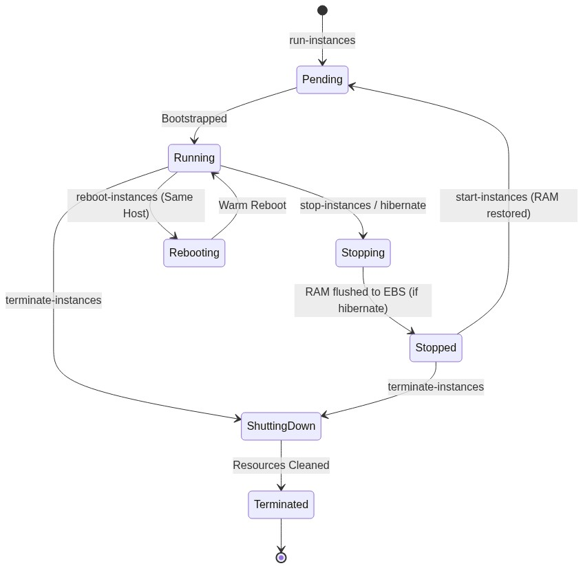
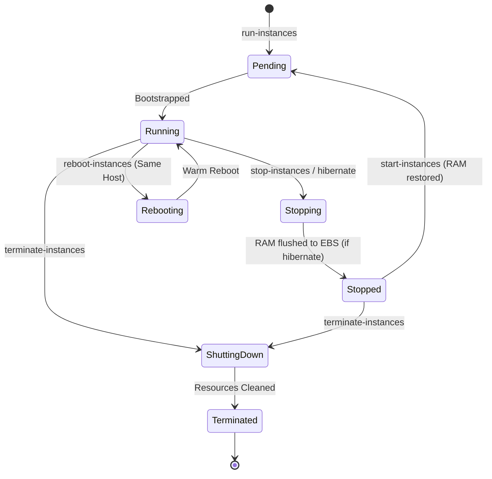

<div align="center">

# 🔬 Lab 1.2: Instance Lifecycle States & EC2 Hibernation

**[🏠 AWS Labs Root](../../../README.md)** &nbsp;•&nbsp; **[🖥️ EC2 Curriculum](../../README.md)** &nbsp;•&nbsp; **[📂 Module 01](../README.md)**

   

**[⬅️ Previous Lab](../../module-01-fundamentals-and-lifecycle/lab-01-launch-and-bootstrap/README.md)** &nbsp;|&nbsp; **[➡️ Next Lab](../../module-01-fundamentals-and-lifecycle/lab-03-amis-and-image-builder/README.md)**

</div>

---

## 📌 Lab Objectives

- [x] Master the full EC2 instance lifecycle state machine (`pending`, `running`, `stopping`, `stopped`, `shutting-down`, `terminated`).
- [x] Understand Termination Protection and Stop Protection safeguards.
- [x] Configure and test **EC2 Hibernation** (persisting in-memory RAM state to encrypted root EBS volume).
- [x] Verify application state recovery across a hibernation cycle.

---

## 🏗️ Lifecycle State Architecture



<details>
<summary>📐 <b>View Mermaid Architecture Source (Click to Expand)</b></summary>



</details>

---

## 💡 Key Architectural Concepts

### Stop vs Hibernate vs Reboot
| Action | RAM Content | Public IP | Private IP | Billing (Compute) | Billing (EBS Storage) |
| :--- | :--- | :--- | :--- | :--- | :--- |
| **Reboot** | Maintained | Kept | Kept | Continues | Continues |
| **Stop** | Erased | Released (unless EIP) | Kept | Paused ($0) | Continues |
| **Hibernate** | Saved to Root EBS | Released (unless EIP) | Kept | Paused ($0) | Continues |
| **Terminate** | Destroyed | Released | Released | Terminated | Deleted (if `DeleteOnTermination=true`) |

### Hibernation Prerequisites
1. **Encrypted Root Volume**: Required to safely protect the dumped memory contents on disk.
2. **Instance Type Support**: Supported on major Nitro and Xen general-purpose families (e.g., `t3.micro`, `c5`, `m5`).
3. **Launch-time Configuration**: Hibernation cannot be enabled after an instance is created; it must be declared at launch with `--hibernation-options Configured=true`.

---

## ⏱️ Prerequisites & Cost

> [!TIP]
> **AWS Free Tier & Cost Guardrail**
> - **AWS Free Tier Eligible**: Yes (using `t3.micro` with an 8 GB encrypted root volume).
> - **Estimated Duration**: 20 minutes.

---

## 🚀 Step-by-Step Instructions

### Step 1: Launch an Instance with Hibernation Enabled
We fetch the default subnet and an Amazon Linux 2023 x86_64 AMI:
```bash
export AWS_REGION=$(aws configure get region || echo "us-east-1")
export VPC_ID=$(aws ec2 describe-vpcs \
  --filters "Name=isDefault,Values=true" \
  --query "Vpcs[0].VpcId" \
  --output text)
export SUBNET_ID=$(aws ec2 describe-subnets \
  --filters "Name=vpc-id,Values=${VPC_ID}" \
  --query "Subnets[0].SubnetId" \
  --output text)

AMI_ID=$(aws ssm get-parameter \
  --name "/aws/service/ami-amazon-linux-latest/al2023-ami-kernel-default-x86_64" \
  --query "Parameter.Value" --output text)
```

Launch the instance with:
- `--hibernation-options Configured=true`
- Root EBS volume encrypted with default AWS KMS key (`Encrypted=true`)
- Size: 10 GiB (sufficient to hold OS + memory dump):
```bash
INSTANCE_ID=$(aws ec2 run-instances \
  --image-id "${AMI_ID}" \
  --instance-type "t3.micro" \
  --subnet-id "${SUBNET_ID}" \
  --hibernation-options Configured=true \
  --block-device-mappings '[
    {
      "DeviceName": "/dev/xvda",
      "Ebs": {
        "VolumeSize": 10,
        "VolumeType": "gp3",
        "Encrypted": true,
        "DeleteOnTermination": true
      }
    }
  ]' \
  --tag-specifications "ResourceType=instance,Tags=[{Key=Project,Value=ec2-master-labs},{Key=Name,Value=ec2-hibernation-node}]" \
  --query "Instances[0].InstanceId" --output text)

echo "Launched Hibernation Instance: ${INSTANCE_ID}"
aws ec2 wait instance-running --instance-ids "${INSTANCE_ID}"
```

### Step 2: Enable Termination Protection
Prevent accidental termination via AWS Console or CLI:
```bash
aws ec2 modify-instance-attribute \
  --instance-id "${INSTANCE_ID}" \
  --disable-api-termination "{\"Value\": true}"

# Verify attribute
aws ec2 describe-instance-attribute \
  --instance-id "${INSTANCE_ID}" \
  --attribute disableApiTermination
```

---

## 🔍 Verification & Testing

### 1. Test Termination Protection Safeguard
Attempt to terminate the instance:
```bash
aws ec2 terminate-instances --instance-ids "${INSTANCE_ID}"
```
**Expected Output**: An API error:
`An error occurred (OperationNotPermitted) when calling the TerminateInstances operation: The instance 'i-xxxx' may not be terminated. Modify its 'disableApiTermination' instance attribute and try again.`

### 2. Verify Hibernation Capability
Check the instance description:
```bash
aws ec2 describe-instances \
  --instance-ids "${INSTANCE_ID}" \
  --query "Reservations[0].Instances[0].HibernationOptions.Configured" --output text
```
It must return `True`.

### 3. Initiate Hibernation
Now initiate the hibernate call:
```bash
aws ec2 stop-instances --instance-ids "${INSTANCE_ID}" --hibernate
echo "Initiated hibernation..."
```
Monitor the state transition:
```bash
aws ec2 describe-instances \
  --instance-ids "${INSTANCE_ID}" \
  --query "Reservations[0].Instances[0].State.Name" --output text
```
The state will transition from `running` -> `stopping` -> `stopped`.
Unlike a regular stop, the kernel freezes processes and dumps the dirty memory pages to the swap/hibernation partition on the encrypted root EBS volume.

### 4. Wake / Resume the Instance
Start the instance back up:
```bash
aws ec2 start-instances --instance-ids "${INSTANCE_ID}"
aws ec2 wait instance-running --instance-ids "${INSTANCE_ID}"
echo "Instance resumed from hibernation!"
```

---

## 📘 Deep-Dive Command & Flag Reference

> [!TIP]
> **Line-by-Line Production Analysis**: Every command executed in this lab is dissected below, explaining each CLI flag, JMESPath query, Linux kernel parameter, and why it is critical in production automation.

<details open>
<summary>📘 <b>Command 1: Launching an Instance with Hibernation & Encrypted Root Volume</b></summary>

```bash
INSTANCE_ID=$(aws ec2 run-instances \
  --image-id "${AMI_ID}" \
  --instance-type "t3.micro" \
  --subnet-id "${SUBNET_ID}" \
  --hibernation-options Configured=true \
  --block-device-mappings '[
    {
      "DeviceName": "/dev/xvda",
      "Ebs": {
        "VolumeSize": 10,
        "VolumeType": "gp3",
        "Encrypted": true,
        "DeleteOnTermination": true
      }
    }
  ]' \
  --tag-specifications "ResourceType=instance,Tags=[{Key=Project,Value=ec2-master-labs},{Key=Name,Value=ec2-hibernation-node}]" \
  --query "Instances[0].InstanceId" --output text)
```

#### 🔍 Parameter & Component Breakdown

- **`--hibernation-options Configured=true`** — Configures the EC2 hypervisor to prepare the instance for hibernation.
**Critical Constraint**: Hibernation **cannot** be enabled after an instance is launched. If this flag is omitted at launch, any future attempt to hibernate the instance via `stop-instances --hibernate` will fail with an `UnsupportedHibernationConfiguration` error.

- **`--block-device-mappings '[ { "DeviceName": "/dev/xvda", ... } ]'`** — Overrides default storage specifications for the root disk attached at `/dev/xvda`.
  - **`"VolumeSize": 10`** — Allocates 10 GiB. Hibernation requires the root EBS volume to be large enough to store both the operating system files AND the entire uncompressed RAM contents (e.g. 1 GiB for `t3.micro`).
  - **`"VolumeType": "gp3"`** — Provisions General Purpose SSD (gp3) providing baseline 3,000 IOPS and 125 MB/s throughput decoupled from volume size.
  - **`"Encrypted": true`** — **Mandatory for hibernation**. Hibernation dumps sensitive volatile memory contents (including active encryption keys, passwords, and sessions) to disk; AWS strictly enforces KMS encryption on the root volume before allowing hibernation.
  - **`"DeleteOnTermination": true`** — Ensures the EBS storage volume is automatically cleaned up when the instance is terminated, preventing orphan storage billing.

> 🏭 **Why This Matters in Production Automation**
> Hibernation is a game-changer for compute-heavy applications with prolonged initialization times (such as machine learning model caching, Java virtual machines with extensive warm-up times, or rendering engines). Instead of cold-booting and running lengthy initialization scripts, hibernated instances resume execution in seconds from their exact pre-saved memory state.

</details>

<details open>
<summary>📘 <b>Command 2: Enabling API Termination Protection</b></summary>

```bash
aws ec2 modify-instance-attribute \
  --instance-id "${INSTANCE_ID}" \
  --disable-api-termination "{\"Value\": true}"
```

#### 🔍 Parameter & Component Breakdown

- **`aws ec2 modify-instance-attribute`** — Updates runtime configuration attributes of an existing instance without requiring a reboot.

- **`--instance-id "${INSTANCE_ID}"`** — Specifies the target instance.

- **`--disable-api-termination "{\"Value\": true}"`** — Enables termination protection by setting the attribute `DisableApiTermination` to `true`. Notice the escaped JSON syntax (`"{\"Value\": true}"`) required by the AWS CLI parameter parser to convey boolean wrapper objects.

> 🏭 **Why This Matters in Production Automation**
> Accidental termination of core database instances or Kubernetes control planes by automated scripts, over-eager CI/CD pipelines, or human error is a catastrophic outage vector. Termination protection acts as a hard stop: any API call or console click attempting to terminate the instance is rejected at the API layer until this flag is explicitly revoked.

</details>

<details open>
<summary>📘 <b>Command 3: Auditing Termination Protection via Describe Attributes</b></summary>

```bash
aws ec2 describe-instance-attribute \
  --instance-id "${INSTANCE_ID}" \
  --attribute disableApiTermination
```

#### 🔍 Parameter & Component Breakdown

- **`aws ec2 describe-instance-attribute`** — Queries a specific low-level instance attribute rather than the full instance description.

- **`--attribute disableApiTermination`** — Restricts the response solely to the `disableApiTermination` key, returning:
```json
{
    "InstanceId": "i-0123456789abcdef0",
    "DisableApiTermination": {
        "Value": true
    }
}
```

> 🏭 **Why This Matters in Production Automation**
> Querying specific attributes rather than calling `describe-instances` significantly reduces API response payload size, helping automation scripts stay within AWS API throttling limits (TPS quotas) during fleet-wide audits.

</details>

<details open>
<summary>📘 <b>Command 4: Simulating Accidental Termination (Safeguard Test)</b></summary>

```bash
aws ec2 terminate-instances --instance-ids "${INSTANCE_ID}"
```

#### 🔍 Parameter & Component Breakdown

- **`aws ec2 terminate-instances`** — Sends a termination request to the EC2 control plane.

- **Resulting Error Response** — `An error occurred (OperationNotPermitted) when calling the TerminateInstances operation: The instance 'i-xxxx' may not be terminated. Modify its 'disableApiTermination' instance attribute and try again.`

> 🏭 **Why This Matters in Production Automation**
> Testing failure conditions is as important as testing happy paths. Verifying that the API explicitly blocks termination proves that the infrastructure safeguard is active and prevents disastrous automated cleanups in shared multi-tenant AWS accounts.

</details>

<details open>
<summary>📘 <b>Command 5: Initiating Instance Hibernation</b></summary>

```bash
aws ec2 stop-instances --instance-ids "${INSTANCE_ID}" --hibernate
```

#### 🔍 Parameter & Component Breakdown

- **`aws ec2 stop-instances`** — Transitions an EC2 instance from `running` to `stopped`.

- **`--hibernate`** — Modifies standard stop behavior:
1. Signals the operating system ACPI sleep state (`S4`).  
2. The Linux kernel freezes user space and writes the dirty contents of RAM to the allocated swap partition on the encrypted root volume.  
3. The underlying physical hypervisor powers off the virtual machine.  
4. Compute billing ($/vCPU-hour) stops immediately; only root EBS storage charges remain active.

> 🏭 **Why This Matters in Production Automation**
> Standard `stop-instances` completely clears RAM; running processes are terminated with `SIGTERM`/`SIGKILL`. Hibernation preserves application runtime state, active sockets, in-memory caches, and OS uptime. It enables rapid scale-out fleets that can be pre-warmed, hibernated at near-zero cost, and resurrected instantaneously during demand spikes.

</details>

<details open>
<summary>📘 <b>Command 6: Monitoring State Transition to Stopped</b></summary>

```bash
aws ec2 describe-instances \
  --instance-ids "${INSTANCE_ID}" \
  --query "Reservations[0].Instances[0].State.Name" --output text
```

#### 🔍 Parameter & Component Breakdown

- **`--query "Reservations[0].Instances[0].State.Name"`** — Pulls the lifecycle state field. During hibernation, the instance moves through:
`running` -> `stopping` -> `stopped`.

> 🏭 **Why This Matters in Production Automation**
> During the `stopping` phase of hibernation, the instance is actively flushing gigabytes of RAM to disk. Calling `start-instances` prematurely before the state reaches `stopped` will throw an invalid state error. Automation scripts must poll until `State.Name == stopped`.

</details>

<details open>
<summary>📘 <b>Command 7: Resuming from Hibernation</b></summary>

```bash
aws ec2 start-instances --instance-ids "${INSTANCE_ID}"
aws ec2 wait instance-running --instance-ids "${INSTANCE_ID}"
```

#### 🔍 Parameter & Component Breakdown

- **`aws ec2 start-instances`** — Powers on the virtual machine. The Nitro hypervisor detects the hibernation header on the root EBS volume, reloads the saved memory pages directly into physical RAM, and resumes kernel execution at the exact instruction pointer where it was paused.

- **`aws ec2 wait instance-running`** — Blocks execution until the instance is restored and ready to process traffic.

> 🏭 **Why This Matters in Production Automation**
> Unlike a standard cold boot, resume times are determined primarily by disk-to-RAM I/O speed. On `gp3` volumes with 3,000 IOPS, a 1 GiB–4 GiB memory restoration completes in seconds, bypassing BIOS, bootloader, systemd service dependency trees, and application initialization logic.

</details>

<details open>
<summary>📘 <b>Command 8: Orderly De-provisioning</b></summary>

```bash
aws ec2 modify-instance-attribute \
  --instance-id "${INSTANCE_ID}" \
  --disable-api-termination "{\"Value\": false}"
aws ec2 terminate-instances --instance-ids "${INSTANCE_ID}"
aws ec2 wait instance-terminated --instance-ids "${INSTANCE_ID}"
```

#### 🔍 Parameter & Component Breakdown

- **`--disable-api-termination "{\"Value\": false}"`** — Unlocks the instance, allowing the termination API to succeed.

- **`aws ec2 terminate-instances`** — Permanently deallocates the virtual hardware and deletes the root volume.

> 🏭 **Why This Matters in Production Automation**
> In automated infrastructure lifecycle scripts (Terraform, CloudFormation, Pulumi), de-provisioning hooks must gracefully lift protection flags prior to initiating destruction steps, preventing orphan resources or hung pipeline runs.

</details>

---

## 🧹 Teardown & Clean-up


> [!CAUTION]
> **Always Tear Down Lab Resources**: Execute the cleanup commands below immediately after completing the verification steps to prevent unintended AWS billing.

To clean up, you must first disable termination protection:
```bash
# 1. Disable termination protection
aws ec2 modify-instance-attribute \
  --instance-id "${INSTANCE_ID}" \
  --disable-api-termination "{\"Value\": false}"

# 2. Terminate the instance
aws ec2 terminate-instances --instance-ids "${INSTANCE_ID}"
aws ec2 wait instance-terminated --instance-ids "${INSTANCE_ID}"

echo "Lab 1.2 clean-up completed successfully."
```

---

<div align="center">

**[⬅️ Previous Lab](../../module-01-fundamentals-and-lifecycle/lab-01-launch-and-bootstrap/README.md)** &nbsp;•&nbsp; **[⬆️ Back to Module 01](../README.md)** &nbsp;•&nbsp; **[🏠 EC2 Index](../../README.md)** &nbsp;•&nbsp; **[➡️ Next Lab](../../module-01-fundamentals-and-lifecycle/lab-03-amis-and-image-builder/README.md)**

</div>
