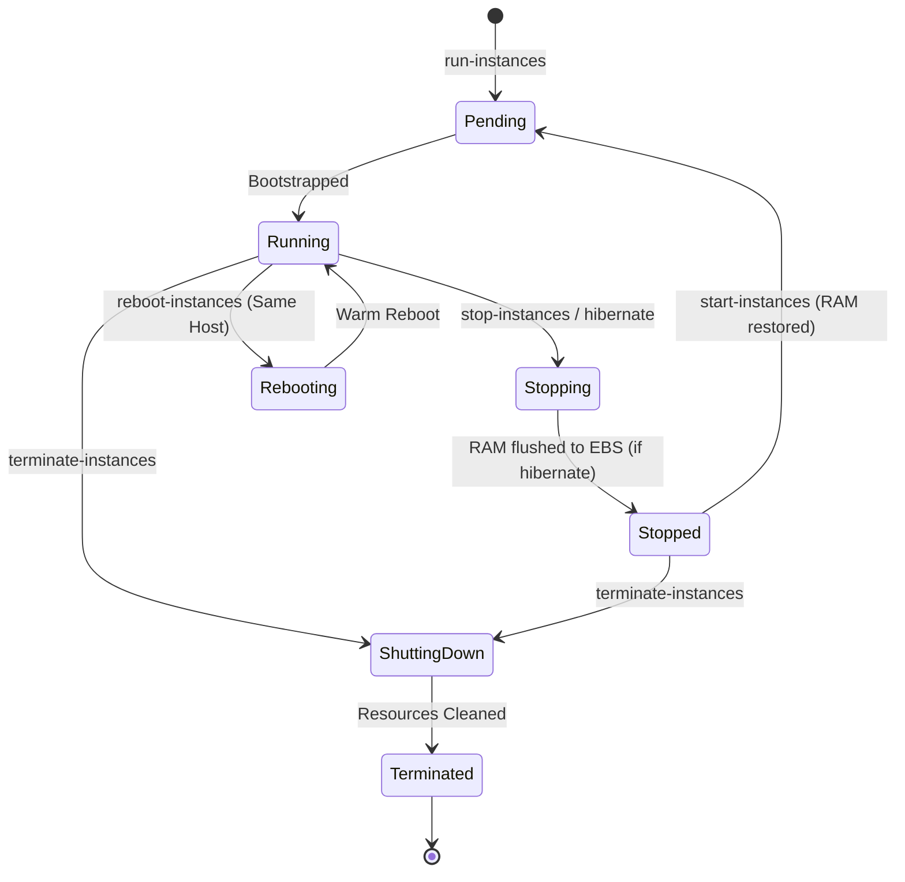

# Lab 1.2: Instance Lifecycle States & EC2 Hibernation

## 📌 Lab Objectives
- Master the full EC2 instance lifecycle state machine (`pending`, `running`, `stopping`, `stopped`, `shutting-down`, `terminated`).
- Understand Termination Protection and Stop Protection safeguards.
- Configure and test **EC2 Hibernation** (persisting in-memory RAM state to encrypted root EBS volume).
- Verify application state recovery across a hibernation cycle.

---

## 🏗️ Lifecycle State Architecture


<details>
<summary>Click to expand Mermaid diagram source</summary>


<details>
<summary>Click to expand Mermaid diagram source</summary>


<details>
<summary>Click to expand Mermaid diagram source</summary>


</details>
</details>
</details>

---

## 💡 Key Architectural Concepts

### Stop vs Hibernate vs Reboot
| Action | RAM Content | Public IP | Private IP | Billing (Compute) | Billing (EBS Storage) |
| :--- | :--- | :--- | :--- | :--- | :--- |
| **Reboot** | Maintained | Kept | Kept | Continues | Continues |
| **Stop** | Erased | Released (unless EIP) | Kept | Paused ($0) | Continues |
| **Hibernate** | Saved to Root EBS | Released (unless EIP) | Kept | Paused ($0) | Continues |
| **Terminate** | Destroyed | Released | Released | Terminated | Deleted (if `DeleteOnTermination=true`) |

### Hibernation Prerequisites
1. **Encrypted Root Volume**: Required to safely protect the dumped memory contents on disk.
2. **Instance Type Support**: Supported on major Nitro and Xen general-purpose families (e.g., `t3.micro`, `c5`, `m5`).
3. **Launch-time Configuration**: Hibernation cannot be enabled after an instance is created; it must be declared at launch with `--hibernation-options Configured=true`.

---

## ⏱️ Prerequisites & Cost
- **AWS Free Tier Eligible**: Yes (using `t3.micro` with an 8 GB encrypted root volume).
- **Estimated Duration**: 20 minutes.

---

## 🚀 Step-by-Step Instructions

### Step 1: Launch an Instance with Hibernation Enabled
We fetch the default subnet and an Amazon Linux 2023 x86_64 AMI:
```bash
export AWS_REGION=$(aws configure get region || echo "us-east-1")
export VPC_ID=$(aws ec2 describe-vpcs --filters "Name=isDefault,Values=true" --query "Vpcs[0].VpcId" --output text)
export SUBNET_ID=$(aws ec2 describe-subnets --filters "Name=vpc-id,Values=${VPC_ID}" --query "Subnets[0].SubnetId" --output text)

AMI_ID=$(aws ssm get-parameter \
  --name "/aws/service/ami-amazon-linux-latest/al2023-ami-kernel-default-x86_64" \
  --query "Parameter.Value" --output text)
```

Launch the instance with:
- `--hibernation-options Configured=true`
- Root EBS volume encrypted with default AWS KMS key (`Encrypted=true`)
- Size: 10 GiB (sufficient to hold OS + memory dump):
```bash
INSTANCE_ID=$(aws ec2 run-instances \
  --image-id "${AMI_ID}" \
  --instance-type "t3.micro" \
  --subnet-id "${SUBNET_ID}" \
  --hibernation-options Configured=true \
  --block-device-mappings '[
    {
      "DeviceName": "/dev/xvda",
      "Ebs": {
        "VolumeSize": 10,
        "VolumeType": "gp3",
        "Encrypted": true,
        "DeleteOnTermination": true
      }
    }
  ]' \
  --tag-specifications "ResourceType=instance,Tags=[{Key=Project,Value=ec2-master-labs},{Key=Name,Value=ec2-hibernation-node}]" \
  --query "Instances[0].InstanceId" --output text)

echo "Launched Hibernation Instance: ${INSTANCE_ID}"
aws ec2 wait instance-running --instance-ids "${INSTANCE_ID}"
```

### Step 2: Enable Termination Protection
Prevent accidental termination via AWS Console or CLI:
```bash
aws ec2 modify-instance-attribute \
  --instance-id "${INSTANCE_ID}" \
  --disable-api-termination "{\"Value\": true}"

# Verify attribute
aws ec2 describe-instance-attribute \
  --instance-id "${INSTANCE_ID}" \
  --attribute disableApiTermination
```

---

## 🔍 Verification & Testing

### 1. Test Termination Protection Safeguard
Attempt to terminate the instance:
```bash
aws ec2 terminate-instances --instance-ids "${INSTANCE_ID}"
```
**Expected Output**: An API error:
`An error occurred (OperationNotPermitted) when calling the TerminateInstances operation: The instance 'i-xxxx' may not be terminated. Modify its 'disableApiTermination' instance attribute and try again.`

### 2. Verify Hibernation Capability
Check the instance description:
```bash
aws ec2 describe-instances \
  --instance-ids "${INSTANCE_ID}" \
  --query "Reservations[0].Instances[0].HibernationOptions.Configured" --output text
```
It must return `True`.

### 3. Initiate Hibernation
Now initiate the hibernate call:
```bash
aws ec2 stop-instances --instance-ids "${INSTANCE_ID}" --hibernate
echo "Initiated hibernation..."
```
Monitor the state transition:
```bash
aws ec2 describe-instances \
  --instance-ids "${INSTANCE_ID}" \
  --query "Reservations[0].Instances[0].State.Name" --output text
```
The state will transition from `running` -> `stopping` -> `stopped`.
Unlike a regular stop, the kernel freezes processes and dumps the dirty memory pages to the swap/hibernation partition on the encrypted root EBS volume.

### 4. Wake / Resume the Instance
Start the instance back up:
```bash
aws ec2 start-instances --instance-ids "${INSTANCE_ID}"
aws ec2 wait instance-running --instance-ids "${INSTANCE_ID}"
echo "Instance resumed from hibernation!"
```

---

## 🧹 Teardown & Clean-up

To clean up, you must first disable termination protection:
```bash
# 1. Disable termination protection
aws ec2 modify-instance-attribute \
  --instance-id "${INSTANCE_ID}" \
  --disable-api-termination "{\"Value\": false}"

# 2. Terminate the instance
aws ec2 terminate-instances --instance-ids "${INSTANCE_ID}"
aws ec2 wait instance-terminated --instance-ids "${INSTANCE_ID}"

echo "Lab 1.2 clean-up completed successfully."
```
