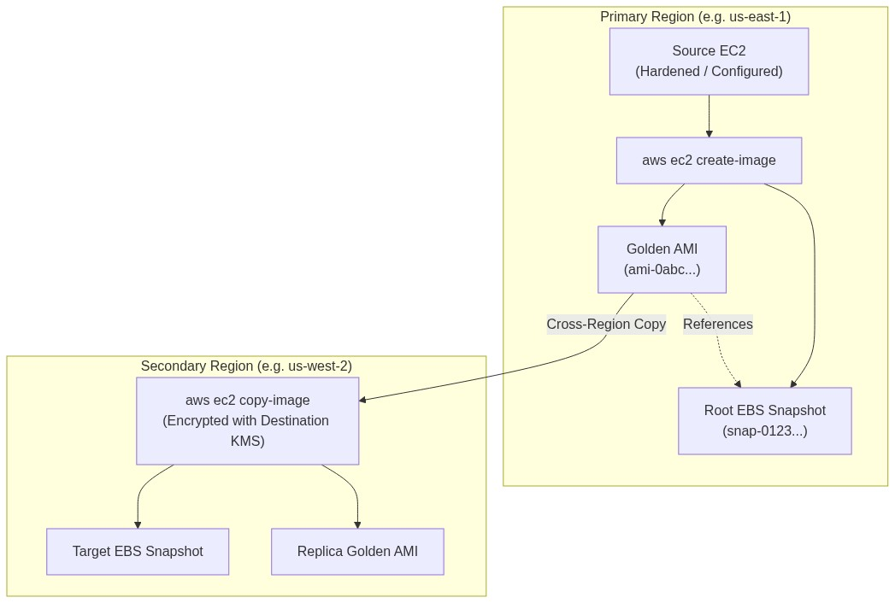
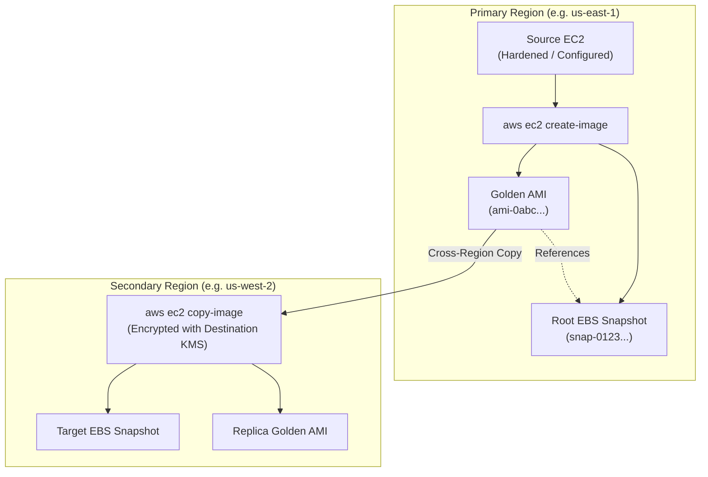

<div align="center">

# 🔬 Lab 1.3: Custom AMIs, Golden Images & Cross-Region Distribution

**[🏠 AWS Labs Root](../../../README.md)** &nbsp;•&nbsp; **[🖥️ EC2 Curriculum](../../README.md)** &nbsp;•&nbsp; **[📂 Module 01](../README.md)**

   

**[⬅️ Previous Lab](../../module-01-fundamentals-and-lifecycle/lab-02-lifecycle-and-hibernation/README.md)** &nbsp;|&nbsp; **[➡️ Next Lab](../../module-02-storage-ebs-ephemeral-efs/lab-01-ebs-elastic-volumes/README.md)**

</div>

---

## 📌 Lab Objectives

- [x] Create a customized "Golden Image" Amazon Machine Image (AMI) from an EC2 instance.
- [x] Understand how AMIs reference EBS snapshots and block device mappings.
- [x] Copy an AMI to another AWS Region with KMS encryption key re-wrapping.
- [x] Safely deregister AMIs and purge orphaned underlying EBS snapshots to eliminate phantom storage costs.
- [x] Review AWS EC2 Image Builder concepts for automated CI/CD image pipelines.

---

## 🏗️ Architecture Diagram



<details>
<summary>📐 <b>View Mermaid Architecture Source (Click to Expand)</b></summary>



</details>

---

## 💡 Key Architectural Concepts

1. **What is an AMI?**:
   - A template containing a configuration descriptor (architecture, virtualization type, root device name) and pointers to one or more EBS Snapshots.
2. **Dangling Snapshot Trap**:
   - Deregistering an AMI (`aws ec2 deregister-image`) does **NOT** delete the underlying EBS snapshots! The snapshots continue to incur storage charges until explicitly deleted (`aws ec2 delete-snapshot`).
3. **No-Reboot Flag (`--no-reboot`)**:
   - AWS typically reboots the instance before taking the snapshot to ensure file system consistency. Using `--no-reboot` creates the image without rebooting, but requires pausing active file I/O to avoid filesystem corruption.

---

## ⏱️ Prerequisites & Cost

> [!TIP]
> **AWS Free Tier & Cost Guardrail**
> - **AWS Free Tier Eligible**: Yes (within 30 GB monthly EBS snapshot allocation).
> - **Estimated Duration**: 20 minutes.

---

## 🚀 Step-by-Step Instructions

### Step 1: Launch a Base Instance with Pre-Installed Tools
```bash
export AWS_REGION="us-east-1"
export DEST_REGION="us-west-2"

AMI_ID=$(aws ssm get-parameter \
  --region "${AWS_REGION}" \
  --name "/aws/service/ami-amazon-linux-latest/al2023-ami-kernel-default-x86_64" \
  --query "Parameter.Value" --output text)

VPC_ID=$(aws ec2 describe-vpcs \
  --region "${AWS_REGION}" \
  --filters "Name=isDefault,Values=true" \
  --query "Vpcs[0].VpcId" \
  --output text)
SUBNET_ID=$(aws ec2 describe-subnets \
  --region "${AWS_REGION}" \
  --filters "Name=vpc-id,Values=${VPC_ID}" \
  --query "Subnets[0].SubnetId" \
  --output text)

INSTANCE_ID=$(aws ec2 run-instances \
  --region "${AWS_REGION}" \
  --image-id "${AMI_ID}" \
  --instance-type "t3.micro" \
  --subnet-id "${SUBNET_ID}" \
  --user-data "#!/bin/bash
dnf install -y htop git tmux
echo 'Golden Image Base Build 1.0' > /etc/golden-image-version" \
  --tag-specifications "ResourceType=instance,Tags=[{Key=Project,Value=ec2-master-labs},{Key=Name,Value=golden-image-base}]" \
  --query "Instances[0].InstanceId" --output text)

echo "Launched Base Instance: ${INSTANCE_ID}"
aws ec2 wait instance-running --region "${AWS_REGION}" --instance-ids "${INSTANCE_ID}"
```

### Step 2: Create the Custom AMI
Create the custom AMI from the running instance:
```bash
CUSTOM_AMI_ID=$(aws ec2 create-image \
  --region "${AWS_REGION}" \
  --instance-id "${INSTANCE_ID}" \
  --name "golden-al2023-v1-$(date +%s)" \
  --description "Custom Golden AMI with pre-baked packages" \
  --no-reboot \
  --tag-specifications "ResourceType=image,Tags=[{Key=Project,Value=ec2-master-labs},{Key=Name,Value=golden-al2023-v1}]" \
  --query "ImageId" --output text)

echo "Created AMI: ${CUSTOM_AMI_ID}"
echo "Waiting for AMI to reach 'available' state (takes 2-3 mins)..."
aws ec2 wait image-available --region "${AWS_REGION}" --image-ids "${CUSTOM_AMI_ID}"
echo "AMI ${CUSTOM_AMI_ID} is ready!"
```

### Step 3: Inspect AMI Block Device Mappings and Snapshot IDs
Identify the snapshot backing this AMI:
```bash
SNAPSHOT_ID=$(aws ec2 describe-images \
  --region "${AWS_REGION}" \
  --image-ids "${CUSTOM_AMI_ID}" \
  --query "Images[0].BlockDeviceMappings[0].Ebs.SnapshotId" --output text)

echo "Underlying Snapshot ID: ${SNAPSHOT_ID}"
```

### Step 4: Copy AMI Cross-Region
Copy the AMI to `us-west-2` with destination encryption:
```bash
COPIED_AMI_ID=$(aws ec2 copy-image \
  --source-region "${AWS_REGION}" \
  --source-image-id "${CUSTOM_AMI_ID}" \
  --region "${DEST_REGION}" \
  --name "golden-al2023-v1-replica" \
  --description "Cross-region replica of Golden AMI" \
  --encrypted \
  --query "ImageId" --output text)

echo "Copied AMI to ${DEST_REGION}: ${COPIED_AMI_ID}"
```

---

## 🔍 Verification & Testing

### 1. Launch a Test Instance from the Custom AMI
Verify that instances launched from this AMI boot instantly with the pre-baked packages:
```bash
TEST_NODE_ID=$(aws ec2 run-instances \
  --region "${AWS_REGION}" \
  --image-id "${CUSTOM_AMI_ID}" \
  --instance-type "t3.micro" \
  --subnet-id "${SUBNET_ID}" \
  --tag-specifications "ResourceType=instance,Tags=[{Key=Project,Value=ec2-master-labs},{Key=Name,Value=test-ami-instance}]" \
  --query "Instances[0].InstanceId" --output text)

echo "Launched Node from Custom AMI: ${TEST_NODE_ID}"
aws ec2 wait instance-running --region "${AWS_REGION}" --instance-ids "${TEST_NODE_ID}"
```

---

## 📘 Deep-Dive Command & Flag Reference

> [!TIP]
> **Line-by-Line Production Analysis**: Every command executed in this lab is dissected below, explaining each CLI flag, JMESPath query, Linux kernel parameter, and why it is critical in production automation.

<details open>
<summary>📘 <b>Command 1: Creating a Custom Golden AMI from a Running Instance</b></summary>

```bash
CUSTOM_AMI_ID=$(aws ec2 create-image \
  --region "${AWS_REGION}" \
  --instance-id "${INSTANCE_ID}" \
  --name "golden-al2023-v1-$(date +%s)" \
  --description "Custom Golden AMI with pre-baked packages" \
  --no-reboot \
  --tag-specifications "ResourceType=image,Tags=[{Key=Project,Value=ec2-master-labs},{Key=Name,Value=golden-al2023-v1}]" \
  --query "ImageId" --output text)
```

#### 🔍 Parameter & Component Breakdown

- **`aws ec2 create-image`** — Calls the `CreateImage` API endpoint. Under the hood, this initiates two parallel actions:
1. Creates point-in-time Amazon EBS snapshots of all EBS volumes attached to the instance.  
2. Registers a new Amazon Machine Image (AMI) metadata catalog entry pointing to those newly created snapshots.

- **`--name "golden-al2023-v1-$(date +%s)"`** — Sets the unique AMI name. AMI names must be unique within your account in the target region. Appending `$(date +%s)` (epoch timestamp in seconds) guarantees non-colliding names during automated daily or CI/CD golden image builds.

- **`--description "..."`** — Human-readable summary of image contents, patch levels, or build pipelines.

- **`--no-reboot`** — **Critical Parameter**:
By default, AWS cleanly shuts down the instance, flushes file system buffers to disk, takes the snapshot, and powers the instance back on to guarantee crash consistency.  
Specifying `--no-reboot` forces AWS to snapshot the disks while the operating system continues running with zero downtime.  
*Caveat*: In production, ensure active database writes are quiesced before taking a `--no-reboot` image to prevent uncommitted journal corruption.

- **`--query "ImageId" --output text`** — Extracts the generated AMI identifier (e.g. `ami-0a1b2c3d4e5f67890`).

> 🏭 **Why This Matters in Production Automation**
> Golden Images (pre-baked AMIs containing all base packages, hardening scripts, monitoring daemons, and security tools) form the foundation of immutable infrastructure. Instead of spending 5–10 minutes running package managers (`dnf`/`apt`) every time an Auto Scaling Group launches an instance, instances boot from a Golden AMI in less than 30 seconds.

</details>

<details open>
<summary>📘 <b>Command 2: Synchronous Polling for AMI Availability</b></summary>

```bash
aws ec2 wait image-available --region "${AWS_REGION}" --image-ids "${CUSTOM_AMI_ID}"
```

#### 🔍 Parameter & Component Breakdown

- **`aws ec2 wait image-available`** — Polls the `DescribeImages` API endpoint at 15-second intervals until the image state changes from `pending` to `available`.

- **Underlying Mechanism** — An AMI cannot be marked `available` until its backing EBS snapshots have completed copying dirty blocks to Amazon S3. For a 10 GiB volume, this typically takes 2–4 minutes.

> 🏭 **Why This Matters in Production Automation**
> Attempting to launch an EC2 instance, copy an AMI cross-region, or share an AMI while it is still in the `pending` state will immediately throw an `InvalidAMIID.Unavailable` error. Automated pipelines must use `wait image-available` to gate downstream deployment steps.

</details>

<details open>
<summary>📘 <b>Command 3: Querying the Underlying EBS Snapshot Identifier</b></summary>

```bash
SNAPSHOT_ID=$(aws ec2 describe-images \
  --region "${AWS_REGION}" \
  --image-ids "${CUSTOM_AMI_ID}" \
  --query "Images[0].BlockDeviceMappings[0].Ebs.SnapshotId" --output text)
```

#### 🔍 Parameter & Component Breakdown

- **`aws ec2 describe-images`** — Retrieves full schema attributes of the registered AMI.

- **`--query "Images[0].BlockDeviceMappings[0].Ebs.SnapshotId"`** — Traverses the JSON block device mapping array to extract the specific EBS Snapshot ID (e.g. `snap-0123456789abcdef0`) linked to the root device.

> 🏭 **Why This Matters in Production Automation**
> An AMI is merely a lightweight metadata pointer; the actual data resides inside Amazon S3-backed **EBS Snapshots**. Knowing the snapshot ID is required for audit trails, disaster recovery validation, and executing clean deletions.

</details>

<details open>
<summary>📘 <b>Command 4: Copying AMIs Across AWS Regions with KMS Re-Encryption</b></summary>

```bash
COPIED_AMI_ID=$(aws ec2 copy-image \
  --source-region "${AWS_REGION}" \
  --source-image-id "${CUSTOM_AMI_ID}" \
  --region "${DEST_REGION}" \
  --name "golden-al2023-v1-replica" \
  --description "Cross-region replica of Golden AMI" \
  --encrypted \
  --query "ImageId" --output text)
```

#### 🔍 Parameter & Component Breakdown

- **`aws ec2 copy-image`** — Calls the `CopyImage` API to replicate the AMI and its underlying EBS snapshots over the encrypted AWS private backbone network into a target region (e.g. from `us-east-1` to `us-west-2`).

- **`--source-region` & `--source-image-id`** — Specifies where the origin image resides.

- **`--region "${DEST_REGION}"`** — Specifies where the new AMI will be registered.

- **`--encrypted`** — Forces the destination EBS snapshots to be encrypted using the destination region's default AWS KMS EC2 encryption key.
*Note*: AWS KMS keys are region-specific and can never leave their origin region. When an image is copied cross-region, AWS automatically decrypts the blocks with the source key in memory and re-encrypts them with the target region's KMS key before writing them to disk.

> 🏭 **Why This Matters in Production Automation**
> Cross-region AMI replication is a fundamental requirement for multi-region active-active architectures and cross-region Disaster Recovery (DR) plans. If a primary region suffers an outage, Auto Scaling Groups in the secondary DR region can immediately spin up identical compute clusters using the pre-replicated local AMI.

</details>

<details open>
<summary>📘 <b>Command 5: Launching from the Custom Golden AMI</b></summary>

```bash
TEST_NODE_ID=$(aws ec2 run-instances \
  --region "${AWS_REGION}" \
  --image-id "${CUSTOM_AMI_ID}" \
  --instance-type "t3.micro" \
  --subnet-id "${SUBNET_ID}" \
  --tag-specifications "ResourceType=instance,Tags=[{Key=Project,Value=ec2-master-labs},{Key=Name,Value=test-ami-instance}]" \
  --query "Instances[0].InstanceId" --output text)
```

#### 🔍 Parameter & Component Breakdown

- **`--image-id "${CUSTOM_AMI_ID}"`** — References the newly created custom image rather than an upstream public Amazon Linux AMI.

> 🏭 **Why This Matters in Production Automation**
> This command proves image viability. Newly created AMIs must be smoke-tested in automated CI/CD staging environments before being promoted to production Launch Templates.

</details>

<details open>
<summary>📘 <b>Commands 6, 7 & 8: The Two-Step Purge (Preventing the Dangling Snapshot Trap)</b></summary>

```bash
# Step 1: Deregister AMI
aws ec2 deregister-image --region "${AWS_REGION}" --image-id "${CUSTOM_AMI_ID}"

# Step 2: Delete Underlying Snapshot
aws ec2 delete-snapshot --region "${AWS_REGION}" --snapshot-id "${SNAPSHOT_ID}"
```

#### 🔍 Parameter & Component Breakdown

- **`aws ec2 deregister-image`** — Removes the AMI entry from the AWS EC2 image catalog. After deregistration, no new instances can be launched from this AMI.
**THE TRAP**: Deregistering an AMI **does NOT delete the underlying EBS snapshots**! The snapshot remains in S3 and continues to accrue monthly storage charges indefinitely.

- **`aws ec2 delete-snapshot`** — Permanently deletes the underlying EBS snapshot from Amazon S3, freeing storage and stopping billing.
*Order of Operations*: You **cannot** delete an EBS snapshot while an active AMI points to it (`ResourceInUse` error). You must always call `deregister-image` first, followed by `delete-snapshot`.

> 🏭 **Why This Matters in Production Automation**
> The "Dangling Snapshot" phenomenon is one of the most common sources of cloud waste in enterprise AWS bills. Automated golden image pipelines that build daily AMIs without a corresponding two-step cleanup script can accumulate thousands of orphaned snapshots, generating thousands of dollars in surprise monthly S3 storage charges.

</details>

---

## 🧹 Teardown & Clean-up


> [!CAUTION]
> **Always Tear Down Lab Resources**: Execute the cleanup commands below immediately after completing the verification steps to prevent unintended AWS billing.

To avoid leftover snapshot storage charges, follow the strict two-step purge:
```bash
# 1. Terminate test and base instances
aws ec2 terminate-instances \
  --region "${AWS_REGION}" \
  --instance-ids "${INSTANCE_ID}" "${TEST_NODE_ID}"
aws ec2 wait instance-terminated --region "${AWS_REGION}" --instance-ids "${INSTANCE_ID}" "${TEST_NODE_ID}"

# 2. Deregister AMI in primary region
aws ec2 deregister-image --region "${AWS_REGION}" --image-id "${CUSTOM_AMI_ID}"

# 3. Delete underlying snapshot in primary region
aws ec2 delete-snapshot --region "${AWS_REGION}" --snapshot-id "${SNAPSHOT_ID}"

# 4. Deregister copied AMI and delete snapshot in destination region
DEST_SNAPSHOT_ID=$(aws ec2 describe-images --region "${DEST_REGION}" --image-ids "${COPIED_AMI_ID}" --query "Images[0].BlockDeviceMappings[0].Ebs.SnapshotId" --output text 2>/dev/null || echo "")
aws ec2 deregister-image --region "${DEST_REGION}" --image-id "${COPIED_AMI_ID}"
if [[ -n "${DEST_SNAPSHOT_ID}" && "${DEST_SNAPSHOT_ID}" != "None" ]]; then
  aws ec2 delete-snapshot --region "${DEST_REGION}" --snapshot-id "${DEST_SNAPSHOT_ID}"
fi

echo "Lab 1.3 clean-up completed successfully."
```

---

<div align="center">

**[⬅️ Previous Lab](../../module-01-fundamentals-and-lifecycle/lab-02-lifecycle-and-hibernation/README.md)** &nbsp;•&nbsp; **[⬆️ Back to Module 01](../README.md)** &nbsp;•&nbsp; **[🏠 EC2 Index](../../README.md)** &nbsp;•&nbsp; **[➡️ Next Lab](../../module-02-storage-ebs-ephemeral-efs/lab-01-ebs-elastic-volumes/README.md)**

</div>
