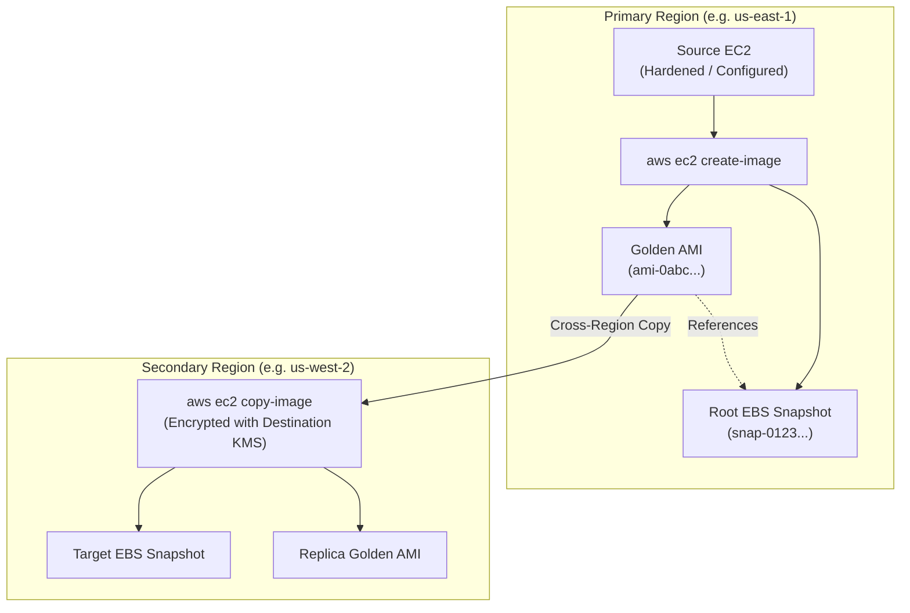

# Lab 1.3: Custom AMIs, Golden Images & Cross-Region Distribution

## 📌 Lab Objectives
- Create a customized "Golden Image" Amazon Machine Image (AMI) from an EC2 instance.
- Understand how AMIs reference EBS snapshots and block device mappings.
- Copy an AMI to another AWS Region with KMS encryption key re-wrapping.
- Safely deregister AMIs and purge orphaned underlying EBS snapshots to eliminate phantom storage costs.
- Review AWS EC2 Image Builder concepts for automated CI/CD image pipelines.

---

## 🏗️ Architecture Diagram


<details>
<summary>Click to expand Mermaid diagram source</summary>


<details>
<summary>Click to expand Mermaid diagram source</summary>


<details>
<summary>Click to expand Mermaid diagram source</summary>


</details>
</details>
</details>

---

## 💡 Key Architectural Concepts

1. **What is an AMI?**:
   - A template containing a configuration descriptor (architecture, virtualization type, root device name) and pointers to one or more EBS Snapshots.
2. **Dangling Snapshot Trap**:
   - Deregistering an AMI (`aws ec2 deregister-image`) does **NOT** delete the underlying EBS snapshots! The snapshots continue to incur storage charges until explicitly deleted (`aws ec2 delete-snapshot`).
3. **No-Reboot Flag (`--no-reboot`)**:
   - AWS typically reboots the instance before taking the snapshot to ensure file system consistency. Using `--no-reboot` creates the image without rebooting, but requires pausing active file I/O to avoid filesystem corruption.

---

## ⏱️ Prerequisites & Cost
- **AWS Free Tier Eligible**: Yes (within 30 GB monthly EBS snapshot allocation).
- **Estimated Duration**: 20 minutes.

---

## 🚀 Step-by-Step Instructions

### Step 1: Launch a Base Instance with Pre-Installed Tools
```bash
export AWS_REGION="us-east-1"
export DEST_REGION="us-west-2"

AMI_ID=$(aws ssm get-parameter \
  --region "${AWS_REGION}" \
  --name "/aws/service/ami-amazon-linux-latest/al2023-ami-kernel-default-x86_64" \
  --query "Parameter.Value" --output text)

VPC_ID=$(aws ec2 describe-vpcs --region "${AWS_REGION}" --filters "Name=isDefault,Values=true" --query "Vpcs[0].VpcId" --output text)
SUBNET_ID=$(aws ec2 describe-subnets --region "${AWS_REGION}" --filters "Name=vpc-id,Values=${VPC_ID}" --query "Subnets[0].SubnetId" --output text)

INSTANCE_ID=$(aws ec2 run-instances \
  --region "${AWS_REGION}" \
  --image-id "${AMI_ID}" \
  --instance-type "t3.micro" \
  --subnet-id "${SUBNET_ID}" \
  --user-data "#!/bin/bash
dnf install -y htop git tmux
echo 'Golden Image Base Build 1.0' > /etc/golden-image-version" \
  --tag-specifications "ResourceType=instance,Tags=[{Key=Project,Value=ec2-master-labs},{Key=Name,Value=golden-image-base}]" \
  --query "Instances[0].InstanceId" --output text)

echo "Launched Base Instance: ${INSTANCE_ID}"
aws ec2 wait instance-running --region "${AWS_REGION}" --instance-ids "${INSTANCE_ID}"
```

### Step 2: Create the Custom AMI
Create the custom AMI from the running instance:
```bash
CUSTOM_AMI_ID=$(aws ec2 create-image \
  --region "${AWS_REGION}" \
  --instance-id "${INSTANCE_ID}" \
  --name "golden-al2023-v1-$(date +%s)" \
  --description "Custom Golden AMI with pre-baked packages" \
  --no-reboot \
  --tag-specifications "ResourceType=image,Tags=[{Key=Project,Value=ec2-master-labs},{Key=Name,Value=golden-al2023-v1}]" \
  --query "ImageId" --output text)

echo "Created AMI: ${CUSTOM_AMI_ID}"
echo "Waiting for AMI to reach 'available' state (takes 2-3 mins)..."
aws ec2 wait image-available --region "${AWS_REGION}" --image-ids "${CUSTOM_AMI_ID}"
echo "AMI ${CUSTOM_AMI_ID} is ready!"
```

### Step 3: Inspect AMI Block Device Mappings and Snapshot IDs
Identify the snapshot backing this AMI:
```bash
SNAPSHOT_ID=$(aws ec2 describe-images \
  --region "${AWS_REGION}" \
  --image-ids "${CUSTOM_AMI_ID}" \
  --query "Images[0].BlockDeviceMappings[0].Ebs.SnapshotId" --output text)

echo "Underlying Snapshot ID: ${SNAPSHOT_ID}"
```

### Step 4: Copy AMI Cross-Region
Copy the AMI to `us-west-2` with destination encryption:
```bash
COPIED_AMI_ID=$(aws ec2 copy-image \
  --source-region "${AWS_REGION}" \
  --source-image-id "${CUSTOM_AMI_ID}" \
  --region "${DEST_REGION}" \
  --name "golden-al2023-v1-replica" \
  --description "Cross-region replica of Golden AMI" \
  --encrypted \
  --query "ImageId" --output text)

echo "Copied AMI to ${DEST_REGION}: ${COPIED_AMI_ID}"
```

---

## 🔍 Verification & Testing

### 1. Launch a Test Instance from the Custom AMI
Verify that instances launched from this AMI boot instantly with the pre-baked packages:
```bash
TEST_NODE_ID=$(aws ec2 run-instances \
  --region "${AWS_REGION}" \
  --image-id "${CUSTOM_AMI_ID}" \
  --instance-type "t3.micro" \
  --subnet-id "${SUBNET_ID}" \
  --tag-specifications "ResourceType=instance,Tags=[{Key=Project,Value=ec2-master-labs},{Key=Name,Value=test-ami-instance}]" \
  --query "Instances[0].InstanceId" --output text)

echo "Launched Node from Custom AMI: ${TEST_NODE_ID}"
aws ec2 wait instance-running --region "${AWS_REGION}" --instance-ids "${TEST_NODE_ID}"
```

---

## 🧹 Teardown & Clean-up

To avoid leftover snapshot storage charges, follow the strict two-step purge:
```bash
# 1. Terminate test and base instances
aws ec2 terminate-instances --region "${AWS_REGION}" --instance-ids "${INSTANCE_ID}" "${TEST_NODE_ID}"
aws ec2 wait instance-terminated --region "${AWS_REGION}" --instance-ids "${INSTANCE_ID}" "${TEST_NODE_ID}"

# 2. Deregister AMI in primary region
aws ec2 deregister-image --region "${AWS_REGION}" --image-id "${CUSTOM_AMI_ID}"

# 3. Delete underlying snapshot in primary region
aws ec2 delete-snapshot --region "${AWS_REGION}" --snapshot-id "${SNAPSHOT_ID}"

# 4. Deregister copied AMI and delete snapshot in destination region
DEST_SNAPSHOT_ID=$(aws ec2 describe-images --region "${DEST_REGION}" --image-ids "${COPIED_AMI_ID}" --query "Images[0].BlockDeviceMappings[0].Ebs.SnapshotId" --output text 2>/dev/null || echo "")
aws ec2 deregister-image --region "${DEST_REGION}" --image-id "${COPIED_AMI_ID}"
if [[ -n "${DEST_SNAPSHOT_ID}" && "${DEST_SNAPSHOT_ID}" != "None" ]]; then
  aws ec2 delete-snapshot --region "${DEST_REGION}" --snapshot-id "${DEST_SNAPSHOT_ID}"
fi

echo "Lab 1.3 clean-up completed successfully."
```
