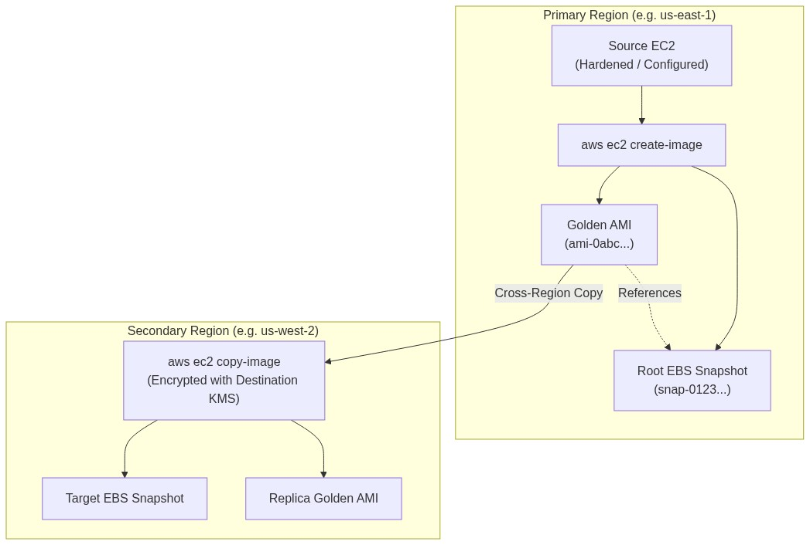
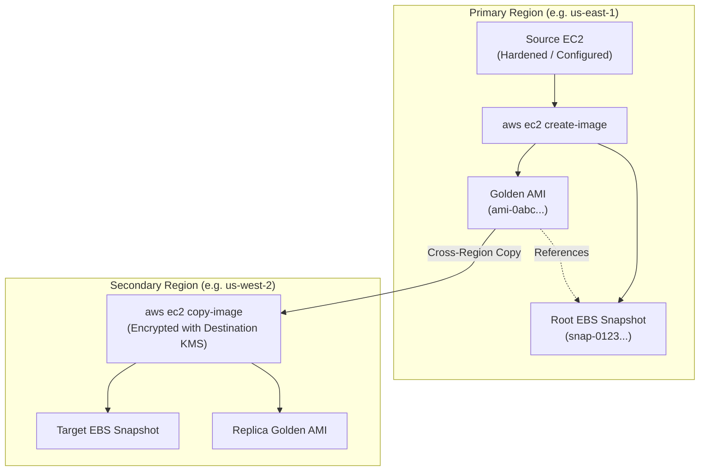

<div align="center">

# 🔬 Lab 1.3: Custom AMIs, Golden Images & Cross-Region Distribution

**[🏠 AWS Labs Root](../../../README.md)** &nbsp;•&nbsp; **[🖥️ EC2 Curriculum](../../README.md)** &nbsp;•&nbsp; **[📂 Module 01](../README.md)**

   

**[⬅️ Previous Lab](../../module-01-fundamentals-and-lifecycle/lab-02-lifecycle-and-hibernation/README.md)** &nbsp;|&nbsp; **[➡️ Next Lab](../../module-02-storage-ebs-ephemeral-efs/lab-01-ebs-elastic-volumes/README.md)**


<a href="https://cyber-cloud-security.github.io/aws-labs/?lab=lab-03-amis-and-image-builder" target="_blank" rel="noopener noreferrer"></a>

</div>

---

## 📌 Lab Objectives

- [x] Create a customized "Golden Image" Amazon Machine Image (AMI) from an EC2 instance.
- [x] Understand how AMIs reference EBS snapshots and block device mappings.
- [x] Copy an AMI to another AWS Region with KMS encryption key re-wrapping.
- [x] Safely deregister AMIs and purge orphaned underlying EBS snapshots to eliminate phantom storage costs.
- [x] Review AWS EC2 Image Builder concepts for automated CI/CD image pipelines.

---

## 🏗️ Architecture Diagram



<details>
<summary>📐 <b>View Mermaid Architecture Source (Click to Expand)</b></summary>


```mermaid
flowchart TD
    subgraph PrimaryRegion["Primary Region (e.g. us-east-1)"]
        BaseEC2["Source EC2\n(Hardened / Configured)"]
        CreateImg["aws ec2 create-image"]
        Snap["Root EBS Snapshot\n(snap-0123...)"]
        AMI["Golden AMI\n(ami-0abc...)"]

        BaseEC2 --> CreateImg
        CreateImg --> Snap
        CreateImg --> AMI
        AMI -.->|References| Snap
    end

    subgraph SecondaryRegion["Secondary Region (e.g. us-west-2)"]
        CopyImg["aws ec2 copy-image\n(Encrypted with Destination KMS)"]
        DestSnap["Target EBS Snapshot"]
        DestAMI["Replica Golden AMI"]

        CopyImg --> DestSnap
        CopyImg --> DestAMI
    end

    AMI -->|Cross-Region Copy| CopyImg
```

</details>

---

## 💡 Key Architectural Concepts

1. **What is an AMI?**:
   - A template containing a configuration descriptor (architecture, virtualization type, root device name) and pointers to one or more EBS Snapshots.
2. **Dangling Snapshot Trap**:
   - Deregistering an AMI (`aws ec2 deregister-image`) does **NOT** delete the underlying EBS snapshots! The snapshots continue to incur storage charges until explicitly deleted (`aws ec2 delete-snapshot`).
3. **No-Reboot Flag (`--no-reboot`)**:
   - AWS typically reboots the instance before taking the snapshot to ensure file system consistency. Using `--no-reboot` creates the image without rebooting, but requires pausing active file I/O to avoid filesystem corruption.

---

## ⏱️ Prerequisites & Environment Setup

- **Global Setup**: Ensure you have completed the **[Module 00: Global Prerequisites & AWS CLI Environment Setup](../../module-00-prerequisites/README.md)** (AWS CLI v2 installed on Ubuntu/macOS, authenticated credentials, and `AWS_PAGER=""` configured).
- **AWS Free Tier Eligible**: Yes (within 30 GB monthly EBS snapshot allocation).
- **Estimated Duration**: 20 minutes.

### 🔑 Lab-Specific Requirements
> [!IMPORTANT]
> - **Primary Region**: `us-east-1` (Active Default VPC with internet access).
> - **Secondary Region**: `us-west-2` (Enabled region for cross-region AMI replication).
> - **IAM Permissions**: `ec2:RunInstances`, `ec2:CreateImage`, `ec2:CopyImage`, `ec2:DeregisterImage`, `ec2:DeleteSnapshot`, and `ssm:GetParameter`.

---

---

## 🚀 Step-by-Step Instructions

### Step 1: Launch a Base Instance with Pre-Installed Tools

1. Set target regions and discover AMI and network identifiers:
```bash
export AWS_REGION="us-east-1"
export DEST_REGION="us-west-2"

AMI_ID=$(aws ssm get-parameter \
  --region "${AWS_REGION}" \
  --name "/aws/service/ami-amazon-linux-latest/al2023-ami-kernel-default-x86_64" \
  --query "Parameter.Value" --output text)

VPC_ID=$(aws ec2 describe-vpcs \
  --region "${AWS_REGION}" \
  --filters "Name=isDefault,Values=true" \
  --query "Vpcs[0].VpcId" \
  --output text)
SUBNET_ID=$(aws ec2 describe-subnets \
  --region "${AWS_REGION}" \
  --filters "Name=vpc-id,Values=${VPC_ID}" \
  --query "Subnets[0].SubnetId" \
  --output text)
```

2. Create the bootstrap script for the Golden Image:
```bash
cat << 'EOF' > userdata.sh
#!/bin/bash
dnf install -y htop git tmux
echo 'Golden Image Base Build 1.0' > /etc/golden-image-version
EOF
```

3. Launch the base instance:
```bash
INSTANCE_ID=$(aws ec2 run-instances \
  --region "${AWS_REGION}" \
  --image-id "${AMI_ID}" \
  --instance-type "t3.micro" \
  --subnet-id "${SUBNET_ID}" \
  --user-data file://userdata.sh \
  --tag-specifications "ResourceType=instance,Tags=[{Key=Project,Value=ec2-master-labs},{Key=Name,Value=golden-image-base}]" \
  --query "Instances[0].InstanceId" --output text)
```

4. Confirm launched instance and wait until running:
```bash
echo "Launched Base Instance: ${INSTANCE_ID}"
aws ec2 wait instance-running --region "${AWS_REGION}" --instance-ids "${INSTANCE_ID}"
echo "[SUCCESS] Base instance is running."
```

---

### Step 2: Create the Custom AMI

1. Trigger AMI creation from the base instance:
```bash
CUSTOM_AMI_ID=$(aws ec2 create-image \
  --region "${AWS_REGION}" \
  --instance-id "${INSTANCE_ID}" \
  --name "golden-al2023-v1-$(date +%s)" \
  --description "Custom Golden AMI with pre-baked packages" \
  --no-reboot \
  --tag-specifications "ResourceType=image,Tags=[{Key=Project,Value=ec2-master-labs},{Key=Name,Value=golden-al2023-v1}]" \
  --query "ImageId" --output text)
```

2. Wait for the custom AMI to reach `available` state:
```bash
echo "Created AMI: ${CUSTOM_AMI_ID}"
aws ec2 wait image-available --region "${AWS_REGION}" --image-ids "${CUSTOM_AMI_ID}"
echo "[SUCCESS] AMI ${CUSTOM_AMI_ID} is ready!"
```

---

### Step 3: Inspect AMI Block Device Mappings and Snapshot IDs

Identify the snapshot backing this AMI:
```bash
SNAPSHOT_ID=$(aws ec2 describe-images \
  --region "${AWS_REGION}" \
  --image-ids "${CUSTOM_AMI_ID}" \
  --query "Images[0].BlockDeviceMappings[0].Ebs.SnapshotId" --output text)

echo "Underlying Snapshot ID: ${SNAPSHOT_ID}"
```

---

### Step 4: Copy AMI Cross-Region

1. Copy the AMI to `us-west-2` with destination KMS encryption:
```bash
COPIED_AMI_ID=$(aws ec2 copy-image \
  --source-region "${AWS_REGION}" \
  --source-image-id "${CUSTOM_AMI_ID}" \
  --region "${DEST_REGION}" \
  --name "golden-al2023-v1-replica" \
  --description "Cross-region replica of Golden AMI" \
  --encrypted \
  --query "ImageId" --output text)
```

2. Confirm copied AMI identifier:
```bash
echo "Copied AMI to ${DEST_REGION}: ${COPIED_AMI_ID}"
```

---

## 🔍 Verification & Testing

### 1. Launch a Test Instance from the Custom AMI
1. Launch an instance using the custom AMI:
```bash
TEST_NODE_ID=$(aws ec2 run-instances \
  --region "${AWS_REGION}" \
  --image-id "${CUSTOM_AMI_ID}" \
  --instance-type "t3.micro" \
  --subnet-id "${SUBNET_ID}" \
  --tag-specifications "ResourceType=instance,Tags=[{Key=Project,Value=ec2-master-labs},{Key=Name,Value=test-ami-instance}]" \
  --query "Instances[0].InstanceId" --output text)
```

2. Confirm launch and wait until running:
```bash
echo "Launched Node from Custom AMI: ${TEST_NODE_ID}"
aws ec2 wait instance-running --region "${AWS_REGION}" --instance-ids "${TEST_NODE_ID}"
echo "[SUCCESS] Test instance from custom AMI is running."
```

---

## 🧹 Teardown & Clean-up

> [!CAUTION]
> **Always Tear Down Lab Resources**: Execute the cleanup commands below immediately after completing the verification steps to prevent unintended AWS billing.

1. Terminate test and base instances and wait for termination:
```bash
aws ec2 terminate-instances \
  --region "${AWS_REGION}" \
  --instance-ids "${INSTANCE_ID}" "${TEST_NODE_ID}"
aws ec2 wait instance-terminated --region "${AWS_REGION}" --instance-ids "${INSTANCE_ID}" "${TEST_NODE_ID}"
```

2. Deregister AMI in primary region:
```bash
aws ec2 deregister-image --region "${AWS_REGION}" --image-id "${CUSTOM_AMI_ID}"
```

3. Delete underlying snapshot in primary region:
```bash
aws ec2 delete-snapshot --region "${AWS_REGION}" --snapshot-id "${SNAPSHOT_ID}"
```

4. Deregister copied AMI and delete snapshot in destination region:
```bash
DEST_SNAPSHOT_ID=$(aws ec2 describe-images --region "${DEST_REGION}" --image-ids "${COPIED_AMI_ID}" --query "Images[0].BlockDeviceMappings[0].Ebs.SnapshotId" --output text 2>/dev/null || echo "")
aws ec2 deregister-image --region "${DEST_REGION}" --image-id "${COPIED_AMI_ID}"
if [[ -n "${DEST_SNAPSHOT_ID}" && "${DEST_SNAPSHOT_ID}" != "None" ]]; then
  aws ec2 delete-snapshot --region "${DEST_REGION}" --snapshot-id "${DEST_SNAPSHOT_ID}"
fi
```

5. Clean up local temporary files:
```bash
rm -f userdata.sh
```

6. Confirm cleanup:
```bash
echo "[SUCCESS] Lab 1.3 clean-up completed successfully."
```

---

<div align="center">

**[⬅️ Previous Lab](../../module-01-fundamentals-and-lifecycle/lab-02-lifecycle-and-hibernation/README.md)** &nbsp;•&nbsp; **[⬆️ Back to Module 01](../README.md)** &nbsp;•&nbsp; **[🏠 EC2 Index](../../README.md)** &nbsp;•&nbsp; **[➡️ Next Lab](../../module-02-storage-ebs-ephemeral-efs/lab-01-ebs-elastic-volumes/README.md)**

</div>
