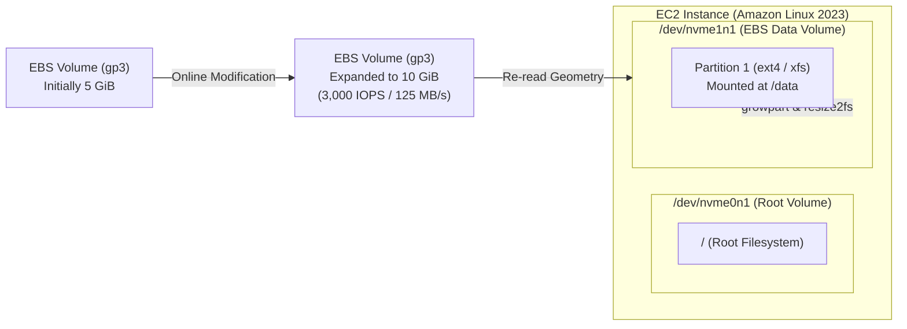

<div align="center">

# 🔬 Lab 2.1: EBS Volume Management & Online Elastic Volume Expansion

**[🏠 AWS Labs Root](../../../README.md)** &nbsp;•&nbsp; **[🖥️ EC2 Curriculum](../../README.md)** &nbsp;•&nbsp; **[📂 Module 02](../README.md)**

   

**[⬅️ Previous Lab](../../module-01-fundamentals-and-lifecycle/lab-03-amis-and-image-builder/README.md)** &nbsp;|&nbsp; **[➡️ Next Lab](../../module-02-storage-ebs-ephemeral-efs/lab-02-snapshots-dlm-multiattach/README.md)**


[](https://cyber-cloud-security.github.io/aws-labs/?lab=lab-01-ebs-elastic-volumes)

</div>

---

## 📌 Lab Objectives

- [x] Create, attach, and persistently mount an Amazon EBS volume (`gp3`) to an EC2 instance.
- [x] Safely configure `/etc/fstab` using filesystem **UUIDs** and fail-safe options (`nofail`) to prevent boot hangs.
- [x] Perform **Online Elastic Volume Expansion**: Increase volume size from 5 GiB to 10 GiB on-the-fly without unmounting or rebooting.
- [x] Expand partition table (`growpart`) and resize file systems (`xfs_growfs` / `resize2fs`) with zero downtime.

---

## 🏗️ Architecture Diagram


<details>
<summary>📐 <b>View Mermaid Architecture Source (Click to Expand)</b></summary>



</details>

---

## 💡 Key Architectural Concepts

1. **Nitro Device Naming**:
   - On Nitro-based instances, EBS volumes are exposed as NVMe devices (`/dev/nvme0n1`, `/dev/nvme1n1`), regardless of the traditional device name passed to the API (such as `/dev/sdf`).
   - Use `nvme id-ctrl -v /dev/nvmeXn1` or `ebsnvme-id` to identify which volume maps to which NVMe device.
2. **The `/etc/fstab` "nofail" Rule**:
   - If an EBS volume listed in `/etc/fstab` is detached, destroyed, or slow to attach during instance restart, Linux will drop into emergency recovery mode.
   - **Always** specify `nofail` and mount by `UUID=` rather than `/dev/xvdf`.
3. **Elastic Volumes**:
   - Allows changing volume size, IOPS, throughput, and volume type (e.g., `gp2` to `gp3`) without detaching or stopping the instance.

---

## ⏱️ Prerequisites & Cost

> [!TIP]
> **AWS Free Tier & Cost Guardrail**
> - **AWS Free Tier Eligible**: Yes (within the 30 GB EBS Free Tier limit).
> - **Estimated Duration**: 20 minutes.

---

## 🚀 Step-by-Step Instructions

### Step 1: Launch EC2 Instance
```bash
export AWS_REGION=$(aws configure get region || echo "us-east-1")
export VPC_ID=$(aws ec2 describe-vpcs \
  --filters "Name=isDefault,Values=true" \
  --query "Vpcs[0].VpcId" \
  --output text)
export SUBNET_ID=$(aws ec2 describe-subnets \
  --filters "Name=vpc-id,Values=${VPC_ID}" \
  --query "Subnets[0].SubnetId" \
  --output text)
export AZ=$(aws ec2 describe-subnets \
  --subnet-ids "${SUBNET_ID}" \
  --query "Subnets[0].AvailabilityZone" \
  --output text)

AMI_ID=$(aws ssm get-parameter \
  --name "/aws/service/ami-amazon-linux-latest/al2023-ami-kernel-default-x86_64" \
  --query "Parameter.Value" --output text)

INSTANCE_ID=$(aws ec2 run-instances \
  --image-id "${AMI_ID}" \
  --instance-type "t3.micro" \
  --subnet-id "${SUBNET_ID}" \
  --tag-specifications "ResourceType=instance,Tags=[{Key=Project,Value=ec2-master-labs},{Key=Name,Value=ebs-lab-node}]" \
  --query "Instances[0].InstanceId" --output text)

echo "Waiting for instance ${INSTANCE_ID} to run in ${AZ}..."
aws ec2 wait instance-running --instance-ids "${INSTANCE_ID}"
```

### Step 2: Create a 5 GiB gp3 Volume in the SAME Availability Zone
> [!IMPORTANT]
> EBS volumes are zonal resources! The volume MUST be created in the exact same Availability Zone (`${AZ}`) as the EC2 instance.

```bash
VOLUME_ID=$(aws ec2 create-volume \
  --availability-zone "${AZ}" \
  --size 5 \
  --volume-type "gp3" \
  --tag-specifications "ResourceType=volume,Tags=[{Key=Project,Value=ec2-master-labs},{Key=Name,Value=data-vol-1}]" \
  --query "VolumeId" --output text)

echo "Created EBS Volume: ${VOLUME_ID}"
aws ec2 wait volume-available --volume-ids "${VOLUME_ID}"
```

### Step 3: Attach Volume to the EC2 Instance
```bash
aws ec2 attach-volume \
  --volume-id "${VOLUME_ID}" \
  --instance-id "${INSTANCE_ID}" \
  --device "/dev/sdf"

aws ec2 wait volume-in-use --volume-ids "${VOLUME_ID}"
echo "Volume attached successfully."
```

### Step 4: Format, Mount & Configure `/etc/fstab`
Send commands to the instance using AWS Systems Manager Run Command (or via SSH if you have keys configured):

```bash
# Execute partitioning, formatting, and persistent mount
COMMAND_ID=$(aws ssm send-command \
  --instance-ids "${INSTANCE_ID}" \
  --document-name "AWS-RunShellScript" \
  --parameters 'commands=[
    "lsblk",
    "DEVICE=$(lsblk -d -n -o NAME | grep nvme | grep -v nvme0n1 | head -n 1)",
    "mkfs.xfs /dev/$DEVICE",
    "mkdir -p /mnt/data",
    "UUID=$(blkid -s UUID -o value /dev/$DEVICE)",
    "echo \"UUID=$UUID /mnt/data xfs defaults,nofail 0 2\" >> /etc/fstab",
    "mount -a",
    "df -h /mnt/data",
    "echo \"Testing persistent storage write\" > /mnt/data/test.txt"
  ]' \
  --query "Command.CommandId" --output text 2>/dev/null || echo "")

if [[ -n "${COMMAND_ID}" ]]; then
  echo "Command sent via SSM. Command ID: ${COMMAND_ID}"
fi
```

---

## 🔍 Verification: Online Elastic Volume Expansion

Now, simulate high disk usage requiring an emergency storage expansion from **5 GiB to 10 GiB** without downtime:

### 1. Request AWS EBS Volume Modification
```bash
aws ec2 modify-volume \
  --volume-id "${VOLUME_ID}" \
  --size 10

echo "Requested volume expansion to 10 GiB..."
```

Monitor modification state:
```bash
aws ec2 describe-volumes-modifications \
  --volume-ids "${VOLUME_ID}" \
  --query "VolumesModifications[0].ModificationState" --output text
```
The state will transition: `modifying` -> `optimizing` -> `completed`. The new capacity is visible to the hypervisor immediately in `optimizing` state!

### 2. Extend Filesystem in OS (Zero Downtime)
On the instance, the operating system kernel needs to extend the filesystem to take advantage of the newly available block capacity:

For **XFS** filesystems:
```bash
# In an active shell or SSM command:
# xfs_growfs -d /mnt/data
```

For **ext4** filesystems:
```bash
# resize2fs /dev/nvme1n1
```

Verify the new size:
```bash
# df -h /mnt/data
# Filesystem      Size  Used Avail Use% Mounted on
# /dev/nvme1n1     10G   32M   10G   1% /mnt/data
```
The storage is doubled without any unmounting or downtime.

---

## 🧹 Teardown & Clean-up


> [!CAUTION]
> **Always Tear Down Lab Resources**: Execute the cleanup commands below immediately after completing the verification steps to prevent unintended AWS billing.

```bash
# 1. Terminate EC2 instance
aws ec2 terminate-instances --instance-ids "${INSTANCE_ID}"
aws ec2 wait instance-terminated --instance-ids "${INSTANCE_ID}"

# 2. Wait for volume to become available and delete it
aws ec2 wait volume-available --volume-ids "${VOLUME_ID}" 2>/dev/null || true
aws ec2 delete-volume --volume-id "${VOLUME_ID}"

echo "Lab 2.1 clean-up completed successfully."
```

---

<div align="center">

**[⬅️ Previous Lab](../../module-01-fundamentals-and-lifecycle/lab-03-amis-and-image-builder/README.md)** &nbsp;•&nbsp; **[⬆️ Back to Module 02](../README.md)** &nbsp;•&nbsp; **[🏠 EC2 Index](../../README.md)** &nbsp;•&nbsp; **[➡️ Next Lab](../../module-02-storage-ebs-ephemeral-efs/lab-02-snapshots-dlm-multiattach/README.md)**

</div>
