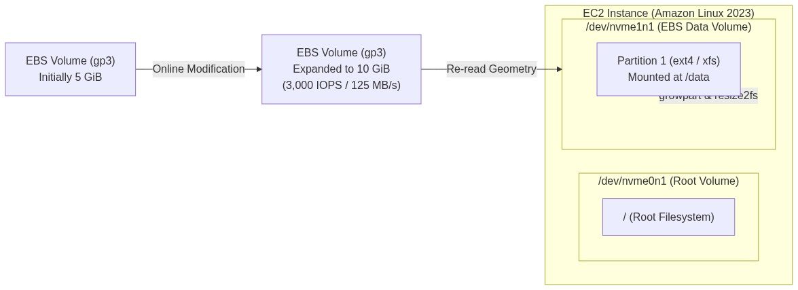
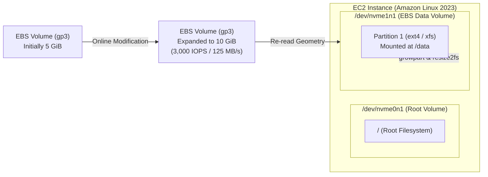

<div align="center">

# 🔬 Lab 2.1: EBS Volume Management & Online Elastic Volume Expansion

**[🏠 AWS Labs Root](../../../README.md)** &nbsp;•&nbsp; **[🖥️ EC2 Curriculum](../../README.md)** &nbsp;•&nbsp; **[📂 Module 02](../README.md)**

   

**[⬅️ Previous Lab](../../module-01-fundamentals-and-lifecycle/lab-03-amis-and-image-builder/README.md)** &nbsp;|&nbsp; **[➡️ Next Lab](../../module-02-storage-ebs-ephemeral-efs/lab-02-snapshots-dlm-multiattach/README.md)**

</div>

---

## 📌 Lab Objectives

- [x] Create, attach, and persistently mount an Amazon EBS volume (`gp3`) to an EC2 instance.
- [x] Safely configure `/etc/fstab` using filesystem **UUIDs** and fail-safe options (`nofail`) to prevent boot hangs.
- [x] Perform **Online Elastic Volume Expansion**: Increase volume size from 5 GiB to 10 GiB on-the-fly without unmounting or rebooting.
- [x] Expand partition table (`growpart`) and resize file systems (`xfs_growfs` / `resize2fs`) with zero downtime.

---

## 🏗️ Architecture Diagram



<details>
<summary>📐 <b>View Mermaid Architecture Source (Click to Expand)</b></summary>



</details>

---

## 💡 Key Architectural Concepts

1. **Nitro Device Naming**:
   - On Nitro-based instances, EBS volumes are exposed as NVMe devices (`/dev/nvme0n1`, `/dev/nvme1n1`), regardless of the traditional device name passed to the API (such as `/dev/sdf`).
   - Use `nvme id-ctrl -v /dev/nvmeXn1` or `ebsnvme-id` to identify which volume maps to which NVMe device.
2. **The `/etc/fstab` "nofail" Rule**:
   - If an EBS volume listed in `/etc/fstab` is detached, destroyed, or slow to attach during instance restart, Linux will drop into emergency recovery mode.
   - **Always** specify `nofail` and mount by `UUID=` rather than `/dev/xvdf`.
3. **Elastic Volumes**:
   - Allows changing volume size, IOPS, throughput, and volume type (e.g., `gp2` to `gp3`) without detaching or stopping the instance.

---

## ⏱️ Prerequisites & Cost

> [!TIP]
> **AWS Free Tier & Cost Guardrail**
> - **AWS Free Tier Eligible**: Yes (within the 30 GB EBS Free Tier limit).
> - **Estimated Duration**: 20 minutes.

---

## 🚀 Step-by-Step Instructions

### Step 1: Launch EC2 Instance
```bash
export AWS_REGION=$(aws configure get region || echo "us-east-1")
export VPC_ID=$(aws ec2 describe-vpcs \
  --filters "Name=isDefault,Values=true" \
  --query "Vpcs[0].VpcId" \
  --output text)
export SUBNET_ID=$(aws ec2 describe-subnets \
  --filters "Name=vpc-id,Values=${VPC_ID}" \
  --query "Subnets[0].SubnetId" \
  --output text)
export AZ=$(aws ec2 describe-subnets \
  --subnet-ids "${SUBNET_ID}" \
  --query "Subnets[0].AvailabilityZone" \
  --output text)

AMI_ID=$(aws ssm get-parameter \
  --name "/aws/service/ami-amazon-linux-latest/al2023-ami-kernel-default-x86_64" \
  --query "Parameter.Value" --output text)

INSTANCE_ID=$(aws ec2 run-instances \
  --image-id "${AMI_ID}" \
  --instance-type "t3.micro" \
  --subnet-id "${SUBNET_ID}" \
  --tag-specifications "ResourceType=instance,Tags=[{Key=Project,Value=ec2-master-labs},{Key=Name,Value=ebs-lab-node}]" \
  --query "Instances[0].InstanceId" --output text)

echo "Waiting for instance ${INSTANCE_ID} to run in ${AZ}..."
aws ec2 wait instance-running --instance-ids "${INSTANCE_ID}"
```

### Step 2: Create a 5 GiB gp3 Volume in the SAME Availability Zone
> [!IMPORTANT]
> EBS volumes are zonal resources! The volume MUST be created in the exact same Availability Zone (`${AZ}`) as the EC2 instance.

```bash
VOLUME_ID=$(aws ec2 create-volume \
  --availability-zone "${AZ}" \
  --size 5 \
  --volume-type "gp3" \
  --tag-specifications "ResourceType=volume,Tags=[{Key=Project,Value=ec2-master-labs},{Key=Name,Value=data-vol-1}]" \
  --query "VolumeId" --output text)

echo "Created EBS Volume: ${VOLUME_ID}"
aws ec2 wait volume-available --volume-ids "${VOLUME_ID}"
```

### Step 3: Attach Volume to the EC2 Instance
```bash
aws ec2 attach-volume \
  --volume-id "${VOLUME_ID}" \
  --instance-id "${INSTANCE_ID}" \
  --device "/dev/sdf"

aws ec2 wait volume-in-use --volume-ids "${VOLUME_ID}"
echo "Volume attached successfully."
```

### Step 4: Format, Mount & Configure `/etc/fstab`
Send commands to the instance using AWS Systems Manager Run Command (or via SSH if you have keys configured):

```bash
# Execute partitioning, formatting, and persistent mount
COMMAND_ID=$(aws ssm send-command \
  --instance-ids "${INSTANCE_ID}" \
  --document-name "AWS-RunShellScript" \
  --parameters 'commands=[
    "lsblk",
    "DEVICE=$(lsblk -d -n -o NAME | grep nvme | grep -v nvme0n1 | head -n 1)",
    "mkfs.xfs /dev/$DEVICE",
    "mkdir -p /mnt/data",
    "UUID=$(blkid -s UUID -o value /dev/$DEVICE)",
    "echo \"UUID=$UUID /mnt/data xfs defaults,nofail 0 2\" >> /etc/fstab",
    "mount -a",
    "df -h /mnt/data",
    "echo \"Testing persistent storage write\" > /mnt/data/test.txt"
  ]' \
  --query "Command.CommandId" --output text 2>/dev/null || echo "")

if [[ -n "${COMMAND_ID}" ]]; then
  echo "Command sent via SSM. Command ID: ${COMMAND_ID}"
fi
```

---

## 🔍 Verification: Online Elastic Volume Expansion

Now, simulate high disk usage requiring an emergency storage expansion from **5 GiB to 10 GiB** without downtime:

### 1. Request AWS EBS Volume Modification
```bash
aws ec2 modify-volume \
  --volume-id "${VOLUME_ID}" \
  --size 10

echo "Requested volume expansion to 10 GiB..."
```

Monitor modification state:
```bash
aws ec2 describe-volumes-modifications \
  --volume-ids "${VOLUME_ID}" \
  --query "VolumesModifications[0].ModificationState" --output text
```
The state will transition: `modifying` -> `optimizing` -> `completed`. The new capacity is visible to the hypervisor immediately in `optimizing` state!

### 2. Extend Filesystem in OS (Zero Downtime)
On the instance, the operating system kernel needs to extend the filesystem to take advantage of the newly available block capacity:

For **XFS** filesystems:
```bash
# In an active shell or SSM command:
# xfs_growfs -d /mnt/data
```

For **ext4** filesystems:
```bash
# resize2fs /dev/nvme1n1
```

Verify the new size:
```bash
# df -h /mnt/data
# Filesystem      Size  Used Avail Use% Mounted on
# /dev/nvme1n1     10G   32M   10G   1% /mnt/data
```
The storage is doubled without any unmounting or downtime.

---

## 📘 Deep-Dive Command & Flag Reference

> [!TIP]
> **Line-by-Line Production Analysis**: Every command executed in this lab is dissected below, explaining each CLI flag, JMESPath query, Linux kernel parameter, and why it is critical in production automation.

<details open>
<summary>📘 <b>Command 1: Creating a Zonal Amazon EBS Volume (`gp3`)</b></summary>

```bash
VOLUME_ID=$(aws ec2 create-volume \
  --availability-zone "${AZ}" \
  --size 5 \
  --volume-type "gp3" \
  --tag-specifications "ResourceType=volume,Tags=[{Key=Project,Value=ec2-master-labs},{Key=Name,Value=data-vol-1}]" \
  --query "VolumeId" --output text)
```

#### 🔍 Parameter & Component Breakdown

- **`aws ec2 create-volume`** — Invokes the `CreateVolume` API to allocate a new unformatted block storage volume on AWS storage clusters.

- **`--availability-zone "${AZ}"`** — **Strict Architectural Rule**:
EBS volumes are **zonal resources**, not regional. A volume physically resides on storage racks within a single Availability Zone (e.g. `us-east-1a`). It can **only** be attached to EC2 instances running in that exact same AZ. If the instance is in `us-east-1b` and the volume is in `us-east-1a`, attachment is physically impossible.

- **`--size 5`** — Allocates 5 GiB of storage capacity.

- **`--volume-type "gp3"`** — Selects latest-generation General Purpose SSD (`gp3`).
  - **Baseline Performance** — 3,000 IOPS and 125 MB/s throughput included free of charge, regardless of volume size.
  - Unlike legacy `gp2` (which ties performance to size at 3 IOPS/GB), a 5 GiB `gp3` volume gets full 3,000 IOPS immediately.

- **`--query "VolumeId" --output text`** — Retrieves the newly allocated volume identifier (e.g. `vol-0123456789abcdef0`).

> 🏭 **Why This Matters in Production Automation**
> When designing multi-AZ architectures, automation scripts must dynamically extract the target instance's `Placement.AvailabilityZone` before calling `create-volume`. Hardcoding zones or assuming multi-AZ volume attachment will trigger immediate deployment failures.

</details>

<details open>
<summary>📘 <b>Command 2: Attaching the EBS Volume to the Instance</b></summary>

```bash
aws ec2 attach-volume \
  --volume-id "${VOLUME_ID}" \
  --instance-id "${INSTANCE_ID}" \
  --device "/dev/sdf"
```

#### 🔍 Parameter & Component Breakdown

- **`aws ec2 attach-volume`** — Instructs the Nitro storage card on the physical host to connect the remote networked EBS volume over the internal AWS PCIe NVMe storage fabric.

- **`--device "/dev/sdf"`** — The traditional block device name passed to the AWS API.
**The Nitro Mapping Reality**: On all modern AWS Nitro instances, the Linux kernel does **not** expose the disk as `/dev/sdf` or `/dev/xvdf`. Instead, it is exposed as an NVMe block device: `/dev/nvme1n1`. The `/dev/sdf` parameter is preserved solely for AWS API backward compatibility.

> 🏭 **Why This Matters in Production Automation**
> Modern cloud automation scripts must never assume traditional `/dev/xvd*` device paths inside guest operating systems. Automation tools must use NVMe-aware discovery commands (such as `nvme id-ctrl` or `ebsnvme-id`) to map AWS volume IDs to actual Linux block device paths.

</details>

<details open>
<summary>📘 <b>Command 3: Formatting and Mounting via `/etc/fstab` with `nofail`</b></summary>

```bash
mkfs.xfs /dev/nvme1n1
mkdir -p /mnt/data
UUID=$(blkid -s UUID -o value /dev/nvme1n1)
echo "UUID=$UUID /mnt/data xfs defaults,nofail 0 2" >> /etc/fstab
mount -a
```

#### 🔍 Parameter & Component Breakdown

- **`mkfs.xfs /dev/nvme1n1`** — Formats the raw block device with the high-performance XFS filesystem, creating allocation groups and metadata superblocks.

- **`blkid -s UUID -o value /dev/nvme1n1`** — Extracts the universally unique identifier (UUID) generated by `mkfs`.
Example: `b1a2c3d4-5678-90ab-cdef-1234567890ab`.

- `UUID=$UUID /mnt/data xfs defaults,nofail 0 2` (The `/etc/fstab` Line):
  - **`UUID=...`** — Mounts by filesystem signature rather than device name. Device names can shuffle across reboots (e.g. `/dev/nvme1n1` swapping with `/dev/nvme2n1`); UUIDs are immutable.
  - **`/mnt/data`** — Target directory mount point.
  - **`xfs`** — Filesystem type.
  - **`defaults`** — Enables standard mount options (`rw`, `suid`, `dev`, `exec`, `auto`, `nouser`, `async`).
  - **`nofail`** — **The Enterprise Disaster Prevention Flag**. Tells systemd to continue booting normally even if this volume is missing, detached, or corrupted. Without `nofail`, a detached secondary disk will cause Linux boot to halt and drop into emergency recovery shell!
  - **`0`** — Disables filesystem dumps via the legacy `dump` utility.
  - **`2`** — Sets filesystem check order (`fsck`) to secondary priority (root disk is `1`).

- **`mount -a`** — Parses `/etc/fstab` and mounts all declared filesystems immediately without rebooting, validating that the fstab syntax is 100% correct.

> 🏭 **Why This Matters in Production Automation**
> Writing to `/etc/fstab` without `nofail` is one of the most common causes of bricked EC2 instances in production. If a secondary volume is detached or snapshotted during maintenance, the instance will fail its health checks on subsequent reboot, causing total application downtime.

</details>

<details open>
<summary>📘 <b>Command 4: Triggering Online Elastic Volume Resizing</b></summary>

```bash
aws ec2 modify-volume \
  --volume-id "${VOLUME_ID}" \
  --size 10
```

#### 🔍 Parameter & Component Breakdown

- **`aws ec2 modify-volume`** — Leverages AWS **Elastic Volumes** technology to alter block device geometry on live, in-use volumes.

- **`--size 10`** — Expands capacity from 5 GiB to 10 GiB.

- **Under the Hood** — AWS automatically increases the virtual disk boundary at the storage SAN layer. The storage modification moves through three distinct states:
1. `modifying`: AWS storage controllers are adjusting disk allocations.  
2. `optimizing`: The new capacity is immediately visible and usable by the guest OS hypervisor; AWS background processes migrate blocks.  
3. `completed`: Optimization finishes.

> 🏭 **Why This Matters in Production Automation**
> Elastic Volumes completely eliminates the legacy requirement of detaching volumes, taking snapshots, creating new larger volumes, re-attaching, and suffering hours of production maintenance downtime. Disk capacity can be doubled live while customer transactions continue writing to the disk.

</details>

<details open>
<summary>📘 <b>Command 5: Online Filesystem Expansion in Linux (Zero Downtime)</b></summary>

```bash
# For XFS filesystems:
xfs_growfs -d /mnt/data

# For ext4 filesystems:
# resize2fs /dev/nvme1n1
```

#### 🔍 Parameter & Component Breakdown

- **`xfs_growfs -d /mnt/data`** — Tells the Linux XFS kernel module to query the underlying block device geometry and expand the filesystem to the maximum available boundary (`-d`).
*Note*: `xfs_growfs` operates on the **mount point** (`/mnt/data`), not the raw device path.

- **`resize2fs /dev/nvme1n1` (For ext4)** — The corresponding ext4 command, which operates on the block device path and online-resizes block groups.

> 🏭 **Why This Matters in Production Automation**
> Modifying volume size in AWS (`aws ec2 modify-volume`) only increases the size of the *virtual disk container*. The guest operating system kernel is not aware of the extra space until `xfs_growfs` or `resize2fs` is executed. Both commands execute in less than 1 second with **zero downtime or unmounting required**.

</details>

---

## 🧹 Teardown & Clean-up


> [!CAUTION]
> **Always Tear Down Lab Resources**: Execute the cleanup commands below immediately after completing the verification steps to prevent unintended AWS billing.

```bash
# 1. Terminate EC2 instance
aws ec2 terminate-instances --instance-ids "${INSTANCE_ID}"
aws ec2 wait instance-terminated --instance-ids "${INSTANCE_ID}"

# 2. Wait for volume to become available and delete it
aws ec2 wait volume-available --volume-ids "${VOLUME_ID}" 2>/dev/null || true
aws ec2 delete-volume --volume-id "${VOLUME_ID}"

echo "Lab 2.1 clean-up completed successfully."
```

---

<div align="center">

**[⬅️ Previous Lab](../../module-01-fundamentals-and-lifecycle/lab-03-amis-and-image-builder/README.md)** &nbsp;•&nbsp; **[⬆️ Back to Module 02](../README.md)** &nbsp;•&nbsp; **[🏠 EC2 Index](../../README.md)** &nbsp;•&nbsp; **[➡️ Next Lab](../../module-02-storage-ebs-ephemeral-efs/lab-02-snapshots-dlm-multiattach/README.md)**

</div>
