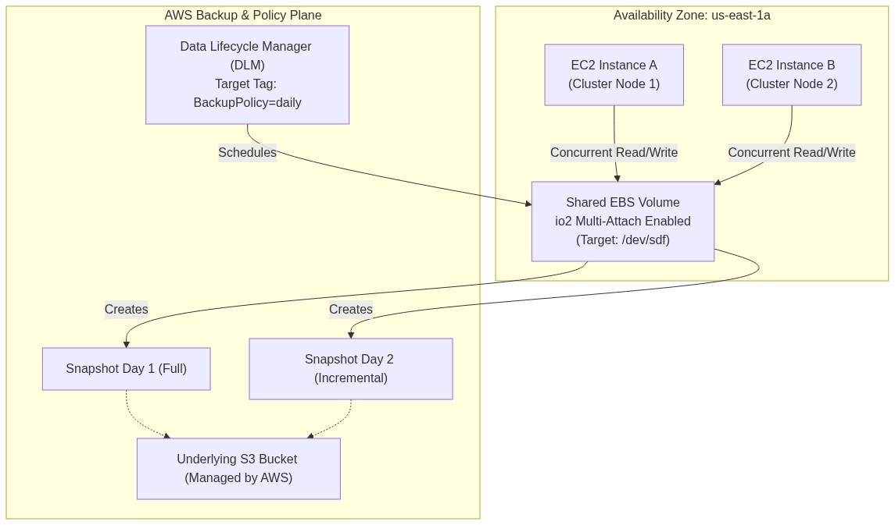
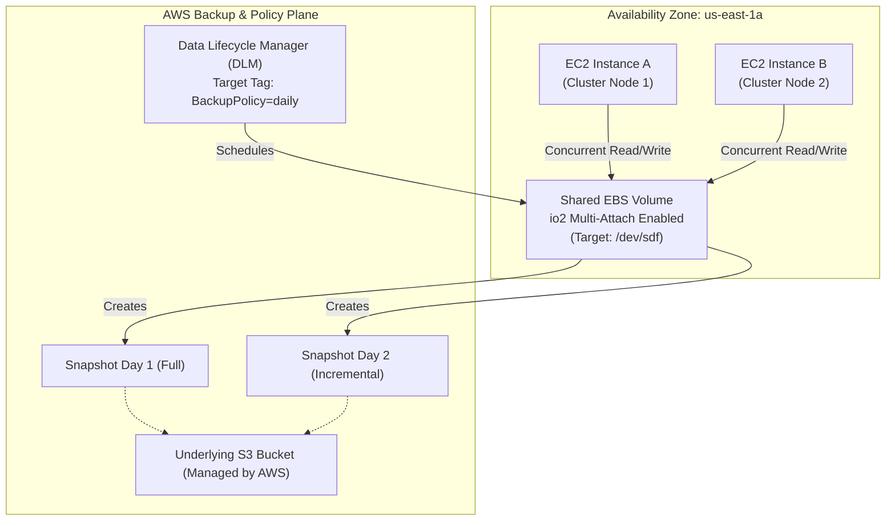

<div align="center">

# 🔬 Lab 2.2: EBS Snapshots, Data Lifecycle Manager (DLM) & io2 Multi-Attach

**[🏠 AWS Labs Root](../../../README.md)** &nbsp;•&nbsp; **[🖥️ EC2 Curriculum](../../README.md)** &nbsp;•&nbsp; **[📂 Module 02](../README.md)**

   

**[⬅️ Previous Lab](../../module-02-storage-ebs-ephemeral-efs/lab-01-ebs-elastic-volumes/README.md)** &nbsp;|&nbsp; **[➡️ Next Lab](../../module-02-storage-ebs-ephemeral-efs/lab-03-instance-store-ephemeral/README.md)**

</div>

---

## 📌 Lab Objectives

- [x] Create point-in-time **EBS Snapshots** and understand incremental backup mechanics.
- [x] Configure an automated backup lifecycle using **Amazon Data Lifecycle Manager (DLM)**.
- [x] Provision an `io2` volume with **Multi-Attach** enabled and attach it concurrently to multiple EC2 instances.
- [x] Understand clustered filesystem requirements (GFS2 / OCFS2) to prevent split-brain corruption on shared block storage.

---

## 🏗️ Architecture Diagram



<details>
<summary>📐 <b>View Mermaid Architecture Source (Click to Expand)</b></summary>



</details>

---

## 💡 Key Architectural Concepts

1. **Incremental Snapshots**:
   - Only modified blocks (deltas) since the last snapshot are copied to Amazon S3. Even though each snapshot points back to base blocks, snapshot deletion cleans up only unique unreferenced blocks.
2. **Crash-Consistent vs Application-Consistent**:
   - Taking a snapshot of a running volume without freezing I/O is crash-consistent (equivalent to pulling power). For databases (e.g., PostgreSQL, MySQL), flush tables and acquire read-locks before snapshotting.
3. **EBS Multi-Attach**:
   - Allows an `io2` or `io1` volume to be attached simultaneously to up to 16 Nitro-based EC2 instances within the **same Availability Zone**.
   - Standard filesystems (ext4, XFS, NTFS) **are not cluster-aware**; writing concurrently from multiple nodes will corrupt the filesystem! You must use cluster software like Pacemaker with GFS2/OCFS2 or NVMe reservation primitives.

---

## ⏱️ Prerequisites & Cost

> [!WARNING]
> **Paid Instance / Storage Notice**
> - **AWS Free Tier Eligible**: DLM and Standard Snapshots are free-tier friendly. `io2` volumes incur a small hourly provisioned IOPS fee ($0.065/provisioned IOPS/month), so ensure prompt teardown.
> - **Estimated Duration**: 20 minutes.

---

## 🚀 Step-by-Step Instructions

### Step 1: Create a Snapshot of an Existing Volume
Assume an active EBS volume `VOLUME_ID`:
```bash
export AWS_REGION=$(aws configure get region || echo "us-east-1")

# Create snapshot with descriptive tags
SNAPSHOT_ID=$(aws ec2 create-snapshot \
  --volume-id "${VOLUME_ID}" \
  --description "Manual point-in-time backup for Lab 2.2" \
  --tag-specifications "ResourceType=snapshot,Tags=[{Key=Project,Value=ec2-master-labs},{Key=Name,Value=manual-backup-1}]" \
  --query "SnapshotId" --output text)

echo "Snapshot creation initiated: ${SNAPSHOT_ID}"
aws ec2 wait snapshot-completed --snapshot-ids "${SNAPSHOT_ID}"
echo "Snapshot completed."
```

### Step 2: Configure Amazon Data Lifecycle Manager (DLM) Policy
DLM automatically snapshots volumes based on tag selectors:

1. Create IAM Role for DLM:
```bash
cat <<JSON > dlm-trust-policy.json
{
  "Version": "2012-10-17",
  "Statement": [
    {
      "Effect": "Allow",
      "Principal": { "Service": "dlm.amazonaws.com" },
      "Action": "sts:AssumeRole"
    }
  ]
}
JSON

DLM_ROLE_ARN=$(aws iam create-role \
  --role-name "ec2-labs-dlm-lifecycle-role" \
  --assume-role-policy-document file://dlm-trust-policy.json \
  --query "Role.Arn" --output text 2>/dev/null || \
  aws iam get-role \
    --role-name "ec2-labs-dlm-lifecycle-role" \
    --query "Role.Arn" \
    --output text)

aws iam attach-role-policy \
  --role-name "ec2-labs-dlm-lifecycle-role" \
  --policy-arn "arn:aws:iam::aws:policy/service-role/AWSDataLifecycleManagerServiceRole"
```

2. Create Lifecycle Policy JSON:
```bash
cat <<JSON > dlm-policy.json
{
  "ResourceTypes": ["VOLUME"],
  "TargetTags": [
    { "Key": "BackupPolicy", "Value": "DailySnapshot" }
  ],
  "Schedules": [
    {
      "Name": "DailyRun",
      "CreateRule": {
        "Interval": 24,
        "IntervalUnit": "HOURS",
        "Times": ["03:00"]
      },
      "RetainRule": {
        "Count": 7
      },
      "CopyTags": true
    }
  ]
}
JSON

POLICY_ID=$(aws dlm create-lifecycle-policy \
  --description "Daily 7-day retention EBS snapshot policy" \
  --state ENABLED \
  --execution-role-arn "${DLM_ROLE_ARN}" \
  --policy-details file://dlm-policy.json \
  --query "PolicyId" --output text)

echo "Created DLM Policy ID: ${POLICY_ID}"
```

### Step 3: Provision an `io2` Multi-Attach Volume
Create an `io2` volume configured with Multi-Attach:
```bash
AZ="us-east-1a"

IO2_VOL_ID=$(aws ec2 create-volume \
  --availability-zone "${AZ}" \
  --volume-type "io2" \
  --size 4 \
  --iops 200 \
  --multi-attach-enabled \
  --tag-specifications "ResourceType=volume,Tags=[{Key=Project,Value=ec2-master-labs},{Key=Name,Value=multi-attach-io2}]" \
  --query "VolumeId" --output text)

echo "Created Multi-Attach io2 Volume: ${IO2_VOL_ID}"
aws ec2 wait volume-available --volume-ids "${IO2_VOL_ID}"
```

---

## 🔍 Verification: Multi-Attach to Two Running Instances

Verify that the volume can be attached to two separate instances simultaneously:
```bash
# Attach to Instance A
aws ec2 attach-volume \
  --volume-id "${IO2_VOL_ID}" \
  --instance-id "${INSTANCE_A_ID}" \
  --device "/dev/sdf"

# Attach to Instance B (Normal EBS volumes would throw InvalidParameterCombination / VolumeInUse)
aws ec2 attach-volume \
  --volume-id "${IO2_VOL_ID}" \
  --instance-id "${INSTANCE_B_ID}" \
  --device "/dev/sdf"

# Check attachments:
aws ec2 describe-volumes \
  --volume-ids "${IO2_VOL_ID}" \
  --query "Volumes[0].Attachments[*].[InstanceId,State,Device]" \
  --output table
```
Both instances will show state: `attached`.

---

## 📘 Deep-Dive Command & Flag Reference

> [!TIP]
> **Line-by-Line Production Analysis**: Every command executed in this lab is dissected below, explaining each CLI flag, JMESPath query, Linux kernel parameter, and why it is critical in production automation.

<details open>
<summary>📘 <b>Command 1: Creating a Point-in-Time EBS Snapshot</b></summary>

```bash
SNAPSHOT_ID=$(aws ec2 create-snapshot \
  --volume-id "${VOLUME_ID}" \
  --description "Manual point-in-time backup for Lab 2.2" \
  --tag-specifications "ResourceType=snapshot,Tags=[{Key=Project,Value=ec2-master-labs},{Key=Name,Value=manual-backup-1}]" \
  --query "SnapshotId" --output text)
```

#### 🔍 Parameter & Component Breakdown

- **`aws ec2 create-snapshot`** — Calls the `CreateSnapshot` API to freeze the state of an EBS volume and initiate asynchronous block copy to Amazon S3.

- **Incremental Copy Mechanics** — EBS snapshots are **incremental**. The first snapshot copies all allocated blocks on the volume. Subsequent snapshots copy *only* the specific 512-byte sectors that changed since the preceding snapshot, dramatically reducing backup storage costs and completion time.

- **`--tag-specifications "ResourceType=snapshot,Tags=[...]"`** — Tags the snapshot at creation. In enterprise environments, backup tags (e.g. `BackupRetention=30d`, `Environment=Production`) dictate automated lifecycle governance.

> 🏭 **Why This Matters in Production Automation**
> Snapshots serve as the cornerstone for point-in-time disaster recovery, volume cloning, and testing production data in staging environments. While the block copy occurs asynchronously in the background, the snapshot is logically instantaneous; you can continue writing to the volume immediately after `create-snapshot` returns.

</details>

<details open>
<summary>📘 <b>Command 2: Provisioning an IAM Service Role for DLM</b></summary>

```bash
DLM_ROLE_ARN=$(aws iam create-role \
  --role-name "ec2-labs-dlm-lifecycle-role" \
  --assume-role-policy-document file://dlm-trust-policy.json \
  --query "Role.Arn" --output text)

aws iam attach-role-policy \
  --role-name "ec2-labs-dlm-lifecycle-role" \
  --policy-arn "arn:aws:iam::aws:policy/service-role/AWSDataLifecycleManagerServiceRole"
```

#### 🔍 Parameter & Component Breakdown

- **`aws iam create-role`** — Creates an IAM identity with an assume-role trust policy granting the Amazon Data Lifecycle Manager service (`dlm.amazonaws.com`) permission to assume this role.

- **`aws iam attach-role-policy`** — Attaches the AWS-managed policy `AWSDataLifecycleManagerServiceRole`. This grants DLM permissions to discover tagged EBS volumes, call `CreateSnapshot`, apply retention tags, and delete expired snapshots according to schedule.

> 🏭 **Why This Matters in Production Automation**
> AWS services cannot interact with your resources without explicit IAM delegation. The principle of least privilege dictates using dedicated service roles rather than granting broad administrative credentials to automation daemons.

</details>

<details open>
<summary>📘 <b>Command 3: Deploying an Automated Amazon Data Lifecycle Manager (DLM) Policy</b></summary>

```bash
POLICY_ID=$(aws dlm create-lifecycle-policy \
  --description "Daily 7-day retention EBS snapshot policy" \
  --state ENABLED \
  --execution-role-arn "${DLM_ROLE_ARN}" \
  --policy-details file://dlm-policy.json \
  --query "PolicyId" --output text)
```

#### 🔍 Parameter & Component Breakdown

- **`aws dlm create-lifecycle-policy`** — Configures native, serverless backup automation directly in the AWS EC2 control plane.

- `--policy-details file://dlm-policy.json`:
  - **`"ResourceTypes": ["VOLUME"]`** — Targets raw EBS volumes.
  - **`"TargetTags": [ {"Key": "BackupPolicy", "Value": "DailySnapshot"} ]`** — DLM scans your account dynamically and snapshots any volume matching this tag key-value pair.
  - **`"Interval": 24, "IntervalUnit": "HOURS"`** — Executes backup every 24 hours.
  - **`"RetainRule": { "Count": 7 }`** — Automatically maintains a rolling window of the last 7 daily snapshots, pruning older snapshots to control storage spending.
  - **`"CopyTags": true`** — Automatically propagates all tags from the source EBS volume onto each generated snapshot.

> 🏭 **Why This Matters in Production Automation**
> Relying on custom cron jobs running inside EC2 instances or fragile Lambda scripts to execute backups introduces maintenance overhead and failure points. DLM is a fully managed, zero-maintenance AWS-native service that guarantees compliance with data retention SLAs and audit mandates (SOC2, HIPAA, ISO 27001).

</details>

<details open>
<summary>📘 <b>Command 4: Provisioning an `io2` Multi-Attach EBS Volume</b></summary>

```bash
IO2_VOL_ID=$(aws ec2 create-volume \
  --availability-zone "${AZ}" \
  --volume-type "io2" \
  --size 4 \
  --iops 200 \
  --multi-attach-enabled \
  --tag-specifications "ResourceType=volume,Tags=[{Key=Project,Value=ec2-master-labs},{Key=Name,Value=multi-attach-io2}]" \
  --query "VolumeId" --output text)
```

#### 🔍 Parameter & Component Breakdown

- **`--volume-type "io2"`** — Selects Provisioned IOPS SSD (`io2`). `io2` provides 99.999% durability (100x higher than `gp3`'s 99.9%) and supports high-concurrency clustered storage.

- **`--iops 200`** — Provisions a dedicated performance floor of 200 Input/Output Operations Per Second.

- **`--multi-attach-enabled`** — Enables **EBS Multi-Attach**, allowing up to 16 Nitro-based EC2 instances within the **same Availability Zone** to attach to this single block storage device simultaneously with full read/write capabilities.

> 🏭 **Why This Matters in Production Automation**
> Multi-Attach is engineered specifically for active-standby database failover pairs, high-availability clustering software (e.g. Pacemaker/Corosync), and clustered shared-disk databases (like Oracle RAC).

</details>

<details open>
<summary>📘 <b>Command 5: Attaching Multi-Attach Volume Concurrently</b></summary>

```bash
# Attach to Instance A
aws ec2 attach-volume \
  --volume-id "${IO2_VOL_ID}" \
  --instance-id "${INSTANCE_A_ID}" \
  --device "/dev/sdf"

# Attach to Instance B concurrently
aws ec2 attach-volume \
  --volume-id "${IO2_VOL_ID}" \
  --instance-id "${INSTANCE_B_ID}" \
  --device "/dev/sdf"
```

#### 🔍 Parameter & Component Breakdown

- **Attaching to Multiple Nodes** — On standard `gp2`/`gp3` volumes, the second attachment call would instantly crash with `VolumeInUse`. Because `--multi-attach-enabled` is active, the EC2 hypervisor accepts both attachments.

- **The Clustered Filesystem Requirement (CRITICAL)** — Standard filesystems (such as ext4, XFS, or NTFS) maintain local memory caches of disk metadata. If two separate operating system kernels write to the same ext4 partition simultaneously without coordination, they will overwrite each other's block allocations and **destroy the filesystem**.
In production, Multi-Attach **must** be paired with a cluster-aware distributed filesystem (such as GFS2, OCFS2, or Veritas InfoScale) or raw disk fencing software.

> 🏭 **Why This Matters in Production Automation**
> Understanding the architectural boundary between block storage capabilities (multi-host connectivity) and OS filesystem semantics (distributed locking) prevents catastrophic data loss in enterprise high-availability engineering.

</details>

---

## 🧹 Teardown & Clean-up


> [!CAUTION]
> **Always Tear Down Lab Resources**: Execute the cleanup commands below immediately after completing the verification steps to prevent unintended AWS billing.

```bash
# 1. Delete DLM Policy
aws dlm delete-lifecycle-policy --policy-id "${POLICY_ID}"

# 2. Detach and delete io2 volume
aws ec2 detach-volume --volume-id "${IO2_VOL_ID}" --instance-id "${INSTANCE_A_ID}" 2>/dev/null || true
aws ec2 detach-volume --volume-id "${IO2_VOL_ID}" --instance-id "${INSTANCE_B_ID}" 2>/dev/null || true
sleep 10
aws ec2 delete-volume --volume-id "${IO2_VOL_ID}"

# 3. Delete manual snapshot
aws ec2 delete-snapshot --snapshot-id "${SNAPSHOT_ID}"

# 4. Cleanup DLM IAM role
aws iam detach-role-policy \
  --role-name "ec2-labs-dlm-lifecycle-role" \
  --policy-arn "arn:aws:iam::aws:policy/service-role/AWSDataLifecycleManagerServiceRole"
aws iam delete-role --role-name "ec2-labs-dlm-lifecycle-role"
rm -f dlm-trust-policy.json dlm-policy.json

echo "Lab 2.2 clean-up completed successfully."
```

---

<div align="center">

**[⬅️ Previous Lab](../../module-02-storage-ebs-ephemeral-efs/lab-01-ebs-elastic-volumes/README.md)** &nbsp;•&nbsp; **[⬆️ Back to Module 02](../README.md)** &nbsp;•&nbsp; **[🏠 EC2 Index](../../README.md)** &nbsp;•&nbsp; **[➡️ Next Lab](../../module-02-storage-ebs-ephemeral-efs/lab-03-instance-store-ephemeral/README.md)**

</div>
