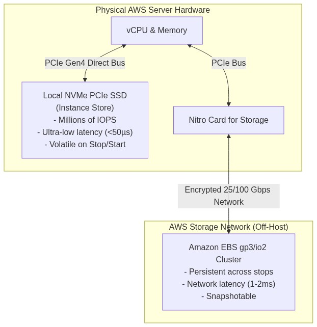
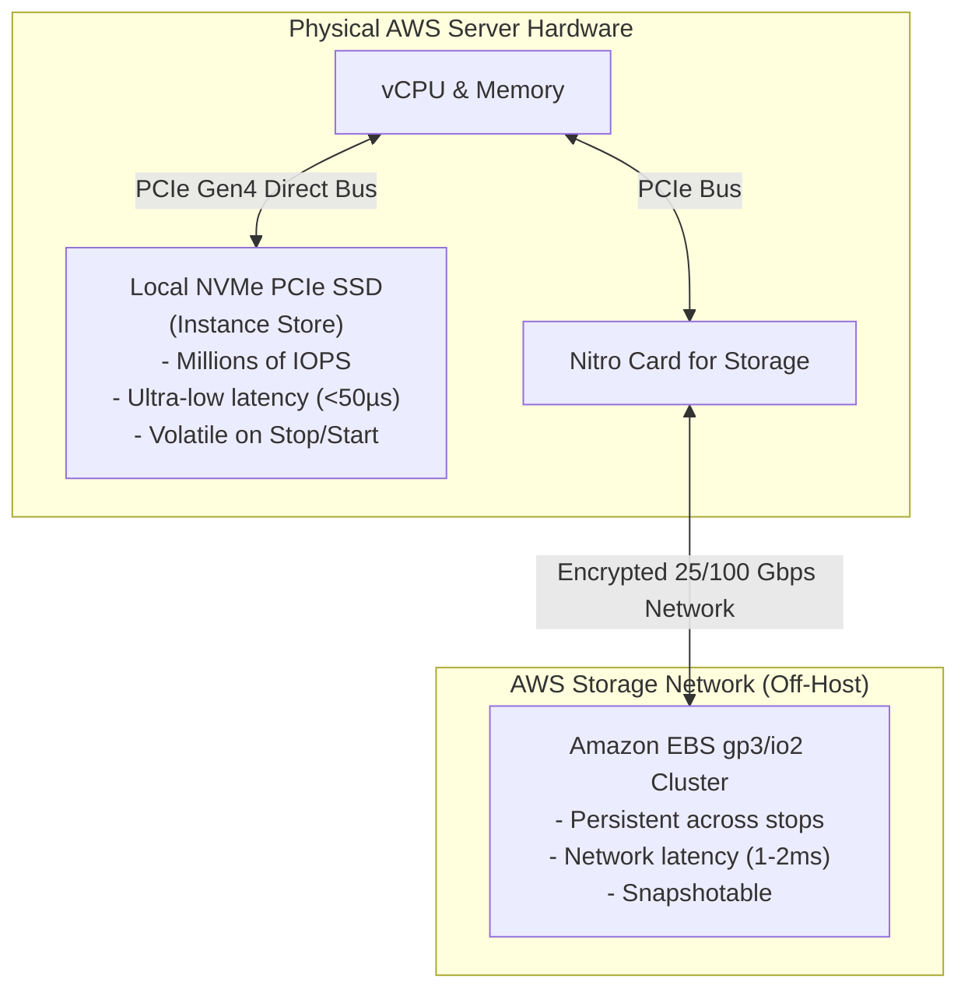

# Lab 2.3: Ephemeral Storage (Instance Store) & High-IOPS Benchmarking

## 📌 Lab Objectives
- Understand the physical architecture and trade-offs of **EC2 Instance Store** (local NVMe SSDs).
- Compare performance characteristics: Network-attached EBS (`gp3`) vs Host-attached Local NVMe.
- Measure IOPS and write latency with `fio` (Flexible I/O Tester).
- Prove the **ephemeral data volatility lifecycle**: Verify data survival across a warm OS reboot vs complete erasure on a `stop`/`start` hardware migration.

---

## 🏗️ Architectural Comparison



<details>
<summary>Click to expand Mermaid diagram source</summary>


<details>
<summary>Click to expand Mermaid diagram source</summary>


<details>
<summary>Click to expand Mermaid diagram source</summary>


</details>
</details>
</details>

---

## 💡 Key Architectural Concepts

| Feature | Amazon EBS (`gp3`/`io2`) | EC2 Instance Store |
| :--- | :--- | :--- |
| **Physical Location** | Network-attached SAN/Storage Fabric | Physically attached to the host server motherboard |
| **Persistence** | Persists independently of instance lifecycle | Erased when the instance is **stopped**, **hibernated**, or terminated |
| **OS Reboot** | Persists | Persists |
| **Snapshots** | Native automated snapshots to S3 | Not supported; must backup via software/scripts |
| **Latency** | Sub-millisecond (1–2 ms) | Microseconds (~20–50 µs) |
| **Pricing** | Billed per GB-month & provisioned IOPS | Included in the hourly price of the instance (`d`-families) |

---

## ⏱️ Prerequisites & Cost
- **Instance Requirement**: Needs an instance type with the `d` suffix indicating local disk (e.g. `c5d.large`, `c6id.large`, or `m5d.large`).
- **Cost Warning**: `c5d.large` is roughly ~$0.096/hour. Run the benchmark and terminate immediately (estimated cost < $0.05).
- **Estimated Duration**: 15 minutes.

---

## 🚀 Step-by-Step Instructions

### Step 1: Launch an Instance with Local NVMe Storage
```bash
export AWS_REGION=$(aws configure get region || echo "us-east-1")
export VPC_ID=$(aws ec2 describe-vpcs --filters "Name=isDefault,Values=true" --query "Vpcs[0].VpcId" --output text)
export SUBNET_ID=$(aws ec2 describe-subnets --filters "Name=vpc-id,Values=${VPC_ID}" --query "Subnets[0].SubnetId" --output text)

AMI_ID=$(aws ssm get-parameter \
  --name "/aws/service/ami-amazon-linux-latest/al2023-ami-kernel-default-x86_64" \
  --query "Parameter.Value" --output text)

INSTANCE_ID=$(aws ec2 run-instances \
  --image-id "${AMI_ID}" \
  --instance-type "c5d.large" \
  --subnet-id "${SUBNET_ID}" \
  --tag-specifications "ResourceType=instance,Tags=[{Key=Project,Value=ec2-master-labs},{Key=Name,Value=instance-store-benchmark}]" \
  --query "Instances[0].InstanceId" --output text)

echo "Launched c5d.large node: ${INSTANCE_ID}"
aws ec2 wait instance-running --instance-ids "${INSTANCE_ID}"
```

### Step 2: Identify and Mount the Ephemeral Device
Connect via SSM Session Manager or SSH and inspect devices:
```bash
# Check block devices:
lsblk
```
Notice two disks:
- `nvme0n1` (EBS root volume)
- `nvme1n1` (50 GB Instance Store disk)

Format and mount the ephemeral disk:
```bash
mkfs.ext4 -E nodiscard /dev/nvme1n1
mkdir -p /mnt/ephemeral
mount -o noatime /dev/nvme1n1 /mnt/ephemeral
```

---

## 🔍 Verification & Testing

### 1. Benchmark IOPS & Latency (Instance Store vs EBS)
Install `fio`:
```bash
dnf install -y fio
```

Run a 4K Random Write Benchmark on the Instance Store:
```bash
fio --name=randwrite-ephemeral \
    --ioengine=libaio \
    --iodepth=64 \
    --rw=randwrite \
    --bs=4k \
    --direct=1 \
    --size=1G \
    --numjobs=4 \
    --runtime=20 \
    --group_reporting \
    --filename=/mnt/ephemeral/fio_test.bin
```
**Observation**: High IOPS (>30,000–60,000 IOPS) with sub-100-microsecond latency.

Run the same benchmark on the EBS root volume:
```bash
fio --name=randwrite-ebs \
    --ioengine=libaio \
    --iodepth=64 \
    --rw=randwrite \
    --bs=4k \
    --direct=1 \
    --size=1G \
    --numjobs=4 \
    --runtime=20 \
    --group_reporting \
    --filename=/tmp/fio_test.bin
```
**Observation**: EBS baseline throughput is constrained by the 3,000 IOPS / 125 MB/s gp3 limit.

### 2. Test Data Volatility Across Reboot vs Stop/Start
Write a canary file to the ephemeral drive:
```bash
echo "Canary payload: instance-store-survives-reboot" > /mnt/ephemeral/canary.txt
```

**Test A: Reboot Instance**
```bash
sudo reboot
```
Reconnect after 1 minute:
```bash
cat /mnt/ephemeral/canary.txt
```
*Result: The file still exists! Data persists across warm OS reboots.*

**Test B: Stop and Start Instance**
From your local CLI:
```bash
aws ec2 stop-instances --instance-ids "${INSTANCE_ID}"
aws ec2 wait instance-stopped --instance-ids "${INSTANCE_ID}"

aws ec2 start-instances --instance-ids "${INSTANCE_ID}"
aws ec2 wait instance-running --instance-ids "${INSTANCE_ID}"
```
Reconnect to the instance and inspect `lsblk`:
*Result: The instance store device is completely blank. The filesystem and `/mnt/ephemeral/canary.txt` have been purged! The instance has booted on a new physical server.*

---

## 🧹 Teardown & Clean-up

```bash
aws ec2 terminate-instances --instance-ids "${INSTANCE_ID}"
aws ec2 wait instance-terminated --instance-ids "${INSTANCE_ID}"
echo "Lab 2.3 clean-up completed successfully."
```
