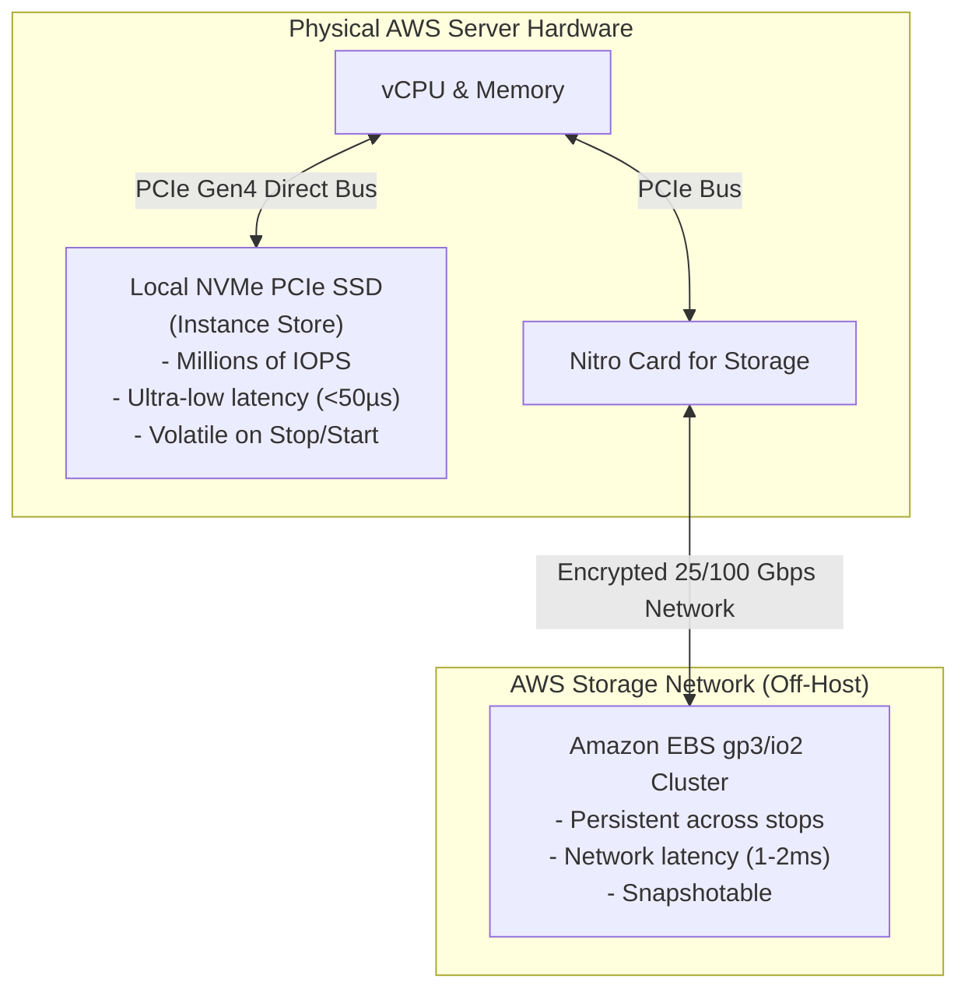

<div align="center">

# 🔬 Lab 2.3: Ephemeral Storage (Instance Store) & High-IOPS Benchmarking

**[🏠 AWS Labs Root](../../../README.md)** &nbsp;•&nbsp; **[🖥️ EC2 Curriculum](../../README.md)** &nbsp;•&nbsp; **[📂 Module 02](../README.md)**

   

**[⬅️ Previous Lab](../../module-02-storage-ebs-ephemeral-efs/lab-02-snapshots-dlm-multiattach/README.md)** &nbsp;|&nbsp; **[➡️ Next Lab](../../module-02-storage-ebs-ephemeral-efs/lab-04-efs-shared-filesystem/README.md)**

</div>

---

## 📌 Lab Objectives

- [x] Understand the physical architecture and trade-offs of **EC2 Instance Store** (local NVMe SSDs).
- [x] Compare performance characteristics: Network-attached EBS (`gp3`) vs Host-attached Local NVMe.
- [x] Measure IOPS and write latency with `fio` (Flexible I/O Tester).
- [x] Prove the **ephemeral data volatility lifecycle**: Verify data survival across a warm OS reboot vs complete erasure on a `stop`/`start` hardware migration.

---

## 🏗️ Architectural Comparison


<details>
<summary>📐 <b>View Mermaid Architecture Source (Click to Expand)</b></summary>



</details>

---

## 💡 Key Architectural Concepts

| Feature | Amazon EBS (`gp3`/`io2`) | EC2 Instance Store |
| :--- | :--- | :--- |
| **Physical Location** | Network-attached SAN/Storage Fabric | Physically attached to the host server motherboard |
| **Persistence** | Persists independently of instance lifecycle | Erased when the instance is **stopped**, **hibernated**, or terminated |
| **OS Reboot** | Persists | Persists |
| **Snapshots** | Native automated snapshots to S3 | Not supported; must backup via software/scripts |
| **Latency** | Sub-millisecond (1–2 ms) | Microseconds (~20–50 µs) |
| **Pricing** | Billed per GB-month & provisioned IOPS | Included in the hourly price of the instance (`d`-families) |

---

## ⏱️ Prerequisites & Cost

> [!WARNING]
> **Paid Instance / Storage Notice**
> - **Instance Requirement**: Needs an instance type with the `d` suffix indicating local disk (e.g. `c5d.large`, `c6id.large`, or `m5d.large`).
> - **Cost Warning**: `c5d.large` is roughly ~$0.096/hour. Run the benchmark and terminate immediately (estimated cost < $0.05).
> - **Estimated Duration**: 15 minutes.

---

## 🚀 Step-by-Step Instructions

### Step 1: Launch an Instance with Local NVMe Storage
```bash
export AWS_REGION=$(aws configure get region || echo "us-east-1")
export VPC_ID=$(aws ec2 describe-vpcs \
  --filters "Name=isDefault,Values=true" \
  --query "Vpcs[0].VpcId" \
  --output text)
export SUBNET_ID=$(aws ec2 describe-subnets \
  --filters "Name=vpc-id,Values=${VPC_ID}" \
  --query "Subnets[0].SubnetId" \
  --output text)

AMI_ID=$(aws ssm get-parameter \
  --name "/aws/service/ami-amazon-linux-latest/al2023-ami-kernel-default-x86_64" \
  --query "Parameter.Value" --output text)

INSTANCE_ID=$(aws ec2 run-instances \
  --image-id "${AMI_ID}" \
  --instance-type "c5d.large" \
  --subnet-id "${SUBNET_ID}" \
  --tag-specifications "ResourceType=instance,Tags=[{Key=Project,Value=ec2-master-labs},{Key=Name,Value=instance-store-benchmark}]" \
  --query "Instances[0].InstanceId" --output text)

echo "Launched c5d.large node: ${INSTANCE_ID}"
aws ec2 wait instance-running --instance-ids "${INSTANCE_ID}"
```

### Step 2: Identify and Mount the Ephemeral Device
Connect via SSM Session Manager or SSH and inspect devices:
```bash
# Check block devices:
lsblk
```
Notice two disks:
- `nvme0n1` (EBS root volume)
- `nvme1n1` (50 GB Instance Store disk)

Format and mount the ephemeral disk:
```bash
mkfs.ext4 -E nodiscard /dev/nvme1n1
mkdir -p /mnt/ephemeral
mount -o noatime /dev/nvme1n1 /mnt/ephemeral
```

---

## 🔍 Verification & Testing

### 1. Benchmark IOPS & Latency (Instance Store vs EBS)
Install `fio`:
```bash
dnf install -y fio
```

Run a 4K Random Write Benchmark on the Instance Store:
```bash
fio --name=randwrite-ephemeral \
    --ioengine=libaio \
    --iodepth=64 \
    --rw=randwrite \
    --bs=4k \
    --direct=1 \
    --size=1G \
    --numjobs=4 \
    --runtime=20 \
    --group_reporting \
    --filename=/mnt/ephemeral/fio_test.bin
```
**Observation**: High IOPS (>30,000–60,000 IOPS) with sub-100-microsecond latency.

Run the same benchmark on the EBS root volume:
```bash
fio --name=randwrite-ebs \
    --ioengine=libaio \
    --iodepth=64 \
    --rw=randwrite \
    --bs=4k \
    --direct=1 \
    --size=1G \
    --numjobs=4 \
    --runtime=20 \
    --group_reporting \
    --filename=/tmp/fio_test.bin
```
**Observation**: EBS baseline throughput is constrained by the 3,000 IOPS / 125 MB/s gp3 limit.

### 2. Test Data Volatility Across Reboot vs Stop/Start
Write a canary file to the ephemeral drive:
```bash
echo "Canary payload: instance-store-survives-reboot" > /mnt/ephemeral/canary.txt
```

**Test A: Reboot Instance**
```bash
sudo reboot
```
Reconnect after 1 minute:
```bash
cat /mnt/ephemeral/canary.txt
```
*Result: The file still exists! Data persists across warm OS reboots.*

**Test B: Stop and Start Instance**
From your local CLI:
```bash
aws ec2 stop-instances --instance-ids "${INSTANCE_ID}"
aws ec2 wait instance-stopped --instance-ids "${INSTANCE_ID}"

aws ec2 start-instances --instance-ids "${INSTANCE_ID}"
aws ec2 wait instance-running --instance-ids "${INSTANCE_ID}"
```
Reconnect to the instance and inspect `lsblk`:
*Result: The instance store device is completely blank. The filesystem and `/mnt/ephemeral/canary.txt` have been purged! The instance has booted on a new physical server.*

---

## 📘 Deep-Dive Command & Flag Reference

> [!TIP]
> **Line-by-Line Production Analysis**: Every command executed in this lab is dissected below, explaining each CLI flag, JMESPath query, Linux kernel parameter, and why it is critical in production automation.

<details open>
<summary>📘 <b>Command 1: Provisioning an Instance with Local NVMe SSD Hardware</b></summary>

```bash
INSTANCE_ID=$(aws ec2 run-instances \
  --image-id "${AMI_ID}" \
  --instance-type "c5d.large" \
  --subnet-id "${SUBNET_ID}" \
  --tag-specifications "ResourceType=instance,Tags=[{Key=Project,Value=ec2-master-labs},{Key=Name,Value=instance-store-benchmark}]" \
  --query "Instances[0].InstanceId" --output text)
```

#### 🔍 Parameter & Component Breakdown

- **`--instance-type "c5d.large"`** — **The `d` Suffix Significance**:
In the AWS instance naming convention, the letter `d` denotes dedicated physical **direct-attached NVMe solid-state drives** (e.g. `c5d`, `m5d`, `r6id`, `i3en`).  
  - Standard `c5.large`: Relies 100% on remote, network-attached Amazon EBS storage.
  - **`c5d.large`** — Comes pre-equipped with 50 GB of local physical NVMe SSD storage physically wired to the PCIe bus of the physical host motherboard.

> 🏭 **Why This Matters in Production Automation**
> When designing low-latency caching layers (Memcached, Redis), high-speed distributed buffers, temporary scratch spaces for big data map-reduce jobs (Hadoop/Spark), or video transcoding scratch drives, selecting an instance family with local NVMe disks delivers millions of IOPS at zero additional EBS storage fees.

</details>

<details open>
<summary>📘 <b>Command 2: Formatting and Mounting with Linux Performance Optimizations</b></summary>

```bash
mkfs.ext4 -E nodiscard /dev/nvme1n1
mkdir -p /mnt/ephemeral
mount -o noatime /dev/nvme1n1 /mnt/ephemeral
```

#### 🔍 Parameter & Component Breakdown

- `mkfs.ext4 -E nodiscard /dev/nvme1n1`
  - **`mkfs.ext4`** — Formats the local NVMe block device with the fourth extended filesystem.
  - **`-E nodiscard`** — **Performance Optimization**. Tells the filesystem creation tool not to send discard/TRIM commands across the entire disk during format. Because AWS allocates zeroed, sanitized virtual block ranges upon launch, skipping discard saves significant initialization time on large NVMe arrays.

- `mount -o noatime /dev/nvme1n1 /mnt/ephemeral`
  - **`-o noatime`** — Disables the Linux kernel's default behavior of updating file access timestamps (`atime`) every single time a file is read. In high-throughput read environments, disabling `atime` eliminates up to 30% of unnecessary filesystem write overhead.

> 🏭 **Why This Matters in Production Automation**
> Ephemeral drives must be formatted and mounted programmatically at boot (typically via `cloud-init` User Data) because every time the instance starts from a `stopped` state, the disk is delivered completely blank and unpartitioned.

</details>

<details open>
<summary>📘 <b>Command 3: Executing High-Concurrency 4K Random Write Benchmarks with `fio`</b></summary>

```bash
fio --name=randwrite-ephemeral \
    --ioengine=libaio \
    --iodepth=64 \
    --rw=randwrite \
    --bs=4k \
    --direct=1 \
    --size=1G \
    --numjobs=4 \
    --runtime=20 \
    --group_reporting \
    --filename=/mnt/ephemeral/fio_test.bin
```

#### 🔍 Parameter & Component Breakdown

- **`fio` (Flexible I/O Tester)** — The industry-standard Linux storage benchmarking tool.

- **`--ioengine=libaio`** — Uses Linux Native Asynchronous I/O (`libaio`), allowing the benchmarking process to submit I/O requests to the kernel without blocking.

- **`--iodepth=64`** — Keeps 64 concurrent I/O requests constantly queued in the hardware driver pipeline, saturating device controllers.

- **`--rw=randwrite`** — Executes 100% random write access patterns, simulating demanding database workloads.

- **`--bs=4k`** — Sets block size to 4 Kibibytes—the standard block size for PostgreSQL, MySQL InnoDB pages, and Linux virtual memory pages.

- **`--direct=1`** — **Bypasses Linux Page Cache (`O_DIRECT`)**. Forces all read/write operations to travel directly to physical disk controller hardware without caching in kernel RAM.

- **`--numjobs=4`** — Spawns 4 parallel worker threads to stress multiple CPU cores and NVMe hardware submission queues.

- **`--group_reporting`** — Aggregates performance statistics from all 4 worker threads into a unified summary metric.

> 🏭 **Why This Matters in Production Automation**
> Benchmarking under realistic, unbuffered conditions (`--direct=1`) reveals the true physical storage performance ceiling: - Local NVMe Instance Store: Delivers 40,000–100,000+ IOPS with 20–50 microsecond write latencies. - Network EBS (`gp3`): Capped at provisioned limits (baseline 3,000 IOPS) with 1–2 millisecond network traversal latency.

</details>

<details open>
<summary>📘 <b>Command 4: Verifying Data Volatility (Reboot vs Stop/Start Lifecycle)</b></summary>

```bash
# Test A: Reboot instance
sudo reboot

# Test B: Stop and Start instance
aws ec2 stop-instances --instance-ids "${INSTANCE_ID}"
aws ec2 wait instance-stopped --instance-ids "${INSTANCE_ID}"
aws ec2 start-instances --instance-ids "${INSTANCE_ID}"
```

#### 🔍 Parameter & Component Breakdown

- **`sudo reboot` (Warm OS Reboot)** — The guest OS kernel reboots, but the physical server hardware remains powered on and allocated to the VM. **The data on `/dev/nvme1n1` survives completely intact.**

- **`stop-instances` followed by `start-instances` (Cold Power Cycle)** — When an EC2 instance is stopped:
1. AWS deallocates the virtual machine from the physical host server rack.  
2. The physical server's local NVMe drives are cryptographically erased and wiped for security before being reassigned to other customers.  
3. When `start-instances` is issued, the instance boots on an **entirely new physical server**.  
4. The newly allocated local NVMe drive is 100% blank; all previous data is permanently lost.

> 🏭 **Why This Matters in Production Automation**
> This lifecycle behavior dictates application architecture: **Never store stateful or irreplaceable data on an Instance Store disk without continuous, real-time application-level replication** (e.g. Cassandra or Kafka with replication factor $\ge 3$, or automated replication to S3/EBS).

</details>

---

## 🧹 Teardown & Clean-up


> [!CAUTION]
> **Always Tear Down Lab Resources**: Execute the cleanup commands below immediately after completing the verification steps to prevent unintended AWS billing.

```bash
aws ec2 terminate-instances --instance-ids "${INSTANCE_ID}"
aws ec2 wait instance-terminated --instance-ids "${INSTANCE_ID}"
echo "Lab 2.3 clean-up completed successfully."
```

---

<div align="center">

**[⬅️ Previous Lab](../../module-02-storage-ebs-ephemeral-efs/lab-02-snapshots-dlm-multiattach/README.md)** &nbsp;•&nbsp; **[⬆️ Back to Module 02](../README.md)** &nbsp;•&nbsp; **[🏠 EC2 Index](../../README.md)** &nbsp;•&nbsp; **[➡️ Next Lab](../../module-02-storage-ebs-ephemeral-efs/lab-04-efs-shared-filesystem/README.md)**

</div>
