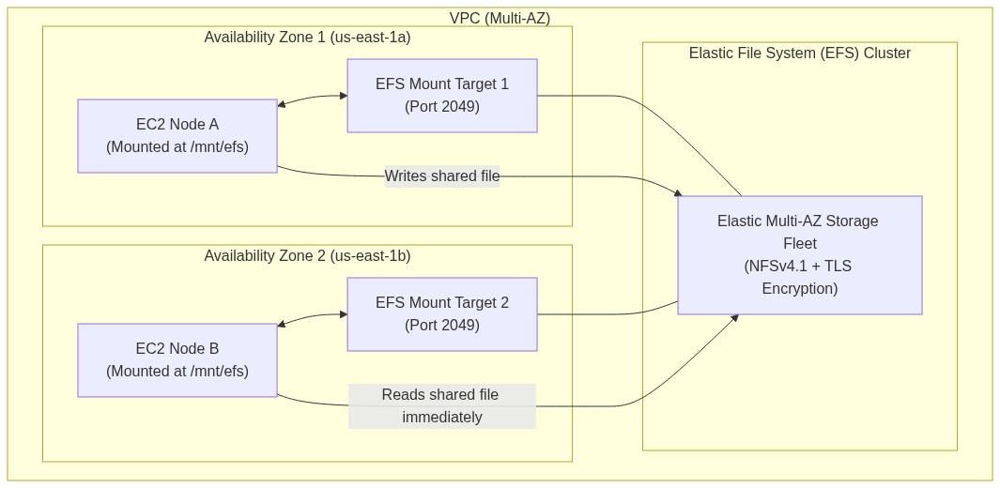
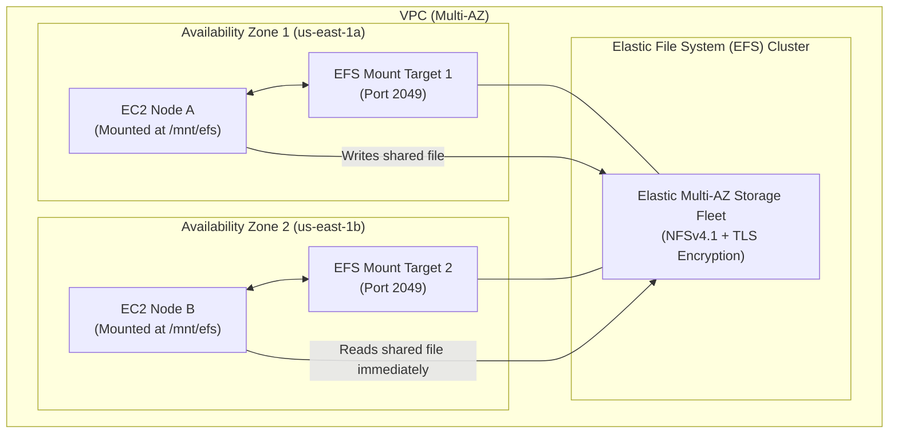

<div align="center">

# 🔬 Lab 2.4: Multi-AZ Shared Storage with Amazon Elastic File System (EFS)

**[🏠 AWS Labs Root](../../../README.md)** &nbsp;•&nbsp; **[🖥️ EC2 Curriculum](../../README.md)** &nbsp;•&nbsp; **[📂 Module 02](../README.md)**

   

**[⬅️ Previous Lab](../../module-02-storage-ebs-ephemeral-efs/lab-03-instance-store-ephemeral/README.md)** &nbsp;|&nbsp; **[➡️ Next Lab](../../module-03-networking-eni-placement/lab-01-dual-eni-routing/README.md)**

</div>

---

## 📌 Lab Objectives

- [x] Provision a serverless, multi-AZ **Amazon Elastic File System (EFS)**.
- [x] Configure EFS Mount Targets and Security Group rules (NFS TCP port 2049).
- [x] Mount the distributed filesystem simultaneously across multiple EC2 instances in different Availability Zones using `amazon-efs-utils`.
- [x] Verify POSIX compliance, concurrent write operations, and in-transit TLS encryption.

---

## 🏗️ Architecture Diagram



<details>
<summary>📐 <b>View Mermaid Architecture Source (Click to Expand)</b></summary>



</details>

---

## 💡 Key Architectural Concepts

| Feature | Amazon EBS | Amazon EFS |
| :--- | :--- | :--- |
| **Scope** | Single Availability Zone (Zonal) | Regional across multiple Availability Zones |
| **Protocol** | Block Storage (Raw NVMe / SCSI) | File Storage (NFSv4.1) |
| **Concurrency** | Single Instance (except `io2` multi-attach in 1 AZ) | Thousands of EC2 instances concurrently across all AZs |
| **Scalability** | Fixed allocated size (manually resized) | Elastic (automatically expands and contracts on demand) |
| **Encryption** | KMS Encryption at Rest | Encryption at rest (KMS) + Encryption in transit (TLS) |

---

## ⏱️ Prerequisites & Cost

> [!TIP]
> **AWS Free Tier & Cost Guardrail**
> - **AWS Free Tier Eligible**: Yes (5 GB-months of Amazon EFS Standard storage free tier).
> - **Estimated Duration**: 20 minutes.

---

## 🚀 Step-by-Step Instructions

### Step 1: Create an EFS Security Group
```bash
export AWS_REGION=$(aws configure get region || echo "us-east-1")
export VPC_ID=$(aws ec2 describe-vpcs \
  --filters "Name=isDefault,Values=true" \
  --query "Vpcs[0].VpcId" \
  --output text)

EFS_SG_ID=$(aws ec2 create-security-group \
  --group-name "efs-mount-target-sg" \
  --description "Allow NFS traffic from EC2 instances" \
  --vpc-id "${VPC_ID}" \
  --tag-specifications "ResourceType=security-group,Tags=[{Key=Project,Value=ec2-master-labs},{Key=Name,Value=efs-sg}]" \
  --query "GroupId" --output text)

# Allow NFS Port 2049 from within the VPC CIDR
VPC_CIDR=$(aws ec2 describe-vpcs \
  --vpc-ids "${VPC_ID}" \
  --query "Vpcs[0].CidrBlock" \
  --output text)
aws ec2 authorize-security-group-ingress \
  --group-id "${EFS_SG_ID}" \
  --protocol tcp \
  --port 2049 \
  --cidr "${VPC_CIDR}"

echo "EFS Security Group Created: ${EFS_SG_ID}"
```

### Step 2: Create the EFS File System
```bash
EFS_ID=$(aws efs create-file-system \
  --performance-mode "generalPurpose" \
  --throughput-mode "elastic" \
  --encrypted \
  --tags "Key=Project,Value=ec2-master-labs" "Key=Name,Value=shared-efs-lab" \
  --query "FileSystemId" --output text)

echo "Created EFS File System: ${EFS_ID}"
# Wait for EFS to become available
sleep 5
```

### Step 3: Create Mount Targets in Two Availability Zones
Retrieve subnets in two different AZs:
```bash
SUBNET_1=$(aws ec2 describe-subnets \
  --filters "Name=vpc-id,Values=${VPC_ID}" \
  --query "Subnets[0].SubnetId" \
  --output text)
SUBNET_2=$(aws ec2 describe-subnets \
  --filters "Name=vpc-id,Values=${VPC_ID}" \
  --query "Subnets[1].SubnetId" \
  --output text)

# Mount Target in Subnet 1
MT1_ID=$(aws efs create-mount-target \
  --file-system-id "${EFS_ID}" \
  --subnet-id "${SUBNET_1}" \
  --security-groups "${EFS_SG_ID}" \
  --query "MountTargetId" --output text)

# Mount Target in Subnet 2
MT2_ID=$(aws efs create-mount-target \
  --file-system-id "${EFS_ID}" \
  --subnet-id "${SUBNET_2}" \
  --security-groups "${EFS_SG_ID}" \
  --query "MountTargetId" --output text)

echo "Created Mount Targets: ${MT1_ID}, ${MT2_ID}"
```

### Step 4: Mount EFS on EC2 Instances using `amazon-efs-utils`
Install the EFS client and mount the filesystem:
```bash
# On your Amazon Linux 2023 instance:
sudo dnf install -y amazon-efs-utils

sudo mkdir -p /mnt/efs

# Mount with in-transit TLS encryption:
sudo mount -t efs -o tls ${EFS_ID}:/ /mnt/efs

# Add to /etc/fstab for auto-mount on reboot:
echo "${EFS_ID}:/ /mnt/efs efs _netdev,tls 0 0" | sudo tee -a /etc/fstab
```

---

## 🔍 Verification & Testing

### 1. Concurrent Multi-Instance Write Verification
- On **EC2 Instance A** in Subnet 1:
  ```bash
  echo "Written by Instance A at $(date)" | sudo tee /mnt/efs/cluster-node-a.txt
  ```

- On **EC2 Instance B** in Subnet 2:
  ```bash
  ls -lh /mnt/efs/
  cat /mnt/efs/cluster-node-a.txt
  ```
The file written by Instance A is instantly readable by Instance B across different Availability Zones with zero sync delay.

---

## 📘 Deep-Dive Command & Flag Reference

> [!TIP]
> **Line-by-Line Production Analysis**: Every command executed in this lab is dissected below, explaining each CLI flag, JMESPath query, Linux kernel parameter, and why it is critical in production automation.

<details open>
<summary>📘 <b>Command 1: Creating the EFS Security Group and Opening NFS Port 2049</b></summary>

```bash
EFS_SG_ID=$(aws ec2 create-security-group \
  --group-name "efs-mount-target-sg" \
  --description "Allow NFS traffic from EC2 instances" \
  --vpc-id "${VPC_ID}" \
  --query "GroupId" --output text)

aws ec2 authorize-security-group-ingress \
  --group-id "${EFS_SG_ID}" \
  --protocol tcp \
  --port 2049 \
  --cidr "${VPC_CIDR}"
```

#### 🔍 Parameter & Component Breakdown

- **`aws ec2 authorize-security-group-ingress ... --protocol tcp --port 2049`** — Authorizes Layer 4 TCP traffic on destination port **2049**—the standardized IANA port for Network File System (NFSv4.1).

- **`--cidr "${VPC_CIDR}"`** — Restricts NFS access strictly to clients residing within the VPC's private CIDR boundary, blocking all public internet exposure.

> 🏭 **Why This Matters in Production Automation**
> EFS mount targets behave as virtual network interfaces inside your subnets. If port 2049 is not explicitly permitted inbound on the mount target's security group, Linux clients running `mount` will hang indefinitely until connection timeout, crashing automated instance provisioning pipelines.

</details>

<details open>
<summary>📘 <b>Command 2: Provisioning an Elastic Multi-AZ File System</b></summary>

```bash
EFS_ID=$(aws efs create-file-system \
  --performance-mode "generalPurpose" \
  --throughput-mode "elastic" \
  --encrypted \
  --tags "Key=Project,Value=ec2-master-labs" "Key=Name,Value=shared-efs-lab" \
  --query "FileSystemId" --output text)
```

#### 🔍 Parameter & Component Breakdown

- **`aws efs create-file-system`** — Provisions a serverless, POSIX-compliant, distributed network filesystem.

- **`--performance-mode "generalPurpose"`** — Optimized for latency-sensitive workloads (web serving, content management systems, developer home directories, CI/CD workspaces).
*Alternative*: `maxIO` (scales to higher total IOPS for massive parallel big data analytics, at the expense of slightly higher per-operation latency).

- **`--throughput-mode "elastic"`** — Automatically scales read and write throughput up and down based on real-time application demand. You pay solely for the throughput consumed, eliminating capacity planning guesswork.

- **`--encrypted`** — Enforces AWS KMS encryption at rest across all storage nodes holding your files.

> 🏭 **Why This Matters in Production Automation**
> Unlike Amazon EBS (which is locked to a single AZ), Amazon EFS stores file data redundantly across **multiple Availability Zones**. A catastrophic failure of an entire AWS data center will not cause data loss or downtime for clients connected to EFS.

</details>

<details open>
<summary>📘 <b>Command 3: Provisioning Mount Targets in Multiple Subnets / AZs</b></summary>

```bash
MT1_ID=$(aws efs create-mount-target \
  --file-system-id "${EFS_ID}" \
  --subnet-id "${SUBNET_1}" \
  --security-groups "${EFS_SG_ID}" \
  --query "MountTargetId" --output text)

MT2_ID=$(aws efs create-mount-target \
  --file-system-id "${EFS_ID}" \
  --subnet-id "${SUBNET_2}" \
  --security-groups "${EFS_SG_ID}" \
  --query "MountTargetId" --output text)
```

#### 🔍 Parameter & Component Breakdown

- **`aws efs create-mount-target`** — Deploys a physical NFS endpoint (Elastic Network Interface with a private IP) inside the designated subnet.

- **Why Multi-Subnet Mount Targets are Mandatory** — 1. **Network Locality**: An EC2 instance in Subnet 1 (AZ-1) talks to the mount target in Subnet 1 via low-latency local switching.
2. **Cost Optimization**: Inter-AZ data transfer carries fees in AWS ($0.01/GB). Mounting through the local AZ's mount target ensures data transfer between EC2 and EFS remains entirely intra-AZ ($0.00/GB).

> 🏭 **Why This Matters in Production Automation**
> When designing Auto Scaling Groups that span multiple AZs, you must ensure every subnet configured in the ASG has a corresponding EFS mount target. Missing mount targets in one AZ will cause instances launched in that zone to fail mounting the shared drive.

</details>

<details open>
<summary>📘 <b>Command 4: Mounting with In-Transit TLS Encryption via `amazon-efs-utils`</b></summary>

```bash
sudo dnf install -y amazon-efs-utils
sudo mkdir -p /mnt/efs
sudo mount -t efs -o tls ${EFS_ID}:/ /mnt/efs
echo "${EFS_ID}:/ /mnt/efs efs _netdev,tls 0 0" | sudo tee -a /etc/fstab
```

#### 🔍 Parameter & Component Breakdown

- **`amazon-efs-utils`** — An AWS-maintained open-source package providing the specialized EFS mount helper (`mount.efs`). It automates DNS resolution, TLS certificate management, and watchdog monitoring.

- **`-t efs`** — Invokes the EFS mount helper rather than the generic Linux `mount.nfs4`.

- **`-o tls`** — **Enterprise Security Enforcement**:
Spawns a lightweight local TLS tunnel daemon (`stunnel`) on the EC2 instance. All NFS traffic traveling over the network between the EC2 kernel and the EFS cluster is 100% encrypted with TLS 1.3, satisfying compliance requirements (PCI-DSS, HIPAA).

- `_netdev,tls 0 0` in `/etc/fstab`:
  - **`_netdev`** — Critical mount option informing the Linux boot manager that this filesystem resides on a remote network. systemd will delay mounting this drive until the network interface (`eth0`) is fully initialized and an IP address is bound.

> 🏭 **Why This Matters in Production Automation**
> Without `_netdev`, the Linux kernel will attempt to mount EFS before local network interfaces have negotiated DHCP, causing the boot process to freeze or timeout during server restarts.

</details>

---

## 🧹 Teardown & Clean-up

> [!CAUTION]
> **Always Tear Down Lab Resources**: Execute the cleanup commands below immediately after completing the verification steps to prevent unintended AWS billing.

```bash
# 1. Delete Mount Targets
aws efs delete-mount-target --mount-target-id "${MT1_ID}"
aws efs delete-mount-target --mount-target-id "${MT2_ID}"

# Wait for mount targets to terminate
sleep 15

# 2. Delete EFS File System
aws efs delete-file-system --file-system-id "${EFS_ID}"

# 3. Delete Security Group
aws ec2 delete-security-group --group-id "${EFS_SG_ID}"

echo "Lab 2.4 clean-up completed successfully."
```

---

<div align="center">

**[⬅️ Previous Lab](../../module-02-storage-ebs-ephemeral-efs/lab-03-instance-store-ephemeral/README.md)** &nbsp;•&nbsp; **[⬆️ Back to Module 02](../README.md)** &nbsp;•&nbsp; **[🏠 EC2 Index](../../README.md)** &nbsp;•&nbsp; **[➡️ Next Lab](../../module-03-networking-eni-placement/lab-01-dual-eni-routing/README.md)**

</div>
