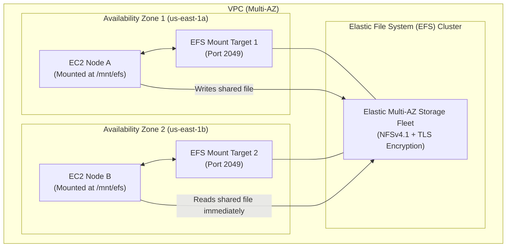

# Lab 2.4: Multi-AZ Shared Storage with Amazon Elastic File System (EFS)

## 📌 Lab Objectives
- Provision a serverless, multi-AZ **Amazon Elastic File System (EFS)**.
- Configure EFS Mount Targets and Security Group rules (NFS TCP port 2049).
- Mount the distributed filesystem simultaneously across multiple EC2 instances in different Availability Zones using `amazon-efs-utils`.
- Verify POSIX compliance, concurrent write operations, and in-transit TLS encryption.

---

## 🏗️ Architecture Diagram


<details>
<summary>Click to expand Mermaid diagram source</summary>


<details>
<summary>Click to expand Mermaid diagram source</summary>


<details>
<summary>Click to expand Mermaid diagram source</summary>


</details>
</details>
</details>

---

## 💡 Key Architectural Concepts

| Feature | Amazon EBS | Amazon EFS |
| :--- | :--- | :--- |
| **Scope** | Single Availability Zone (Zonal) | Regional across multiple Availability Zones |
| **Protocol** | Block Storage (Raw NVMe / SCSI) | File Storage (NFSv4.1) |
| **Concurrency** | Single Instance (except `io2` multi-attach in 1 AZ) | Thousands of EC2 instances concurrently across all AZs |
| **Scalability** | Fixed allocated size (manually resized) | Elastic (automatically expands and contracts on demand) |
| **Encryption** | KMS Encryption at Rest | Encryption at rest (KMS) + Encryption in transit (TLS) |

---

## ⏱️ Prerequisites & Cost
- **AWS Free Tier Eligible**: Yes (5 GB-months of Amazon EFS Standard storage free tier).
- **Estimated Duration**: 20 minutes.

---

## 🚀 Step-by-Step Instructions

### Step 1: Create an EFS Security Group
```bash
export AWS_REGION=$(aws configure get region || echo "us-east-1")
export VPC_ID=$(aws ec2 describe-vpcs --filters "Name=isDefault,Values=true" --query "Vpcs[0].VpcId" --output text)

EFS_SG_ID=$(aws ec2 create-security-group \
  --group-name "efs-mount-target-sg" \
  --description "Allow NFS traffic from EC2 instances" \
  --vpc-id "${VPC_ID}" \
  --tag-specifications "ResourceType=security-group,Tags=[{Key=Project,Value=ec2-master-labs},{Key=Name,Value=efs-sg}]" \
  --query "GroupId" --output text)

# Allow NFS Port 2049 from within the VPC CIDR
VPC_CIDR=$(aws ec2 describe-vpcs --vpc-ids "${VPC_ID}" --query "Vpcs[0].CidrBlock" --output text)
aws ec2 authorize-security-group-ingress \
  --group-id "${EFS_SG_ID}" \
  --protocol tcp \
  --port 2049 \
  --cidr "${VPC_CIDR}"

echo "EFS Security Group Created: ${EFS_SG_ID}"
```

### Step 2: Create the EFS File System
```bash
EFS_ID=$(aws efs create-file-system \
  --performance-mode "generalPurpose" \
  --throughput-mode "elastic" \
  --encrypted \
  --tags "Key=Project,Value=ec2-master-labs" "Key=Name,Value=shared-efs-lab" \
  --query "FileSystemId" --output text)

echo "Created EFS File System: ${EFS_ID}"
# Wait for EFS to become available
sleep 5
```

### Step 3: Create Mount Targets in Two Availability Zones
Retrieve subnets in two different AZs:
```bash
SUBNET_1=$(aws ec2 describe-subnets --filters "Name=vpc-id,Values=${VPC_ID}" --query "Subnets[0].SubnetId" --output text)
SUBNET_2=$(aws ec2 describe-subnets --filters "Name=vpc-id,Values=${VPC_ID}" --query "Subnets[1].SubnetId" --output text)

# Mount Target in Subnet 1
MT1_ID=$(aws efs create-mount-target \
  --file-system-id "${EFS_ID}" \
  --subnet-id "${SUBNET_1}" \
  --security-groups "${EFS_SG_ID}" \
  --query "MountTargetId" --output text)

# Mount Target in Subnet 2
MT2_ID=$(aws efs create-mount-target \
  --file-system-id "${EFS_ID}" \
  --subnet-id "${SUBNET_2}" \
  --security-groups "${EFS_SG_ID}" \
  --query "MountTargetId" --output text)

echo "Created Mount Targets: ${MT1_ID}, ${MT2_ID}"
```

### Step 4: Mount EFS on EC2 Instances using `amazon-efs-utils`
Install the EFS client and mount the filesystem:
```bash
# On your Amazon Linux 2023 instance:
sudo dnf install -y amazon-efs-utils

sudo mkdir -p /mnt/efs

# Mount with in-transit TLS encryption:
sudo mount -t efs -o tls ${EFS_ID}:/ /mnt/efs

# Add to /etc/fstab for auto-mount on reboot:
echo "${EFS_ID}:/ /mnt/efs efs _netdev,tls 0 0" | sudo tee -a /etc/fstab
```

---

## 🔍 Verification & Testing

### 1. Concurrent Multi-Instance Write Verification
- On **EC2 Instance A** in Subnet 1:
  ```bash
  echo "Written by Instance A at $(date)" | sudo tee /mnt/efs/cluster-node-a.txt
  ```

- On **EC2 Instance B** in Subnet 2:
  ```bash
  ls -lh /mnt/efs/
  cat /mnt/efs/cluster-node-a.txt
  ```
The file written by Instance A is instantly readable by Instance B across different Availability Zones with zero sync delay.

---

## 🧹 Teardown & Clean-up

```bash
# 1. Delete Mount Targets
aws efs delete-mount-target --mount-target-id "${MT1_ID}"
aws efs delete-mount-target --mount-target-id "${MT2_ID}"

# Wait for mount targets to terminate
sleep 15

# 2. Delete EFS File System
aws efs delete-file-system --file-system-id "${EFS_ID}"

# 3. Delete Security Group
aws ec2 delete-security-group --group-id "${EFS_SG_ID}"

echo "Lab 2.4 clean-up completed successfully."
```
