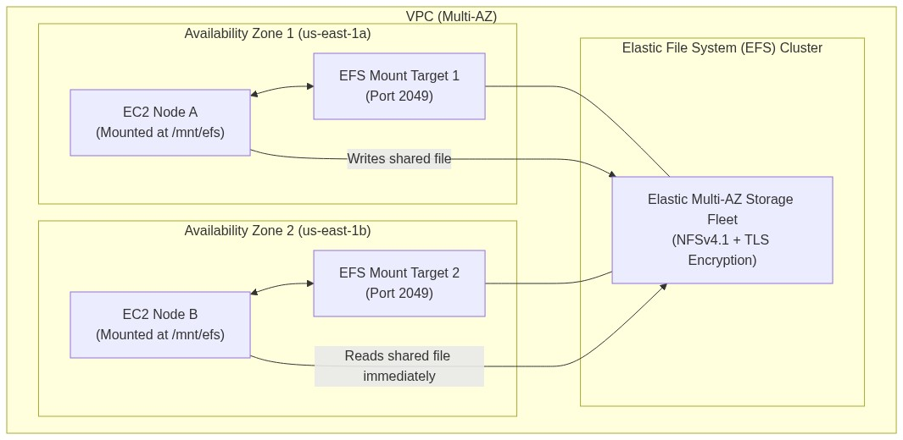
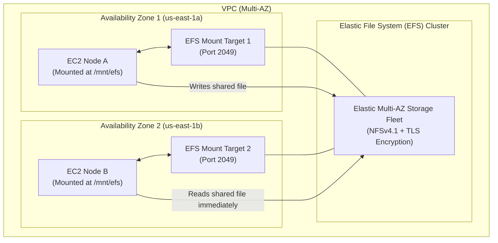

<div align="center">

# 🔬 Lab 2.4: Multi-AZ Shared Storage with Amazon Elastic File System (EFS)

**[🏠 AWS Labs Root](../../../README.md)** &nbsp;•&nbsp; **[🖥️ EC2 Curriculum](../../README.md)** &nbsp;•&nbsp; **[📂 Module 02](../README.md)**

   

**[⬅️ Previous Lab](../../module-02-storage-ebs-ephemeral-efs/lab-03-instance-store-ephemeral/README.md)** &nbsp;|&nbsp; **[➡️ Next Lab](../../module-03-networking-eni-placement/lab-01-dual-eni-routing/README.md)**


<a href="https://cyber-cloud-security.github.io/aws-labs/?lab=lab-04-efs-shared-filesystem" target="_blank" rel="noopener noreferrer"></a>

</div>

---

## 📌 Lab Objectives

- [x] Provision a serverless, multi-AZ **Amazon Elastic File System (EFS)**.
- [x] Configure EFS Mount Targets and Security Group rules (NFS TCP port 2049).
- [x] Mount the distributed filesystem simultaneously across multiple EC2 instances in different Availability Zones using `amazon-efs-utils`.
- [x] Verify POSIX compliance, concurrent write operations, and in-transit TLS encryption.

---

## 🏗️ Architecture Diagram



<details>
<summary>📐 <b>View Mermaid Architecture Source (Click to Expand)</b></summary>


```mermaid
flowchart TD
    subgraph MultiAZVPC["VPC (Multi-AZ)"]
        subgraph AZ1["Availability Zone 1 (us-east-1a)"]
            EC2_A["EC2 Node A\n(Mounted at /mnt/efs)"]
            MT1["EFS Mount Target 1\n(Port 2049)"]
            EC2_A <--> MT1
        end

        subgraph AZ2["Availability Zone 2 (us-east-1b)"]
            EC2_B["EC2 Node B\n(Mounted at /mnt/efs)"]
            MT2["EFS Mount Target 2\n(Port 2049)"]
            EC2_B <--> MT2
        end

        subgraph EFSBackend["Elastic File System (EFS) Cluster"]
            StorageFleet["Elastic Multi-AZ Storage Fleet\n(NFSv4.1 + TLS Encryption)"]
            MT1 --- StorageFleet
            MT2 --- StorageFleet
        end
    end

    EC2_A -->|Writes shared file| StorageFleet
    EC2_B -->|Reads shared file immediately| StorageFleet
```

</details>

---

## 💡 Key Architectural Concepts

| Feature | Amazon EBS | Amazon EFS |
| :--- | :--- | :--- |
| **Scope** | Single Availability Zone (Zonal) | Regional across multiple Availability Zones |
| **Protocol** | Block Storage (Raw NVMe / SCSI) | File Storage (NFSv4.1) |
| **Concurrency** | Single Instance (except `io2` multi-attach in 1 AZ) | Thousands of EC2 instances concurrently across all AZs |
| **Scalability** | Fixed allocated size (manually resized) | Elastic (automatically expands and contracts on demand) |
| **Encryption** | KMS Encryption at Rest | Encryption at rest (KMS) + Encryption in transit (TLS) |

---

## ⏱️ Prerequisites & Cost

> [!TIP]
> **AWS Free Tier & Cost Guardrail**
> - **AWS Free Tier Eligible**: Yes (5 GB-months of Amazon EFS Standard storage free tier).
> - **Estimated Duration**: 20 minutes.

---

## 🚀 Step-by-Step Instructions

### Step 1: Create an EFS Security Group

1. Discover default VPC and create the security group:
```bash
export AWS_REGION=$(aws configure get region || echo "us-east-1")
export VPC_ID=$(aws ec2 describe-vpcs \
  --filters "Name=isDefault,Values=true" \
  --query "Vpcs[0].VpcId" \
  --output text)

EFS_SG_ID=$(aws ec2 create-security-group \
  --group-name "efs-mount-target-sg" \
  --description "Allow NFS traffic from EC2 instances" \
  --vpc-id "${VPC_ID}" \
  --tag-specifications "ResourceType=security-group,Tags=[{Key=Project,Value=ec2-master-labs},{Key=Name,Value=efs-sg}]" \
  --query "GroupId" --output text)
```

2. Authorize NFS port 2049 inbound from within the VPC CIDR:
```bash
VPC_CIDR=$(aws ec2 describe-vpcs \
  --vpc-ids "${VPC_ID}" \
  --query "Vpcs[0].CidrBlock" \
  --output text)

aws ec2 authorize-security-group-ingress \
  --group-id "${EFS_SG_ID}" \
  --protocol tcp \
  --port 2049 \
  --cidr "${VPC_CIDR}"
```

3. Confirm created security group:
```bash
echo "EFS Security Group Created: ${EFS_SG_ID}"
```

---

### Step 2: Create the EFS File System

1. Provision the encrypted EFS filesystem:
```bash
EFS_ID=$(aws efs create-file-system \
  --performance-mode "generalPurpose" \
  --throughput-mode "elastic" \
  --encrypted \
  --tags "Key=Project,Value=ec2-master-labs" "Key=Name,Value=shared-efs-lab" \
  --query "FileSystemId" --output text)
```

2. Confirm created EFS File System:
```bash
echo "Created EFS File System: ${EFS_ID}"
```

---

### Step 3: Create Mount Targets in Two Availability Zones

1. Retrieve subnets in two different Availability Zones:
```bash
SUBNET_1=$(aws ec2 describe-subnets \
  --filters "Name=vpc-id,Values=${VPC_ID}" \
  --query "Subnets[0].SubnetId" \
  --output text)
SUBNET_2=$(aws ec2 describe-subnets \
  --filters "Name=vpc-id,Values=${VPC_ID}" \
  --query "Subnets[1].SubnetId" \
  --output text)
```

2. Create Mount Target in Subnet 1:
```bash
MT1_ID=$(aws efs create-mount-target \
  --file-system-id "${EFS_ID}" \
  --subnet-id "${SUBNET_1}" \
  --security-groups "${EFS_SG_ID}" \
  --query "MountTargetId" --output text)
```

3. Create Mount Target in Subnet 2:
```bash
MT2_ID=$(aws efs create-mount-target \
  --file-system-id "${EFS_ID}" \
  --subnet-id "${SUBNET_2}" \
  --security-groups "${EFS_SG_ID}" \
  --query "MountTargetId" --output text)
```

4. Confirm created mount targets:
```bash
echo "Created Mount Targets: ${MT1_ID}, ${MT2_ID}"
```

---

### Step 4: Mount EFS on EC2 Instances using `amazon-efs-utils`

Execute the following on your Amazon Linux 2023 instance:

1. Install the `amazon-efs-utils` package:
```bash
sudo dnf install -y amazon-efs-utils
```

2. Create the mount directory:
```bash
sudo mkdir -p /mnt/efs
```

3. Mount EFS with in-transit TLS encryption:
```bash
sudo mount -t efs -o tls ${EFS_ID}:/ /mnt/efs
```

4. Add entry to `/etc/fstab` for auto-mounting on reboot:
```bash
echo "${EFS_ID}:/ /mnt/efs efs _netdev,tls 0 0" | sudo tee -a /etc/fstab
```

---

## 🔍 Verification & Testing

### 1. Concurrent Multi-Instance Write Verification
- On **EC2 Instance A** in Subnet 1:
  ```bash
  echo "Written by Instance A at $(date)" | sudo tee /mnt/efs/cluster-node-a.txt
  ```

- On **EC2 Instance B** in Subnet 2:
  ```bash
  ls -lh /mnt/efs/
  cat /mnt/efs/cluster-node-a.txt
  ```
The file written by Instance A is instantly readable by Instance B across different Availability Zones with zero sync delay.

---

## 🧹 Teardown & Clean-up

> [!CAUTION]
> **Always Tear Down Lab Resources**: Execute the cleanup commands below immediately after completing the verification steps to prevent unintended AWS billing.

1. Delete Mount Targets:
```bash
aws efs delete-mount-target --mount-target-id "${MT1_ID}"
aws efs delete-mount-target --mount-target-id "${MT2_ID}"
```

2. Wait for mount targets to terminate and delete the EFS file system:
```bash
sleep 15
aws efs delete-file-system --file-system-id "${EFS_ID}"
```

3. Delete the EFS Security Group:
```bash
aws ec2 delete-security-group --group-id "${EFS_SG_ID}"
```

4. Confirm cleanup:
```bash
echo "[SUCCESS] Lab 2.4 clean-up completed successfully."
```

---

<div align="center">

**[⬅️ Previous Lab](../../module-02-storage-ebs-ephemeral-efs/lab-03-instance-store-ephemeral/README.md)** &nbsp;•&nbsp; **[⬆️ Back to Module 02](../README.md)** &nbsp;•&nbsp; **[🏠 EC2 Index](../../README.md)** &nbsp;•&nbsp; **[➡️ Next Lab](../../module-03-networking-eni-placement/lab-01-dual-eni-routing/README.md)**

</div>
