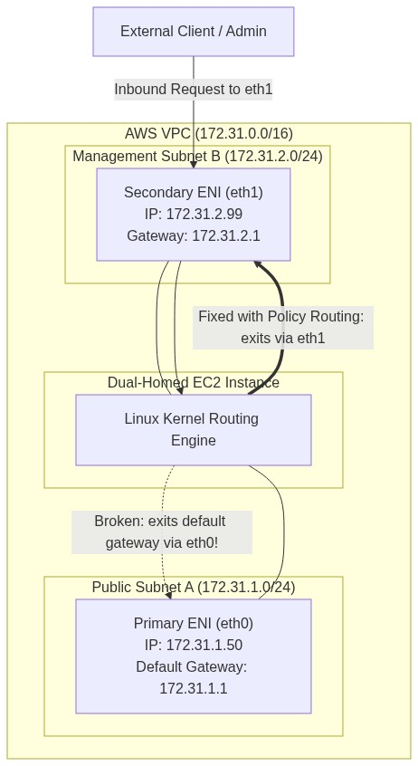
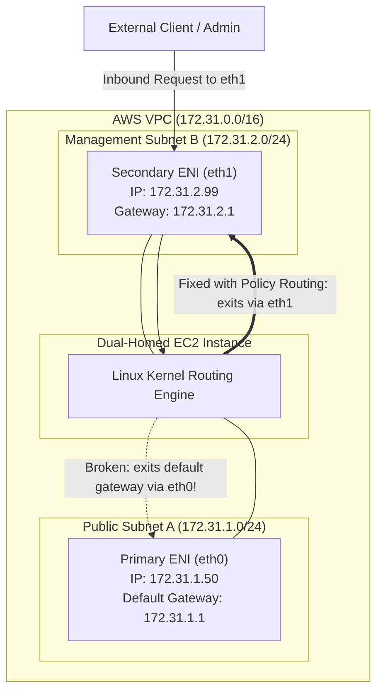

<div align="center">

# 🔬 Lab 3.1: Dual Elastic Network Interfaces (ENI) & Linux Policy Routing

**[🏠 AWS Labs Root](../../../README.md)** &nbsp;•&nbsp; **[🖥️ EC2 Curriculum](../../README.md)** &nbsp;•&nbsp; **[📂 Module 03](../README.md)**

   

**[⬅️ Previous Lab](../../module-02-storage-ebs-ephemeral-efs/lab-04-efs-shared-filesystem/README.md)** &nbsp;|&nbsp; **[➡️ Next Lab](../../module-03-networking-eni-placement/lab-02-elastic-ips-ha/README.md)**

</div>

---

## 📌 Lab Objectives

- [x] Provision and attach a secondary **Elastic Network Interface (ENI)** to an EC2 instance across two subnets.
- [x] Understand how primary (`eth0`) and secondary (`eth1`) interfaces interact.
- [x] Diagnose and resolve the classic Linux **asymmetric routing problem** (where return packets exit the wrong interface and get dropped).
- [x] Implement Linux policy-based routing (`ip rule`, `ip route`) to ensure traffic responding to `eth1` exits through `eth1`'s gateway.

---

## 🏗️ Architecture Diagram



<details>
<summary>📐 <b>View Mermaid Architecture Source (Click to Expand)</b></summary>



</details>

---

## 💡 Key Architectural Concepts

1. **Why Multiple ENIs?**:
   - Creating dual-homed network security appliances (firewalls, reverse proxies, IDS/IPS).
   - Isolating management traffic (SSH, telemetry) from production data plane traffic.
2. **The Asymmetric Routing Problem**:
   - Linux by default maintains only **one default gateway** (bound to `eth0`).
   - When a packet arrives on `eth1`, the application receives it, but the OS routing table sends the response packet out through `eth0`'s gateway.
   - The client's firewall or intermediate stateful NAT drops this response because the SYN-ACK originates from an unexpected IP address (or Reverse Path Filtering `rp_filter` drops it).

---

## ⏱️ Prerequisites & Cost

> [!TIP]
> **AWS Free Tier & Cost Guardrail**
> - **AWS Free Tier Eligible**: Yes (`t3.micro`).
> - **Estimated Duration**: 20 minutes.

---

## 🚀 Step-by-Step Instructions

### Step 1: Launch EC2 Instance with Primary ENI
```bash
export AWS_REGION=$(aws configure get region || echo "us-east-1")
export VPC_ID=$(aws ec2 describe-vpcs \
  --filters "Name=isDefault,Values=true" \
  --query "Vpcs[0].VpcId" \
  --output text)

SUBNET_1=$(aws ec2 describe-subnets \
  --filters "Name=vpc-id,Values=${VPC_ID}" \
  --query "Subnets[0].SubnetId" \
  --output text)
SUBNET_2=$(aws ec2 describe-subnets \
  --filters "Name=vpc-id,Values=${VPC_ID}" \
  --query "Subnets[1].SubnetId" \
  --output text)

AMI_ID=$(aws ssm get-parameter \
  --name "/aws/service/ami-amazon-linux-latest/al2023-ami-kernel-default-x86_64" \
  --query "Parameter.Value" --output text)

INSTANCE_ID=$(aws ec2 run-instances \
  --image-id "${AMI_ID}" \
  --instance-type "t3.micro" \
  --subnet-id "${SUBNET_1}" \
  --tag-specifications "ResourceType=instance,Tags=[{Key=Project,Value=ec2-master-labs},{Key=Name,Value=dual-eni-host}]" \
  --query "Instances[0].InstanceId" --output text)

echo "Waiting for instance ${INSTANCE_ID} to run..."
aws ec2 wait instance-running --instance-ids "${INSTANCE_ID}"
```

### Step 2: Create and Attach Secondary ENI
```bash
# Get Security Group
SG_ID=$(aws ec2 describe-instances \
  --instance-ids "${INSTANCE_ID}" \
  --query "Reservations[0].Instances[0].SecurityGroups[0].GroupId" \
  --output text)

# Create secondary ENI in Subnet 2
SECONDARY_ENI_ID=$(aws ec2 create-network-interface \
  --subnet-id "${SUBNET_2}" \
  --description "Secondary ENI for management traffic" \
  --groups "${SG_ID}" \
  --tag-specifications "ResourceType=network-interface,Tags=[{Key=Project,Value=ec2-master-labs},{Key=Name,Value=secondary-eni}]" \
  --query "NetworkInterface.NetworkInterfaceId" --output text)

echo "Created Secondary ENI: ${SECONDARY_ENI_ID}"

# Attach ENI to Device Index 1 (eth1)
ATTACHMENT_ID=$(aws ec2 attach-network-interface \
  --network-interface-id "${SECONDARY_ENI_ID}" \
  --instance-id "${INSTANCE_ID}" \
  --device-index 1 \
  --query "AttachmentId" --output text)

echo "Attached ENI (Device Index 1): ${ATTACHMENT_ID}"
```

---

## 🔍 Verification & Configuring Policy Routing

### 1. Inspect Interfaces Inside the Guest OS
Connect to the instance via Session Manager or SSH:
```bash
# Inspect network links
ip link show
```
Notice both `eth0` and `eth1` are present, but `eth1` has no default route.

Fetch IP and gateway of `eth1`:
```bash
IP2=$(ip -4 addr show eth1 | grep -oP '(?<=inet\s)\d+(\.\d+){3}')
GATEWAY2=$(ip route | grep "default via" | awk '{print $3}' | sed 's/\.[0-9]*$/.1/')
```

### 2. Configure Custom Routing Table for `eth1`
Create table `100` and rule so all packets with source IP of `eth1` use table `100`:
```bash
# Add default route for eth1 in table 100
sudo ip route add default via ${GATEWAY2} dev eth1 table 100

# Add rule: any packet originating from IP2 must consult table 100
sudo ip rule add from ${IP2} lookup 100

# Verify rule
ip rule show
# Output shows:
# 32765: from 172.31.x.x lookup 100
```

### 3. Verify Ping / Curl Responses
Ping both interfaces from another host in the VPC or run test curl commands. Both interfaces now respond cleanly with zero dropped packets.

---

## 🧹 Teardown & Clean-up


> [!CAUTION]
> **Always Tear Down Lab Resources**: Execute the cleanup commands below immediately after completing the verification steps to prevent unintended AWS billing.

```bash
# 1. Detach secondary ENI
aws ec2 detach-network-interface --attachment-id "${ATTACHMENT_ID}" --force
sleep 5

# 2. Delete secondary ENI
aws ec2 delete-network-interface --network-interface-id "${SECONDARY_ENI_ID}"

# 3. Terminate instance
aws ec2 terminate-instances --instance-ids "${INSTANCE_ID}"
aws ec2 wait instance-terminated --instance-ids "${INSTANCE_ID}"

echo "Lab 3.1 clean-up completed successfully."
```

---

<div align="center">

**[⬅️ Previous Lab](../../module-02-storage-ebs-ephemeral-efs/lab-04-efs-shared-filesystem/README.md)** &nbsp;•&nbsp; **[⬆️ Back to Module 03](../README.md)** &nbsp;•&nbsp; **[🏠 EC2 Index](../../README.md)** &nbsp;•&nbsp; **[➡️ Next Lab](../../module-03-networking-eni-placement/lab-02-elastic-ips-ha/README.md)**

</div>
