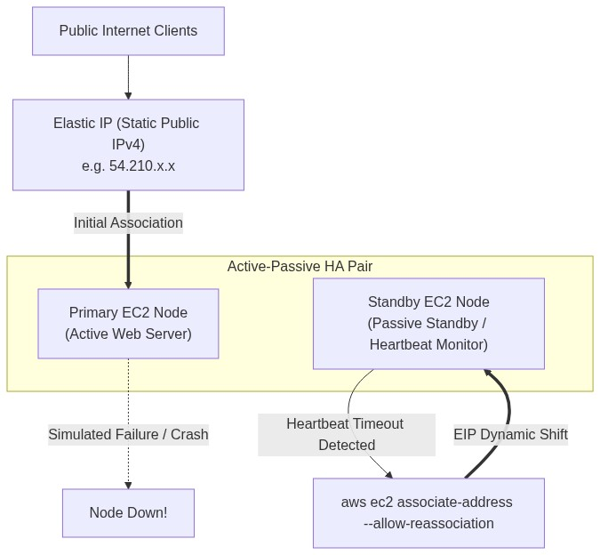
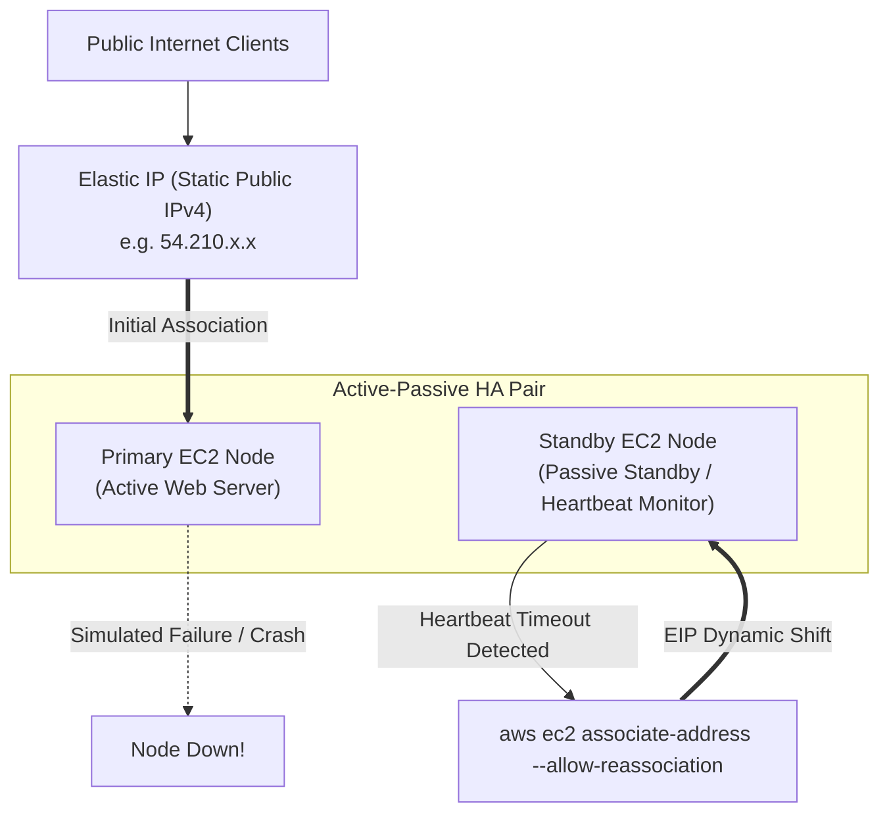

<div align="center">

# 🔬 Lab 3.2: Elastic IP Addresses (EIP) & Automated High-Availability Failover

**[🏠 AWS Labs Root](../../../README.md)** &nbsp;•&nbsp; **[🖥️ EC2 Curriculum](../../README.md)** &nbsp;•&nbsp; **[📂 Module 03](../README.md)**

   

**[⬅️ Previous Lab](../../module-03-networking-eni-placement/lab-01-dual-eni-routing/README.md)** &nbsp;|&nbsp; **[➡️ Next Lab](../../module-03-networking-eni-placement/lab-03-enhanced-networking-ena/README.md)**

</div>

---

## 📌 Lab Objectives

- [x] Allocate and manage **Elastic IP (EIP)** addresses via the AWS CLI.
- [x] Design an **Active-Passive High Availability (HA) Failover**: Automatically re-associate an Elastic IP from an unhealthy primary EC2 instance to a standby secondary EC2 instance.
- [x] Understand AWS billing rules regarding public IPv4 addresses and idle unattached EIP penalties.

---

## 🏗️ Architecture Diagram



<details>
<summary>📐 <b>View Mermaid Architecture Source (Click to Expand)</b></summary>



</details>

---

## 💡 Key Architectural Concepts

1. **Why Elastic IP?**:
   - Standard EC2 public IPs change whenever an instance is stopped and started. An Elastic IP remains fixed to your account until explicitly released.
2. **Dynamic Re-association (`--allow-reassociation`)**:
   - The AWS EC2 control plane allows an Elastic IP to be instantly moved from one instance/ENI to another in seconds without waiting for DNS propagation (TTL delays).
3. **Public IPv4 Pricing**:
   - AWS charges $0.005 per hour for all in-use public IPv4 addresses.
   - An unattached Elastic IP is charged an idle penalty ($0.005/hr) to discourage IP address hoarding.

---

## ⏱️ Prerequisites & Cost

> [!WARNING]
> **Paid Instance / Storage Notice**
> - **Estimated Duration**: 15 minutes.
> - **Cost**: < $0.01 (EIP hourly prorated fee; release immediately after lab).

---

## 🚀 Step-by-Step Instructions

### Step 1: Launch Primary (Active) and Standby (Passive) Instances
```bash
export AWS_REGION=$(aws configure get region || echo "us-east-1")
export VPC_ID=$(aws ec2 describe-vpcs \
  --filters "Name=isDefault,Values=true" \
  --query "Vpcs[0].VpcId" \
  --output text)
export SUBNET_ID=$(aws ec2 describe-subnets \
  --filters "Name=vpc-id,Values=${VPC_ID}" \
  --query "Subnets[0].SubnetId" \
  --output text)

AMI_ID=$(aws ssm get-parameter \
  --name "/aws/service/ami-amazon-linux-latest/al2023-ami-kernel-default-x86_64" \
  --query "Parameter.Value" --output text)

# Launch Primary Node
PRIMARY_ID=$(aws ec2 run-instances \
  --image-id "${AMI_ID}" \
  --instance-type "t3.micro" \
  --subnet-id "${SUBNET_ID}" \
  --user-data "#!/bin/bash
dnf install -y nginx
echo '<h1>PRIMARY Active Node</h1>' > /usr/share/nginx/html/index.html
systemctl start nginx" \
  --tag-specifications "ResourceType=instance,Tags=[{Key=Project,Value=ec2-master-labs},{Key=Name,Value=ha-primary}]" \
  --query "Instances[0].InstanceId" --output text)

# Launch Standby Node
STANDBY_ID=$(aws ec2 run-instances \
  --image-id "${AMI_ID}" \
  --instance-type "t3.micro" \
  --subnet-id "${SUBNET_ID}" \
  --user-data "#!/bin/bash
dnf install -y nginx
echo '<h1>STANDBY Failover Node</h1>' > /usr/share/nginx/html/index.html
systemctl start nginx" \
  --tag-specifications "ResourceType=instance,Tags=[{Key=Project,Value=ec2-master-labs},{Key=Name,Value=ha-standby}]" \
  --query "Instances[0].InstanceId" --output text)

echo "Waiting for instances to enter running state..."
aws ec2 wait instance-running --instance-ids "${PRIMARY_ID}" "${STANDBY_ID}"
```

### Step 2: Allocate an Elastic IP Address
```bash
ALLOCATION_OUTPUT=$(aws ec2 allocate-address \
  --domain vpc \
  --tag-specifications "ResourceType=elastic-ip,Tags=[{Key=Project,Value=ec2-master-labs},{Key=Name,Value=ha-failover-eip}]" \
  --output json)

ALLOCATION_ID=$(echo "${ALLOCATION_OUTPUT}" | grep -o '"AllocationId": "[^"]*' | cut -d'"' -f4)
PUBLIC_IP=$(echo "${ALLOCATION_OUTPUT}" | grep -o '"PublicIp": "[^"]*' | cut -d'"' -f4)

echo "Allocated EIP: ${PUBLIC_IP} (Allocation ID: ${ALLOCATION_ID})"
```

### Step 3: Associate EIP with Primary Instance
```bash
ASSOC_ID=$(aws ec2 associate-address \
  --instance-id "${PRIMARY_ID}" \
  --allocation-id "${ALLOCATION_ID}" \
  --query "AssociationId" --output text)

echo "Associated EIP with Primary Node. Association ID: ${ASSOC_ID}"
```

---

## 🔍 Verification & Failover Simulation

### 1. Test Traffic to Primary Node
Wait 30 seconds for Nginx to initialize, then curl the Elastic IP:
```bash
curl "http://${PUBLIC_IP}"
```
**Output**: `<h1>PRIMARY Active Node</h1>`

### 2. Simulate Node Crash & Trigger EIP Failover
Simulate failure by stopping the Primary instance:
```bash
echo "Simulating failure: Stopping primary node..."
aws ec2 stop-instances --instance-ids "${PRIMARY_ID}"
```

Perform automated failover by re-associating the Elastic IP to the Standby Node using `--allow-reassociation`:
```bash
FAILOVER_ASSOC_ID=$(aws ec2 associate-address \
  --instance-id "${STANDBY_ID}" \
  --allocation-id "${ALLOCATION_ID}" \
  --allow-reassociation \
  --query "AssociationId" --output text)

echo "EIP re-associated to Standby Node! New Association ID: ${FAILOVER_ASSOC_ID}"
```

### 3. Verify Traffic Now Reaches Standby
```bash
curl "http://${PUBLIC_IP}"
```
**Output**: `<h1>STANDBY Failover Node</h1>`
Traffic switched seamlessly to the healthy standby server with zero DNS propagation delays.

---

## 🧹 Teardown & Clean-up

> [!CAUTION]
> Always disassociate and **release** the Elastic IP, otherwise idle charges will accrue!

```bash
# 1. Disassociate EIP
aws ec2 disassociate-address --association-id "${FAILOVER_ASSOC_ID}"

# 2. Release EIP back to the AWS pool
aws ec2 release-address --allocation-id "${ALLOCATION_ID}"
echo "Released Elastic IP ${PUBLIC_IP}."

# 3. Terminate instances
aws ec2 terminate-instances --instance-ids "${PRIMARY_ID}" "${STANDBY_ID}"
aws ec2 wait instance-terminated --instance-ids "${PRIMARY_ID}" "${STANDBY_ID}"

echo "Lab 3.2 clean-up completed successfully."
```

---

<div align="center">

**[⬅️ Previous Lab](../../module-03-networking-eni-placement/lab-01-dual-eni-routing/README.md)** &nbsp;•&nbsp; **[⬆️ Back to Module 03](../README.md)** &nbsp;•&nbsp; **[🏠 EC2 Index](../../README.md)** &nbsp;•&nbsp; **[➡️ Next Lab](../../module-03-networking-eni-placement/lab-03-enhanced-networking-ena/README.md)**

</div>
