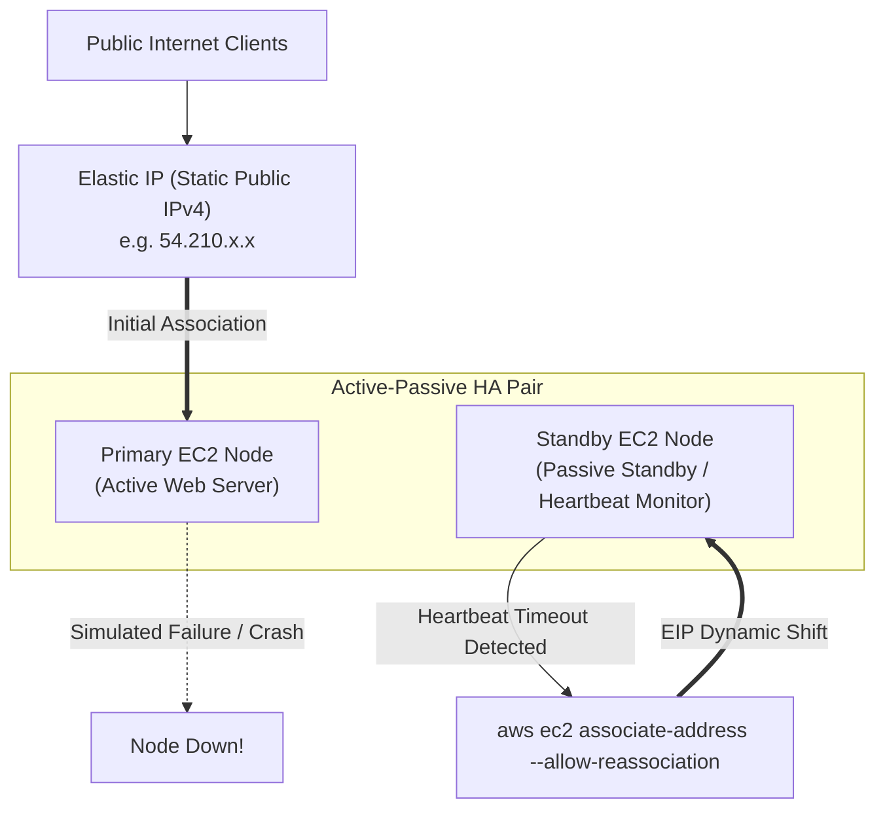

<div align="center">

# 🔬 Lab 3.2: Elastic IP Addresses (EIP) & Automated High-Availability Failover

**[🏠 AWS Labs Root](../../../README.md)** &nbsp;•&nbsp; **[🖥️ EC2 Curriculum](../../README.md)** &nbsp;•&nbsp; **[📂 Module 03](../README.md)**

   

**[⬅️ Previous Lab](../../module-03-networking-eni-placement/lab-01-dual-eni-routing/README.md)** &nbsp;|&nbsp; **[➡️ Next Lab](../../module-03-networking-eni-placement/lab-03-enhanced-networking-ena/README.md)**

</div>

---

## 📌 Lab Objectives

- [x] Allocate and manage **Elastic IP (EIP)** addresses via the AWS CLI.
- [x] Design an **Active-Passive High Availability (HA) Failover**: Automatically re-associate an Elastic IP from an unhealthy primary EC2 instance to a standby secondary EC2 instance.
- [x] Understand AWS billing rules regarding public IPv4 addresses and idle unattached EIP penalties.

---

## 🏗️ Architecture Diagram


<details>
<summary>📐 <b>View Mermaid Architecture Source (Click to Expand)</b></summary>



</details>

---

## 💡 Key Architectural Concepts

1. **Why Elastic IP?**:
   - Standard EC2 public IPs change whenever an instance is stopped and started. An Elastic IP remains fixed to your account until explicitly released.
2. **Dynamic Re-association (`--allow-reassociation`)**:
   - The AWS EC2 control plane allows an Elastic IP to be instantly moved from one instance/ENI to another in seconds without waiting for DNS propagation (TTL delays).
3. **Public IPv4 Pricing**:
   - AWS charges $0.005 per hour for all in-use public IPv4 addresses.
   - An unattached Elastic IP is charged an idle penalty ($0.005/hr) to discourage IP address hoarding.

---

## ⏱️ Prerequisites & Cost

> [!WARNING]
> **Paid Instance / Storage Notice**
> - **Estimated Duration**: 15 minutes.
> - **Cost**: < $0.01 (EIP hourly prorated fee; release immediately after lab).

---

## 🚀 Step-by-Step Instructions

### Step 1: Launch Primary (Active) and Standby (Passive) Instances
```bash
export AWS_REGION=$(aws configure get region || echo "us-east-1")
export VPC_ID=$(aws ec2 describe-vpcs \
  --filters "Name=isDefault,Values=true" \
  --query "Vpcs[0].VpcId" \
  --output text)
export SUBNET_ID=$(aws ec2 describe-subnets \
  --filters "Name=vpc-id,Values=${VPC_ID}" \
  --query "Subnets[0].SubnetId" \
  --output text)

AMI_ID=$(aws ssm get-parameter \
  --name "/aws/service/ami-amazon-linux-latest/al2023-ami-kernel-default-x86_64" \
  --query "Parameter.Value" --output text)

# Launch Primary Node
PRIMARY_ID=$(aws ec2 run-instances \
  --image-id "${AMI_ID}" \
  --instance-type "t3.micro" \
  --subnet-id "${SUBNET_ID}" \
  --user-data "#!/bin/bash
dnf install -y nginx
echo '<h1>PRIMARY Active Node</h1>' > /usr/share/nginx/html/index.html
systemctl start nginx" \
  --tag-specifications "ResourceType=instance,Tags=[{Key=Project,Value=ec2-master-labs},{Key=Name,Value=ha-primary}]" \
  --query "Instances[0].InstanceId" --output text)

# Launch Standby Node
STANDBY_ID=$(aws ec2 run-instances \
  --image-id "${AMI_ID}" \
  --instance-type "t3.micro" \
  --subnet-id "${SUBNET_ID}" \
  --user-data "#!/bin/bash
dnf install -y nginx
echo '<h1>STANDBY Failover Node</h1>' > /usr/share/nginx/html/index.html
systemctl start nginx" \
  --tag-specifications "ResourceType=instance,Tags=[{Key=Project,Value=ec2-master-labs},{Key=Name,Value=ha-standby}]" \
  --query "Instances[0].InstanceId" --output text)

echo "Waiting for instances to enter running state..."
aws ec2 wait instance-running --instance-ids "${PRIMARY_ID}" "${STANDBY_ID}"
```

### Step 2: Allocate an Elastic IP Address
```bash
ALLOCATION_OUTPUT=$(aws ec2 allocate-address \
  --domain vpc \
  --tag-specifications "ResourceType=elastic-ip,Tags=[{Key=Project,Value=ec2-master-labs},{Key=Name,Value=ha-failover-eip}]" \
  --output json)

ALLOCATION_ID=$(echo "${ALLOCATION_OUTPUT}" | grep -o '"AllocationId": "[^"]*' | cut -d'"' -f4)
PUBLIC_IP=$(echo "${ALLOCATION_OUTPUT}" | grep -o '"PublicIp": "[^"]*' | cut -d'"' -f4)

echo "Allocated EIP: ${PUBLIC_IP} (Allocation ID: ${ALLOCATION_ID})"
```

### Step 3: Associate EIP with Primary Instance
```bash
ASSOC_ID=$(aws ec2 associate-address \
  --instance-id "${PRIMARY_ID}" \
  --allocation-id "${ALLOCATION_ID}" \
  --query "AssociationId" --output text)

echo "Associated EIP with Primary Node. Association ID: ${ASSOC_ID}"
```

---

## 🔍 Verification & Failover Simulation

### 1. Test Traffic to Primary Node
Wait 30 seconds for Nginx to initialize, then curl the Elastic IP:
```bash
curl "http://${PUBLIC_IP}"
```
**Output**: `<h1>PRIMARY Active Node</h1>`

### 2. Simulate Node Crash & Trigger EIP Failover
Simulate failure by stopping the Primary instance:
```bash
echo "Simulating failure: Stopping primary node..."
aws ec2 stop-instances --instance-ids "${PRIMARY_ID}"
```

Perform automated failover by re-associating the Elastic IP to the Standby Node using `--allow-reassociation`:
```bash
FAILOVER_ASSOC_ID=$(aws ec2 associate-address \
  --instance-id "${STANDBY_ID}" \
  --allocation-id "${ALLOCATION_ID}" \
  --allow-reassociation \
  --query "AssociationId" --output text)

echo "EIP re-associated to Standby Node! New Association ID: ${FAILOVER_ASSOC_ID}"
```

### 3. Verify Traffic Now Reaches Standby
```bash
curl "http://${PUBLIC_IP}"
```
**Output**: `<h1>STANDBY Failover Node</h1>`
Traffic switched seamlessly to the healthy standby server with zero DNS propagation delays.

---

## 📘 Deep-Dive Command & Flag Reference

> [!TIP]
> **Line-by-Line Production Analysis**: Every command executed in this lab is dissected below, explaining each CLI flag, JMESPath query, Linux kernel parameter, and why it is critical in production automation.

<details open>
<summary>📘 <b>Command 1: Allocating a Static Elastic IP Address</b></summary>

```bash
ALLOCATION_OUTPUT=$(aws ec2 allocate-address \
  --domain vpc \
  --tag-specifications "ResourceType=elastic-ip,Tags=[{Key=Project,Value=ec2-master-labs},{Key=Name,Value=ha-failover-eip}]" \
  --output json)

ALLOCATION_ID=$(echo "${ALLOCATION_OUTPUT}" | grep -o '"AllocationId": "[^"]*' | cut -d'"' -f4)
PUBLIC_IP=$(echo "${ALLOCATION_OUTPUT}" | grep -o '"PublicIp": "[^"]*' | cut -d'"' -f4)
```

#### 🔍 Parameter & Component Breakdown

- **`aws ec2 allocate-address`** — Reserves a permanent, static public IPv4 address from Amazon's global pool and assigns it exclusively to your AWS account.

- **`--domain vpc`** — Specifies that this Elastic IP is allocated for use within an Amazon Virtual Private Cloud (VPC).

- **`AllocationId` vs `PublicIp`** — In AWS VPC, an Elastic IP is identified by two tokens:
  - **`PublicIp`** — The actual routable IPv4 address (e.g. `54.210.123.45`).
  - **`AllocationId`** — The AWS resource handle (e.g. `eipalloc-0123456789abcdef0`). Most EC2 APIs require the `AllocationId` rather than the raw IP address.

- ****The Billing Rule (Crucial)**** — AWS charges $0.005 per hour for all in-use public IPv4 addresses. However, if an Elastic IP is allocated to your account but **NOT associated** with a running instance, AWS charges an additional idle penalty fee to discourage address hoarding.

> 🏭 **Why This Matters in Production Automation**
> Unlike default dynamic public IPs (which are released and regenerated every single time an instance is stopped and started), an Elastic IP remains permanently tied to your AWS account until you explicitly release it. This allows external clients and firewall whitelists to maintain static connections.

</details>

<details open>
<summary>📘 <b>Command 2: Associating the Elastic IP with the Primary Instance</b></summary>

```bash
ASSOC_ID=$(aws ec2 associate-address \
  --instance-id "${PRIMARY_ID}" \
  --allocation-id "${ALLOCATION_ID}" \
  --query "AssociationId" --output text)
```

#### 🔍 Parameter & Component Breakdown

- **`aws ec2 associate-address`** — Instructs the AWS Software-Defined Networking (SDN) layer to map incoming packets addressed to the public Elastic IP directly to the private IP address of the target instance's primary ENI using 1:1 Network Address Translation (1:1 NAT).

- **`--instance-id "${PRIMARY_ID}"` & `--allocation-id "${ALLOCATION_ID}"`** — Defines the mapping relationship between compute instance and IP address.

- **`--query "AssociationId" --output text`** — Returns the unique mapping session token (e.g. `eipassoc-0a1b2c3d4e5f6g7h8`).

> 🏭 **Why This Matters in Production Automation**
> 1:1 NAT occurs entirely at the AWS hypervisor gateway. The EC2 instance operating system is unaware of its public IP; running `ip addr show` inside the instance will only ever show its private IP (e.g. `172.31.1.50`).

</details>

<details open>
<summary>📘 <b>Command 3: Instant High-Availability Failover via Dynamic Re-association</b></summary>

```bash
FAILOVER_ASSOC_ID=$(aws ec2 associate-address \
  --instance-id "${STANDBY_ID}" \
  --allocation-id "${ALLOCATION_ID}" \
  --allow-reassociation \
  --query "AssociationId" --output text)
```

#### 🔍 Parameter & Component Breakdown

- **`--allow-reassociation` (The Magic Flag)** — By default, if an Elastic IP is already attached to an active instance, attempting to associate it with a different instance will throw an `InvalidParameterCombination` error (`The address ... is already in use`).
Passing `--allow-reassociation` overrides this check, atomically detaching the IP from the unhealthy Primary node and attaching it to the Standby node in a single transaction.

- **Architectural Advantage over DNS Failover** — Standard DNS-based failover (e.g. Route 53 health check record routing) relies on DNS Time-To-Live (TTL) expiration. Many client operating systems, ISPs, and mobile networks cache DNS records for minutes or hours, ignoring low TTLs.
Dynamic EIP re-association shifts traffic at the AWS network routing layer within **3 to 5 seconds**, achieving instant zero-TTL failover.

> 🏭 **Why This Matters in Production Automation**
> In Active-Passive architectures (firewall pairs, VPN gateways, legacy monolithic databases that cannot run active-active), automated watchdog scripts monitor the primary node and execute this command to recover service availability in seconds.

</details>

<details open>
<summary>📘 <b>Command 4: Releasing the Elastic IP back to AWS Pool</b></summary>

```bash
aws ec2 disassociate-address --association-id "${FAILOVER_ASSOC_ID}"
aws ec2 release-address --allocation-id "${ALLOCATION_ID}"
```

#### 🔍 Parameter & Component Breakdown

- **`aws ec2 disassociate-address`** — Unbinds the Elastic IP from the instance. The IP remains in your account pool.

- **`aws ec2 release-address`** — Surrenders the Elastic IP back to Amazon's global pool. This immediately stops all hourly IPv4 reservation charges.

> 🏭 **Why This Matters in Production Automation**
> Terminating an EC2 instance automatically disassociates any attached Elastic IP, but **does NOT release the Elastic IP from your account**. Without an explicit `release-address` command in teardown scripts, idle unattached Elastic IPs will continue billing your account month after month.

</details>

---

## 🧹 Teardown & Clean-up

> [!CAUTION]
> Always disassociate and **release** the Elastic IP, otherwise idle charges will accrue!

```bash
# 1. Disassociate EIP
aws ec2 disassociate-address --association-id "${FAILOVER_ASSOC_ID}"

# 2. Release EIP back to the AWS pool
aws ec2 release-address --allocation-id "${ALLOCATION_ID}"
echo "Released Elastic IP ${PUBLIC_IP}."

# 3. Terminate instances
aws ec2 terminate-instances --instance-ids "${PRIMARY_ID}" "${STANDBY_ID}"
aws ec2 wait instance-terminated --instance-ids "${PRIMARY_ID}" "${STANDBY_ID}"

echo "Lab 3.2 clean-up completed successfully."
```

---

<div align="center">

**[⬅️ Previous Lab](../../module-03-networking-eni-placement/lab-01-dual-eni-routing/README.md)** &nbsp;•&nbsp; **[⬆️ Back to Module 03](../README.md)** &nbsp;•&nbsp; **[🏠 EC2 Index](../../README.md)** &nbsp;•&nbsp; **[➡️ Next Lab](../../module-03-networking-eni-placement/lab-03-enhanced-networking-ena/README.md)**

</div>
