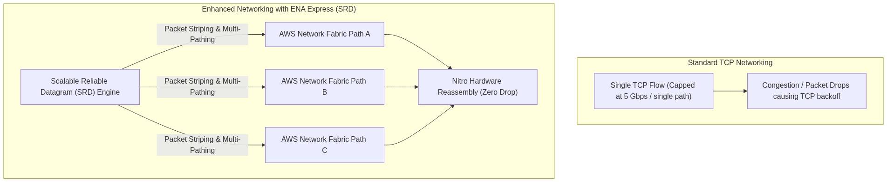
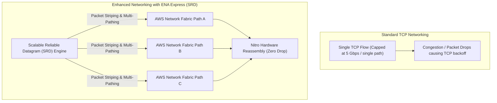

# Lab 3.3: Enhanced Networking & ENA Express (SRD Protocol)

## 📌 Lab Objectives
- Understand the evolution of **Enhanced Networking** on AWS: SR-IOV vs Elastic Network Adapter (ENA).
- Verify the **ENA Linux kernel driver module** and inspect hardware queue telemetry using `ethtool`.
- Configure **Jumbo Frames (MTU 9001)** for maximum throughput within a VPC.
- Configure and evaluate **ENA Express** powered by AWS **Scalable Reliable Datagram (SRD)** protocol to slash p99 tail latencies.

---

## 🏗️ Architecture Diagram



<details>
<summary>Click to expand Mermaid diagram source</summary>


<details>
<summary>Click to expand Mermaid diagram source</summary>


<details>
<summary>Click to expand Mermaid diagram source</summary>


</details>
</details>
</details>

---

## 💡 Key Architectural Concepts

1. **What is ENA?**:
   - The Elastic Network Adapter (ENA) uses Single Root I/O Virtualization (SR-IOV) to bypass the traditional hypervisor software switch, providing bare-metal PCIe network performance directly to the guest OS.
2. **ENA Express with AWS SRD**:
   - Standard TCP routes all packets of a connection across a single fixed path. If any switch is congested, jitter occurs.
   - **ENA Express** replaces hop-by-hop TCP with AWS SRD (developed for HPC): packets are striped across multiple dynamic paths through the AWS datacenter fabric and reassembled in hardware by Nitro cards, eliminating head-of-line blocking.
3. **MTU (Maximum Transmission Unit)**:
   - Default MTU is 1500 bytes (required for Internet traffic).
   - Within an AWS VPC or across VPC Peering, instances support **Jumbo Frames (MTU 9001)**, reducing CPU packet processing overhead by up to 6x.

---

## ⏱️ Prerequisites & Cost
- **AWS Free Tier Eligible**: Basic ENA verification works on `t3.micro`. ENA Express requires supported Nitro instance sizes (e.g. `c6i.large` or `m6i.large`).
- **Estimated Duration**: 15 minutes.

---

## 🚀 Step-by-Step Instructions

### Step 1: Launch an Instance and Verify ENA Support
Launch an instance with enhanced networking enabled by default:
```bash
export AWS_REGION=$(aws configure get region || echo "us-east-1")
export VPC_ID=$(aws ec2 describe-vpcs --filters "Name=isDefault,Values=true" --query "Vpcs[0].VpcId" --output text)
export SUBNET_ID=$(aws ec2 describe-subnets --filters "Name=vpc-id,Values=${VPC_ID}" --query "Subnets[0].SubnetId" --output text)

AMI_ID=$(aws ssm get-parameter \
  --name "/aws/service/ami-amazon-linux-latest/al2023-ami-kernel-default-x86_64" \
  --query "Parameter.Value" --output text)

INSTANCE_ID=$(aws ec2 run-instances \
  --image-id "${AMI_ID}" \
  --instance-type "t3.micro" \
  --subnet-id "${SUBNET_ID}" \
  --tag-specifications "ResourceType=instance,Tags=[{Key=Project,Value=ec2-master-labs},{Key=Name,Value=ena-network-node}]" \
  --query "Instances[0].InstanceId" --output text)

aws ec2 wait instance-running --instance-ids "${INSTANCE_ID}"
```

### Step 2: Query ENA Attribute via AWS CLI
Verify that `EnaSupport` is enabled on the instance:
```bash
aws ec2 describe-instances \
  --instance-ids "${INSTANCE_ID}" \
  --query "Reservations[0].Instances[0].EnaSupport" --output text
```
**Expected Output**: `True`

---

## 🔍 Verification & Driver Telemetry (Guest OS)

Connect to the instance via Session Manager or SSH:

### 1. Check ENA Kernel Driver
```bash
modinfo ena
```
Notice the author: `Amazon.com, Inc. or its affiliates` and the driver version.

### 2. Inspect Network Queue Statistics & Allowance Throttling
Query low-level driver statistics via `ethtool`:
```bash
ethtool -S eth0 | grep -E "queue|allowance|drop"
```
Key metrics to watch in production:
- `bw_in_allowance_exceeded`: Bandwidth inbound throttled by AWS hypervisor limit.
- `bw_out_allowance_exceeded`: Bandwidth outbound throttled.
- `pps_allowance_exceeded`: Packets per second throttled.
- `conntrack_allowance_exceeded`: Exceeded maximum active tracked connections in the Nitro security group engine.

### 3. Configure Jumbo Frames (MTU 9001)
Check current MTU:
```bash
ip link show eth0 | grep mtu
# <BROADCAST,MULTICAST,UP,LOWER_UP> mtu 9001 qdisc mq state UP ...
```
If MTU is 1500, set it to 9001:
```bash
sudo ip link set dev eth0 mtu 9001
```

### 4. Enable ENA Express (Supported Instances)
On instances supporting ENA Express (such as `c6i.large`), enable it at the network interface level:
```bash
# Example command for ENI:
# aws ec2 modify-network-interface-attribute \
#   --network-interface-id <ENI_ID> \
#   --ena-srd-specification "EnaSrdSupported=true,EnaSrdUdpSpecification={EnaSrdUdpSupported=true}"
```

---

## 🧹 Teardown & Clean-up

```bash
aws ec2 terminate-instances --instance-ids "${INSTANCE_ID}"
aws ec2 wait instance-terminated --instance-ids "${INSTANCE_ID}"
echo "Lab 3.3 clean-up completed successfully."
```
