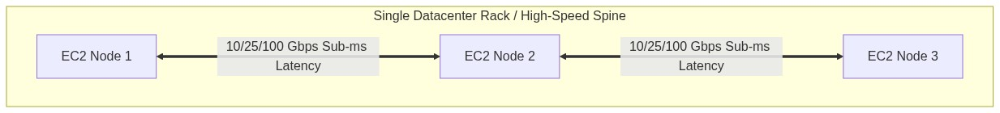
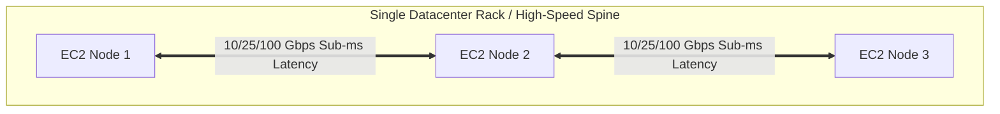
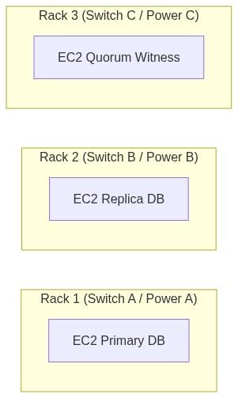
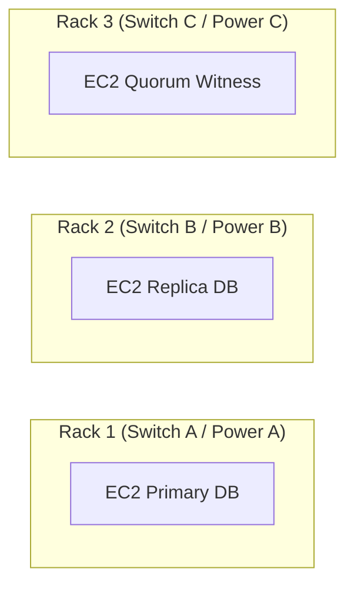
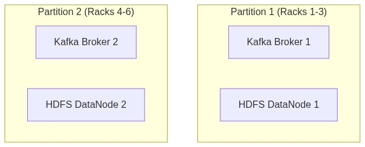
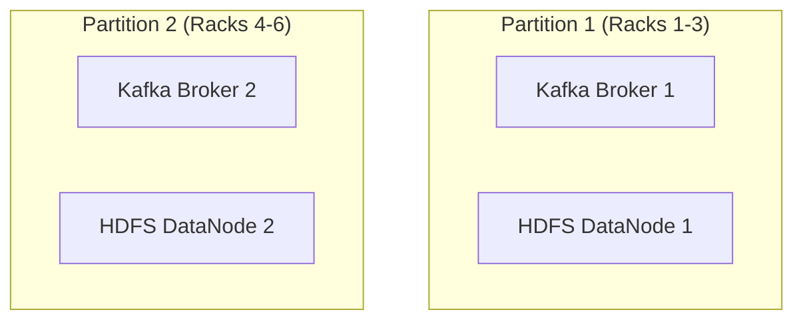

<div align="center">

# 🔬 Lab 3.4: EC2 Placement Groups (Cluster, Spread & Partition)

**[🏠 AWS Labs Root](../../../README.md)** &nbsp;•&nbsp; **[🖥️ EC2 Curriculum](../../README.md)** &nbsp;•&nbsp; **[📂 Module 03](../README.md)**

   

**[⬅️ Previous Lab](../../module-03-networking-eni-placement/lab-03-enhanced-networking-ena/README.md)** &nbsp;|&nbsp; **[➡️ Next Lab](../../module-04-security-iam-ssm/lab-01-security-groups-nacls/README.md)**


[](https://cyber-cloud-security.github.io/aws-labs/?lab=lab-04-placement-groups)

</div>

---

## 📌 Lab Objectives

- [x] Understand the physical hardware layout and architectural differences between **Cluster**, **Spread**, and **Partition** Placement Groups.
- [x] Create each placement group type using the AWS CLI.
- [x] Launch instances directly into placement groups and verify their physical rack and partition distribution.
- [x] Know the limitations, quotas, and rules (e.g., max 7 instances per AZ for Spread).

---

## 🏗️ Architecture Diagrams

### 1. Cluster Placement Group (Low Latency / High Throughput)


<details>
<summary>📐 <b>View Mermaid Architecture Source (Click to Expand)</b></summary>



</details>

### 2. Spread Placement Group (Strict Hardware Isolation)


<details>
<summary>📐 <b>View Mermaid Architecture Source (Click to Expand)</b></summary>



</details>

### 3. Partition Placement Group (Distributed Topologies)


<details>
<summary>📐 <b>View Mermaid Architecture Source (Click to Expand)</b></summary>



</details>

---

## 💡 Strategy Comparison Matrix

| Strategy | Scope | Primary Use Case | Hardware Separation Guarantee | Limits / Caveats |
| :--- | :--- | :--- | :--- | :--- |
| **`cluster`** | Single AZ | HPC, MPI, low-latency microservices, high-bandwidth workloads | None (instances are clustered tightly on same spine) | If launched gradually over time, may fail with `InsufficientInstanceCapacity` |
| **`spread`** | Multi-AZ or Single AZ | High-availability database clusters, quorum arbiters | Guaranteed distinct underlying rack, power, and switch | **Strict limit of 7 running instances per AZ** per group |
| **`partition`** | Multi-AZ or Single AZ | Kafka, Cassandra, Hadoop HDFS, distributed datastores | Partitions do not share racks with each other | Up to 7 partitions per AZ; partitions expose partition number to OS |

---

## ⏱️ Prerequisites & Cost

> [!TIP]
> **AWS Free Tier & Cost Guardrail**
> - **AWS Free Tier Eligible**: Yes (`t3.micro`).
> - **Estimated Duration**: 15 minutes.

---

## 🚀 Step-by-Step Instructions

### Step 1: Create Placement Groups for Each Strategy
```bash
export AWS_REGION=$(aws configure get region || echo "us-east-1")

# 1. Cluster Placement Group
aws ec2 create-placement-group \
  --group-name "pg-hpc-cluster" \
  --strategy "cluster" \
  --tag-specifications "ResourceType=placement-group,Tags=[{Key=Project,Value=ec2-master-labs}]"

# 2. Spread Placement Group
aws ec2 create-placement-group \
  --group-name "pg-ha-spread" \
  --strategy "spread" \
  --spread-level "rack" \
  --tag-specifications "ResourceType=placement-group,Tags=[{Key=Project,Value=ec2-master-labs}]"

# 3. Partition Placement Group (3 partitions)
aws ec2 create-placement-group \
  --group-name "pg-kafka-partition" \
  --strategy "partition" \
  --partition-count 3 \
  --tag-specifications "ResourceType=placement-group,Tags=[{Key=Project,Value=ec2-master-labs}]"

echo "Created Cluster, Spread, and Partition placement groups."
```

### Step 2: Launch Instances into the Spread Placement Group
```bash
AMI_ID=$(aws ssm get-parameter \
  --name "/aws/service/ami-amazon-linux-latest/al2023-ami-kernel-default-x86_64" \
  --query "Parameter.Value" --output text)

VPC_ID=$(aws ec2 describe-vpcs \
  --filters "Name=isDefault,Values=true" \
  --query "Vpcs[0].VpcId" \
  --output text)
SUBNET_ID=$(aws ec2 describe-subnets \
  --filters "Name=vpc-id,Values=${VPC_ID}" \
  --query "Subnets[0].SubnetId" \
  --output text)

# Launch 2 instances guaranteed to sit on separate physical server racks
INSTANCE_IDS=$(aws ec2 run-instances \
  --image-id "${AMI_ID}" \
  --instance-type "t3.micro" \
  --subnet-id "${SUBNET_ID}" \
  --count 2 \
  --placement "GroupName=pg-ha-spread" \
  --tag-specifications "ResourceType=instance,Tags=[{Key=Project,Value=ec2-master-labs},{Key=Name,Value=spread-node}]" \
  --query "Instances[*].InstanceId" --output text)

echo "Launched instances in Spread Placement Group: ${INSTANCE_IDS}"
```

---

## 🔍 Verification & Inspection

Inspect the placement details of the running instances:
```bash
aws ec2 describe-instances \
  --instance-ids ${INSTANCE_IDS} \
  --query "Reservations[*].Instances[*].[InstanceId,Placement.GroupName,Placement.AvailabilityZone]" \
  --output table
```
Both instances run in the same AZ under `pg-ha-spread`, but AWS guarantees they are hosted on physically separate server racks and power circuits.

---

## 🧹 Teardown & Clean-up

> [!NOTE]
> A placement group cannot be deleted until all instances inside it are terminated and reached the `terminated` state.

```bash
# 1. Terminate instances
aws ec2 terminate-instances --instance-ids ${INSTANCE_IDS}
aws ec2 wait instance-terminated --instance-ids ${INSTANCE_IDS}

# 2. Delete placement groups
aws ec2 delete-placement-group --group-name "pg-hpc-cluster"
aws ec2 delete-placement-group --group-name "pg-ha-spread"
aws ec2 delete-placement-group --group-name "pg-kafka-partition"

echo "Lab 3.4 clean-up completed successfully."
```

---

<div align="center">

**[⬅️ Previous Lab](../../module-03-networking-eni-placement/lab-03-enhanced-networking-ena/README.md)** &nbsp;•&nbsp; **[⬆️ Back to Module 03](../README.md)** &nbsp;•&nbsp; **[🏠 EC2 Index](../../README.md)** &nbsp;•&nbsp; **[➡️ Next Lab](../../module-04-security-iam-ssm/lab-01-security-groups-nacls/README.md)**

</div>
