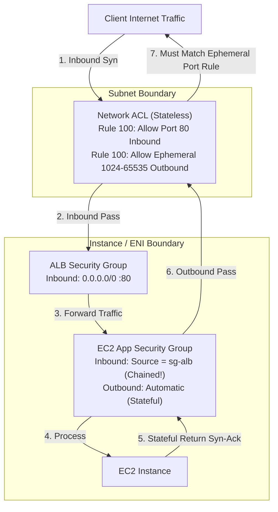

<div align="center">

# 🔬 Lab 4.1: Security Groups vs Network ACLs (Stateless vs Stateful Deep Dive)

**[🏠 AWS Labs Root](../../../README.md)** &nbsp;•&nbsp; **[🖥️ EC2 Curriculum](../../README.md)** &nbsp;•&nbsp; **[📂 Module 04](../README.md)**

   

**[⬅️ Previous Lab](../../module-03-networking-eni-placement/lab-04-placement-groups/README.md)** &nbsp;|&nbsp; **[➡️ Next Lab](../../module-04-security-iam-ssm/lab-02-iam-roles-instance-profiles/README.md)**


[](https://cyber-cloud-security.github.io/aws-labs/?lab=lab-01-security-groups-nacls)

</div>

---

## 📌 Lab Objectives

- [x] Understand the technical differences between **Security Groups (stateful)** and **Network Access Control Lists (stateless)**.
- [x] Implement **Security Group Chaining** (referencing SG IDs as traffic sources instead of IP CIDRs).
- [x] Configure a custom **NACL** with numbered allow/deny rules and understand why **ephemeral return ports (1024–65535)** are required for stateless inspection.
- [x] Diagnose dropped packets and firewall misconfigurations.

---

## 🏗️ Architecture Diagram


<details>
<summary>📐 <b>View Mermaid Architecture Source (Click to Expand)</b></summary>



</details>

---

## 💡 Comparison Matrix: Stateful vs Stateless

| Feature | Security Group | Network ACL (NACL) |
| :--- | :--- | :--- |
| **Operates At** | Instance / ENI level | Subnet boundary |
| **State Tracking** | **Stateful**: Return traffic is automatically allowed regardless of inbound rules | **Stateless**: Inbound and outbound traffic must be explicitly permitted |
| **Rule Types** | **ALLOW rules only** (implicit deny all) | **ALLOW and DENY rules** |
| **Rule Order** | Evaluates all rules simultaneously | Evaluated in numerical order (lowest number first) |
| **Source Specification** | CIDR blocks, Prefix Lists, or other **Security Group IDs** | CIDR blocks only (cannot reference SGs) |
| **Return Traffic Requirement** | None (conntrack handles responses) | Outbound rules **must allow ephemeral ports** (`1024-65535`) |

---

## ⏱️ Prerequisites & Cost

> [!TIP]
> **AWS Free Tier & Cost Guardrail**
> - **AWS Free Tier Eligible**: Yes (`t3.micro`).
> - **Estimated Duration**: 20 minutes.

---

## 🚀 Step-by-Step Instructions

### Step 1: Create Two Chained Security Groups
We will create a Tier-1 "Bastion/Proxy" SG and a Tier-2 "Application" SG:
```bash
export AWS_REGION=$(aws configure get region || echo "us-east-1")
export VPC_ID=$(aws ec2 describe-vpcs \
  --filters "Name=isDefault,Values=true" \
  --query "Vpcs[0].VpcId" \
  --output text)

# 1. Front-end SG
FRONTEND_SG=$(aws ec2 create-security-group \
  --group-name "sg-frontend-lb" \
  --description "Simulated Load Balancer / Proxy SG" \
  --vpc-id "${VPC_ID}" \
  --query "GroupId" --output text)

# 2. Back-end SG
BACKEND_SG=$(aws ec2 create-security-group \
  --group-name "sg-backend-app" \
  --description "Application Backend SG" \
  --vpc-id "${VPC_ID}" \
  --query "GroupId" --output text)

# Allow HTTP from 0.0.0.0/0 to FRONTEND_SG
aws ec2 authorize-security-group-ingress \
  --group-id "${FRONTEND_SG}" \
  --protocol tcp \
  --port 80 \
  --cidr 0.0.0.0/0

# CHAINING: Authorize BACKEND_SG to accept traffic ONLY from FRONTEND_SG ID
aws ec2 authorize-security-group-ingress \
  --group-id "${BACKEND_SG}" \
  --protocol tcp \
  --port 80 \
  --source-group "${FRONTEND_SG}"

echo "Configured SG Chaining: ${BACKEND_SG} only trusts ${FRONTEND_SG}"
```

### Step 2: Create a Custom Network ACL & Understand Stateless Ephemeral Ports
Create a NACL:
```bash
NACL_ID=$(aws ec2 create-network-acl \
  --vpc-id "${VPC_ID}" \
  --tag-specifications "ResourceType=network-acl,Tags=[{Key=Project,Value=ec2-master-labs},{Key=Name,Value=demo-nacl}]" \
  --query "NetworkAcl.NetworkAclId" --output text)

echo "Created NACL: ${NACL_ID}"
```

Add Inbound Rule 100 allowing Port 80:
```bash
aws ec2 create-network-acl-entry \
  --network-acl-id "${NACL_ID}" \
  --rule-number 100 \
  --protocol 6 \
  --rule-action allow \
  --ingress \
  --cidr-block 0.0.0.0/0 \
  --port-range From=80,To=80
```

> [!IMPORTANT]
> **The Ephemeral Port Catch**: If you stop here, all inbound HTTP requests to instances in this subnet will **TIMEOUT**!
> Because NACLs are stateless, when the server sends the HTTP response packet back to the client, the client's destination port is a random ephemeral port (e.g., 52341).
> You must create an outbound NACL rule for ports **1024–65535**:

Add Outbound Rule 100 for Ephemeral Ports:
```bash
aws ec2 create-network-acl-entry \
  --network-acl-id "${NACL_ID}" \
  --rule-number 100 \
  --protocol 6 \
  --rule-action allow \
  --egress \
  --cidr-block 0.0.0.0/0 \
  --port-range From=1024,To=65535

echo "NACL configured with stateless inbound :80 and outbound ephemeral :1024-65535."
```

---

## 🔍 Verification & Testing

Inspect the rules of both components:
```bash
# Verify Security Group rules:
aws ec2 describe-security-group-rules \
  --filters "Name=group-id,Values=${BACKEND_SG}" \
  --query "SecurityGroupRules[*].[GroupId,IsEgress,IpProtocol,FromPort,ToPort,ReferencedGroupInfo.GroupId]" \
  --output table

# Verify NACL rules:
aws ec2 describe-network-acls \
  --network-acl-ids "${NACL_ID}" \
  --query "NetworkAcls[0].Entries[*].[RuleNumber,RuleAction,Egress,Protocol,CidrBlock,PortRange]" \
  --output table
```

---

## 🧹 Teardown & Clean-up


> [!CAUTION]
> **Always Tear Down Lab Resources**: Execute the cleanup commands below immediately after completing the verification steps to prevent unintended AWS billing.

```bash
# 1. Delete NACL
aws ec2 delete-network-acl --network-acl-id "${NACL_ID}"

# 2. Delete Security Groups (must delete ingress rule before deleting referenced SG)
aws ec2 revoke-security-group-ingress \
  --group-id "${BACKEND_SG}" \
  --protocol tcp \
  --port 80 \
  --source-group "${FRONTEND_SG}"

aws ec2 delete-security-group --group-id "${BACKEND_SG}"
aws ec2 delete-security-group --group-id "${FRONTEND_SG}"

echo "Lab 4.1 clean-up completed successfully."
```

---

<div align="center">

**[⬅️ Previous Lab](../../module-03-networking-eni-placement/lab-04-placement-groups/README.md)** &nbsp;•&nbsp; **[⬆️ Back to Module 04](../README.md)** &nbsp;•&nbsp; **[🏠 EC2 Index](../../README.md)** &nbsp;•&nbsp; **[➡️ Next Lab](../../module-04-security-iam-ssm/lab-02-iam-roles-instance-profiles/README.md)**

</div>
