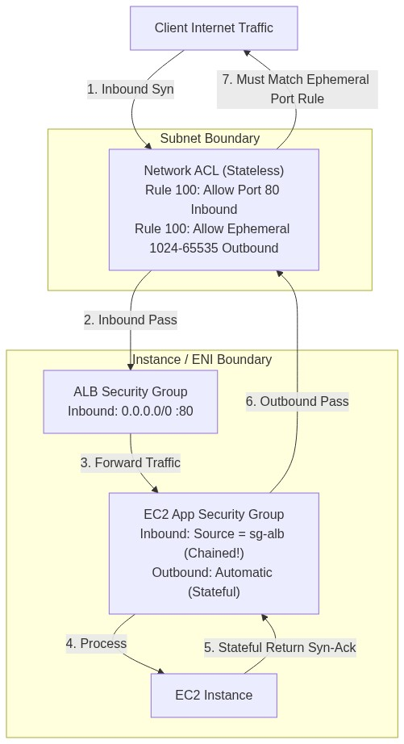
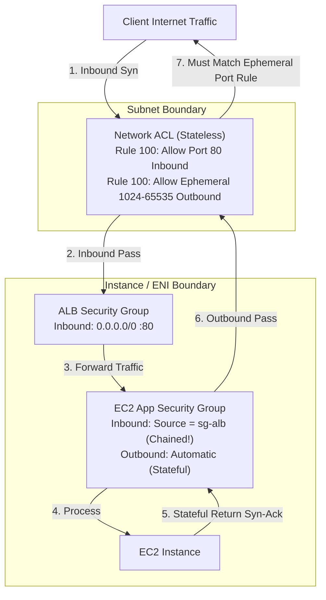

<div align="center">

# 🔬 Lab 4.1: Security Groups vs Network ACLs (Stateless vs Stateful Deep Dive)

**[🏠 AWS Labs Root](../../../README.md)** &nbsp;•&nbsp; **[🖥️ EC2 Curriculum](../../README.md)** &nbsp;•&nbsp; **[📂 Module 04](../README.md)**

   

**[⬅️ Previous Lab](../../module-03-networking-eni-placement/lab-04-placement-groups/README.md)** &nbsp;|&nbsp; **[➡️ Next Lab](../../module-04-security-iam-ssm/lab-02-iam-roles-instance-profiles/README.md)**

</div>

---

## 📌 Lab Objectives

- [x] Understand the technical differences between **Security Groups (stateful)** and **Network Access Control Lists (stateless)**.
- [x] Implement **Security Group Chaining** (referencing SG IDs as traffic sources instead of IP CIDRs).
- [x] Configure a custom **NACL** with numbered allow/deny rules and understand why **ephemeral return ports (1024–65535)** are required for stateless inspection.
- [x] Diagnose dropped packets and firewall misconfigurations.

---

## 🏗️ Architecture Diagram



<details>
<summary>📐 <b>View Mermaid Architecture Source (Click to Expand)</b></summary>



</details>

---

## 💡 Comparison Matrix: Stateful vs Stateless

| Feature | Security Group | Network ACL (NACL) |
| :--- | :--- | :--- |
| **Operates At** | Instance / ENI level | Subnet boundary |
| **State Tracking** | **Stateful**: Return traffic is automatically allowed regardless of inbound rules | **Stateless**: Inbound and outbound traffic must be explicitly permitted |
| **Rule Types** | **ALLOW rules only** (implicit deny all) | **ALLOW and DENY rules** |
| **Rule Order** | Evaluates all rules simultaneously | Evaluated in numerical order (lowest number first) |
| **Source Specification** | CIDR blocks, Prefix Lists, or other **Security Group IDs** | CIDR blocks only (cannot reference SGs) |
| **Return Traffic Requirement** | None (conntrack handles responses) | Outbound rules **must allow ephemeral ports** (`1024-65535`) |

---

## ⏱️ Prerequisites & Cost

> [!TIP]
> **AWS Free Tier & Cost Guardrail**
> - **AWS Free Tier Eligible**: Yes (`t3.micro`).
> - **Estimated Duration**: 20 minutes.

---

## 🚀 Step-by-Step Instructions

### Step 1: Create Two Chained Security Groups
We will create a Tier-1 "Bastion/Proxy" SG and a Tier-2 "Application" SG:
```bash
export AWS_REGION=$(aws configure get region || echo "us-east-1")
export VPC_ID=$(aws ec2 describe-vpcs \
  --filters "Name=isDefault,Values=true" \
  --query "Vpcs[0].VpcId" \
  --output text)

# 1. Front-end SG
FRONTEND_SG=$(aws ec2 create-security-group \
  --group-name "sg-frontend-lb" \
  --description "Simulated Load Balancer / Proxy SG" \
  --vpc-id "${VPC_ID}" \
  --query "GroupId" --output text)

# 2. Back-end SG
BACKEND_SG=$(aws ec2 create-security-group \
  --group-name "sg-backend-app" \
  --description "Application Backend SG" \
  --vpc-id "${VPC_ID}" \
  --query "GroupId" --output text)

# Allow HTTP from 0.0.0.0/0 to FRONTEND_SG
aws ec2 authorize-security-group-ingress \
  --group-id "${FRONTEND_SG}" \
  --protocol tcp \
  --port 80 \
  --cidr 0.0.0.0/0

# CHAINING: Authorize BACKEND_SG to accept traffic ONLY from FRONTEND_SG ID
aws ec2 authorize-security-group-ingress \
  --group-id "${BACKEND_SG}" \
  --protocol tcp \
  --port 80 \
  --source-group "${FRONTEND_SG}"

echo "Configured SG Chaining: ${BACKEND_SG} only trusts ${FRONTEND_SG}"
```

### Step 2: Create a Custom Network ACL & Understand Stateless Ephemeral Ports
Create a NACL:
```bash
NACL_ID=$(aws ec2 create-network-acl \
  --vpc-id "${VPC_ID}" \
  --tag-specifications "ResourceType=network-acl,Tags=[{Key=Project,Value=ec2-master-labs},{Key=Name,Value=demo-nacl}]" \
  --query "NetworkAcl.NetworkAclId" --output text)

echo "Created NACL: ${NACL_ID}"
```

Add Inbound Rule 100 allowing Port 80:
```bash
aws ec2 create-network-acl-entry \
  --network-acl-id "${NACL_ID}" \
  --rule-number 100 \
  --protocol 6 \
  --rule-action allow \
  --ingress \
  --cidr-block 0.0.0.0/0 \
  --port-range From=80,To=80
```

> [!IMPORTANT]
> **The Ephemeral Port Catch**: If you stop here, all inbound HTTP requests to instances in this subnet will **TIMEOUT**!
> Because NACLs are stateless, when the server sends the HTTP response packet back to the client, the client's destination port is a random ephemeral port (e.g., 52341).
> You must create an outbound NACL rule for ports **1024–65535**:

Add Outbound Rule 100 for Ephemeral Ports:
```bash
aws ec2 create-network-acl-entry \
  --network-acl-id "${NACL_ID}" \
  --rule-number 100 \
  --protocol 6 \
  --rule-action allow \
  --egress \
  --cidr-block 0.0.0.0/0 \
  --port-range From=1024,To=65535

echo "NACL configured with stateless inbound :80 and outbound ephemeral :1024-65535."
```

---

## 🔍 Verification & Testing

Inspect the rules of both components:
```bash
# Verify Security Group rules:
aws ec2 describe-security-group-rules \
  --filters "Name=group-id,Values=${BACKEND_SG}" \
  --query "SecurityGroupRules[*].[GroupId,IsEgress,IpProtocol,FromPort,ToPort,ReferencedGroupInfo.GroupId]" \
  --output table

# Verify NACL rules:
aws ec2 describe-network-acls \
  --network-acl-ids "${NACL_ID}" \
  --query "NetworkAcls[0].Entries[*].[RuleNumber,RuleAction,Egress,Protocol,CidrBlock,PortRange]" \
  --output table
```

---

## 📘 Deep-Dive Command & Flag Reference

> [!TIP]
> **Line-by-Line Production Analysis**: Every command executed in this lab is dissected below, explaining each CLI flag, JMESPath query, Linux kernel parameter, and why it is critical in production automation.

<details open>
<summary>📘 <b>Command 1: Implementing Security Group Chaining (Referencing Source Groups)</b></summary>

```bash
aws ec2 authorize-security-group-ingress \
  --group-id "${BACKEND_SG}" \
  --protocol tcp \
  --port 80 \
  --source-group "${FRONTEND_SG}"
```

#### 🔍 Parameter & Component Breakdown

- **`aws ec2 authorize-security-group-ingress`** — Appends an inbound firewall rule to the backend security group.

- **`--source-group "${FRONTEND_SG}"` (Security Group Chaining)** — Instead of specifying a static IP CIDR block (like `172.31.1.0/24`), this rule specifies another **Security Group ID** as the source of traffic.
  - **How it works** — The AWS hypervisor continuously tracks the private IP addresses of all ENIs attached to `FRONTEND_SG`. Any instance bearing `FRONTEND_SG` is dynamically permitted to communicate with `BACKEND_SG` on port 80.
  - If 50 new frontend instances are added by an Auto Scaling Group, their traffic is automatically authorized with zero rule modifications.

> 🏭 **Why This Matters in Production Automation**
> Security Group Chaining is the cornerstone of tiered enterprise architectures (e.g. ALB -> Web Tier -> App Tier -> Database Tier). It completely eliminates the administrative nightmare of manually updating IP allowlists when instances scale up and down, while preventing rogue instances in the same subnet from accessing protected databases.

</details>

<details open>
<summary>📘 <b>Command 2: Creating a Custom Network ACL (NACL)</b></summary>

```bash
NACL_ID=$(aws ec2 create-network-acl \
  --vpc-id "${VPC_ID}" \
  --tag-specifications "ResourceType=network-acl,Tags=[{Key=Project,Value=ec2-master-labs},{Key=Name,Value=demo-nacl}]" \
  --query "NetworkAcl.NetworkAclId" --output text)
```

#### 🔍 Parameter & Component Breakdown

- **`aws ec2 create-network-acl`** — Provisions a **stateless, subnet-level firewall**.
  - Security Groups operate at the individual instance/ENI layer.
  - Network ACLs operate at the **subnet boundary**. Any packet entering or leaving the subnet must traverse the NACL before it ever reaches a security group.

- **Default NACL Rules** — A custom NACL is created with a default deny-all rule (`*`) for both inbound and outbound traffic.

> 🏭 **Why This Matters in Production Automation**
> NACLs provide coarse-grained subnet isolation and can be used to set explicit **DENY** rules (e.g. blocking known malicious IP blocks, subnets compromised by malware, or DDoS botnets) before packets consume compute cycles on EC2 instances.

</details>

<details open>
<summary>📘 <b>Command 3: Adding Inbound NACL Rule for HTTP</b></summary>

```bash
aws ec2 create-network-acl-entry \
  --network-acl-id "${NACL_ID}" \
  --rule-number 100 \
  --protocol 6 \
  --rule-action allow \
  --ingress \
  --cidr-block 0.0.0.0/0 \
  --port-range From=80,To=80
```

#### 🔍 Parameter & Component Breakdown

- **`aws ec2 create-network-acl-entry`** — Appends a numbered rule entry to the NACL table.

- **`--rule-number 100`** — Rules are evaluated in strict numerical order (lowest number first). Once a packet matches a rule (e.g. Rule 100 ALLOW), evaluation halts immediately; subsequent rules are ignored.

- **`--protocol 6`** — The IANA protocol number for TCP (`6` = TCP, `17` = UDP, `1` = ICMP).

- **`--rule-action allow`** — Unlike Security Groups (which only support ALLOW), NACLs support both `allow` and `deny`.

- **`--ingress`** — Applies this rule to inbound packets entering the subnet from outside.

> 🏭 **Why This Matters in Production Automation**
> Using increments of 10 or 100 (e.g. 100, 110, 120) for rule numbers is standard practice. It allows future automation scripts to inject high-priority DENY rules (e.g. Rule 50 DENY malicious IP) above general ALLOW rules without renumbering the entire firewall policy.

</details>

<details open>
<summary>📘 <b>Command 4: Adding Outbound Ephemeral Port Rule (Stateless Requirement)</b></summary>

```bash
aws ec2 create-network-acl-entry \
  --network-acl-id "${NACL_ID}" \
  --rule-number 100 \
  --protocol 6 \
  --rule-action allow \
  --egress \
  --cidr-block 0.0.0.0/0 \
  --port-range From=1024,To=65535
```

#### 🔍 Parameter & Component Breakdown

- **The Stateless Catch** — Security Groups are **stateful**—if traffic is allowed inbound on port 80, the return response is automatically permitted back out.
Network ACLs are **stateless**—they have zero connection tracking memory. Every outbound packet is inspected independently against the egress rule table.

- **`--egress`** — Applies to packets departing the subnet.

- **`--port-range From=1024,To=65535` (Ephemeral Ports)** — When a client (e.g. web browser) connects to port 80, the client's operating system chooses a random high port between **1024 and 65535** as its source port. When the web server sends the HTTP response, the destination port is that random client port.
**If egress ports 1024–65535 are not explicitly permitted in the NACL, all inbound HTTP requests will timeout!**

> 🏭 **Why This Matters in Production Automation**
> Forgetting the ephemeral return rule is the #1 troubleshooting failure when working with AWS NACLs. Engineering teams must ensure that subnets hosting web servers or Lambda functions in VPCs permit outbound ephemeral traffic to allow TCP handshakes to complete.

</details>

<details open>
<summary>📘 <b>Command 5: Ordered Deletion of Chained Security Groups</b></summary>

```bash
# 1. Revoke the ingress rule referencing the frontend SG
aws ec2 revoke-security-group-ingress \
  --group-id "${BACKEND_SG}" \
  --protocol tcp \
  --port 80 \
  --source-group "${FRONTEND_SG}"

# 2. Delete the groups
aws ec2 delete-security-group --group-id "${BACKEND_SG}"
aws ec2 delete-security-group --group-id "${FRONTEND_SG}"
```

#### 🔍 Parameter & Component Breakdown

- **The Chained Dependency Lock** — If you attempt to delete `FRONTEND_SG` while `BACKEND_SG` still contains an ingress rule referencing it, the AWS API will reject the command with a `DependencyViolation` error. You must explicitly call `revoke-security-group-ingress` to unlink the relationship before deleting either security group.

> 🏭 **Why This Matters in Production Automation**
> Automated destruction scripts must tear down security relationships in reverse order of creation, ensuring zero orphan locks or hung CI/CD teardown jobs.

</details>

---

## 🧹 Teardown & Clean-up


> [!CAUTION]
> **Always Tear Down Lab Resources**: Execute the cleanup commands below immediately after completing the verification steps to prevent unintended AWS billing.

```bash
# 1. Delete NACL
aws ec2 delete-network-acl --network-acl-id "${NACL_ID}"

# 2. Delete Security Groups (must delete ingress rule before deleting referenced SG)
aws ec2 revoke-security-group-ingress \
  --group-id "${BACKEND_SG}" \
  --protocol tcp \
  --port 80 \
  --source-group "${FRONTEND_SG}"

aws ec2 delete-security-group --group-id "${BACKEND_SG}"
aws ec2 delete-security-group --group-id "${FRONTEND_SG}"

echo "Lab 4.1 clean-up completed successfully."
```

---

<div align="center">

**[⬅️ Previous Lab](../../module-03-networking-eni-placement/lab-04-placement-groups/README.md)** &nbsp;•&nbsp; **[⬆️ Back to Module 04](../README.md)** &nbsp;•&nbsp; **[🏠 EC2 Index](../../README.md)** &nbsp;•&nbsp; **[➡️ Next Lab](../../module-04-security-iam-ssm/lab-02-iam-roles-instance-profiles/README.md)**

</div>
