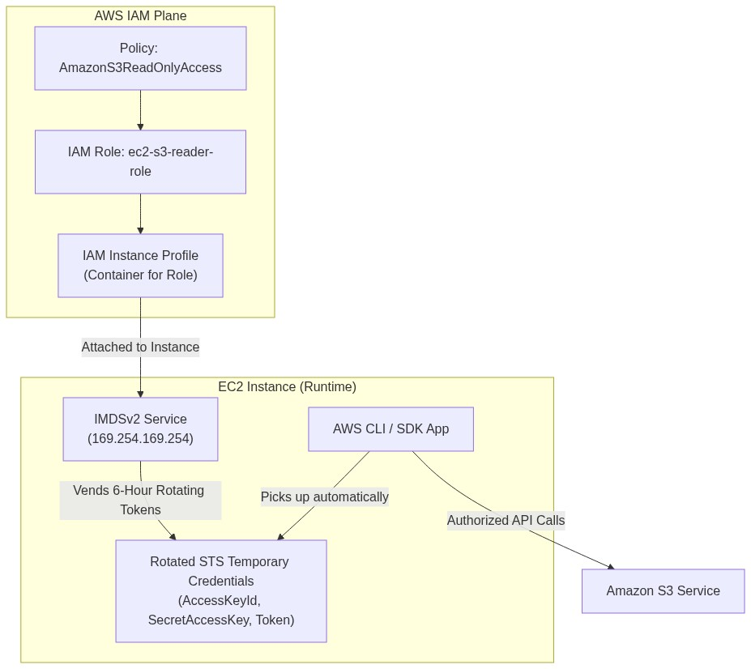
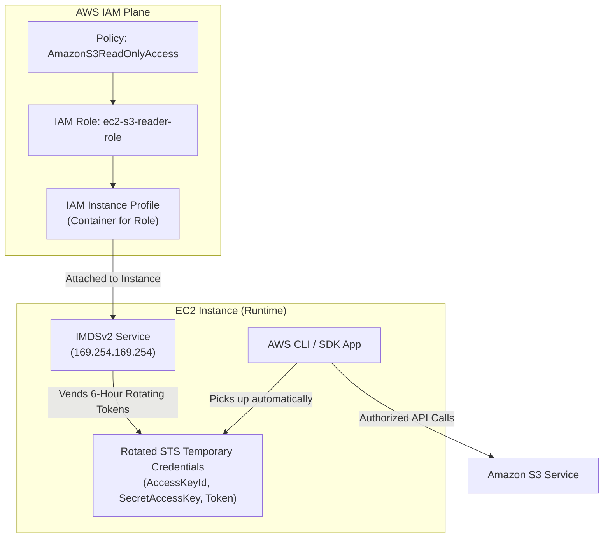

<div align="center">

# 🔬 Lab 4.2: IAM Roles & Instance Profiles (Zero-Credential Architecture)

**[🏠 AWS Labs Root](../../../README.md)** &nbsp;•&nbsp; **[🖥️ EC2 Curriculum](../../README.md)** &nbsp;•&nbsp; **[📂 Module 04](../README.md)**

   

**[⬅️ Previous Lab](../../module-04-security-iam-ssm/lab-01-security-groups-nacls/README.md)** &nbsp;|&nbsp; **[➡️ Next Lab](../../module-04-security-iam-ssm/lab-03-imdsv2-hardening/README.md)**

</div>

---

## 📌 Lab Objectives

- [x] Implement the **Zero-Credential Security Architecture**: completely eliminate static AWS access keys on EC2 instances.
- [x] Construct an IAM Role with an `ec2.amazonaws.com` assume-role trust policy.
- [x] Package the IAM Role into an **Instance Profile** and attach it to an active, running EC2 instance with zero downtime.
- [x] Inspect how the EC2 instance automatically rotates and manages temporary **AWS STS credentials** via IMDSv2.

---

## 🏗️ Architecture Diagram



<details>
<summary>📐 <b>View Mermaid Architecture Source (Click to Expand)</b></summary>



</details>

---

## 💡 Key Architectural Concepts

1. **Why Instance Profiles?**:
   - In IAM, an IAM Role defines *permissions* and *trust*. However, EC2 API calls require an **Instance Profile**, which acts as a bridge or wrapper around the IAM Role specifically for EC2.
2. **Automatic Credential Rotation**:
   - The AWS SDK and AWS CLI automatically query the local IMDS endpoint for fresh temporary credentials issued by AWS Security Token Service (STS). They rotate ~15 minutes before expiry without application interruption.
3. **Hot-Swapping Instance Profiles**:
   - You do not need to restart or terminate an EC2 instance to attach, detach, or replace its IAM instance profile (`aws ec2 associate-iam-instance-profile`).

---

## ⏱️ Prerequisites & Cost

> [!TIP]
> **AWS Free Tier & Cost Guardrail**
> - **AWS Free Tier Eligible**: Yes (`t3.micro`).
> - **Estimated Duration**: 15 minutes.

---

## 🚀 Step-by-Step Instructions

### Step 1: Create the IAM Role and Trust Policy
```bash
cat <<JSON > ec2-trust-policy.json
{
  "Version": "2012-10-17",
  "Statement": [
    {
      "Effect": "Allow",
      "Principal": { "Service": "ec2.amazonaws.com" },
      "Action": "sts:AssumeRole"
    }
  ]
}
JSON

aws iam create-role \
  --role-name "ec2-labs-s3-reader-role" \
  --assume-role-policy-document file://ec2-trust-policy.json

# Attach S3 Read Only Policy
aws iam attach-role-policy \
  --role-name "ec2-labs-s3-reader-role" \
  --policy-arn "arn:aws:iam::aws:policy/AmazonS3ReadOnlyAccess"
```

### Step 2: Create the IAM Instance Profile & Add the Role
```bash
# 1. Create Instance Profile
aws iam create-instance-profile \
  --instance-profile-name "ec2-labs-s3-reader-profile"

# 2. Add Role to Instance Profile
aws iam add-role-to-instance-profile \
  --instance-profile-name "ec2-labs-s3-reader-profile" \
  --role-name "ec2-labs-s3-reader-role"

echo "Created and populated Instance Profile."
# Sleep 10s for IAM propagation
sleep 10
```

### Step 3: Launch an EC2 Instance Without Keys or Profile
```bash
export AWS_REGION=$(aws configure get region || echo "us-east-1")
export VPC_ID=$(aws ec2 describe-vpcs \
  --filters "Name=isDefault,Values=true" \
  --query "Vpcs[0].VpcId" \
  --output text)
export SUBNET_ID=$(aws ec2 describe-subnets \
  --filters "Name=vpc-id,Values=${VPC_ID}" \
  --query "Subnets[0].SubnetId" \
  --output text)

AMI_ID=$(aws ssm get-parameter \
  --name "/aws/service/ami-amazon-linux-latest/al2023-ami-kernel-default-x86_64" \
  --query "Parameter.Value" --output text)

INSTANCE_ID=$(aws ec2 run-instances \
  --image-id "${AMI_ID}" \
  --instance-type "t3.micro" \
  --subnet-id "${SUBNET_ID}" \
  --tag-specifications "ResourceType=instance,Tags=[{Key=Project,Value=ec2-master-labs},{Key=Name,Value=iam-role-demo}]" \
  --query "Instances[0].InstanceId" --output text)

aws ec2 wait instance-running --instance-ids "${INSTANCE_ID}"
```

### Step 4: Attach the Instance Profile Live
Attach the instance profile to the already running instance:
```bash
ASSOC_ID=$(aws ec2 associate-iam-instance-profile \
  --instance-id "${INSTANCE_ID}" \
  --iam-instance-profile "Name=ec2-labs-s3-reader-profile" \
  --query "IamInstanceProfileAssociation.AssociationId" --output text)

echo "Associated Instance Profile Live! Association ID: ${ASSOC_ID}"
```

---

## 🔍 Verification & Testing

### 1. Inspect Temporary STS Credentials via IMDSv2
Connect to the instance and execute:
```bash
TOKEN=$(curl -s -X PUT "http://169.254.169.254/latest/api/token" -H "X-aws-ec2-metadata-token-ttl-seconds: 21600")

# Fetch IAM Role credentials:
curl -s -H "X-aws-ec2-metadata-token: $TOKEN" \
  http://169.254.169.254/latest/meta-data/iam/security-credentials/ec2-labs-s3-reader-role
```
**Sample Output**:
```json
{
  "Code": "Success",
  "LastUpdated": "2026-09-18T01:30:00Z",
  "Type": "AWS-HMAC",
  "AccessKeyId": "ASIAEXAMPLEKEYID...",
  "SecretAccessKey": "wJalrXUtnFEMI/K7MDENG/bPxRfiCYEXAMPLEKEY",
  "Token": "IQoJb3JpZ2luX2VjE...",
  "Expiration": "2026-09-18T07:30:00Z"
}
```

### 2. Run AWS S3 Commands Without Hardcoded Config
From within the instance:
```bash
aws s3 ls
```
The command succeeds immediately using the IAM role credentials with zero configuration files in `~/.aws/`!

---

## 📘 Deep-Dive Command & Flag Reference

> [!TIP]
> **Line-by-Line Production Analysis**: Every command executed in this lab is dissected below, explaining each CLI flag, JMESPath query, Linux kernel parameter, and why it is critical in production automation.

<details open>
<summary>📘 <b>Command 1: Creating an IAM Role with an EC2 Trust Policy</b></summary>

```bash
aws iam create-role \
  --role-name "ec2-labs-s3-reader-role" \
  --assume-role-policy-document file://ec2-trust-policy.json
```

#### 🔍 Parameter & Component Breakdown

- **`aws iam create-role`** — Provisions a global IAM Role entity within your AWS account.

- **`--assume-role-policy-document file://ec2-trust-policy.json`** — Defines the **Trust Relationship (Trust Policy)**:
```json
{
  "Version": "2012-10-17",
  "Statement": [{
    "Effect": "Allow",
    "Principal": { "Service": "ec2.amazonaws.com" },
    "Action": "sts:AssumeRole"
  }]
}
```
  - **`Principal: { "Service": "ec2.amazonaws.com" }`** — Specifies that only the Amazon EC2 compute service is permitted to assume this identity.
  - **`Action: "sts:AssumeRole"`** — Grants the EC2 control plane permission to call the AWS Security Token Service (STS) on behalf of this role.

> 🏭 **Why This Matters in Production Automation**
> An IAM Role cannot be used by an EC2 instance unless the trust policy explicitly names `ec2.amazonaws.com`. Without this trust policy, AWS Security Token Service will reject credential generation requests.

</details>

<details open>
<summary>📘 <b>Command 2: Bridging the IAM Role into an EC2 Instance Profile</b></summary>

```bash
# 1. Create the Instance Profile container
aws iam create-instance-profile \
  --instance-profile-name "ec2-labs-s3-reader-profile"

# 2. Add the IAM Role into the Instance Profile container
aws iam add-role-to-instance-profile \
  --instance-profile-name "ec2-labs-s3-reader-profile" \
  --role-name "ec2-labs-s3-reader-role"
```

#### 🔍 Parameter & Component Breakdown

- **What is an Instance Profile?** — In AWS Identity and Access Management, an **IAM Role** is a pure policy construct. However, the EC2 service requires a physical container called an **IAM Instance Profile** to pass that role to the hypervisor.
When using the AWS Management Console, AWS automatically creates an instance profile with the exact same name as the IAM role behind the scenes. When using the AWS CLI or Terraform, this two-step binding must be performed explicitly.

- **`add-role-to-instance-profile`** — Places the role inside the profile container. Each instance profile can contain at most one IAM role.

> 🏭 **Why This Matters in Production Automation**
> Attempting to attach an IAM role directly to an EC2 instance without creating an instance profile first will throw an `InvalidParameterValue` error. Automating this pairing is standard across Terraform (`aws_iam_instance_profile`) and CloudFormation (`AWS::IAM::InstanceProfile`).

</details>

<details open>
<summary>📘 <b>Command 3: Attaching an Instance Profile to a Running Instance (Zero Downtime)</b></summary>

```bash
ASSOC_ID=$(aws ec2 associate-iam-instance-profile \
  --instance-id "${INSTANCE_ID}" \
  --iam-instance-profile "Name=ec2-labs-s3-reader-profile" \
  --query "IamInstanceProfileAssociation.AssociationId" --output text)
```

#### 🔍 Parameter & Component Breakdown

- **`aws ec2 associate-iam-instance-profile`** — Hot-attaches the IAM credentials provider to an active, running virtual machine.
  - Does **not** require stopping, rebooting, or interrupting the instance.
  - The hypervisor immediately contacts AWS STS, acquires temporary credentials, and begins vending them via the local IMDS endpoint (`169.254.169.254`).

- **`--query "IamInstanceProfileAssociation.AssociationId"`** — Returns the association handle (e.g. `iip-assoc-0123456789abcdef0`), used if you ever need to replace or detach the profile later.

> 🏭 **Why This Matters in Production Automation**
> This allows security teams to elevate, restrict, or rotate permissions on production workloads dynamically without incurring any application downtime.

</details>

<details open>
<summary>📘 <b>Command 4: Inspecting STS Rotating Credentials via IMDSv2</b></summary>

```bash
TOKEN=$(curl -s -X PUT "http://169.254.169.254/latest/api/token" -H "X-aws-ec2-metadata-token-ttl-seconds: 21600")

curl -s -H "X-aws-ec2-metadata-token: $TOKEN" \
  http://169.254.169.254/latest/meta-data/iam/security-credentials/ec2-labs-s3-reader-role
```

#### 🔍 Parameter & Component Breakdown

- **The Credential Vending Payload** — The instance metadata service returns a JSON credential block:
```json
{
  "Code": "Success",
  "AccessKeyId": "ASIA...",
  "SecretAccessKey": "...",
  "Token": "IQoJb3JpZ2luX2VjE...",
  "Expiration": "2026-09-18T15:30:00Z"
}
```
  - `ASIA...` Prefix: Denotes temporary credentials issued by AWS STS (as opposed to `AKIA...` for permanent, static user keys).
  - **`Token`** — The session token validating the temporary signature against AWS IAM.
  - **`Expiration`** — ISO-8601 timestamp (typically 6 hours). The AWS SDK automatically refreshes these credentials 15 minutes prior to expiry without restarting the application.

> 🏭 **Why This Matters in Production Automation**
> **The Zero-Credential Architecture**: By relying entirely on Instance Profiles, you completely eliminate static credentials (`aws_access_key_id` and `aws_secret_access_key`) from your instances. No secrets are stored in plaintext files (`~/.aws/credentials`), committed to git repositories, or baked into AMI images.

</details>

---

## 🧹 Teardown & Clean-up


> [!CAUTION]
> **Always Tear Down Lab Resources**: Execute the cleanup commands below immediately after completing the verification steps to prevent unintended AWS billing.

```bash
# 1. Terminate instance
aws ec2 terminate-instances --instance-ids "${INSTANCE_ID}"
aws ec2 wait instance-terminated --instance-ids "${INSTANCE_ID}"

# 2. Remove role from instance profile & delete profile
aws iam remove-role-from-instance-profile \
  --instance-profile-name "ec2-labs-s3-reader-profile" \
  --role-name "ec2-labs-s3-reader-role"
aws iam delete-instance-profile --instance-profile-name "ec2-labs-s3-reader-profile"

# 3. Detach policy and delete role
aws iam detach-role-policy \
  --role-name "ec2-labs-s3-reader-role" \
  --policy-arn "arn:aws:iam::aws:policy/AmazonS3ReadOnlyAccess"
aws iam delete-role --role-name "ec2-labs-s3-reader-role"
rm -f ec2-trust-policy.json

echo "Lab 4.2 clean-up completed successfully."
```

---

<div align="center">

**[⬅️ Previous Lab](../../module-04-security-iam-ssm/lab-01-security-groups-nacls/README.md)** &nbsp;•&nbsp; **[⬆️ Back to Module 04](../README.md)** &nbsp;•&nbsp; **[🏠 EC2 Index](../../README.md)** &nbsp;•&nbsp; **[➡️ Next Lab](../../module-04-security-iam-ssm/lab-03-imdsv2-hardening/README.md)**

</div>
