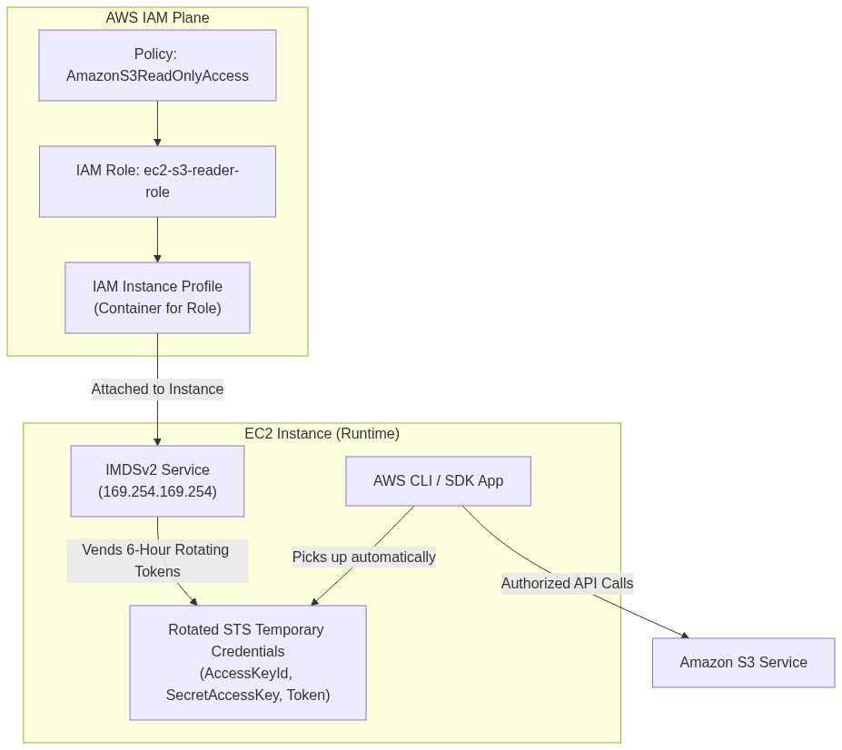
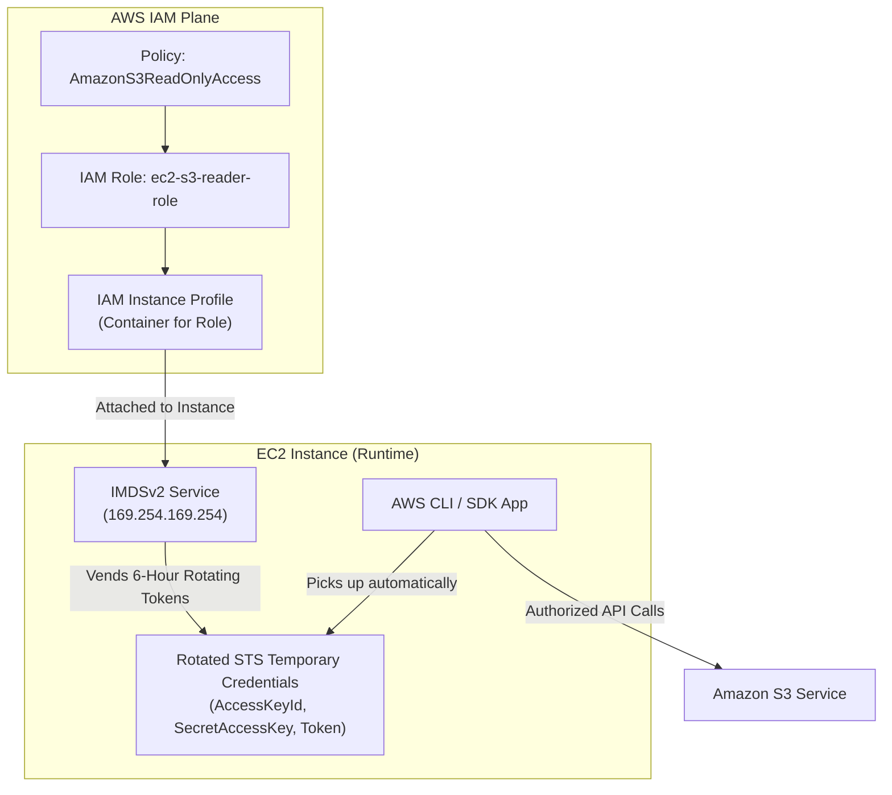

<div align="center">

# 🔬 Lab 4.2: IAM Roles & Instance Profiles (Zero-Credential Architecture)

**[🏠 AWS Labs Root](../../../README.md)** &nbsp;•&nbsp; **[🖥️ EC2 Curriculum](../../README.md)** &nbsp;•&nbsp; **[📂 Module 04](../README.md)**

   

**[⬅️ Previous Lab](../../module-04-security-iam-ssm/lab-01-security-groups-nacls/README.md)** &nbsp;|&nbsp; **[➡️ Next Lab](../../module-04-security-iam-ssm/lab-03-imdsv2-hardening/README.md)**


[](https://cyber-cloud-security.github.io/aws-labs/?lab=lab-02-iam-roles-instance-profiles)

</div>

---

## 📌 Lab Objectives

- [x] Implement the **Zero-Credential Security Architecture**: completely eliminate static AWS access keys on EC2 instances.
- [x] Construct an IAM Role with an `ec2.amazonaws.com` assume-role trust policy.
- [x] Package the IAM Role into an **Instance Profile** and attach it to an active, running EC2 instance with zero downtime.
- [x] Inspect how the EC2 instance automatically rotates and manages temporary **AWS STS credentials** via IMDSv2.

---

## 🏗️ Architecture Diagram



<details>
<summary>📐 <b>View Mermaid Architecture Source (Click to Expand)</b></summary>


```mermaid
flowchart TD
    subgraph IAMPlane["AWS IAM Plane"]
        Role["IAM Role: ec2-s3-reader-role"]
        Policy["Policy: AmazonS3ReadOnlyAccess"]
        Profile["IAM Instance Profile\n(Container for Role)"]

        Policy --> Role
        Role --> Profile
    end

    subgraph EC2Plane["EC2 Instance (Runtime)"]
        IMDS["IMDSv2 Service\n(169.254.169.254)"]
        AWSCLI["AWS CLI / SDK App"]
        TokenCache["Rotated STS Temporary Credentials\n(AccessKeyId, SecretAccessKey, Token)"]

        Profile -->|Attached to Instance| IMDS
        IMDS -->|Vends 6-Hour Rotating Tokens| TokenCache
        AWSCLI -->|Picks up automatically| TokenCache
    end

    AWSCLI -->|Authorized API Calls| S3["Amazon S3 Service"]
```

</details>

---

## 💡 Key Architectural Concepts

1. **Why Instance Profiles?**:
   - In IAM, an IAM Role defines *permissions* and *trust*. However, EC2 API calls require an **Instance Profile**, which acts as a bridge or wrapper around the IAM Role specifically for EC2.
2. **Automatic Credential Rotation**:
   - The AWS SDK and AWS CLI automatically query the local IMDS endpoint for fresh temporary credentials issued by AWS Security Token Service (STS). They rotate ~15 minutes before expiry without application interruption.
3. **Hot-Swapping Instance Profiles**:
   - You do not need to restart or terminate an EC2 instance to attach, detach, or replace its IAM instance profile (`aws ec2 associate-iam-instance-profile`).

---

## ⏱️ Prerequisites & Cost

> [!TIP]
> **AWS Free Tier & Cost Guardrail**
> - **AWS Free Tier Eligible**: Yes (`t3.micro`).
> - **Estimated Duration**: 15 minutes.

---

## 🚀 Step-by-Step Instructions

### Step 1: Create the IAM Role and Trust Policy

1. Create the EC2 trust policy document:
```bash
cat << 'EOF' > ec2-trust-policy.json
{
  "Version": "2012-10-17",
  "Statement": [
    {
      "Effect": "Allow",
      "Principal": { "Service": "ec2.amazonaws.com" },
      "Action": "sts:AssumeRole"
    }
  ]
}
EOF
```

2. Create the IAM Role:
```bash
aws iam create-role \
  --role-name "ec2-labs-s3-reader-role" \
  --assume-role-policy-document file://ec2-trust-policy.json
```

3. Attach the AmazonS3ReadOnlyAccess managed policy:
```bash
aws iam attach-role-policy \
  --role-name "ec2-labs-s3-reader-role" \
  --policy-arn "arn:aws:iam::aws:policy/AmazonS3ReadOnlyAccess"
```

---

### Step 2: Create the IAM Instance Profile & Add the Role

1. Create the Instance Profile wrapper:
```bash
aws iam create-instance-profile \
  --instance-profile-name "ec2-labs-s3-reader-profile"
```

2. Add the IAM Role to the Instance Profile:
```bash
aws iam add-role-to-instance-profile \
  --instance-profile-name "ec2-labs-s3-reader-profile" \
  --role-name "ec2-labs-s3-reader-role"
```

3. Confirm creation and allow for IAM propagation:
```bash
echo "[SUCCESS] Created and populated Instance Profile."
sleep 10
```

---

### Step 3: Launch an EC2 Instance Without Keys or Profile

1. Discover network parameters and AMI:
```bash
export AWS_REGION=$(aws configure get region || echo "us-east-1")
export VPC_ID=$(aws ec2 describe-vpcs \
  --filters "Name=isDefault,Values=true" \
  --query "Vpcs[0].VpcId" \
  --output text)
export SUBNET_ID=$(aws ec2 describe-subnets \
  --filters "Name=vpc-id,Values=${VPC_ID}" \
  --query "Subnets[0].SubnetId" \
  --output text)

AMI_ID=$(aws ssm get-parameter \
  --name "/aws/service/ami-amazon-linux-latest/al2023-ami-kernel-default-x86_64" \
  --query "Parameter.Value" --output text)
```

2. Launch the EC2 instance without hardcoded credentials:
```bash
INSTANCE_ID=$(aws ec2 run-instances \
  --image-id "${AMI_ID}" \
  --instance-type "t3.micro" \
  --subnet-id "${SUBNET_ID}" \
  --tag-specifications "ResourceType=instance,Tags=[{Key=Project,Value=ec2-master-labs},{Key=Name,Value=iam-role-demo}]" \
  --query "Instances[0].InstanceId" --output text)
```

3. Wait for the instance to enter running state:
```bash
echo "Waiting for instance ${INSTANCE_ID} to run..."
aws ec2 wait instance-running --instance-ids "${INSTANCE_ID}"
echo "[SUCCESS] Instance ${INSTANCE_ID} is running."
```

---

### Step 4: Attach the Instance Profile Live

1. Attach the instance profile to the already running instance:
```bash
ASSOC_ID=$(aws ec2 associate-iam-instance-profile \
  --instance-id "${INSTANCE_ID}" \
  --iam-instance-profile "Name=ec2-labs-s3-reader-profile" \
  --query "IamInstanceProfileAssociation.AssociationId" --output text)
```

2. Confirm live association:
```bash
echo "[SUCCESS] Associated Instance Profile Live! Association ID: ${ASSOC_ID}"
```

---

## 🔍 Verification & Testing

### 1. Inspect Temporary STS Credentials via IMDSv2
Connect to the instance and execute:
```bash
TOKEN=$(curl -s -X PUT "http://169.254.169.254/latest/api/token" -H "X-aws-ec2-metadata-token-ttl-seconds: 21600")

curl -s -H "X-aws-ec2-metadata-token: $TOKEN" \
  http://169.254.169.254/latest/meta-data/iam/security-credentials/ec2-labs-s3-reader-role
```

### 2. Run AWS S3 Commands Without Hardcoded Config
From within the instance:
```bash
aws s3 ls
```
The command succeeds immediately using the IAM role credentials with zero configuration files in `~/.aws/`!

---

## 🧹 Teardown & Clean-up

> [!CAUTION]
> **Always Tear Down Lab Resources**: Execute the cleanup commands below immediately after completing the verification steps to prevent unintended AWS billing.

1. Terminate the instance and wait for termination:
```bash
aws ec2 terminate-instances --instance-ids "${INSTANCE_ID}"
aws ec2 wait instance-terminated --instance-ids "${INSTANCE_ID}"
```

2. Remove role from instance profile and delete the instance profile:
```bash
aws iam remove-role-from-instance-profile \
  --instance-profile-name "ec2-labs-s3-reader-profile" \
  --role-name "ec2-labs-s3-reader-role"
aws iam delete-instance-profile --instance-profile-name "ec2-labs-s3-reader-profile"
```

3. Detach policy and delete the IAM role:
```bash
aws iam detach-role-policy \
  --role-name "ec2-labs-s3-reader-role" \
  --policy-arn "arn:aws:iam::aws:policy/AmazonS3ReadOnlyAccess"
aws iam delete-role --role-name "ec2-labs-s3-reader-role"
```

4. Clean up local temporary files:
```bash
rm -f ec2-trust-policy.json
```

5. Confirm cleanup:
```bash
echo "[SUCCESS] Lab 4.2 clean-up completed successfully."
```

---

<div align="center">

**[⬅️ Previous Lab](../../module-04-security-iam-ssm/lab-01-security-groups-nacls/README.md)** &nbsp;•&nbsp; **[⬆️ Back to Module 04](../README.md)** &nbsp;•&nbsp; **[🏠 EC2 Index](../../README.md)** &nbsp;•&nbsp; **[➡️ Next Lab](../../module-04-security-iam-ssm/lab-03-imdsv2-hardening/README.md)**

</div>
