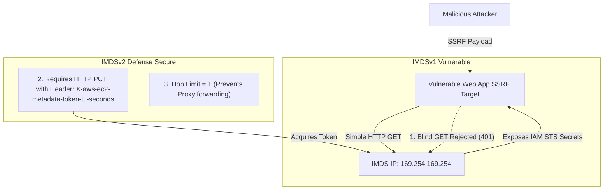

# Lab 4.3: IMDSv2 Hardening & SSRF Threat Mitigation

## 📌 Lab Objectives
- Understand the security vulnerabilities inherent in **IMDSv1** (legacy Instance Metadata Service) and why it enables **Server-Side Request Forgery (SSRF)** credential theft.
- Analyze how **IMDSv2** mitigates SSRF through session-oriented token architecture, HTTP `PUT` enforcement, and **Hop Limit** constraints.
- Audit and transition an instance from optional IMDSv1 to strictly enforced **IMDSv2** (`HttpTokens=required`).
- Enforce IMDSv2 across an entire AWS account/region using EC2 Metadata Defaults.

---

## 🏗️ Attack Surface & Defense Architecture


<details>
<summary>Click to expand Mermaid diagram source</summary>


<details>
<summary>Click to expand Mermaid diagram source</summary>


</details>
</details>

---

## 💡 Key Architectural Concepts

1. **The IMDSv1 Vulnerability**:
   - In IMDSv1, a simple HTTP `GET http://169.254.169.254/latest/meta-data/iam/security-credentials/<Role>` returns full STS tokens.
   - Any SSRF bug (e.g. image fetcher, PDF generator, webhook tester) could be weaponized to exfiltrate AWS credentials (as seen in major cloud data breaches).
2. **The 3 Layers of IMDSv2 Protection**:
   - **HTTP PUT requirement**: Reverse proxies and typical SSRF exploits do not permit sending HTTP `PUT` methods.
   - **Custom Header Requirement**: `X-aws-ec2-metadata-token-ttl-seconds` cannot be spoofed across standard browser/proxy forwards.
   - **Hop Limit (`HttpPutResponseHopLimit`)**: Setting the IP TTL hop limit to `1` ensures that the response packet cannot traverse any intermediate IP router, proxy, or container network bridge.

---

## ⏱️ Prerequisites & Cost
- **AWS Free Tier Eligible**: Yes (`t3.micro`).
- **Estimated Duration**: 15 minutes.

---

## 🚀 Step-by-Step Instructions

### Step 1: Launch an Instance with IMDSv1 Enabled (Default/Legacy Mode)
```bash
export AWS_REGION=$(aws configure get region || echo "us-east-1")
export VPC_ID=$(aws ec2 describe-vpcs --filters "Name=isDefault,Values=true" --query "Vpcs[0].VpcId" --output text)
export SUBNET_ID=$(aws ec2 describe-subnets --filters "Name=vpc-id,Values=${VPC_ID}" --query "Subnets[0].SubnetId" --output text)

AMI_ID=$(aws ssm get-parameter \
  --name "/aws/service/ami-amazon-linux-latest/al2023-ami-kernel-default-x86_64" \
  --query "Parameter.Value" --output text)

INSTANCE_ID=$(aws ec2 run-instances \
  --image-id "${AMI_ID}" \
  --instance-type "t3.micro" \
  --subnet-id "${SUBNET_ID}" \
  --metadata-options "HttpEndpoint=enabled,HttpTokens=optional" \
  --tag-specifications "ResourceType=instance,Tags=[{Key=Project,Value=ec2-master-labs},{Key=Name,Value=imdsv1-vulnerable}]" \
  --query "Instances[0].InstanceId" --output text)

aws ec2 wait instance-running --instance-ids "${INSTANCE_ID}"
```

### Step 2: Test Legacy IMDSv1 Access Inside the Instance
Connect to the instance:
```bash
# Execute an unauthenticated IMDSv1 GET request:
curl -i -s http://169.254.169.254/latest/meta-data/instance-id
```
**Result**: HTTP `200 OK`, returning the instance ID directly without authentication tokens.

---

## 🔍 Hardening: Enforce IMDSv2

### Step 3: Modify Instance Metadata Options Live
From your administrative terminal:
```bash
aws ec2 modify-instance-metadata-options \
  --instance-id "${INSTANCE_ID}" \
  --http-tokens required \
  --http-put-response-hop-limit 1 \
  --http-endpoint enabled

echo "Enforced IMDSv2 on instance ${INSTANCE_ID}."
```

### Step 4: Verify SSRF Mitigation
Inside the instance, repeat the legacy IMDSv1 call:
```bash
curl -i -s http://169.254.169.254/latest/meta-data/instance-id
```
**Result**:
`HTTP/1.1 401 Unauthorized`
The unauthenticated metadata request is instantly blocked by the hypervisor!

### Step 5: Test the Proper IMDSv2 Flow
Acquire an authenticated session token via HTTP PUT:
```bash
TOKEN=$(curl -s -X PUT "http://169.254.169.254/latest/api/token" \
  -H "X-aws-ec2-metadata-token-ttl-seconds: 21600")

# Access metadata with signed header:
curl -s -H "X-aws-ec2-metadata-token: $TOKEN" http://169.254.169.254/latest/meta-data/instance-id
```
**Result**: Returns the instance ID securely.

### Step 6: Account-Wide Default Hardening (Bonus)
To guarantee that all future EC2 instances launched in your region require IMDSv2 by default:
```bash
aws ec2 modify-instance-metadata-defaults \
  --http-tokens required \
  --http-put-response-hop-limit 1
```

---

## 🧹 Teardown & Clean-up

```bash
aws ec2 terminate-instances --instance-ids "${INSTANCE_ID}"
aws ec2 wait instance-terminated --instance-ids "${INSTANCE_ID}"
echo "Lab 4.3 clean-up completed successfully."
```
