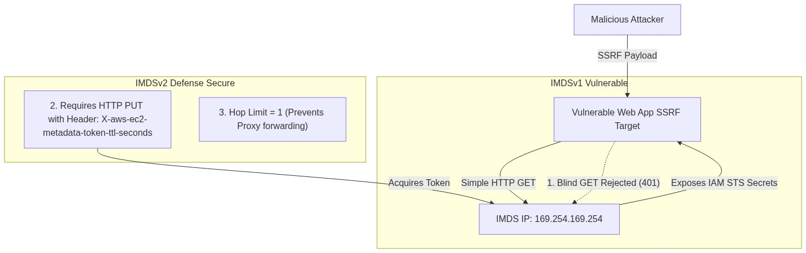
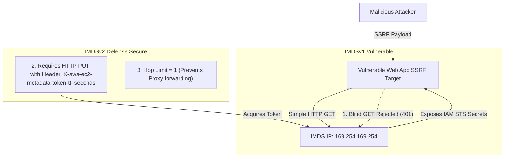

<div align="center">

# 🔬 Lab 4.3: IMDSv2 Hardening & SSRF Threat Mitigation

**[🏠 AWS Labs Root](../../../README.md)** &nbsp;•&nbsp; **[🖥️ EC2 Curriculum](../../README.md)** &nbsp;•&nbsp; **[📂 Module 04](../README.md)**

   

**[⬅️ Previous Lab](../../module-04-security-iam-ssm/lab-02-iam-roles-instance-profiles/README.md)** &nbsp;|&nbsp; **[➡️ Next Lab](../../module-04-security-iam-ssm/lab-04-ssm-session-manager/README.md)**

</div>

---

## 📌 Lab Objectives

- [x] Understand the security vulnerabilities inherent in **IMDSv1** (legacy Instance Metadata Service) and why it enables **Server-Side Request Forgery (SSRF)** credential theft.
- [x] Analyze how **IMDSv2** mitigates SSRF through session-oriented token architecture, HTTP `PUT` enforcement, and **Hop Limit** constraints.
- [x] Audit and transition an instance from optional IMDSv1 to strictly enforced **IMDSv2** (`HttpTokens=required`).
- [x] Enforce IMDSv2 across an entire AWS account/region using EC2 Metadata Defaults.

---

## 🏗️ Attack Surface & Defense Architecture



<details>
<summary>📐 <b>View Mermaid Architecture Source (Click to Expand)</b></summary>



</details>

---

## 💡 Key Architectural Concepts

1. **The IMDSv1 Vulnerability**:
   - In IMDSv1, a simple HTTP `GET http://169.254.169.254/latest/meta-data/iam/security-credentials/<Role>` returns full STS tokens.
   - Any SSRF bug (e.g. image fetcher, PDF generator, webhook tester) could be weaponized to exfiltrate AWS credentials (as seen in major cloud data breaches).
2. **The 3 Layers of IMDSv2 Protection**:
   - **HTTP PUT requirement**: Reverse proxies and typical SSRF exploits do not permit sending HTTP `PUT` methods.
   - **Custom Header Requirement**: `X-aws-ec2-metadata-token-ttl-seconds` cannot be spoofed across standard browser/proxy forwards.
   - **Hop Limit (`HttpPutResponseHopLimit`)**: Setting the IP TTL hop limit to `1` ensures that the response packet cannot traverse any intermediate IP router, proxy, or container network bridge.

---

## ⏱️ Prerequisites & Cost

> [!TIP]
> **AWS Free Tier & Cost Guardrail**
> - **AWS Free Tier Eligible**: Yes (`t3.micro`).
> - **Estimated Duration**: 15 minutes.

---

## 🚀 Step-by-Step Instructions

### Step 1: Launch an Instance with IMDSv1 Enabled (Default/Legacy Mode)
```bash
export AWS_REGION=$(aws configure get region || echo "us-east-1")
export VPC_ID=$(aws ec2 describe-vpcs \
  --filters "Name=isDefault,Values=true" \
  --query "Vpcs[0].VpcId" \
  --output text)
export SUBNET_ID=$(aws ec2 describe-subnets \
  --filters "Name=vpc-id,Values=${VPC_ID}" \
  --query "Subnets[0].SubnetId" \
  --output text)

AMI_ID=$(aws ssm get-parameter \
  --name "/aws/service/ami-amazon-linux-latest/al2023-ami-kernel-default-x86_64" \
  --query "Parameter.Value" --output text)

INSTANCE_ID=$(aws ec2 run-instances \
  --image-id "${AMI_ID}" \
  --instance-type "t3.micro" \
  --subnet-id "${SUBNET_ID}" \
  --metadata-options "HttpEndpoint=enabled,HttpTokens=optional" \
  --tag-specifications "ResourceType=instance,Tags=[{Key=Project,Value=ec2-master-labs},{Key=Name,Value=imdsv1-vulnerable}]" \
  --query "Instances[0].InstanceId" --output text)

aws ec2 wait instance-running --instance-ids "${INSTANCE_ID}"
```

### Step 2: Test Legacy IMDSv1 Access Inside the Instance
Connect to the instance:
```bash
# Execute an unauthenticated IMDSv1 GET request:
curl -i -s http://169.254.169.254/latest/meta-data/instance-id
```
**Result**: HTTP `200 OK`, returning the instance ID directly without authentication tokens.

---

## 🔍 Hardening: Enforce IMDSv2

### Step 3: Modify Instance Metadata Options Live
From your administrative terminal:
```bash
aws ec2 modify-instance-metadata-options \
  --instance-id "${INSTANCE_ID}" \
  --http-tokens required \
  --http-put-response-hop-limit 1 \
  --http-endpoint enabled

echo "Enforced IMDSv2 on instance ${INSTANCE_ID}."
```

### Step 4: Verify SSRF Mitigation
Inside the instance, repeat the legacy IMDSv1 call:
```bash
curl -i -s http://169.254.169.254/latest/meta-data/instance-id
```
**Result**:
`HTTP/1.1 401 Unauthorized`
The unauthenticated metadata request is instantly blocked by the hypervisor!

### Step 5: Test the Proper IMDSv2 Flow
Acquire an authenticated session token via HTTP PUT:
```bash
TOKEN=$(curl -s -X PUT "http://169.254.169.254/latest/api/token" \
  -H "X-aws-ec2-metadata-token-ttl-seconds: 21600")

# Access metadata with signed header:
curl -s -H "X-aws-ec2-metadata-token: $TOKEN" http://169.254.169.254/latest/meta-data/instance-id
```
**Result**: Returns the instance ID securely.

### Step 6: Account-Wide Default Hardening (Bonus)
To guarantee that all future EC2 instances launched in your region require IMDSv2 by default:
```bash
aws ec2 modify-instance-metadata-defaults \
  --http-tokens required \
  --http-put-response-hop-limit 1
```

---

## 📘 Deep-Dive Command & Flag Reference

> [!TIP]
> **Line-by-Line Production Analysis**: Every command executed in this lab is dissected below, explaining each CLI flag, JMESPath query, Linux kernel parameter, and why it is critical in production automation.

<details open>
<summary>📘 <b>Command 1: Auditing Legacy IMDSv1 Vulnerability Mechanics</b></summary>

```bash
# Inside the guest operating system:
curl -i -s http://169.254.169.254/latest/meta-data/instance-id
```

#### 🔍 Parameter & Component Breakdown

- **`http://169.254.169.254`** — A Link-Local non-routable IPv4 address hardcoded into the AWS hypervisor network stack to serve instance metadata.

- `curl -i -s`
  - **`-i`** — Includes HTTP response status headers in the output.
  - **`-s`** — Silent mode (suppresses progress meters).

- **The IMDSv1 Architectural Flaw** — In IMDSv1, any simple, unauthenticated HTTP `GET` request returns metadata and IAM credentials.
If an attacker discovers a **Server-Side Request Forgery (SSRF)** vulnerability in a web application running on this instance (e.g. an image fetcher, PDF exporter, or webhook tester like `https://example.com/fetch?url=http://169.254.169.254/latest/meta-data/iam/security-credentials/`), the vulnerable application makes the GET request internally and returns the credentials to the attacker.

> 🏭 **Why This Matters in Production Automation**
> This exact vulnerability was weaponized in several high-profile enterprise cloud data breaches (including the Capital One breach), leading to the exfiltration of millions of customer records. IMDSv1 is now flagged as a Critical finding by AWS Security Hub and AWS GuardDuty.

</details>

<details open>
<summary>📘 <b>Command 2: Modifying Instance Metadata Options Live (Enforcing IMDSv2)</b></summary>

```bash
aws ec2 modify-instance-metadata-options \
  --instance-id "${INSTANCE_ID}" \
  --http-tokens required \
  --http-put-response-hop-limit 1 \
  --http-endpoint enabled
```

#### 🔍 Parameter & Component Breakdown

- **`aws ec2 modify-instance-metadata-options`** — Updates the hypervisor's metadata enforcement rules on a live, running EC2 instance with zero downtime.

- **`--http-tokens required` (The Core Hardening Flag)** — Disables IMDSv1 entirely. Any incoming request that does not present a valid, signed, session-oriented IMDSv2 token is immediately rejected by the hypervisor with `HTTP/1.1 401 Unauthorized`.

- **`--http-put-response-hop-limit 1` (The Anti-Proxy / Container Shield)** — Sets the IP packet Time-To-Live (TTL) header of metadata responses to **1**.
  - In IP networking, every time a packet crosses a network router, bridge, or reverse proxy (like Nginx, Squid, or a Docker/Kubernetes container bridge), the TTL is decremented by 1.
  - With a hop limit of `1`, the packet can reach the host OS kernel, but if a Docker container or reverse proxy tries to forward the packet, the TTL drops to `0` and the packet is destroyed by the network stack!

- **`--http-endpoint enabled`** — Ensures the metadata service is accessible to local applications.

> 🏭 **Why This Matters in Production Automation**
> This command hardens the instance against both direct SSRF attacks and container breakout attacks. Any enterprise running containerized workloads (Docker, ECS, EKS) directly on EC2 should set `HttpPutResponseHopLimit=1` to prevent containers from accessing the underlying host's IAM instance profile.

</details>

<details open>
<summary>📘 <b>Command 3: Acquiring and Utilizing an IMDSv2 Session Token</b></summary>

```bash
# 1. Acquire Token via HTTP PUT
TOKEN=$(curl -s -X PUT "http://169.254.169.254/latest/api/token" \
  -H "X-aws-ec2-metadata-token-ttl-seconds: 21600")

# 2. Access metadata using the token header
curl -s -H "X-aws-ec2-metadata-token: $TOKEN" \
  http://169.254.169.254/latest/meta-data/instance-id
```

#### 🔍 Parameter & Component Breakdown

- **`-X PUT "http://169.254.169.254/latest/api/token"`** — IMDSv2 **requires an HTTP `PUT` request**. Standard SSRF vulnerabilities (e.g. `?url=...` image injections) only perform HTTP `GET` requests and cannot be coerced into sending arbitrary `PUT` methods.

- **`-H "X-aws-ec2-metadata-token-ttl-seconds: 21600"`** — **Mandatory Header**: Requests a session token valid for 21,600 seconds (6 hours). Web application firewalls (WAFs) and standard web exploits cannot forge custom HTTP headers.

- **`-H "X-aws-ec2-metadata-token: $TOKEN"`** — Passes the acquired secret token as a request header to unlock metadata queries.

> 🏭 **Why This Matters in Production Automation**
> IMDSv2 neutralizes 99% of SSRF attack vectors by requiring both an HTTP `PUT` verb and custom request headers that external attackers cannot inject.

</details>

<details open>
<summary>📘 <b>Command 4: Account-Wide Default Hardening for Future EC2 Deployments</b></summary>

```bash
aws ec2 modify-instance-metadata-defaults \
  --http-tokens required \
  --http-put-response-hop-limit 1
```

#### 🔍 Parameter & Component Breakdown

- **`aws ec2 modify-instance-metadata-defaults`** — A regional account-level policy setting introduced by AWS.

- **Effect on Future Infrastructure** — Any engineer or automated tool (Terraform, CloudFormation) that subsequently executes `aws ec2 run-instances` in this region will automatically have `--metadata-options "HttpTokens=required,HttpPutResponseHopLimit=1"` enforced by default, even if the engineer forgets to include the parameter!

> 🏭 **Why This Matters in Production Automation**
> This command implements "Secure by Default" governance across entire engineering organizations, preventing junior developers or third-party deployment scripts from launching vulnerable IMDSv1 instances.

</details>

---

## 🧹 Teardown & Clean-up


> [!CAUTION]
> **Always Tear Down Lab Resources**: Execute the cleanup commands below immediately after completing the verification steps to prevent unintended AWS billing.

```bash
aws ec2 terminate-instances --instance-ids "${INSTANCE_ID}"
aws ec2 wait instance-terminated --instance-ids "${INSTANCE_ID}"
echo "Lab 4.3 clean-up completed successfully."
```

---

<div align="center">

**[⬅️ Previous Lab](../../module-04-security-iam-ssm/lab-02-iam-roles-instance-profiles/README.md)** &nbsp;•&nbsp; **[⬆️ Back to Module 04](../README.md)** &nbsp;•&nbsp; **[🏠 EC2 Index](../../README.md)** &nbsp;•&nbsp; **[➡️ Next Lab](../../module-04-security-iam-ssm/lab-04-ssm-session-manager/README.md)**

</div>
