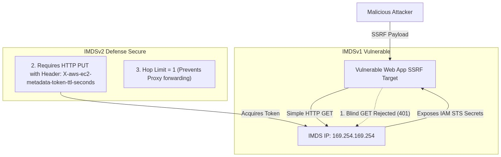
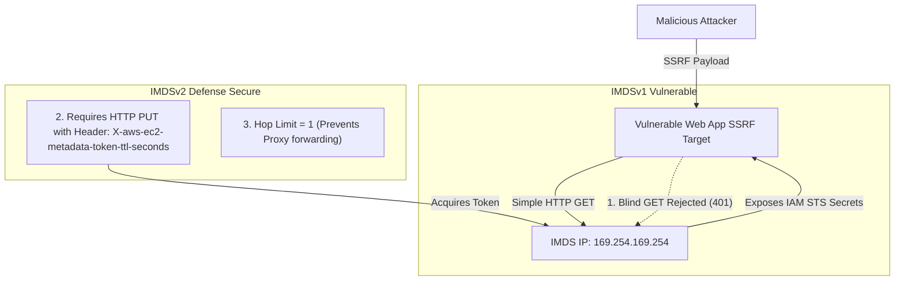

<div align="center">

# 🔬 Lab 4.3: IMDSv2 Hardening & SSRF Threat Mitigation

**[🏠 AWS Labs Root](../../../README.md)** &nbsp;•&nbsp; **[🖥️ EC2 Curriculum](../../README.md)** &nbsp;•&nbsp; **[📂 Module 04](../README.md)**

    

**[⬅️ Previous Lab](../../module-04-security-iam-ssm/lab-02-iam-roles-instance-profiles/README.md)** &nbsp;|&nbsp; **[➡️ Next Lab](../../module-04-security-iam-ssm/lab-04-ssm-session-manager/README.md)**


[](https://cyber-cloud-security.github.io/aws-labs/?lab=lab-03-imdsv2-hardening)

</div>

---

## 📌 Lab Objectives

- [x] Understand the security vulnerabilities inherent in **IMDSv1** (legacy Instance Metadata Service) and why it enables **Server-Side Request Forgery (SSRF)** credential theft.
- [x] Analyze how **IMDSv2** mitigates SSRF through session-oriented token architecture, HTTP `PUT` enforcement, and **Hop Limit** constraints.
- [x] Audit and transition an instance from optional IMDSv1 to strictly enforced **IMDSv2** (`HttpTokens=required`).
- [x] Enforce IMDSv2 across an entire AWS account/region using EC2 Metadata Defaults.

---

## 🏗️ Attack Surface & Defense Architecture



<details>
<summary>📐 <b>View Mermaid Architecture Source (Click to Expand)</b></summary>


```mermaid
flowchart TD
    Attacker["Malicious Attacker"]
    WebVuln["Vulnerable Web App SSRF Target"]
    IMDS["IMDS IP: 169.254.169.254"]

    subgraph IMDSv1["IMDSv1 Vulnerable"]
        WebVuln -->|"Simple HTTP GET"| IMDS
        IMDS -->|"Exposes IAM STS Secrets"| WebVuln
    end

    subgraph IMDSv2["IMDSv2 Defense Secure"]
        WebVuln -.->|"1. Blind GET Rejected (401)"| IMDS
        TokenReq["2. Requires HTTP PUT with Header: X-aws-ec2-metadata-token-ttl-seconds"]
        TokenReq -->|"Acquires Token"| IMDS
        HopLimit["3. Hop Limit = 1 (Prevents Proxy forwarding)"]
    end

    Attacker -->|"SSRF Payload"| WebVuln
```

</details>

---

## 💡 Key Architectural Concepts

1. **The IMDSv1 Vulnerability**:
   - In IMDSv1, a simple HTTP `GET http://169.254.169.254/latest/meta-data/iam/security-credentials/<Role>` returns full STS tokens.
   - Any SSRF bug (e.g. image fetcher, PDF generator, webhook tester) could be weaponized to exfiltrate AWS credentials (as seen in major cloud data breaches).
2. **The 3 Layers of IMDSv2 Protection**:
   - **HTTP PUT requirement**: Reverse proxies and typical SSRF exploits do not permit sending HTTP `PUT` methods.
   - **Custom Header Requirement**: `X-aws-ec2-metadata-token-ttl-seconds` cannot be spoofed across standard browser/proxy forwards.
   - **Hop Limit (`HttpPutResponseHopLimit`)**: Setting the IP TTL hop limit to `1` ensures that the response packet cannot traverse any intermediate IP router, proxy, or container network bridge.

---

## ⏱️ Prerequisites & Cost

> [!TIP]
> **AWS Free Tier & Cost Guardrail**
> - **AWS Free Tier Eligible**: Yes (`t3.micro`).
> - **Estimated Duration**: 15 minutes.

---

## 🚀 Step-by-Step Instructions

### Step 1: Launch an Instance with IMDSv1 Enabled (Default/Legacy Mode)

1. Query your default network infrastructure:
```bash
export AWS_REGION=$(aws configure get region || echo "us-east-1")
export VPC_ID=$(aws ec2 describe-vpcs \
  --filters "Name=isDefault,Values=true" \
  --query "Vpcs[0].VpcId" \
  --output text)
export SUBNET_ID=$(aws ec2 describe-subnets \
  --filters "Name=vpc-id,Values=${VPC_ID}" \
  --query "Subnets[0].SubnetId" \
  --output text)
```

2. Resolve the latest Amazon Linux 2023 AMI:
```bash
AMI_ID=$(aws ssm get-parameter \
  --name "/aws/service/ami-amazon-linux-latest/al2023-ami-kernel-default-x86_64" \
  --query "Parameter.Value" --output text)
```

3. Launch an EC2 instance with `HttpTokens=optional`:
```bash
INSTANCE_ID=$(aws ec2 run-instances \
  --image-id "${AMI_ID}" \
  --instance-type "t3.micro" \
  --subnet-id "${SUBNET_ID}" \
  --metadata-options "HttpEndpoint=enabled,HttpTokens=optional" \
  --tag-specifications "ResourceType=instance,Tags=[{Key=Project,Value=ec2-master-labs},{Key=Name,Value=imdsv1-vulnerable}]" \
  --query "Instances[0].InstanceId" --output text)
```

4. Wait for the instance to reach running state:
```bash
aws ec2 wait instance-running --instance-ids "${INSTANCE_ID}"
```

### Step 2: Test Legacy IMDSv1 Access Inside the Instance

1. Connect to the instance and execute an unauthenticated IMDSv1 GET request:
```bash
curl -i -s http://169.254.169.254/latest/meta-data/instance-id
```

**Result**: HTTP `200 OK`, returning the instance ID directly without authentication tokens.

---

## 🔍 Hardening: Enforce IMDSv2

### Step 3: Modify Instance Metadata Options Live

1. From your administrative terminal, enforce IMDSv2 token requirements and hop limit:
```bash
aws ec2 modify-instance-metadata-options \
  --instance-id "${INSTANCE_ID}" \
  --http-tokens required \
  --http-put-response-hop-limit 1 \
  --http-endpoint enabled
```

2. Confirm configuration update:
```bash
echo "[SUCCESS] Enforced IMDSv2 on instance ${INSTANCE_ID}."
```

### Step 4: Verify SSRF Mitigation

1. Inside the instance, repeat the legacy unauthenticated IMDSv1 call:
```bash
curl -i -s http://169.254.169.254/latest/meta-data/instance-id
```

**Result**:
```text
HTTP/1.1 401 Unauthorized
```
The unauthenticated metadata request is instantly blocked by the hypervisor.

### Step 5: Test the Proper IMDSv2 Flow

1. Acquire an authenticated session token via HTTP PUT:
```bash
TOKEN=$(curl -s -X PUT "http://169.254.169.254/latest/api/token" \
  -H "X-aws-ec2-metadata-token-ttl-seconds: 21600")
```

2. Access metadata with the signed session token header:
```bash
curl -s -H "X-aws-ec2-metadata-token: $TOKEN" http://169.254.169.254/latest/meta-data/instance-id
```

**Result**: Returns the instance ID securely.

### Step 6: Account-Wide Default Hardening (Bonus)

1. Enforce IMDSv2 account-wide for all future EC2 launches in the current region:
```bash
aws ec2 modify-instance-metadata-defaults \
  --http-tokens required \
  --http-put-response-hop-limit 1
```

---

## 🧹 Teardown & Clean-up

> [!CAUTION]
> **Always Tear Down Lab Resources**: Execute the cleanup commands below immediately after completing the verification steps to prevent unintended AWS billing.

1. Terminate the test instance:
```bash
aws ec2 terminate-instances --instance-ids "${INSTANCE_ID}"
```

2. Wait for instance termination:
```bash
aws ec2 wait instance-terminated --instance-ids "${INSTANCE_ID}"
```

3. Confirm clean-up completion:
```bash
echo "[SUCCESS] Lab 4.3 clean-up completed successfully."
```

---

<div align="center">

**[⬅️ Previous Lab](../../module-04-security-iam-ssm/lab-02-iam-roles-instance-profiles/README.md)** &nbsp;•&nbsp; **[⬆️ Back to Module 04](../README.md)** &nbsp;•&nbsp; **[🏠 EC2 Index](../../README.md)** &nbsp;•&nbsp; **[➡️ Next Lab](../../module-04-security-iam-ssm/lab-04-ssm-session-manager/README.md)**

</div>
