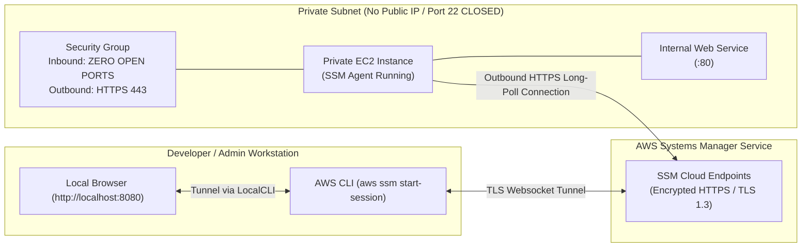

<div align="center">

# 🔬 Lab 4.4: Zero-SSH Access via AWS Systems Manager (SSM) Session Manager

**[🏠 AWS Labs Root](../../../README.md)** &nbsp;•&nbsp; **[🖥️ EC2 Curriculum](../../README.md)** &nbsp;•&nbsp; **[📂 Module 04](../README.md)**

   

**[⬅️ Previous Lab](../../module-04-security-iam-ssm/lab-03-imdsv2-hardening/README.md)** &nbsp;|&nbsp; **[➡️ Next Lab](../../module-05-ha-asg-alb/lab-01-launch-templates/README.md)**


[](https://cyber-cloud-security.github.io/aws-labs/?lab=lab-04-ssm-session-manager)

</div>

---

## 📌 Lab Objectives

- [x] Implement the modern **"Zero-SSH / Bastion-less" Enterprise Architecture**:
  - Close Inbound Port 22 in all Security Groups.
  - Terminate costly Bastion Jump Hosts.
  - Eliminate SSH key generation, distribution, and key-rotation overhead.
- [x] Attach the `AmazonSSMManagedInstanceCore` managed policy to an EC2 instance profile.
- [x] Establish encrypted interactive terminal sessions directly through the AWS CLI using `aws ssm start-session`.
- [x] Configure **SSM Port Forwarding** to tunnel local workstation ports securely to private EC2 instances.

---

## 🏗️ Architecture Diagram


<details>
<summary>📐 <b>View Mermaid Architecture Source (Click to Expand)</b></summary>



</details>

---

## 💡 Key Architectural Concepts

1. **How Session Manager Works**:
   - The instance's open-source `amazon-ssm-agent` establishes an **outbound HTTPS (port 443)** connection to AWS Systems Manager.
   - **No inbound ports need to be open in your Security Group!** You can completely lock down ingress (`0` inbound rules).
2. **Enterprise Audit & Compliance**:
   - Every keystroke, terminal session, and command executed can be automatically encrypted and streamed to **Amazon CloudWatch Logs** or **AWS S3** for audit compliance.
   - Access control is governed by AWS IAM rather than Linux POSIX user accounts.

---

## ⏱️ Prerequisites & Cost

> [!TIP]
> **AWS Free Tier & Cost Guardrail**
> - **AWS Free Tier Eligible**: Yes (`t3.micro`). Session Manager itself is completely free of charge.
> - **Estimated Duration**: 20 minutes.

---

## 🚀 Step-by-Step Instructions

### Step 1: Create IAM Role for SSM Session Manager
```bash
export AWS_REGION=$(aws configure get region || echo "us-east-1")
export VPC_ID=$(aws ec2 describe-vpcs \
  --filters "Name=isDefault,Values=true" \
  --query "Vpcs[0].VpcId" \
  --output text)
export SUBNET_ID=$(aws ec2 describe-subnets \
  --filters "Name=vpc-id,Values=${VPC_ID}" \
  --query "Subnets[0].SubnetId" \
  --output text)

# 1. Create Trust Policy
cat <<JSON > ssm-trust.json
{
  "Version": "2012-10-17",
  "Statement": [
    {
      "Effect": "Allow",
      "Principal": { "Service": "ec2.amazonaws.com" },
      "Action": "sts:AssumeRole"
    }
  ]
}
JSON

aws iam create-role \
  --role-name "ec2-ssm-core-role" \
  --assume-role-policy-document file://ssm-trust.json 2>/dev/null || true

# 2. Attach AWS-managed policy
aws iam attach-role-policy \
  --role-name "ec2-ssm-core-role" \
  --policy-arn "arn:aws:iam::aws:policy/AmazonSSMManagedInstanceCore"

# 3. Create Instance Profile
aws iam create-instance-profile --instance-profile-name "ec2-ssm-core-profile" 2>/dev/null || true
aws iam add-role-to-instance-profile \
  --instance-profile-name "ec2-ssm-core-profile" \
  --role-name "ec2-ssm-core-role" 2>/dev/null || true

sleep 10
```

### Step 2: Create a Security Group with ZERO Inbound Rules
```bash
LOCKED_SG_ID=$(aws ec2 create-security-group \
  --group-name "sg-locked-down" \
  --description "Zero inbound ports allowed" \
  --vpc-id "${VPC_ID}" \
  --query "GroupId" --output text)

echo "Created locked Security Group: ${LOCKED_SG_ID}"
```

### Step 3: Launch Instance with SSM Profile and Locked SG
```bash
AMI_ID=$(aws ssm get-parameter \
  --name "/aws/service/ami-amazon-linux-latest/al2023-ami-kernel-default-x86_64" \
  --query "Parameter.Value" --output text)

INSTANCE_ID=$(aws ec2 run-instances \
  --image-id "${AMI_ID}" \
  --instance-type "t3.micro" \
  --subnet-id "${SUBNET_ID}" \
  --security-group-ids "${LOCKED_SG_ID}" \
  --iam-instance-profile "Name=ec2-ssm-core-profile" \
  --user-data "#!/bin/bash
dnf install -y nginx
echo 'Private internal portal reachable only via SSM Port Forwarding' > /usr/share/nginx/html/index.html
systemctl start nginx" \
  --tag-specifications "ResourceType=instance,Tags=[{Key=Project,Value=ec2-master-labs},{Key=Name,Value=zero-ssh-host}]" \
  --query "Instances[0].InstanceId" --output text)

echo "Launched zero-SSH host: ${INSTANCE_ID}"
aws ec2 wait instance-running --instance-ids "${INSTANCE_ID}"

echo "Waiting 60 seconds for SSM Agent to register with AWS..."
sleep 60
```

---

## 🔍 Verification & Testing

### 1. Start an Interactive Terminal Session
From your local terminal, initiate an interactive shell session:
```bash
aws ssm start-session --target "${INSTANCE_ID}"
```
You are immediately dropped into a bash prompt as `ssm-user`:
```bash
# sh-5.2$ whoami
# ssm-user
# sh-5.2$ sudo su -
# [root@ip-172-31-x-x ~]#
```
Exit the session by typing `exit`.

### 2. Tunnel Private Web Traffic via SSM Port Forwarding
Without opening any firewall ports or assigning a public IP, tunnel the instance's private port 80 to your local workstation port 8080:
```bash
aws ssm start-session \
  --target "${INSTANCE_ID}" \
  --document-name "AWS-StartPortForwardingSession" \
  --parameters '{"portNumber":["80"],"localPortNumber":["8080"]}'
```
In another terminal window or your browser, test the tunnel:
```bash
curl http://localhost:8080
```
**Output**: `Private internal portal reachable only via SSM Port Forwarding`

### 3. SSH Over SSM Proxy (Optional)
If your legacy tooling requires native SSH/SCP/rsync, configure `~/.ssh/config`:
```text
host i-* mi-*
    ProxyCommand sh -c "aws ssm start-session --target %h --document-name AWS-StartSSHSession --parameters 'portNumber=%p'"
```
You can then run `ssh ec2-user@<instance-id>` transparently through the encrypted SSM tunnel!

---

## 🧹 Teardown & Clean-up


> [!CAUTION]
> **Always Tear Down Lab Resources**: Execute the cleanup commands below immediately after completing the verification steps to prevent unintended AWS billing.

```bash
# 1. Terminate instance
aws ec2 terminate-instances --instance-ids "${INSTANCE_ID}"
aws ec2 wait instance-terminated --instance-ids "${INSTANCE_ID}"

# 2. Delete locked security group
aws ec2 delete-security-group --group-id "${LOCKED_SG_ID}"

# 3. Clean up IAM roles
aws iam remove-role-from-instance-profile \
  --instance-profile-name "ec2-ssm-core-profile" \
  --role-name "ec2-ssm-core-role"
aws iam delete-instance-profile --instance-profile-name "ec2-ssm-core-profile"
aws iam detach-role-policy \
  --role-name "ec2-ssm-core-role" \
  --policy-arn "arn:aws:iam::aws:policy/AmazonSSMManagedInstanceCore"
aws iam delete-role --role-name "ec2-ssm-core-role"
rm -f ssm-trust.json

echo "Lab 4.4 clean-up completed successfully."
```

---

<div align="center">

**[⬅️ Previous Lab](../../module-04-security-iam-ssm/lab-03-imdsv2-hardening/README.md)** &nbsp;•&nbsp; **[⬆️ Back to Module 04](../README.md)** &nbsp;•&nbsp; **[🏠 EC2 Index](../../README.md)** &nbsp;•&nbsp; **[➡️ Next Lab](../../module-05-ha-asg-alb/lab-01-launch-templates/README.md)**

</div>
