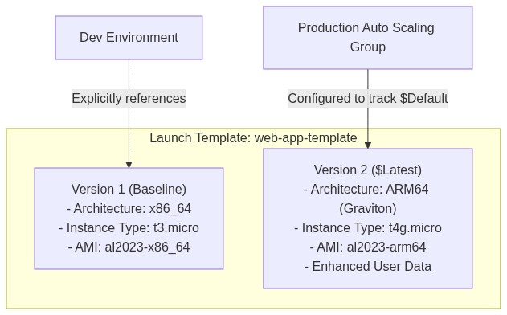
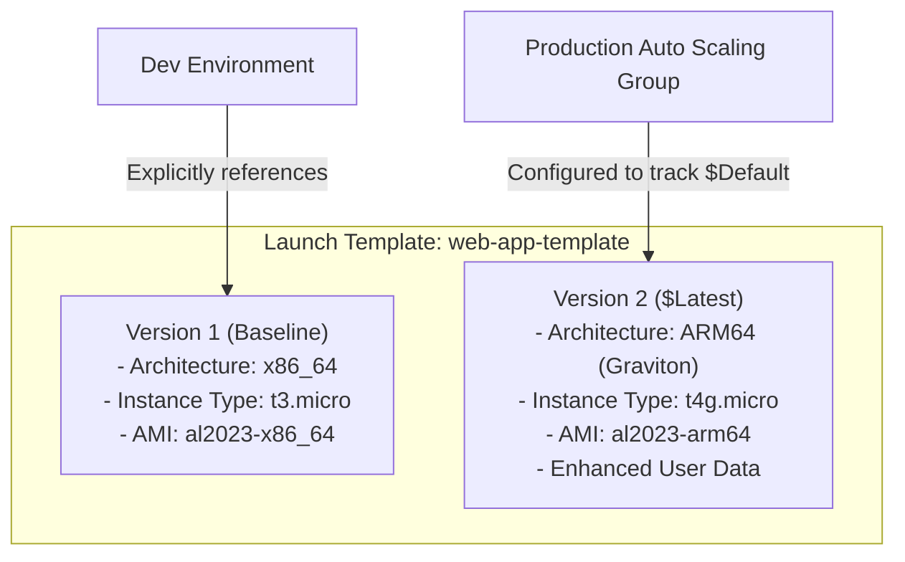

<div align="center">

# 🔬 Lab 5.1: EC2 Launch Templates & Multi-Version Management

**[🏠 AWS Labs Root](../../../README.md)** &nbsp;•&nbsp; **[🖥️ EC2 Curriculum](../../README.md)** &nbsp;•&nbsp; **[📂 Module 05](../README.md)**

   

**[⬅️ Previous Lab](../../module-04-security-iam-ssm/lab-04-ssm-session-manager/README.md)** &nbsp;|&nbsp; **[➡️ Next Lab](../../module-05-ha-asg-alb/lab-02-alb-and-target-groups/README.md)**

</div>

---

## 📌 Lab Objectives

- [x] Understand why **Launch Templates** completely superseded legacy Launch Configurations.
- [x] Author a production Launch Template with multi-versioning support.
- [x] Implement **Version 1 (x86_64 baseline)** and **Version 2 (Graviton ARM64 with performance tuning)**.
- [x] Manage default versions and test instance launches against specific template versions.

---

## 🏗️ Architecture Diagram



<details>
<summary>📐 <b>View Mermaid Architecture Source (Click to Expand)</b></summary>



</details>

---

## 💡 Key Architectural Concepts

### Launch Configurations vs Launch Templates
| Feature | Launch Configuration (Deprecated) | Launch Template (Modern Standard) |
| :--- | :--- | :--- |
| **Versioning** | No (immutable; must create a brand new resource for every edit) | **Yes** (unlimited revisions; can roll back or test canary versions) |
| **Spot & On-Demand** | Single purchasing type only | Can define mixed On-Demand & Spot allocation strategies |
| **T4g / Graviton Support**| Limited / incomplete | Full support |
| **Granular Tagging** | Tags only applied to instances | Tags applied to instances, EBS volumes, and network interfaces simultaneously |

---

## ⏱️ Prerequisites & Cost

> [!TIP]
> **AWS Free Tier & Cost Guardrail**
> - **AWS Free Tier Eligible**: Yes. Launch Templates themselves are free; only launched instances incur standard usage.
> - **Estimated Duration**: 15 minutes.

---

## 🚀 Step-by-Step Instructions

### Step 1: Discover Base AMIs (x86_64 and ARM64)
```bash
export AWS_REGION=$(aws configure get region || echo "us-east-1")
export VPC_ID=$(aws ec2 describe-vpcs \
  --filters "Name=isDefault,Values=true" \
  --query "Vpcs[0].VpcId" \
  --output text)
export SUBNET_ID=$(aws ec2 describe-subnets \
  --filters "Name=vpc-id,Values=${VPC_ID}" \
  --query "Subnets[0].SubnetId" \
  --output text)

AMI_X86=$(aws ssm get-parameter \
  --name "/aws/service/ami-amazon-linux-latest/al2023-ami-kernel-default-x86_64" \
  --query "Parameter.Value" --output text)

AMI_ARM64=$(aws ssm get-parameter \
  --name "/aws/service/ami-amazon-linux-latest/al2023-ami-kernel-default-arm64" \
  --query "Parameter.Value" --output text)
```

### Step 2: Create Launch Template Version 1 (x86_64)
Create `template-v1.json`:
```bash
cat <<JSON > template-v1.json
{
  "ImageId": "${AMI_X86}",
  "InstanceType": "t3.micro",
  "MetadataOptions": {
    "HttpEndpoint": "enabled",
    "HttpTokens": "required"
  },
  "TagSpecifications": [
    {
      "ResourceType": "instance",
      "Tags": [
        {"Key": "Project", "Value": "ec2-master-labs"},
        {"Key": "TemplateVersion", "Value": "v1-x86"}
      ]
    }
  ]
}
JSON

TEMPLATE_ID=$(aws ec2 create-launch-template \
  --launch-template-name "web-app-template" \
  --version-description "Version 1 - x86_64 Baseline" \
  --launch-template-data file://template-v1.json \
  --query "LaunchTemplate.LaunchTemplateId" --output text)

echo "Created Launch Template: ${TEMPLATE_ID} (Version 1)"
```

### Step 3: Create Launch Template Version 2 (Graviton ARM64)
Upgrade to AWS Graviton (`t4g.micro`) with custom user data:
```bash
USERDATA_B64=$(echo -n '#!/bin/bash
dnf install -y nginx
echo "Serving from Graviton ARM64 Launch Template v2" > /usr/share/nginx/html/index.html
systemctl start nginx' | base64)

cat <<JSON > template-v2.json
{
  "ImageId": "${AMI_ARM64}",
  "InstanceType": "t4g.micro",
  "UserData": "${USERDATA_B64}",
  "MetadataOptions": {
    "HttpEndpoint": "enabled",
    "HttpTokens": "required"
  },
  "TagSpecifications": [
    {
      "ResourceType": "instance",
      "Tags": [
        {"Key": "Project", "Value": "ec2-master-labs"},
        {"Key": "TemplateVersion", "Value": "v2-graviton"}
      ]
    }
  ]
}
JSON

aws ec2 create-launch-template-version \
  --launch-template-id "${TEMPLATE_ID}" \
  --version-description "Version 2 - Graviton2 ARM64" \
  --launch-template-data file://template-v2.json

# Set Version 2 as the Default Version
aws ec2 modify-launch-template \
  --launch-template-id "${TEMPLATE_ID}" \
  --default-version 2

echo "Updated Launch Template default version to 2."
```

---

## 🔍 Verification & Testing

### 1. Inspect Launch Template Versions
```bash
aws ec2 describe-launch-template-versions \
  --launch-template-id "${TEMPLATE_ID}" \
  --query "LaunchTemplateVersions[*].[VersionNumber,VersionDescription,DefaultVersion,LaunchTemplateData.InstanceType]" \
  --output table
```

### 2. Launch Instance from Template Default Version
Launch without specifying AMI or instance type—the Launch Template handles everything:
```bash
TEST_INSTANCE_ID=$(aws ec2 run-instances \
  --launch-template "LaunchTemplateId=${TEMPLATE_ID},Version=\$Default" \
  --subnet-id "${SUBNET_ID}" \
  --query "Instances[0].InstanceId" --output text)

echo "Launched Instance from Template Default: ${TEST_INSTANCE_ID}"
aws ec2 wait instance-running --instance-ids "${TEST_INSTANCE_ID}"

# Verify it booted as t4g.micro Graviton:
aws ec2 describe-instances \
  --instance-ids "${TEST_INSTANCE_ID}" \
  --query "Reservations[0].Instances[0].[InstanceType,Architecture]" \
  --output table
```

---

## 🧹 Teardown & Clean-up


> [!CAUTION]
> **Always Tear Down Lab Resources**: Execute the cleanup commands below immediately after completing the verification steps to prevent unintended AWS billing.

```bash
# 1. Terminate instance
aws ec2 terminate-instances --instance-ids "${TEST_INSTANCE_ID}"
aws ec2 wait instance-terminated --instance-ids "${TEST_INSTANCE_ID}"

# 2. Delete Launch Template
aws ec2 delete-launch-template --launch-template-id "${TEMPLATE_ID}"
rm -f template-v1.json template-v2.json

echo "Lab 5.1 clean-up completed successfully."
```

---

<div align="center">

**[⬅️ Previous Lab](../../module-04-security-iam-ssm/lab-04-ssm-session-manager/README.md)** &nbsp;•&nbsp; **[⬆️ Back to Module 05](../README.md)** &nbsp;•&nbsp; **[🏠 EC2 Index](../../README.md)** &nbsp;•&nbsp; **[➡️ Next Lab](../../module-05-ha-asg-alb/lab-02-alb-and-target-groups/README.md)**

</div>
