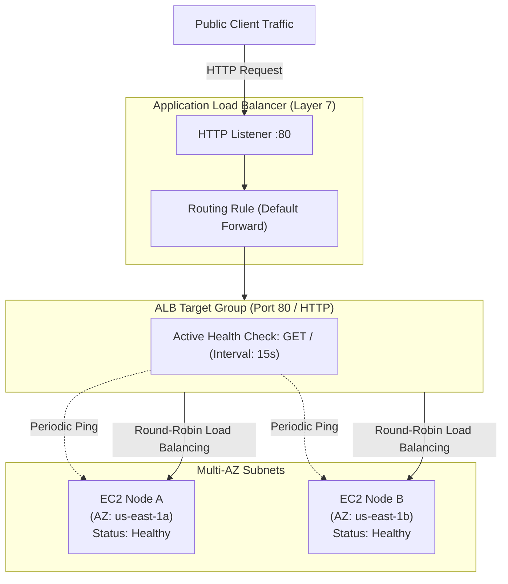

<div align="center">

# 🔬 Lab 5.2: Application Load Balancer (ALB), Target Groups & Health Checks

**[🏠 AWS Labs Root](../../../README.md)** &nbsp;•&nbsp; **[🖥️ EC2 Curriculum](../../README.md)** &nbsp;•&nbsp; **[📂 Module 05](../README.md)**

   

**[⬅️ Previous Lab](../../module-05-ha-asg-alb/lab-01-launch-templates/README.md)** &nbsp;|&nbsp; **[➡️ Next Lab](../../module-05-ha-asg-alb/lab-03-asg-dynamic-scaling/README.md)**

</div>

---

## 📌 Lab Objectives

- [x] Deploy an internet-facing **Application Load Balancer (ALB)** across multiple Availability Zones.
- [x] Configure an **ALB Target Group** with custom HTTP health check thresholds and connection draining (**deregistration delay**).
- [x] Register EC2 instances across different Availability Zones and monitor target health states (`healthy`, `unhealthy`, `draining`).
- [x] Test Layer-7 request load balancing and observe round-robin distribution.

---

## 🏗️ Architecture Diagram


<details>
<summary>📐 <b>View Mermaid Architecture Source (Click to Expand)</b></summary>



</details>

---

## 💡 Key Architectural Concepts

1. **Target Group Health Checks**:
   - The ALB periodically sends HTTP requests to each registered target.
   - If a target fails consecutive checks matching `UnhealthyThresholdCount`, the ALB stops routing traffic to it immediately.
2. **Deregistration Delay (Connection Draining)**:
   - When an instance is removed or deregistered, the ALB stops sending *new* requests but gives active in-flight requests a graceful window (default 300 seconds, customizable down to 5 seconds) to complete.
3. **Cross-Zone Load Balancing**:
   - ALBs distribute traffic evenly across all registered targets in all enabled Availability Zones, regardless of which AZ received the client connection.

---

## ⏱️ Prerequisites & Cost

> [!WARNING]
> **Paid Instance / Storage Notice**
> - **Cost Warning**: ALBs are billed at ~$0.0225/hour plus LCU usage. Run the test and execute teardown promptly (estimated cost < $0.05).
> - **Estimated Duration**: 20 minutes.

---

## 🚀 Step-by-Step Instructions

### Step 1: Launch Two Web Server Instances Across Separate AZs
```bash
export AWS_REGION=$(aws configure get region || echo "us-east-1")
export VPC_ID=$(aws ec2 describe-vpcs \
  --filters "Name=isDefault,Values=true" \
  --query "Vpcs[0].VpcId" \
  --output text)

SUBNET_1=$(aws ec2 describe-subnets \
  --filters "Name=vpc-id,Values=${VPC_ID}" \
  --query "Subnets[0].SubnetId" \
  --output text)
SUBNET_2=$(aws ec2 describe-subnets \
  --filters "Name=vpc-id,Values=${VPC_ID}" \
  --query "Subnets[1].SubnetId" \
  --output text)

AMI_ID=$(aws ssm get-parameter \
  --name "/aws/service/ami-amazon-linux-latest/al2023-ami-kernel-default-x86_64" \
  --query "Parameter.Value" --output text)

# Launch Node A (Subnet 1)
NODE_A_ID=$(aws ec2 run-instances \
  --image-id "${AMI_ID}" \
  --instance-type "t3.micro" \
  --subnet-id "${SUBNET_1}" \
  --user-data "#!/bin/bash
dnf install -y nginx
echo 'Server: NODE-A' > /usr/share/nginx/html/index.html
systemctl start nginx" \
  --tag-specifications "ResourceType=instance,Tags=[{Key=Project,Value=ec2-master-labs},{Key=Name,Value=node-a}]" \
  --query "Instances[0].InstanceId" --output text)

# Launch Node B (Subnet 2)
NODE_B_ID=$(aws ec2 run-instances \
  --image-id "${AMI_ID}" \
  --instance-type "t3.micro" \
  --subnet-id "${SUBNET_2}" \
  --user-data "#!/bin/bash
dnf install -y nginx
echo 'Server: NODE-B' > /usr/share/nginx/html/index.html
systemctl start nginx" \
  --tag-specifications "ResourceType=instance,Tags=[{Key=Project,Value=ec2-master-labs},{Key=Name,Value=node-b}]" \
  --query "Instances[0].InstanceId" --output text)

echo "Waiting for instances to boot..."
aws ec2 wait instance-running --instance-ids "${NODE_A_ID}" "${NODE_B_ID}"
```

### Step 2: Create Security Group for ALB
```bash
ALB_SG_ID=$(aws ec2 create-security-group \
  --group-name "alb-lab-sg" \
  --description "Inbound HTTP for Application Load Balancer" \
  --vpc-id "${VPC_ID}" \
  --query "GroupId" --output text)

aws ec2 authorize-security-group-ingress \
  --group-id "${ALB_SG_ID}" \
  --protocol tcp \
  --port 80 \
  --cidr 0.0.0.0/0
```

### Step 3: Create Target Group with Custom Health Check
```bash
TG_ARN=$(aws elbv2 create-target-group \
  --name "tg-ec2-labs" \
  --protocol HTTP \
  --port 80 \
  --vpc-id "${VPC_ID}" \
  --health-check-protocol HTTP \
  --health-check-path "/" \
  --health-check-interval-seconds 15 \
  --healthy-threshold-count 2 \
  --unhealthy-threshold-count 2 \
  --target-type instance \
  --query "TargetGroups[0].TargetGroupArn" --output text)

# Set Deregistration Delay to 30 seconds for fast draining in labs:
aws elbv2 modify-target-group-attributes \
  --target-group-arn "${TG_ARN}" \
  --attributes "Key=deregistration_delay.timeout_seconds,Value=30"

echo "Created Target Group: ${TG_ARN}"
```

### Step 4: Register Instances to Target Group
```bash
aws elbv2 register-targets \
  --target-group-arn "${TG_ARN}" \
  --targets "Id=${NODE_A_ID}" "Id=${NODE_B_ID}"

echo "Registered nodes with Target Group."
```

### Step 5: Provision Application Load Balancer & Listener
```bash
ALB_ARN=$(aws elbv2 create-load-balancer \
  --name "alb-ec2-labs" \
  --subnets "${SUBNET_1}" "${SUBNET_2}" \
  --security-groups "${ALB_SG_ID}" \
  --scheme internet-facing \
  --type application \
  --query "LoadBalancers[0].LoadBalancerArn" --output text)

echo "Waiting for ALB to become active..."
aws elbv2 wait load-balancer-available --load-balancer-arns "${ALB_ARN}"

# Create Listener forwarding to Target Group
LISTENER_ARN=$(aws elbv2 create-listener \
  --load-balancer-arn "${ALB_ARN}" \
  --protocol HTTP \
  --port 80 \
  --default-actions "Type=forward,TargetGroupArn=${TG_ARN}" \
  --query "Listeners[0].ListenerArn" --output text)

ALB_DNS=$(aws elbv2 describe-load-balancers \
  --load-balancer-arns "${ALB_ARN}" \
  --query "LoadBalancers[0].DNSName" --output text)

echo "ALB Ready at: http://${ALB_DNS}"
```

---

## 🔍 Verification & Testing

### 1. Wait for Targets to Become Healthy
```bash
aws elbv2 describe-target-health \
  --target-group-arn "${TG_ARN}" \
  --query "TargetHealthDescriptions[*].[Target.Id,TargetHealth.State]" \
  --output table
```
Wait until both targets display `healthy`.

### 2. Test Load Balancing Distribution
Send repeated curl requests to the ALB DNS name:
```bash
for i in {1..6}; do
  curl -s "http://${ALB_DNS}"
done
```
**Expected Output**: Alternating responses:
```text
Server: NODE-A
Server: NODE-B
Server: NODE-A
Server: NODE-B
...
```

---

## 📘 Deep-Dive Command & Flag Reference

> [!TIP]
> **Line-by-Line Production Analysis**: Every command executed in this lab is dissected below, explaining each CLI flag, JMESPath query, Linux kernel parameter, and why it is critical in production automation.

<details open>
<summary>📘 <b>Command 1: Creating an ALB Target Group with Custom Health Checks</b></summary>

```bash
TG_ARN=$(aws elbv2 create-target-group \
  --name "tg-ec2-labs" \
  --protocol HTTP \
  --port 80 \
  --vpc-id "${VPC_ID}" \
  --health-check-protocol HTTP \
  --health-check-path "/" \
  --health-check-interval-seconds 15 \
  --healthy-threshold-count 2 \
  --unhealthy-threshold-count 2 \
  --target-type instance \
  --query "TargetGroups[0].TargetGroupArn" --output text)
```

#### 🔍 Parameter & Component Breakdown

- **`aws elbv2 create-target-group`** — Defines a logical pool of destination compute backends (EC2 instances, IP addresses, or Lambda functions) that receive routed traffic.

- **`--protocol HTTP` & `--port 80`** — The protocol and port the load balancer uses to forward traffic to the target instances.

- Health Check Configurations:
  - **`--health-check-path "/"`** — The URI endpoint queried by the ALB to verify backend application health.
  - **`--health-check-interval-seconds 15`** — ALB nodes query the health check endpoint every 15 seconds.
  - **`--unhealthy-threshold-count 2`** — If a target fails 2 consecutive checks, the ALB immediately marks it `unhealthy` and ceases routing traffic to it.
  - **`--healthy-threshold-count 2`** — A recovering instance must pass 2 consecutive checks before the ALB resumes routing traffic to it.

- **`--target-type instance`** — Targets are identified by EC2 Instance ID.
*Alternative*: `ip` (used for microservices running in Docker containers, ECS tasks, or Kubernetes Pods on AWS VPC CNI).

> 🏭 **Why This Matters in Production Automation**
> Target Groups decouple traffic ingress from specific compute backends. Fast health check intervals (15s interval, 2 thresholds) ensure that crashed backend nodes are ejected from service in 30 seconds rather than lingering for minutes.

</details>

<details open>
<summary>📘 <b>Command 2: Tuning Connection Draining (Deregistration Delay)</b></summary>

```bash
aws elbv2 modify-target-group-attributes \
  --target-group-arn "${TG_ARN}" \
  --attributes "Key=deregistration_delay.timeout_seconds,Value=30"
```

#### 🔍 Parameter & Component Breakdown

- **`deregistration_delay.timeout_seconds`** — Controls **Connection Draining**.
When an instance is deregistered (e.g. during a deployment, auto scaling scale-in, or manual termination):  
1. The ALB immediately stops routing *new* connections to that target.  
2. The ALB keeps existing, in-flight HTTP connections alive for up to `Value` seconds, allowing active requests to complete gracefully.  
3. Default AWS timeout is **300 seconds** (5 minutes). Setting this to **30 seconds** accelerates CI/CD blue/green deployments and test suites.

> 🏭 **Why This Matters in Production Automation**
> Without connection draining, terminating or replacing an instance immediately severs active TCP sockets, throwing HTTP 502 Bad Gateway or 504 Gateway Timeout errors to active users.

</details>

<details open>
<summary>📘 <b>Command 3: Provisioning the Application Load Balancer</b></summary>

```bash
ALB_ARN=$(aws elbv2 create-load-balancer \
  --name "alb-ec2-labs" \
  --subnets "${SUBNET_1}" "${SUBNET_2}" \
  --security-groups "${ALB_SG_ID}" \
  --scheme internet-facing \
  --type application \
  --query "LoadBalancers[0].LoadBalancerArn" --output text)
```

#### 🔍 Parameter & Component Breakdown

- **`aws elbv2 create-load-balancer`** — Provisions a dedicated Layer 7 Application Load Balancer.

- **`--subnets "${SUBNET_1}" "${SUBNET_2}"`** — **Mandatory Multi-AZ Rule**:
An Application Load Balancer **must be configured with at least two subnets located in different Availability Zones**. AWS deploys managed load balancer nodes across these zones to ensure high availability.

- **`--scheme internet-facing`** — Assigns publicly routable IP addresses and public DNS names to the ALB nodes.
*Alternative*: `internal` (used for private microservice meshes with internal-only VPC routing).

- **`--type application`** — Operates at OSI Layer 7 (HTTP/HTTPS), supporting URL path routing, host routing, HTTP headers, and WebSockets.

> 🏭 **Why This Matters in Production Automation**
> ALBs automatically scale their internal capacity up and down to handle millions of requests per second, abstracting DNS round-robin and multi-datacenter failover seamlessly.

</details>

<details open>
<summary>📘 <b>Command 4: Creating the HTTP Listener</b></summary>

```bash
LISTENER_ARN=$(aws elbv2 create-listener \
  --load-balancer-arn "${ALB_ARN}" \
  --protocol HTTP \
  --port 80 \
  --default-actions "Type=forward,TargetGroupArn=${TG_ARN}" \
  --query "Listeners[0].ListenerArn" --output text)
```

#### 🔍 Parameter & Component Breakdown

- **`aws elbv2 create-listener`** — Binds a listening process to the public front door of the load balancer on port 80.

- **`--default-actions "Type=forward,TargetGroupArn=${TG_ARN}"`** — Defines the default rule: any incoming request matching port 80 is forwarded directly to the backend compute instances registered in the Target Group.

> 🏭 **Why This Matters in Production Automation**
> Listeners can be configured with complex routing rule trees (e.g. forwarding `/api/*` to an API Target Group, `/static/*` to S3, and issuing automatic HTTP-to-HTTPS 301 redirects).

</details>

---

## 🧹 Teardown & Clean-up


> [!CAUTION]
> **Always Tear Down Lab Resources**: Execute the cleanup commands below immediately after completing the verification steps to prevent unintended AWS billing.

```bash
# 1. Delete ALB and Listener
aws elbv2 delete-load-balancer --load-balancer-arn "${ALB_ARN}"
sleep 10
aws elbv2 delete-target-group --target-group-arn "${TG_ARN}"

# 2. Terminate instances
aws ec2 terminate-instances --instance-ids "${NODE_A_ID}" "${NODE_B_ID}"
aws ec2 wait instance-terminated --instance-ids "${NODE_A_ID}" "${NODE_B_ID}"

# 3. Delete Security Group
aws ec2 delete-security-group --group-id "${ALB_SG_ID}"

echo "Lab 5.2 clean-up completed successfully."
```

---

<div align="center">

**[⬅️ Previous Lab](../../module-05-ha-asg-alb/lab-01-launch-templates/README.md)** &nbsp;•&nbsp; **[⬆️ Back to Module 05](../README.md)** &nbsp;•&nbsp; **[🏠 EC2 Index](../../README.md)** &nbsp;•&nbsp; **[➡️ Next Lab](../../module-05-ha-asg-alb/lab-03-asg-dynamic-scaling/README.md)**

</div>
