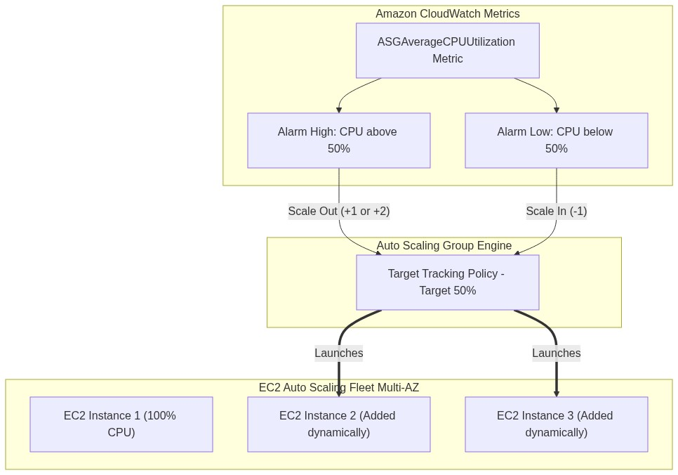
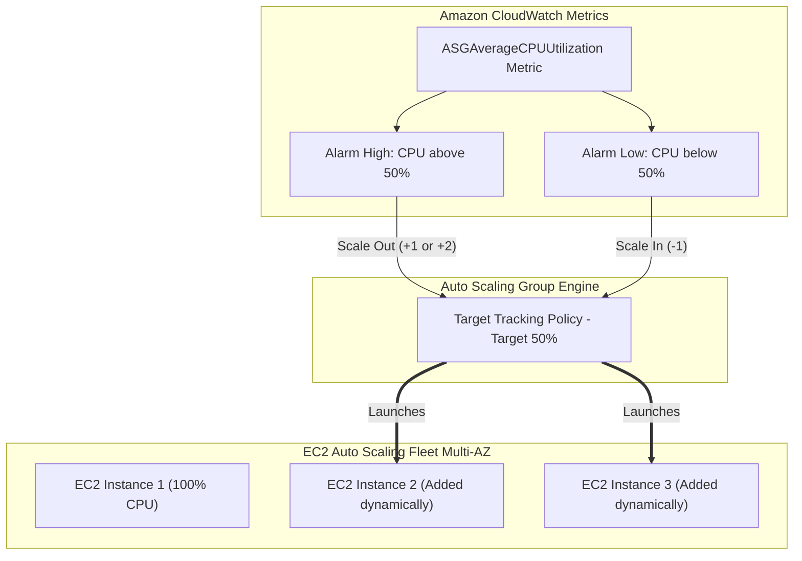

# Lab 5.3: Auto Scaling Groups (ASG) & Target Tracking Dynamic Scaling

## 📌 Lab Objectives
- Deploy an **Auto Scaling Group (ASG)** spanning multiple Availability Zones.
- Configure capacity boundaries: `MinSize=1`, `MaxSize=4`, `DesiredCapacity=1`.
- Implement a **Target Tracking Scaling Policy** based on average CPU utilization (`ASGAverageCPUUtilization=50%`).
- Induce a simulated CPU workload using `stress-ng` and observe automated scale-out and subsequent cooldown scale-in.

---

## 🏗️ Architecture Diagram



<details>
<summary>Click to expand Mermaid diagram source</summary>


<details>
<summary>Click to expand Mermaid diagram source</summary>


</details>
</details>

---

## 💡 Key Architectural Concepts

1. **Target Tracking Scaling**:
   - Like a thermostat: You specify a target metric (e.g. 50% average CPU utilization), and AWS automatically creates the scale-out and scale-in CloudWatch alarms, calculating the precise number of instances needed.
2. **Default Instance Warmup & Cooldown**:
   - Warmup time ensures newly launched instances have enough time to boot, run User Data, and stabilize before their metrics contribute to the group average.
3. **Availability Zone Rebalancing**:
   - The ASG continuously attempts to distribute instances equally across all configured subnets/AZs to maximize fault tolerance.

---

## ⏱️ Prerequisites & Cost
- **AWS Free Tier Eligible**: Yes (`t3.micro` instances). Ensure termination after the test to avoid exceeding free-tier hours.
- **Estimated Duration**: 25 minutes.

---

## 🚀 Step-by-Step Instructions

### Step 1: Create a Launch Template for the ASG Fleet
```bash
export AWS_REGION=$(aws configure get region || echo "us-east-1")
export VPC_ID=$(aws ec2 describe-vpcs --filters "Name=isDefault,Values=true" --query "Vpcs[0].VpcId" --output text)
SUBNET_1=$(aws ec2 describe-subnets --filters "Name=vpc-id,Values=${VPC_ID}" --query "Subnets[0].SubnetId" --output text)
SUBNET_2=$(aws ec2 describe-subnets --filters "Name=vpc-id,Values=${VPC_ID}" --query "Subnets[1].SubnetId" --output text)

AMI_ID=$(aws ssm get-parameter \
  --name "/aws/service/ami-amazon-linux-latest/al2023-ami-kernel-default-x86_64" \
  --query "Parameter.Value" --output text)

USERDATA_B64=$(echo -n '#!/bin/bash
dnf install -y stress-ng
echo "Worker Node Ready" > /tmp/ready.txt' | base64)

cat <<JSON > asg-template.json
{
  "ImageId": "${AMI_ID}",
  "InstanceType": "t3.micro",
  "UserData": "${USERDATA_B64}",
  "MetadataOptions": {
    "HttpEndpoint": "enabled",
    "HttpTokens": "required"
  },
  "TagSpecifications": [
    {
      "ResourceType": "instance",
      "Tags": [
        {"Key": "Project", "Value": "ec2-master-labs"},
        {"Key": "Role", "Value": "asg-worker"}
      ]
    }
  ]
}
JSON

TEMPLATE_ID=$(aws ec2 create-launch-template \
  --launch-template-name "asg-scaling-template" \
  --launch-template-data file://asg-template.json \
  --query "LaunchTemplate.LaunchTemplateId" --output text)
```

### Step 2: Create the Auto Scaling Group
```bash
aws autoscaling create-auto-scaling-group \
  --auto-scaling-group-name "asg-dynamic-scaling-demo" \
  --launch-template "LaunchTemplateId=${TEMPLATE_ID},Version=\$Latest" \
  --min-size 1 \
  --max-size 3 \
  --desired-capacity 1 \
  --vpc-zone-identifier "${SUBNET_1},${SUBNET_2}" \
  --default-instance-warmup 60 \
  --tags "Key=Project,Value=ec2-master-labs,PropagateAtLaunch=true"

echo "Created ASG with DesiredCapacity=1."
```

### Step 3: Attach Target Tracking Scaling Policy (CPU 50%)
```bash
cat <<JSON > target-tracking.json
{
  "TargetValue": 50.0,
  "PredefinedMetricSpecification": {
    "PredefinedMetricType": "ASGAverageCPUUtilization"
  },
  "DisableScaleIn": false
}
JSON

POLICY_ARN=$(aws autoscaling put-scaling-policy \
  --auto-scaling-group-name "asg-dynamic-scaling-demo" \
  --policy-name "cpu-50-target-tracking" \
  --policy-type "TargetTrackingScaling" \
  --target-tracking-configuration file://target-tracking.json \
  --query "PolicyARN" --output text)

echo "Attached Target Tracking Scaling Policy: ${POLICY_ARN}"
```

---

## 🔍 Verification & Load Injection

### 1. Identify Running Instance in ASG
```bash
INSTANCE_ID=$(aws autoscaling describe-auto-scaling-groups \
  --auto-scaling-group-names "asg-dynamic-scaling-demo" \
  --query "AutoScalingGroups[0].Instances[0].InstanceId" --output text)

echo "Active ASG Node: ${INSTANCE_ID}"
```

### 2. Inject 100% CPU Load via SSM Command
Run `stress-ng` on the single running instance for 5 minutes to simulate heavy traffic:
```bash
aws ssm send-command \
  --instance-ids "${INSTANCE_ID}" \
  --document-name "AWS-RunShellScript" \
  --parameters 'commands=["stress-ng --cpu 2 --timeout 300s &"]'
```

### 3. Monitor Auto Scaling Activity
Within 2-3 minutes, CloudWatch detects average CPU > 50% and automatically initiates scale-out:
```bash
aws autoscaling describe-scaling-activities \
  --auto-scaling-group-name "asg-dynamic-scaling-demo" \
  --query "Activities[0].[Description,Progress,StatusCode]" \
  --output table
```
You will see: `Launching a new EC2 instance: i-xxxxxx`.
Capacity will automatically jump to 2 or 3 instances!

---

## 🧹 Teardown & Clean-up

```bash
# 1. Update ASG to 0 instances for fast termination
aws autoscaling update-auto-scaling-group \
  --auto-scaling-group-name "asg-dynamic-scaling-demo" \
  --min-size 0 \
  --desired-capacity 0

echo "Waiting for ASG instances to terminate..."
sleep 30

# 2. Delete ASG
aws autoscaling delete-auto-scaling-group \
  --auto-scaling-group-name "asg-dynamic-scaling-demo" \
  --force-delete

# 3. Delete Launch Template
aws ec2 delete-launch-template --launch-template-id "${TEMPLATE_ID}"
rm -f asg-template.json target-tracking.json

echo "Lab 5.3 clean-up completed successfully."
```
