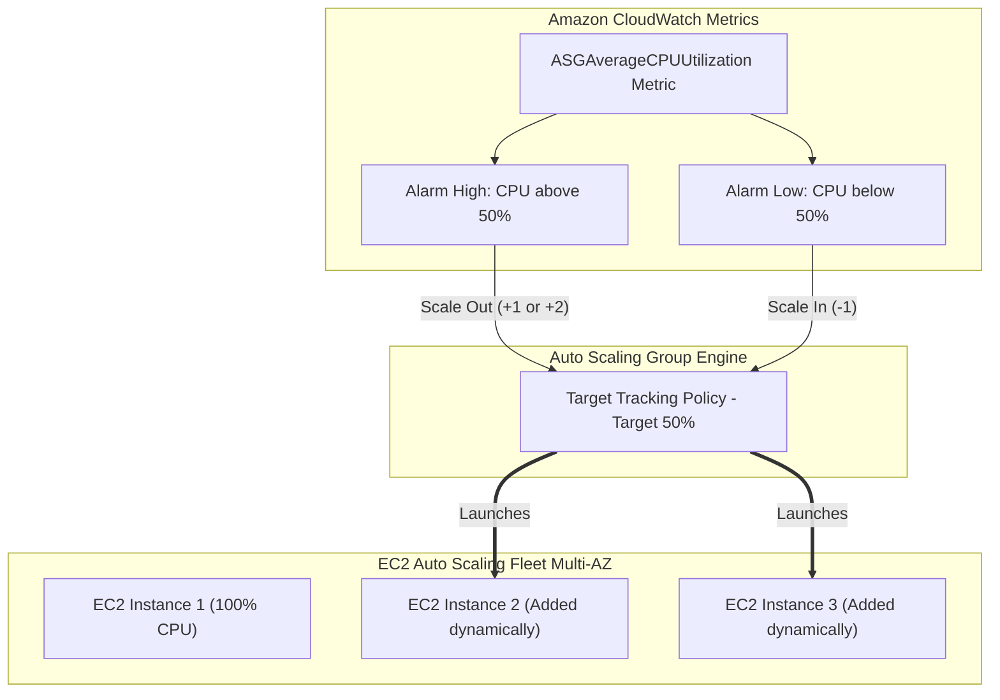

<div align="center">

# 🔬 Lab 5.3: Auto Scaling Groups (ASG) & Target Tracking Dynamic Scaling

**[🏠 AWS Labs Root](../../../README.md)** &nbsp;•&nbsp; **[🖥️ EC2 Curriculum](../../README.md)** &nbsp;•&nbsp; **[📂 Module 05](../README.md)**

   

**[⬅️ Previous Lab](../../module-05-ha-asg-alb/lab-02-alb-and-target-groups/README.md)** &nbsp;|&nbsp; **[➡️ Next Lab](../../module-05-ha-asg-alb/lab-04-asg-lifecycle-hooks/README.md)**

</div>

---

## 📌 Lab Objectives

- [x] Deploy an **Auto Scaling Group (ASG)** spanning multiple Availability Zones.
- [x] Configure capacity boundaries: `MinSize=1`, `MaxSize=4`, `DesiredCapacity=1`.
- [x] Implement a **Target Tracking Scaling Policy** based on average CPU utilization (`ASGAverageCPUUtilization=50%`).
- [x] Induce a simulated CPU workload using `stress-ng` and observe automated scale-out and subsequent cooldown scale-in.

---

## 🏗️ Architecture Diagram


<details>
<summary>📐 <b>View Mermaid Architecture Source (Click to Expand)</b></summary>



</details>

---

## 💡 Key Architectural Concepts

1. **Target Tracking Scaling**:
   - Like a thermostat: You specify a target metric (e.g. 50% average CPU utilization), and AWS automatically creates the scale-out and scale-in CloudWatch alarms, calculating the precise number of instances needed.
2. **Default Instance Warmup & Cooldown**:
   - Warmup time ensures newly launched instances have enough time to boot, run User Data, and stabilize before their metrics contribute to the group average.
3. **Availability Zone Rebalancing**:
   - The ASG continuously attempts to distribute instances equally across all configured subnets/AZs to maximize fault tolerance.

---

## ⏱️ Prerequisites & Cost

> [!TIP]
> **AWS Free Tier & Cost Guardrail**
> - **AWS Free Tier Eligible**: Yes (`t3.micro` instances). Ensure termination after the test to avoid exceeding free-tier hours.
> - **Estimated Duration**: 25 minutes.

---

## 🚀 Step-by-Step Instructions

### Step 1: Create a Launch Template for the ASG Fleet
```bash
export AWS_REGION=$(aws configure get region || echo "us-east-1")
export VPC_ID=$(aws ec2 describe-vpcs \
  --filters "Name=isDefault,Values=true" \
  --query "Vpcs[0].VpcId" \
  --output text)
SUBNET_1=$(aws ec2 describe-subnets \
  --filters "Name=vpc-id,Values=${VPC_ID}" \
  --query "Subnets[0].SubnetId" \
  --output text)
SUBNET_2=$(aws ec2 describe-subnets \
  --filters "Name=vpc-id,Values=${VPC_ID}" \
  --query "Subnets[1].SubnetId" \
  --output text)

AMI_ID=$(aws ssm get-parameter \
  --name "/aws/service/ami-amazon-linux-latest/al2023-ami-kernel-default-x86_64" \
  --query "Parameter.Value" --output text)

USERDATA_B64=$(echo -n '#!/bin/bash
dnf install -y stress-ng
echo "Worker Node Ready" > /tmp/ready.txt' | base64)

cat <<JSON > asg-template.json
{
  "ImageId": "${AMI_ID}",
  "InstanceType": "t3.micro",
  "UserData": "${USERDATA_B64}",
  "MetadataOptions": {
    "HttpEndpoint": "enabled",
    "HttpTokens": "required"
  },
  "TagSpecifications": [
    {
      "ResourceType": "instance",
      "Tags": [
        {"Key": "Project", "Value": "ec2-master-labs"},
        {"Key": "Role", "Value": "asg-worker"}
      ]
    }
  ]
}
JSON

TEMPLATE_ID=$(aws ec2 create-launch-template \
  --launch-template-name "asg-scaling-template" \
  --launch-template-data file://asg-template.json \
  --query "LaunchTemplate.LaunchTemplateId" --output text)
```

### Step 2: Create the Auto Scaling Group
```bash
aws autoscaling create-auto-scaling-group \
  --auto-scaling-group-name "asg-dynamic-scaling-demo" \
  --launch-template "LaunchTemplateId=${TEMPLATE_ID},Version=\$Latest" \
  --min-size 1 \
  --max-size 3 \
  --desired-capacity 1 \
  --vpc-zone-identifier "${SUBNET_1},${SUBNET_2}" \
  --default-instance-warmup 60 \
  --tags "Key=Project,Value=ec2-master-labs,PropagateAtLaunch=true"

echo "Created ASG with DesiredCapacity=1."
```

### Step 3: Attach Target Tracking Scaling Policy (CPU 50%)
```bash
cat <<JSON > target-tracking.json
{
  "TargetValue": 50.0,
  "PredefinedMetricSpecification": {
    "PredefinedMetricType": "ASGAverageCPUUtilization"
  },
  "DisableScaleIn": false
}
JSON

POLICY_ARN=$(aws autoscaling put-scaling-policy \
  --auto-scaling-group-name "asg-dynamic-scaling-demo" \
  --policy-name "cpu-50-target-tracking" \
  --policy-type "TargetTrackingScaling" \
  --target-tracking-configuration file://target-tracking.json \
  --query "PolicyARN" --output text)

echo "Attached Target Tracking Scaling Policy: ${POLICY_ARN}"
```

---

## 🔍 Verification & Load Injection

### 1. Identify Running Instance in ASG
```bash
INSTANCE_ID=$(aws autoscaling describe-auto-scaling-groups \
  --auto-scaling-group-names "asg-dynamic-scaling-demo" \
  --query "AutoScalingGroups[0].Instances[0].InstanceId" --output text)

echo "Active ASG Node: ${INSTANCE_ID}"
```

### 2. Inject 100% CPU Load via SSM Command
Run `stress-ng` on the single running instance for 5 minutes to simulate heavy traffic:
```bash
aws ssm send-command \
  --instance-ids "${INSTANCE_ID}" \
  --document-name "AWS-RunShellScript" \
  --parameters 'commands=["stress-ng --cpu 2 --timeout 300s &"]'
```

### 3. Monitor Auto Scaling Activity
Within 2-3 minutes, CloudWatch detects average CPU > 50% and automatically initiates scale-out:
```bash
aws autoscaling describe-scaling-activities \
  --auto-scaling-group-name "asg-dynamic-scaling-demo" \
  --query "Activities[0].[Description,Progress,StatusCode]" \
  --output table
```
You will see: `Launching a new EC2 instance: i-xxxxxx`.
Capacity will automatically jump to 2 or 3 instances!

---

## 📘 Deep-Dive Command & Flag Reference

> [!TIP]
> **Line-by-Line Production Analysis**: Every command executed in this lab is dissected below, explaining each CLI flag, JMESPath query, Linux kernel parameter, and why it is critical in production automation.

<details open>
<summary>📘 <b>Command 1: Discovering Network Subnets and AWS Region</b></summary>

```bash
export AWS_REGION=$(aws configure get region || echo "us-east-1")
export VPC_ID=$(aws ec2 describe-vpcs \
  --filters "Name=isDefault,Values=true" \
  --query "Vpcs[0].VpcId" \
  --output text)
SUBNET_1=$(aws ec2 describe-subnets \
  --filters "Name=vpc-id,Values=${VPC_ID}" \
  --query "Subnets[0].SubnetId" \
  --output text)
SUBNET_2=$(aws ec2 describe-subnets \
  --filters "Name=vpc-id,Values=${VPC_ID}" \
  --query "Subnets[1].SubnetId" \
  --output text)
```

#### 🔍 Parameter & Component Breakdown
- **`export AWS_REGION=...`** — Queries the default region from local AWS CLI configuration profile (`~/.aws/config`). If not set, falls back to `us-east-1`.
- **`aws ec2 describe-vpcs --filters "Name=isDefault,Values=true"`** — Filters VPCs to discover the default AWS VPC created in the region.
- **`--query "Vpcs[0].VpcId" --output text`** — Extracts the raw VPC identifier string (e.g., `vpc-0123456789abcdef0`).
- **`aws ec2 describe-subnets --filters "Name=vpc-id,Values=${VPC_ID}"`** — Lists all subnets provisioned inside the target VPC.
- **`--query "Subnets[0].SubnetId"` and `--query "Subnets[1].SubnetId"`** — Pulls two distinct subnet IDs residing in different Availability Zones within the default VPC.

> 🏭 **Why This Matters in Production Automation**
> An Auto Scaling Group achieves high availability only when distributed across multiple Availability Zones. Passing multiple subnet IDs ensures that EC2 instances launched by the ASG are balanced across physical AZs, mitigating localized infrastructure outages.

</details>

<details open>
<summary>📘 <b>Command 2: Querying the Latest Amazon Linux 2023 AMI</b></summary>

```bash
AMI_ID=$(aws ssm get-parameter \
  --name "/aws/service/ami-amazon-linux-latest/al2023-ami-kernel-default-x86_64" \
  --query "Parameter.Value" --output text)
```

#### 🔍 Parameter & Component Breakdown
- **`aws ssm get-parameter`** — Retrieves a configuration parameter from AWS Systems Manager Parameter Store.
- **`--name "/aws/service/ami-amazon-linux-latest/..."`** — AWS-maintained public SSM parameter path that dynamically references the newest AL2023 x86_64 AMI ID.
- **`--query "Parameter.Value" --output text`** — Extracts solely the AMI ID string (e.g., `ami-0c101f26f147fa7fd`).

> 🏭 **Why This Matters in Production Automation**
> Hardcoding AMI IDs leads to stale base images, missing critical security kernel patches, and region migration failures. Querying AWS SSM public alias paths guarantees that the ASG launches instances with up-to-date patched operating system baselines.

</details>

<details open>
<summary>📘 <b>Command 3: Base64 Encoding the Worker Bootstrap Script</b></summary>

```bash
USERDATA_B64=$(echo -n '#!/bin/bash
dnf install -y stress-ng
echo "Worker Node Ready" > /tmp/ready.txt' | base64)
```

#### 🔍 Parameter & Component Breakdown
- **`echo -n '...'`** — Emits the bash script without trailing newlines. The script uses Amazon Linux 2023's package manager (`dnf`) to install `stress-ng` for CPU load generation.
- **`| base64`** — Encodes the raw script into a Base64-encoded ASCII string.
- **`USERDATA_B64=...`** — Captures the encoded string into a shell variable for injection into JSON payloads.

> 🏭 **Why This Matters in Production Automation**
> EC2 Launch Templates and the EC2 API require UserData scripts to be Base64-encoded when defined via JSON payloads. Automated installation of testing tools or worker agents allows newly scaled instances to be immediately operational.

</details>

<details open>
<summary>📘 <b>Command 4 & 5: Creating the Launch Template for the ASG</b></summary>

```bash
cat <<JSON > asg-template.json
{
  "ImageId": "${AMI_ID}",
  "InstanceType": "t3.micro",
  "UserData": "${USERDATA_B64}",
  "MetadataOptions": {
    "HttpEndpoint": "enabled",
    "HttpTokens": "required"
  },
  "TagSpecifications": [
    {
      "ResourceType": "instance",
      "Tags": [
        {"Key": "Project", "Value": "ec2-master-labs"},
        {"Key": "Role", "Value": "asg-worker"}
      ]
    }
  ]
}
JSON

TEMPLATE_ID=$(aws ec2 create-launch-template \
  --launch-template-name "asg-scaling-template" \
  --launch-template-data file://asg-template.json \
  --query "LaunchTemplate.LaunchTemplateId" --output text)
```

#### 🔍 Parameter & Component Breakdown
- **`cat <<JSON > asg-template.json`** — Heredoc constructing the Launch Template configuration JSON.
- **`"MetadataOptions": {"HttpTokens": "required"}`** — Strictly enforces IMDSv2 (session-token based metadata service) on all ASG instances.
- **`"TagSpecifications"`** — Tags applied to instances at boot time for cost attribution and IAM resource-level access control.
- **`aws ec2 create-launch-template`** — Creates a versioned launch template blueprint.
- **`--launch-template-name "asg-scaling-template"`** — Identifies the template.
- **`--launch-template-data file://asg-template.json`** — Supplies the JSON configuration.
- **`--query "LaunchTemplate.LaunchTemplateId" --output text`** — Captures the template ID (e.g., `lt-0123456789abcdef0`).

> 🏭 **Why This Matters in Production Automation**
> Launch Configurations are deprecated; Launch Templates provide modern capabilities including mixed instances policies, Spot allocations, versioning, and mandatory IMDSv2 enforcement.

</details>

<details open>
<summary>📘 <b>Command 6: Creating the Auto Scaling Group</b></summary>

```bash
aws autoscaling create-auto-scaling-group \
  --auto-scaling-group-name "asg-dynamic-scaling-demo" \
  --launch-template "LaunchTemplateId=${TEMPLATE_ID},Version=\$Latest" \
  --min-size 1 \
  --max-size 3 \
  --desired-capacity 1 \
  --vpc-zone-identifier "${SUBNET_1},${SUBNET_2}" \
  --default-instance-warmup 60 \
  --tags "Key=Project,Value=ec2-master-labs,PropagateAtLaunch=true"
```

#### 🔍 Parameter & Component Breakdown
- **`aws autoscaling create-auto-scaling-group`** — Provisions a managed pool of EC2 instances.
- **`--auto-scaling-group-name`** — Unique name for the group within the AWS account and region.
- **`--launch-template "LaunchTemplateId=${TEMPLATE_ID},Version=\$Latest"`** — Points the ASG to the created template, automatically using the `$Latest` version when updated. Escaping `\$` prevents bash from expanding `$Latest`.
- **`--min-size 1`** — Lower operational boundary; the group will never terminate instances below 1 node.
- **`--max-size 3`** — Upper operational boundary; limits scaling to 3 nodes to cap infrastructure costs.
- **`--desired-capacity 1`** — Initial target instance count upon creation.
- **`--vpc-zone-identifier "${SUBNET_1},${SUBNET_2}"`** — Comma-separated list of multi-AZ subnets where instances will be launched.
- **`--default-instance-warmup 60`** — Number of seconds (60s) before a newly launched instance contributes its metrics to CloudWatch aggregation.
- **`--tags "Key=Project,...,PropagateAtLaunch=true"`** — Propagates specified tags to child EC2 instances at launch time.

> 🏭 **Why This Matters in Production Automation**
> The ASG maintains fleet health by automatically replacing unhealthy instances and distributing instances across the subnets specified in `--vpc-zone-identifier`. The `--default-instance-warmup` prevents premature or cascading scale-outs while new instances are still bootstrapping.

</details>

<details open>
<summary>📘 <b>Command 7 & 8: Attaching the Target Tracking Scaling Policy</b></summary>

```bash
cat <<JSON > target-tracking.json
{
  "TargetValue": 50.0,
  "PredefinedMetricSpecification": {
    "PredefinedMetricType": "ASGAverageCPUUtilization"
  },
  "DisableScaleIn": false
}
JSON

POLICY_ARN=$(aws autoscaling put-scaling-policy \
  --auto-scaling-group-name "asg-dynamic-scaling-demo" \
  --policy-name "cpu-50-target-tracking" \
  --policy-type "TargetTrackingScaling" \
  --target-tracking-configuration file://target-tracking.json \
  --query "PolicyARN" --output text)
```

#### 🔍 Parameter & Component Breakdown
- **`"TargetValue": 50.0`** — The desired metric benchmark (50% average CPU utilization across all instances in the ASG).
- **`"PredefinedMetricSpecification": {"PredefinedMetricType": "ASGAverageCPUUtilization"}`** — Uses AWS's built-in aggregated CloudWatch metric for ASG CPU.
- **`"DisableScaleIn": false`** — Enables automatic scale-in when traffic subsides. Setting to `true` would keep capacity high once scaled out.
- **`aws autoscaling put-scaling-policy`** — Attaches or updates a scaling policy on the ASG.
- **`--policy-type "TargetTrackingScaling"`** — Specifies target tracking mode (analogous to a thermostat).
- **`--target-tracking-configuration file://target-tracking.json`** — Points to the configuration file.
- **`--query "PolicyARN" --output text`** — Captures the Amazon Resource Name (ARN) of the generated policy.

> 🏭 **Why This Matters in Production Automation**
> Unlike legacy Simple Scaling or Step Scaling policies where engineers must manually configure CloudWatch alarms, thresholds, and step adjustments, Target Tracking automatically creates and adjusts CloudWatch alarms in the background. It dynamically calculates the exact number of instances to add or remove to maintain the target metric.

</details>

<details open>
<summary>📘 <b>Command 9: Identifying the Running Instance in the ASG</b></summary>

```bash
INSTANCE_ID=$(aws autoscaling describe-auto-scaling-groups \
  --auto-scaling-group-names "asg-dynamic-scaling-demo" \
  --query "AutoScalingGroups[0].Instances[0].InstanceId" --output text)
```

#### 🔍 Parameter & Component Breakdown
- **`aws autoscaling describe-auto-scaling-groups`** — Inspects the real-time configuration and membership of the ASG.
- **`--auto-scaling-group-names "asg-dynamic-scaling-demo"`** — Filters for the specified group.
- **`--query "AutoScalingGroups[0].Instances[0].InstanceId" --output text`** — Extracts the instance ID of the initial active worker instance.

> 🏭 **Why This Matters in Production Automation**
> Verifies that the ASG successfully fulfilled its `DesiredCapacity=1` target and allows automated scripts to retrieve the specific instance target for testing or inspection.

</details>

<details open>
<summary>📘 <b>Command 10: Injecting CPU Load via AWS Systems Manager</b></summary>

```bash
aws ssm send-command \
  --instance-ids "${INSTANCE_ID}" \
  --document-name "AWS-RunShellScript" \
  --parameters 'commands=["stress-ng --cpu 2 --timeout 300s &"]'
```

#### 🔍 Parameter & Component Breakdown
- **`aws ssm send-command`** — Executes remote commands asynchronously on managed EC2 instances without requiring SSH keys or inbound firewall port openings.
- **`--instance-ids "${INSTANCE_ID}"`** — Directs execution to the target worker node.
- **`--document-name "AWS-RunShellScript"`** — Uses the standard AWS SSM document for executing arbitrary bash shell commands on Linux.
- **`--parameters 'commands=["stress-ng --cpu 2 --timeout 300s &"]'`** — Passes JSON-formatted shell commands. `stress-ng --cpu 2 --timeout 300s &` spawns 2 CPU stressors running in the background for 5 minutes (300 seconds), pegging CPU utilization at 100%.

> 🏭 **Why This Matters in Production Automation**
> Allows automated chaos engineering and performance load testing directly via the AWS control plane. Testing scaling policies under controlled simulated loads verifies that thresholds and scaling actions trigger reliably before going live.

</details>

<details open>
<summary>📘 <b>Command 11: Monitoring Auto Scaling Activities</b></summary>

```bash
aws autoscaling describe-scaling-activities \
  --auto-scaling-group-name "asg-dynamic-scaling-demo" \
  --query "Activities[0].[Description,Progress,StatusCode]" \
  --output table
```

#### 🔍 Parameter & Component Breakdown
- **`aws autoscaling describe-scaling-activities`** — Returns the log of recent scaling events, terminations, and launches initiated by the ASG engine.
- **`--query "Activities[0].[Description,Progress,StatusCode]"`** — Extracts the latest activity's description (e.g., "Launching a new EC2 instance..."), completion progress percentage, and status code (e.g., `Successful` or `InProgress`).
- **`--output table`** — Displays the extracted fields in a structured ASCII table.

> 🏭 **Why This Matters in Production Automation**
> Provides auditability and visibility into ASG decisions. If a scaling action fails (e.g., due to insufficient subnet IP addresses or EC2 vCPU service quotas), `describe-scaling-activities` outputs detailed error messages and status codes.

</details>

<details open>
<summary>📘 <b>Command 12, 13 & 14: Automated Teardown and Cleanup</b></summary>

```bash
aws autoscaling update-auto-scaling-group \
  --auto-scaling-group-name "asg-dynamic-scaling-demo" \
  --min-size 0 \
  --desired-capacity 0

sleep 30

aws autoscaling delete-auto-scaling-group \
  --auto-scaling-group-name "asg-dynamic-scaling-demo" \
  --force-delete

aws ec2 delete-launch-template --launch-template-id "${TEMPLATE_ID}"
rm -f asg-template.json target-tracking.json
```

#### 🔍 Parameter & Component Breakdown
- **`aws autoscaling update-auto-scaling-group ... --min-size 0 --desired-capacity 0`** — Shrinks the ASG to 0 nodes, initiating graceful termination of all EC2 instances.
- **`sleep 30`** — Allows AWS control plane 30 seconds to begin terminating instances.
- **`aws autoscaling delete-auto-scaling-group --force-delete`** — Permanently destroys the ASG. The `--force-delete` flag forces deletion even if instance termination is still finalizing in the background.
- **`aws ec2 delete-launch-template --launch-template-id "${TEMPLATE_ID}"`** — Removes the Launch Template blueprint.
- **`rm -f asg-template.json target-tracking.json`** — Cleans up local JSON payload configuration files.

> 🏭 **Why This Matters in Production Automation**
> Standard ASG deletion will fail if instances are still running and `--force-delete` is omitted. Gracefully updating desired capacity to 0 and forcing group cleanup ensures zero orphaned instances and eliminates recurring compute charges.

</details>

---

## 🧹 Teardown & Clean-up


> [!CAUTION]
> **Always Tear Down Lab Resources**: Execute the cleanup commands below immediately after completing the verification steps to prevent unintended AWS billing.

```bash
# 1. Update ASG to 0 instances for fast termination
aws autoscaling update-auto-scaling-group \
  --auto-scaling-group-name "asg-dynamic-scaling-demo" \
  --min-size 0 \
  --desired-capacity 0

echo "Waiting for ASG instances to terminate..."
sleep 30

# 2. Delete ASG
aws autoscaling delete-auto-scaling-group \
  --auto-scaling-group-name "asg-dynamic-scaling-demo" \
  --force-delete

# 3. Delete Launch Template
aws ec2 delete-launch-template --launch-template-id "${TEMPLATE_ID}"
rm -f asg-template.json target-tracking.json

echo "Lab 5.3 clean-up completed successfully."
```

---

<div align="center">

**[⬅️ Previous Lab](../../module-05-ha-asg-alb/lab-02-alb-and-target-groups/README.md)** &nbsp;•&nbsp; **[⬆️ Back to Module 05](../README.md)** &nbsp;•&nbsp; **[🏠 EC2 Index](../../README.md)** &nbsp;•&nbsp; **[➡️ Next Lab](../../module-05-ha-asg-alb/lab-04-asg-lifecycle-hooks/README.md)**

</div>
