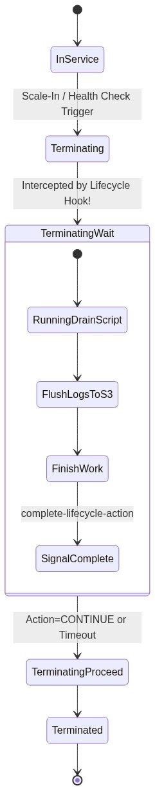
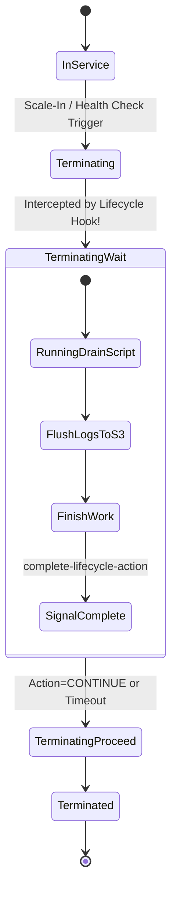

<div align="center">

# 🔬 Lab 5.4: ASG Lifecycle Hooks & Graceful State Flushing

**[🏠 AWS Labs Root](../../../README.md)** &nbsp;•&nbsp; **[🖥️ EC2 Curriculum](../../README.md)** &nbsp;•&nbsp; **[📂 Module 05](../README.md)**

   

**[⬅️ Previous Lab](../../module-05-ha-asg-alb/lab-03-asg-dynamic-scaling/README.md)** &nbsp;|&nbsp; **[➡️ Next Lab](../../module-06-purchasing-cost-optimization/lab-01-spot-interruption-handling/README.md)**


[](https://cyber-cloud-security.github.io/aws-labs/?lab=lab-04-asg-lifecycle-hooks)

</div>

---

## 📌 Lab Objectives

- [x] Understand the complete **Auto Scaling Instance Lifecycle State Machine**.
- [x] Configure a termination lifecycle hook: `autoscaling:EC2_INSTANCE_TERMINATING`.
- [x] Intercept an instance before termination and pause the shutdown in `Terminating:Wait` state.
- [x] Execute an automated graceful drainage routine (exporting in-flight logs and state to S3) before signaling `complete-lifecycle-action` with `CONTINUE`.

---

## 🏗️ Lifecycle Hook Architecture



<details>
<summary>📐 <b>View Mermaid Architecture Source (Click to Expand)</b></summary>



</details>

---

## 💡 Key Architectural Concepts

1. **Why Termination Hooks?**:
   - Without a hook, when an ASG scales in or rebalances, the instance receives an immediate `SIGTERM` followed quickly by `SIGKILL`, abruptly aborting active user transactions and leaving unsaved logs on local disks.
2. **`Terminating:Wait` State**:
   - Freezes the instance termination for up to `HeartbeatTimeout` seconds (default 3600 seconds), giving automated scripts or EventBridge handlers time to finish work.
3. **Heartbeat Extensions**:
   - If a long-running batch job needs more time, a script can call `aws autoscaling record-lifecycle-action-heartbeat` to extend the countdown timer repeatedly.

---

## ⏱️ Prerequisites & Cost

> [!TIP]
> **AWS Free Tier & Cost Guardrail**
> - **AWS Free Tier Eligible**: Yes (`t3.micro`).
> - **Estimated Duration**: 20 minutes.

---

## 🚀 Step-by-Step Instructions

### Step 1: Create an ASG with 1 Instance
```bash
export AWS_REGION=$(aws configure get region || echo "us-east-1")
export VPC_ID=$(aws ec2 describe-vpcs \
  --filters "Name=isDefault,Values=true" \
  --query "Vpcs[0].VpcId" \
  --output text)
SUBNET_1=$(aws ec2 describe-subnets \
  --filters "Name=vpc-id,Values=${VPC_ID}" \
  --query "Subnets[0].SubnetId" \
  --output text)

AMI_ID=$(aws ssm get-parameter \
  --name "/aws/service/ami-amazon-linux-latest/al2023-ami-kernel-default-x86_64" \
  --query "Parameter.Value" --output text)

# Create Launch Template
cat <<JSON > hook-lt.json
{
  "ImageId": "${AMI_ID}",
  "InstanceType": "t3.micro",
  "MetadataOptions": { "HttpTokens": "required" }
}
JSON

LT_ID=$(aws ec2 create-launch-template \
  --launch-template-name "lt-hook-demo" \
  --launch-template-data file://hook-lt.json \
  --query "LaunchTemplate.LaunchTemplateId" --output text)

# Create ASG
aws autoscaling create-auto-scaling-group \
  --auto-scaling-group-name "asg-hook-demo" \
  --launch-template "LaunchTemplateId=${LT_ID},Version=\$Latest" \
  --min-size 1 \
  --max-size 1 \
  --desired-capacity 1 \
  --vpc-zone-identifier "${SUBNET_1}"

echo "Waiting for instance to launch..."
sleep 20
```

### Step 2: Attach Termination Lifecycle Hook
Configure a 300-second pause when an instance is chosen for termination:
```bash
aws autoscaling put-lifecycle-hook \
  --lifecycle-hook-name "graceful-drain-hook" \
  --auto-scaling-group-name "asg-hook-demo" \
  --lifecycle-transition "autoscaling:EC2_INSTANCE_TERMINATING" \
  --heartbeat-timeout 300 \
  --default-result "CONTINUE"

echo "Configured termination lifecycle hook."
```

---

## 🔍 Verification & Drain Simulation

### 1. Trigger Scale-In / Termination
Find the instance ID and terminate it via the ASG:
```bash
INSTANCE_ID=$(aws autoscaling describe-auto-scaling-groups \
  --auto-scaling-group-names "asg-hook-demo" \
  --query "AutoScalingGroups[0].Instances[0].InstanceId" --output text)

echo "Triggering termination on: ${INSTANCE_ID}"
aws autoscaling terminate-instance-in-auto-scaling-group \
  --instance-id "${INSTANCE_ID}" \
  --should-decrement-desired-capacity
```

### 2. Observe `Terminating:Wait` Status
Check the instance lifecycle state:
```bash
aws autoscaling describe-auto-scaling-instances \
  --instance-ids "${INSTANCE_ID}" \
  --query "AutoScalingInstances[0].LifecycleState" --output text
```
**Expected Output**: `Terminating:Wait`
Notice the instance **remains powered on** and accessible! The ASG does not terminate it immediately.

### 3. Simulate Graceful Drainage and Complete Action
Assume your cleanup script finishes flushing local logs and completes its work:
```bash
echo "Cleanup script finished. Sending complete-lifecycle-action..."

aws autoscaling complete-lifecycle-action \
  --lifecycle-hook-name "graceful-drain-hook" \
  --auto-scaling-group-name "asg-hook-demo" \
  --lifecycle-action-result "CONTINUE" \
  --instance-id "${INSTANCE_ID}"

echo "Lifecycle action signaled. Instance will now transition to Terminating:Proceed and terminate."
```

---

## 🧹 Teardown & Clean-up


> [!CAUTION]
> **Always Tear Down Lab Resources**: Execute the cleanup commands below immediately after completing the verification steps to prevent unintended AWS billing.

```bash
# 1. Delete ASG
aws autoscaling delete-auto-scaling-group \
  --auto-scaling-group-name "asg-hook-demo" \
  --force-delete

# 2. Delete Launch Template
aws ec2 delete-launch-template --launch-template-id "${LT_ID}"
rm -f hook-lt.json

echo "Lab 5.4 clean-up completed successfully."
```

---

<div align="center">

**[⬅️ Previous Lab](../../module-05-ha-asg-alb/lab-03-asg-dynamic-scaling/README.md)** &nbsp;•&nbsp; **[⬆️ Back to Module 05](../README.md)** &nbsp;•&nbsp; **[🏠 EC2 Index](../../README.md)** &nbsp;•&nbsp; **[➡️ Next Lab](../../module-06-purchasing-cost-optimization/lab-01-spot-interruption-handling/README.md)**

</div>
