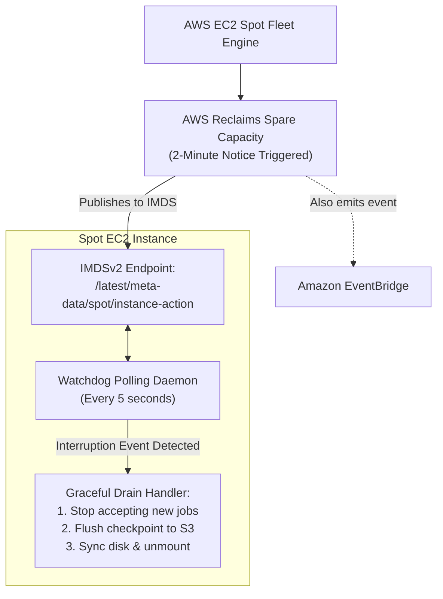

<div align="center">

# 🔬 Lab 6.1: Spot Instances & Automated 2-Minute Interruption Warning Handling

**[🏠 AWS Labs Root](../../../README.md)** &nbsp;•&nbsp; **[🖥️ EC2 Curriculum](../../README.md)** &nbsp;•&nbsp; **[📂 Module 06](../README.md)**

   

**[⬅️ Previous Lab](../../module-05-ha-asg-alb/lab-04-asg-lifecycle-hooks/README.md)** &nbsp;|&nbsp; **[➡️ Next Lab](../../module-06-purchasing-cost-optimization/lab-02-asg-mixed-instances/README.md)**

</div>

---

## 📌 Lab Objectives

- [x] Understand **Amazon EC2 Spot Instances** pricing dynamics and pool capacity mechanics (up to 90% discount over On-Demand).
- [x] Compare Spot allocation strategies: `price-capacity-optimized` vs `capacity-optimized`.
- [x] Intercept the **2-minute Spot Interruption Warning** delivered via local IMDSv2 metadata.
- [x] Deploy an automated background watchdog daemon to trigger immediate graceful shutdown upon receiving an interruption notice.

---

## 🏗️ Architecture Diagram


<details>
<summary>📐 <b>View Mermaid Architecture Source (Click to Expand)</b></summary>



</details>

---

## 💡 Key Architectural Concepts

1. **Why Spot Instances are Interrupted**:
   - Spot instances represent unused EC2 capacity. When AWS requires the capacity back for On-Demand workloads, the Spot instance is reclaimed with a mandatory **2-minute advance warning**.
2. **Detection Vectors**:
   - **Local IMDS**: `http://169.254.169.254/latest/meta-data/spot/instance-action` returns HTTP 404 until an interruption notice is issued, at which point it returns a JSON payload with action (`terminate` or `stop`) and approximate execution time.
   - **Amazon EventBridge**: Emits an `EC2 Spot Instance Interruption Warning` event for centralized serverless handlers.
3. **Allocation Strategy Best Practice**:
   - Use `price-capacity-optimized`: Allocates instances from Spot pools with optimal capacity depth while also considering price, reducing interruptions significantly compared to legacy `lowest-price`.

---

## ⏱️ Prerequisites & Cost

> [!WARNING]
> **Paid Instance / Storage Notice**
> - **Cost**: Fraction of a cent (< $0.01).
> - **Estimated Duration**: 15 minutes.

---

## 🚀 Step-by-Step Instructions

### Step 1: Launch a Spot Instance via AWS CLI
```bash
export AWS_REGION=$(aws configure get region || echo "us-east-1")
export VPC_ID=$(aws ec2 describe-vpcs \
  --filters "Name=isDefault,Values=true" \
  --query "Vpcs[0].VpcId" \
  --output text)
export SUBNET_ID=$(aws ec2 describe-subnets \
  --filters "Name=vpc-id,Values=${VPC_ID}" \
  --query "Subnets[0].SubnetId" \
  --output text)

AMI_ID=$(aws ssm get-parameter \
  --name "/aws/service/ami-amazon-linux-latest/al2023-ami-kernel-default-x86_64" \
  --query "Parameter.Value" --output text)

INSTANCE_ID=$(aws ec2 run-instances \
  --image-id "${AMI_ID}" \
  --instance-type "t3.micro" \
  --subnet-id "${SUBNET_ID}" \
  --instance-market-options '{"MarketType":"spot","SpotOptions":{"SpotInstanceType":"one-time","InstanceInterruptionBehavior":"terminate"}}' \
  --metadata-options "HttpEndpoint=enabled,HttpTokens=required" \
  --tag-specifications "ResourceType=instance,Tags=[{Key=Project,Value=ec2-master-labs},{Key=Name,Value=spot-worker}]" \
  --query "Instances[0].InstanceId" --output text)

echo "Launched Spot Instance: ${INSTANCE_ID}"
aws ec2 wait instance-running --instance-ids "${INSTANCE_ID}"
```

### Step 2: Verify Market Option is Spot
```bash
aws ec2 describe-instances \
  --instance-ids "${INSTANCE_ID}" \
  --query "Reservations[0].Instances[0].[InstanceLifecycle,SpotInstanceRequestId]" \
  --output table
```
`InstanceLifecycle` will show `spot`.

---

## 🔍 The Spot Watchdog Daemon (Guest OS)

Inside the instance, deploy a lightweight Python or bash watchdog script that constantly polls IMDSv2:

```bash
cat <<'SCRIPT' > /usr/local/bin/spot_watchdog.sh
#!/bin/bash
echo "[*] Starting Spot Interruption Watchdog Daemon..."

while true; do
  # 1. Fetch IMDSv2 Token
  TOKEN=$(curl -s -X PUT "http://169.254.169.254/latest/api/token" \
    -H "X-aws-ec2-metadata-token-ttl-seconds: 60" 2>/dev/null)

  # 2. Query spot instance action
  HTTP_STATUS=$(curl -s -o /tmp/spot_action.json -w "%{http_code}" \
    -H "X-aws-ec2-metadata-token: $TOKEN" \
    http://169.254.169.254/latest/meta-data/spot/instance-action)

  if [ "$HTTP_STATUS" -eq 200 ]; then
    echo "[!] CRITICAL: Spot Interruption Notice received at $(date)!"
    cat /tmp/spot_action.json
    
    # 3. Trigger graceful application drain:
    echo "[*] Flushing local buffers to remote storage..."
    sync
    echo "[*] Application safely prepared for termination."
    exit 0
  fi

  # Poll interval: 5 seconds
  sleep 5
done
SCRIPT

chmod +x /usr/local/bin/spot_watchdog.sh
```

---

## 📘 Deep-Dive Command & Flag Reference

> [!TIP]
> **Line-by-Line Production Analysis**: Every command executed in this lab is dissected below, explaining each CLI flag, JMESPath query, Linux kernel parameter, and why it is critical in production automation.

<details open>
<summary>📘 <b>Command 1 & 2: Launching an EC2 Spot Instance</b></summary>

```bash
export AWS_REGION=$(aws configure get region || echo "us-east-1")
export VPC_ID=$(aws ec2 describe-vpcs \
  --filters "Name=isDefault,Values=true" \
  --query "Vpcs[0].VpcId" \
  --output text)
export SUBNET_ID=$(aws ec2 describe-subnets \
  --filters "Name=vpc-id,Values=${VPC_ID}" \
  --query "Subnets[0].SubnetId" \
  --output text)

AMI_ID=$(aws ssm get-parameter \
  --name "/aws/service/ami-amazon-linux-latest/al2023-ami-kernel-default-x86_64" \
  --query "Parameter.Value" --output text)

INSTANCE_ID=$(aws ec2 run-instances \
  --image-id "${AMI_ID}" \
  --instance-type "t3.micro" \
  --subnet-id "${SUBNET_ID}" \
  --instance-market-options '{"MarketType":"spot","SpotOptions":{"SpotInstanceType":"one-time","InstanceInterruptionBehavior":"terminate"}}' \
  --metadata-options "HttpEndpoint=enabled,HttpTokens=required" \
  --tag-specifications "ResourceType=instance,Tags=[{Key=Project,Value=ec2-master-labs},{Key=Name,Value=spot-worker}]" \
  --query "Instances[0].InstanceId" --output text)

echo "Launched Spot Instance: ${INSTANCE_ID}"
aws ec2 wait instance-running --instance-ids "${INSTANCE_ID}"
```

#### 🔍 Parameter & Component Breakdown
- **`aws ec2 run-instances`** — Launches virtual machine capacity in AWS.
- **`--instance-market-options`** — Configures pricing and purchasing model parameters:
  - **`"MarketType": "spot"`** — Informs EC2 to fulfill this request using spare, unallocated compute capacity at dynamic Spot pricing (up to 90% discount compared to On-Demand).
  - **`"SpotInstanceType": "one-time"`** — Requests a single, one-off Spot instance without creating a persistent, recurring Spot fleet request.
  - **`"InstanceInterruptionBehavior": "terminate"`** — Configures what happens when AWS reclaims the instance capacity. Options are `terminate`, `stop`, or `hibernate`.
- **`--metadata-options "HttpEndpoint=enabled,HttpTokens=required"`** — Enforces IMDSv2 session token authentication.
- **`--query "Instances[0].InstanceId" --output text`** — Extracts the newly created instance ID.
- **`aws ec2 wait instance-running`** — Blocks shell execution until the instance reaches the `running` state.

> 🏭 **Why This Matters in Production Automation**
> Spot instances offer massive cost reductions for fault-tolerant, stateless, or horizontally scalable architectures (e.g., CI/CD runners, containerized microservices, batch processing). Explicitly defining `--instance-market-options` with `InstanceInterruptionBehavior` guarantees that automation cleanly handles reclamation.

</details>

<details open>
<summary>📘 <b>Command 3: Verifying Spot Lifecycle and Request ID</b></summary>

```bash
aws ec2 describe-instances \
  --instance-ids "${INSTANCE_ID}" \
  --query "Reservations[0].Instances[0].[InstanceLifecycle,SpotInstanceRequestId]" \
  --output table
```

#### 🔍 Parameter & Component Breakdown
- **`aws ec2 describe-instances`** — Queries EC2 instance attributes.
- **`--instance-ids "${INSTANCE_ID}"`** — The target instance.
- **`--query "Reservations[0].Instances[0].[InstanceLifecycle,SpotInstanceRequestId]"`** — Extracts two specific attributes:
  - **`InstanceLifecycle`** — Returns `spot` (for standard On-Demand instances, this attribute returns `null` or is omitted).
  - **`SpotInstanceRequestId`** — The internal AWS identifier representing the fulfilled Spot bid/request (e.g., `sir-1234abcd`).
- **`--output table`** — Formats the results into an ASCII table.

> 🏭 **Why This Matters in Production Automation**
> Automated deployment pipelines and configuration management scripts (Ansible, Chef, Puppet) can inspect `InstanceLifecycle` to dynamically adjust logging intensity, local cache policies, or worker deregistration handlers based on whether the host is Spot or On-Demand.

</details>

<details open>
<summary>📘 <b>Command 4: Deploying the Guest OS Spot Interruption Watchdog Daemon</b></summary>

```bash
cat <<'SCRIPT' > /usr/local/bin/spot_watchdog.sh
#!/bin/bash
echo "[*] Starting Spot Interruption Watchdog Daemon..."

while true; do
  # 1. Fetch IMDSv2 Token
  TOKEN=$(curl -s -X PUT "http://169.254.169.254/latest/api/token" \
    -H "X-aws-ec2-metadata-token-ttl-seconds: 60" 2>/dev/null)

  # 2. Query spot instance action
  HTTP_STATUS=$(curl -s -o /tmp/spot_action.json -w "%{http_code}" \
    -H "X-aws-ec2-metadata-token: $TOKEN" \
    http://169.254.169.254/latest/meta-data/spot/instance-action)

  if [ "$HTTP_STATUS" -eq 200 ]; then
    echo "[!] CRITICAL: Spot Interruption Notice received at $(date)!"
    cat /tmp/spot_action.json
    
    # 3. Trigger graceful application drain:
    echo "[*] Flushing local buffers to remote storage..."
    sync
    echo "[*] Application safely prepared for termination."
    exit 0
  fi

  # Poll interval: 5 seconds
  sleep 5
done
SCRIPT

chmod +x /usr/local/bin/spot_watchdog.sh
```

#### 🔍 Parameter & Component Breakdown
- **`cat <<'SCRIPT' > ...`** — Heredoc with quoted delimiter `'SCRIPT'` to prevent parameter expansion by the host shell, preserving variables like `$TOKEN` and `$HTTP_STATUS` for the script itself.
- **`curl -s -X PUT "http://169.254.169.254/latest/api/token" -H "X-aws-ec2-metadata-token-ttl-seconds: 60"`** — Acquires an IMDSv2 session token valid for 60 seconds.
- `curl -s -o /tmp/spot_action.json -w "%{http_code}" ... http://169.254.169.254/latest/meta-data/spot/instance-action`:
  - **`-s`** — Silent mode (suppresses progress bar).
  - **`-o /tmp/spot_action.json`** — Saves response body to a temporary file.
  - **`-w "%{http_code}"`** — Emits only the HTTP response status code.
- Path `/latest/meta-data/spot/instance-action`: Under normal operation, this path returns HTTP 404. Exactly 2 minutes before AWS reclaims the instance, AWS begins returning HTTP 200 with a JSON payload specifying `"action": "terminate"` and `"time": "<timestamp>"`.
- **`if [ "$HTTP_STATUS" -eq 200 ]; then ...`** — Evaluates the HTTP response code. If 200, triggers the graceful drain sequence: flushes operating system buffers (`sync`), logs the event, and exits.
- **`sleep 5`** — Configures polling interval to 5 seconds.
- **`chmod +x /usr/local/bin/spot_watchdog.sh`** — Grants execution permissions to the script.

> 🏭 **Why This Matters in Production Automation**
> AWS guarantees a 2-minute notice before terminating a Spot instance. Polling IMDSv2 directly from within the operating system provides sub-second latency to trigger fast graceful degradation: saving application checkpoints, flushing Redis/Kafka buffers, deregistering from consul/cluster managers, and closing database connections cleanly.

</details>

<details open>
<summary>📘 <b>Command 5: Automated Teardown and Cleanup</b></summary>

```bash
aws ec2 terminate-instances --instance-ids "${INSTANCE_ID}"
aws ec2 wait instance-terminated --instance-ids "${INSTANCE_ID}"
echo "Lab 6.1 clean-up completed successfully."
```

#### 🔍 Parameter & Component Breakdown
- **`aws ec2 terminate-instances --instance-ids "${INSTANCE_ID}"`** — Sends an immediate termination signal for the instance.
- **`aws ec2 wait instance-terminated`** — Polls the EC2 API until the instance status changes to `terminated`.

> 🏭 **Why This Matters in Production Automation**
> Ensures automated test environments clean up all compute resources synchronously, avoiding dangling compute charges and maintaining clean AWS account environments.

</details>

---

## 🧹 Teardown & Clean-up


> [!CAUTION]
> **Always Tear Down Lab Resources**: Execute the cleanup commands below immediately after completing the verification steps to prevent unintended AWS billing.

```bash
aws ec2 terminate-instances --instance-ids "${INSTANCE_ID}"
aws ec2 wait instance-terminated --instance-ids "${INSTANCE_ID}"
echo "Lab 6.1 clean-up completed successfully."
```

---

<div align="center">

**[⬅️ Previous Lab](../../module-05-ha-asg-alb/lab-04-asg-lifecycle-hooks/README.md)** &nbsp;•&nbsp; **[⬆️ Back to Module 06](../README.md)** &nbsp;•&nbsp; **[🏠 EC2 Index](../../README.md)** &nbsp;•&nbsp; **[➡️ Next Lab](../../module-06-purchasing-cost-optimization/lab-02-asg-mixed-instances/README.md)**

</div>
