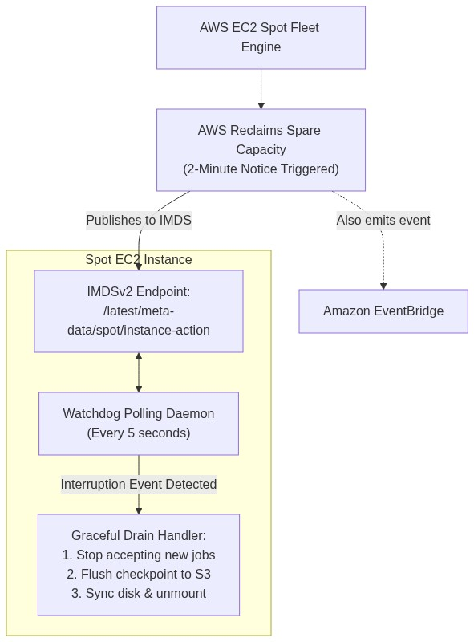
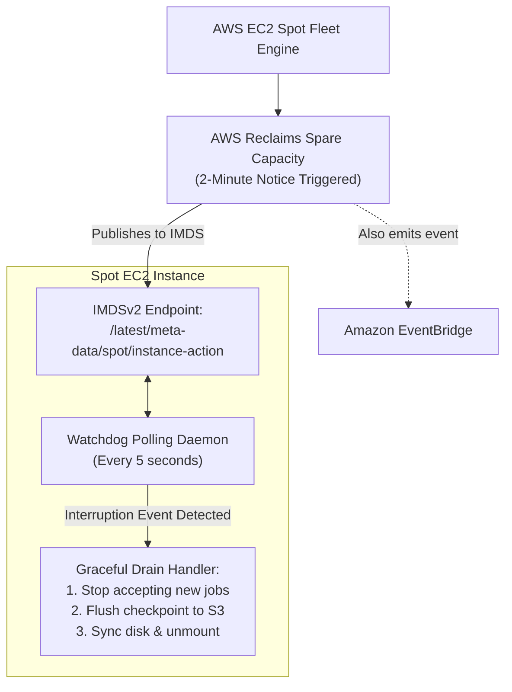

# Lab 6.1: Spot Instances & Automated 2-Minute Interruption Warning Handling

## 📌 Lab Objectives
- Understand **Amazon EC2 Spot Instances** pricing dynamics and pool capacity mechanics (up to 90% discount over On-Demand).
- Compare Spot allocation strategies: `price-capacity-optimized` vs `capacity-optimized`.
- Intercept the **2-minute Spot Interruption Warning** delivered via local IMDSv2 metadata.
- Deploy an automated background watchdog daemon to trigger immediate graceful shutdown upon receiving an interruption notice.

---

## 🏗️ Architecture Diagram



<details>
<summary>Click to expand Mermaid diagram source</summary>


<details>
<summary>Click to expand Mermaid diagram source</summary>


<details>
<summary>Click to expand Mermaid diagram source</summary>


</details>
</details>
</details>

---

## 💡 Key Architectural Concepts

1. **Why Spot Instances are Interrupted**:
   - Spot instances represent unused EC2 capacity. When AWS requires the capacity back for On-Demand workloads, the Spot instance is reclaimed with a mandatory **2-minute advance warning**.
2. **Detection Vectors**:
   - **Local IMDS**: `http://169.254.169.254/latest/meta-data/spot/instance-action` returns HTTP 404 until an interruption notice is issued, at which point it returns a JSON payload with action (`terminate` or `stop`) and approximate execution time.
   - **Amazon EventBridge**: Emits an `EC2 Spot Instance Interruption Warning` event for centralized serverless handlers.
3. **Allocation Strategy Best Practice**:
   - Use `price-capacity-optimized`: Allocates instances from Spot pools with optimal capacity depth while also considering price, reducing interruptions significantly compared to legacy `lowest-price`.

---

## ⏱️ Prerequisites & Cost
- **Cost**: Fraction of a cent (< $0.01).
- **Estimated Duration**: 15 minutes.

---

## 🚀 Step-by-Step Instructions

### Step 1: Launch a Spot Instance via AWS CLI
```bash
export AWS_REGION=$(aws configure get region || echo "us-east-1")
export VPC_ID=$(aws ec2 describe-vpcs --filters "Name=isDefault,Values=true" --query "Vpcs[0].VpcId" --output text)
export SUBNET_ID=$(aws ec2 describe-subnets --filters "Name=vpc-id,Values=${VPC_ID}" --query "Subnets[0].SubnetId" --output text)

AMI_ID=$(aws ssm get-parameter \
  --name "/aws/service/ami-amazon-linux-latest/al2023-ami-kernel-default-x86_64" \
  --query "Parameter.Value" --output text)

INSTANCE_ID=$(aws ec2 run-instances \
  --image-id "${AMI_ID}" \
  --instance-type "t3.micro" \
  --subnet-id "${SUBNET_ID}" \
  --instance-market-options '{"MarketType":"spot","SpotOptions":{"SpotInstanceType":"one-time","InstanceInterruptionBehavior":"terminate"}}' \
  --metadata-options "HttpEndpoint=enabled,HttpTokens=required" \
  --tag-specifications "ResourceType=instance,Tags=[{Key=Project,Value=ec2-master-labs},{Key=Name,Value=spot-worker}]" \
  --query "Instances[0].InstanceId" --output text)

echo "Launched Spot Instance: ${INSTANCE_ID}"
aws ec2 wait instance-running --instance-ids "${INSTANCE_ID}"
```

### Step 2: Verify Market Option is Spot
```bash
aws ec2 describe-instances \
  --instance-ids "${INSTANCE_ID}" \
  --query "Reservations[0].Instances[0].[InstanceLifecycle,SpotInstanceRequestId]" \
  --output table
```
`InstanceLifecycle` will show `spot`.

---

## 🔍 The Spot Watchdog Daemon (Guest OS)

Inside the instance, deploy a lightweight Python or bash watchdog script that constantly polls IMDSv2:

```bash
cat <<'SCRIPT' > /usr/local/bin/spot_watchdog.sh
#!/bin/bash
echo "[*] Starting Spot Interruption Watchdog Daemon..."

while true; do
  # 1. Fetch IMDSv2 Token
  TOKEN=$(curl -s -X PUT "http://169.254.169.254/latest/api/token" \
    -H "X-aws-ec2-metadata-token-ttl-seconds: 60" 2>/dev/null)

  # 2. Query spot instance action
  HTTP_STATUS=$(curl -s -o /tmp/spot_action.json -w "%{http_code}" \
    -H "X-aws-ec2-metadata-token: $TOKEN" \
    http://169.254.169.254/latest/meta-data/spot/instance-action)

  if [ "$HTTP_STATUS" -eq 200 ]; then
    echo "[!] CRITICAL: Spot Interruption Notice received at $(date)!"
    cat /tmp/spot_action.json
    
    # 3. Trigger graceful application drain:
    echo "[*] Flushing local buffers to remote storage..."
    sync
    echo "[*] Application safely prepared for termination."
    exit 0
  fi

  # Poll interval: 5 seconds
  sleep 5
done
SCRIPT

chmod +x /usr/local/bin/spot_watchdog.sh
```

---

## 🧹 Teardown & Clean-up

```bash
aws ec2 terminate-instances --instance-ids "${INSTANCE_ID}"
aws ec2 wait instance-terminated --instance-ids "${INSTANCE_ID}"
echo "Lab 6.1 clean-up completed successfully."
```
