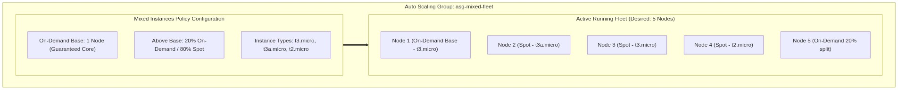
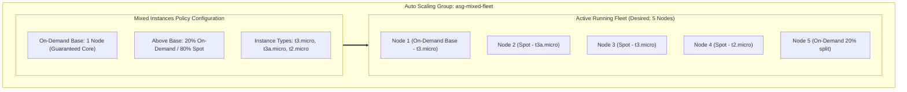

<div align="center">

# 🔬 Lab 6.2: Auto Scaling Groups with Mixed Instances Policy (Spot + On-Demand)

**[🏠 AWS Labs Root](../../../README.md)** &nbsp;•&nbsp; **[🖥️ EC2 Curriculum](../../README.md)** &nbsp;•&nbsp; **[📂 Module 06](../README.md)**

   

**[⬅️ Previous Lab](../../module-06-purchasing-cost-optimization/lab-01-spot-interruption-handling/README.md)** &nbsp;|&nbsp; **[➡️ Next Lab](../../module-06-purchasing-cost-optimization/lab-03-cost-optimization-rightsizing/README.md)**


[](https://cyber-cloud-security.github.io/aws-labs/?lab=lab-02-asg-mixed-instances)

</div>

---

## 📌 Lab Objectives

- [x] Build an enterprise-grade resilient compute cluster combining **On-Demand Baseline** instances with **Spot Instances**.
- [x] Implement **Instance Type Diversification** across multiple families (`t3.micro`, `t3a.micro`, `t2.micro`) to prevent Spot pool depletion outages.
- [x] Configure `OnDemandBaseCapacity=1` and `OnDemandPercentageAboveBaseCapacity=20` (80% Spot).
- [x] Use the `price-capacity-optimized` Spot allocation strategy.

---

## 🏗️ Architecture Diagram



<details>
<summary>📐 <b>View Mermaid Architecture Source (Click to Expand)</b></summary>



</details>

---

## 💡 Key Architectural Concepts

1. **The Spot Availability Risk**:
   - Spot instances can be reclaimed at any time if demand rises. If your ASG is locked to a single instance type (e.g., only `c5.large`), an entire pool outage will halt your scaling.
2. **Instance Type Diversification**:
   - By declaring 3–5 interchangeable instance types with comparable CPU/RAM ratios (e.g., `c5.large`, `c5a.large`, `c6i.large`), AWS will automatically shift Spot requests to alternate pools if one becomes constrained.
3. **On-Demand Base Capacity**:
   - Guarantees that mission-critical background jobs or leadership election nodes always have a dedicated On-Demand anchor node, while autoscaled surge capacity runs at an 80% discount.

---

## ⏱️ Prerequisites & Cost

> [!TIP]
> **AWS Free Tier & Cost Guardrail**
> - **AWS Free Tier Eligible**: Yes (`t3.micro`/`t2.micro` family).
> - **Estimated Duration**: 15 minutes.

---

## 🚀 Step-by-Step Instructions

### Step 1: Create the Base Launch Template
```bash
export AWS_REGION=$(aws configure get region || echo "us-east-1")
export VPC_ID=$(aws ec2 describe-vpcs \
  --filters "Name=isDefault,Values=true" \
  --query "Vpcs[0].VpcId" \
  --output text)
SUBNET_1=$(aws ec2 describe-subnets \
  --filters "Name=vpc-id,Values=${VPC_ID}" \
  --query "Subnets[0].SubnetId" \
  --output text)
SUBNET_2=$(aws ec2 describe-subnets \
  --filters "Name=vpc-id,Values=${VPC_ID}" \
  --query "Subnets[1].SubnetId" \
  --output text)

AMI_ID=$(aws ssm get-parameter \
  --name "/aws/service/ami-amazon-linux-latest/al2023-ami-kernel-default-x86_64" \
  --query "Parameter.Value" --output text)

cat <<JSON > mixed-lt.json
{
  "ImageId": "${AMI_ID}",
  "MetadataOptions": { "HttpTokens": "required" }
}
JSON

LT_ID=$(aws ec2 create-launch-template \
  --launch-template-name "lt-mixed-demo" \
  --launch-template-data file://mixed-lt.json \
  --query "LaunchTemplate.LaunchTemplateId" --output text)
```

### Step 2: Define Mixed Instances Policy JSON
```bash
cat <<JSON > mixed-policy.json
{
  "LaunchTemplate": {
    "LaunchTemplateSpecification": {
      "LaunchTemplateId": "${LT_ID}",
      "Version": "\$Latest"
    },
    "Overrides": [
      { "InstanceType": "t3.micro" },
      { "InstanceType": "t3a.micro" },
      { "InstanceType": "t2.micro" }
    ]
  },
  "InstancesDistribution": {
    "OnDemandAllocationStrategy": "prioritized",
    "OnDemandBaseCapacity": 1,
    "OnDemandPercentageAboveBaseCapacity": 20,
    "SpotAllocationStrategy": "price-capacity-optimized"
  }
}
JSON
```

### Step 3: Deploy ASG with Mixed Instances Policy
```bash
aws autoscaling create-auto-scaling-group \
  --auto-scaling-group-name "asg-mixed-fleet-demo" \
  --mixed-instances-policy file://mixed-policy.json \
  --min-size 1 \
  --max-size 5 \
  --desired-capacity 3 \
  --vpc-zone-identifier "${SUBNET_1},${SUBNET_2}"

echo "Created ASG with Mixed Instances Policy."
echo "Waiting for instances to launch..."
sleep 25
```

---

## 🔍 Verification & Lifecycle Breakdown

Inspect the fleet distribution:
```bash
aws ec2 describe-instances \
  --filters "Name=tag:aws:autoscaling:groupName,Values=asg-mixed-fleet-demo" \
  --query "Reservations[*].Instances[*].[InstanceId,InstanceType,InstanceLifecycle||'on-demand',Placement.AvailabilityZone]" \
  --output table
```
**Sample Output**:
```text
----------------------------------------------------------------------
|                          DescribeInstances                         |
+----------------------+------------+------------+-------------------+
|  i-0123456789abcdef0 |  t3.micro  |  on-demand |  us-east-1a       |
|  i-0987654321fedcba1 |  t3a.micro |  spot      |  us-east-1b       |
|  i-0abcdef1234567890 |  t3.micro  |  spot      |  us-east-1a       |
+----------------------+------------+------------+-------------------+
```
Notice:
- Instance 1 is **On-Demand** (fulfilling the `OnDemandBaseCapacity=1` guarantee).
- Instances 2 and 3 are **Spot** (running at ~70–90% cost savings).
- Instances are diversified across multiple instance types and AZs.

---

## 🧹 Teardown & Clean-up


> [!CAUTION]
> **Always Tear Down Lab Resources**: Execute the cleanup commands below immediately after completing the verification steps to prevent unintended AWS billing.

```bash
# 1. Terminate fleet
aws autoscaling update-auto-scaling-group \
  --auto-scaling-group-name "asg-mixed-fleet-demo" \
  --min-size 0 \
  --desired-capacity 0

sleep 15
aws autoscaling delete-auto-scaling-group \
  --auto-scaling-group-name "asg-mixed-fleet-demo" \
  --force-delete

# 2. Delete Launch Template
aws ec2 delete-launch-template --launch-template-id "${LT_ID}"
rm -f mixed-lt.json mixed-policy.json

echo "Lab 6.2 clean-up completed successfully."
```

---

<div align="center">

**[⬅️ Previous Lab](../../module-06-purchasing-cost-optimization/lab-01-spot-interruption-handling/README.md)** &nbsp;•&nbsp; **[⬆️ Back to Module 06](../README.md)** &nbsp;•&nbsp; **[🏠 EC2 Index](../../README.md)** &nbsp;•&nbsp; **[➡️ Next Lab](../../module-06-purchasing-cost-optimization/lab-03-cost-optimization-rightsizing/README.md)**

</div>
