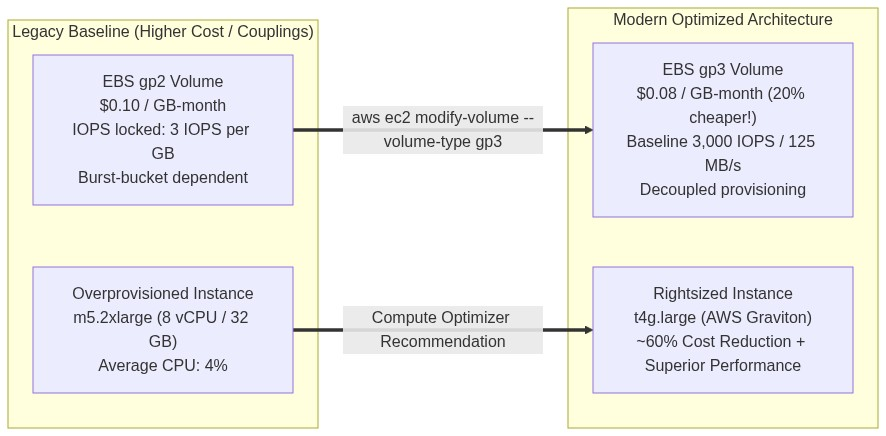
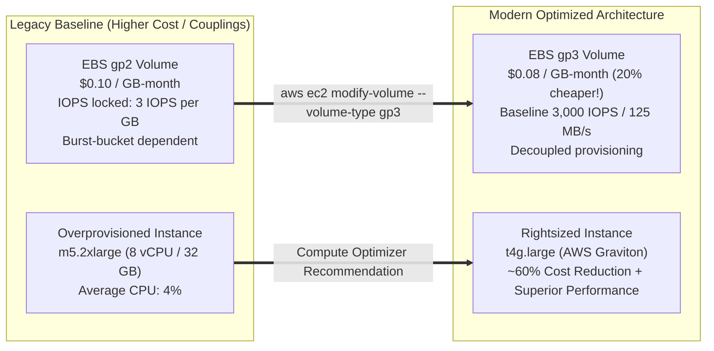

<div align="center">

# 🔬 Lab 6.3: FinOps Rightsizing, Compute Optimizer & gp2-to-gp3 Modernization

**[🏠 AWS Labs Root](../../../README.md)** &nbsp;•&nbsp; **[🖥️ EC2 Curriculum](../../README.md)** &nbsp;•&nbsp; **[📂 Module 06](../README.md)**

   

**[⬅️ Previous Lab](../../module-06-purchasing-cost-optimization/lab-02-asg-mixed-instances/README.md)** &nbsp;|&nbsp; **[➡️ Next Lab](../../module-07-monitoring-and-troubleshooting/lab-01-status-checks-autorecovery/README.md)**

</div>

---

## 📌 Lab Objectives

- [x] Implement FinOps principles to drive immediate EC2 cost reductions.
- [x] Execute an **in-place, zero-downtime migration from `gp2` to `gp3`** EBS volumes for an instant 20% storage cost reduction.
- [x] Leverage **AWS Compute Optimizer** recommendations to identify over-provisioned / zombie compute resources.
- [x] Evaluate **Savings Plans vs Reserved Instances (RIs)** economics and commitment modeling.

---

## 🏗️ Architectural Modernization



<details>
<summary>📐 <b>View Mermaid Architecture Source (Click to Expand)</b></summary>



</details>

---

## 💡 Key Architectural Concepts

### Why Migrate from `gp2` to `gp3`?
1. **Cost**: `gp3` is **20% less expensive** per GB-month ($0.08 vs $0.10).
2. **Performance Independence**:
   - In `gp2`, a small 30 GB volume gets only 90 baseline IOPS and must rely on burst credits.
   - In `gp3`, any volume size gets **3,000 IOPS and 125 MB/s baseline free of charge** without burst buckets.
   - You can scale IOPS and throughput independently of storage capacity.

### Savings Plans vs Reserved Instances
| Factor | Compute Savings Plans | EC2 Instance Savings Plans | Standard Reserved Instances |
| :--- | :--- | :--- | :--- |
| **Commitment** | $/hour (1 or 3 years) | $/hour (1 or 3 years) | Instance attributes (1 or 3 yrs) |
| **Max Savings** | Up to 66% | Up to 72% | Up to 72% |
| **Flexibility** | Any instance family, region, OS, plus ECS Fargate & Lambda | Any size or OS within the chosen family & region | Fixed instance type & region |
| **Recommendation**| **Default choice for modern cloud architectures** | For predictable database or steady core workloads | Legacy; prefer Savings Plans |

---

## ⏱️ Prerequisites & Cost

> [!TIP]
> **AWS Free Tier & Cost Guardrail**
> - **AWS Free Tier Eligible**: Yes.
> - **Estimated Duration**: 15 minutes.

---

## 🚀 Step-by-Step Instructions

### Step 1: Create a Legacy `gp2` Volume
```bash
export AWS_REGION=$(aws configure get region || echo "us-east-1")
AZ=$(aws ec2 describe-availability-zones \
  --query "AvailabilityZones[0].ZoneName" \
  --output text)

LEGACY_VOL_ID=$(aws ec2 create-volume \
  --availability-zone "${AZ}" \
  --size 20 \
  --volume-type "gp2" \
  --tag-specifications "ResourceType=volume,Tags=[{Key=Project,Value=ec2-master-labs},{Key=Name,Value=legacy-gp2-volume}]" \
  --query "VolumeId" --output text)

echo "Created Legacy gp2 Volume: ${LEGACY_VOL_ID}"
aws ec2 wait volume-available --volume-ids "${LEGACY_VOL_ID}"
```

### Step 2: Perform Zero-Downtime Migration to `gp3`
Convert the volume type live using Elastic Volumes:
```bash
aws ec2 modify-volume \
  --volume-id "${LEGACY_VOL_ID}" \
  --volume-type "gp3"

echo "Sent modification command: Converting gp2 -> gp3..."
```

Verify the transformation:
```bash
aws ec2 describe-volumes \
  --volume-ids "${LEGACY_VOL_ID}" \
  --query "Volumes[0].[VolumeId,VolumeType,Size,Iops,Throughput]" \
  --output table
```
**Result**: The volume immediately reports `gp3`, delivering 3,000 baseline IOPS and 125 MB/s with an automatic 20% billing discount.

---

## 🔍 AWS Compute Optimizer Inspection

Query Compute Optimizer recommendations (must be enrolled in your AWS account):
```bash
aws compute-optimizer get-ec2-instance-recommendations \
  --query "instanceRecommendations[*].[instanceArn,currentInstanceType,finding,recommendationOptions[0].instanceType]" \
  --output table 2>/dev/null || echo "Compute Optimizer requires opt-in via AWS Console."
```
Findings categorize instances as:
- `Underprovisioned`: Bottlenecked on CPU/RAM.
- `Overprovisioned`: Wasting money on excess resources.
- `Optimized`: Sized appropriately for historical load.

---

## 📘 Deep-Dive Command & Flag Reference

> [!TIP]
> **Line-by-Line Production Analysis**: Every command executed in this lab is dissected below, explaining each CLI flag, JMESPath query, Linux kernel parameter, and why it is critical in production automation.

<details open>
<summary>📘 <b>Command 1 & 2: Provisioning a Legacy gp2 Volume</b></summary>

```bash
export AWS_REGION=$(aws configure get region || echo "us-east-1")
AZ=$(aws ec2 describe-availability-zones \
  --query "AvailabilityZones[0].ZoneName" \
  --output text)

LEGACY_VOL_ID=$(aws ec2 create-volume \
  --availability-zone "${AZ}" \
  --size 20 \
  --volume-type "gp2" \
  --tag-specifications "ResourceType=volume,Tags=[{Key=Project,Value=ec2-master-labs},{Key=Name,Value=legacy-gp2-volume}]" \
  --query "VolumeId" --output text)

echo "Created Legacy gp2 Volume: ${LEGACY_VOL_ID}"
aws ec2 wait volume-available --volume-ids "${LEGACY_VOL_ID}"
```

#### 🔍 Parameter & Component Breakdown
- **`AZ=$(aws ec2 describe-availability-zones ...)`** — Discovers the first available AZ in the region. EBS volumes are strictly zonal constructs.
- **`aws ec2 create-volume`** — Provisions an EBS block storage volume.
- **`--size 20`** — Specifies 20 GiB capacity.
- **`--volume-type "gp2"`** — Specifies AWS's legacy General Purpose SSD storage tier ($0.10/GB-month). In `gp2`, IOPS performance is statically tied to volume size at 3 IOPS per GiB (a 20 GiB volume gets only 60 baseline IOPS, requiring burst credits for temporary bursts to 3,000 IOPS).
- **`aws ec2 wait volume-available`** — Polls until the volume transitions from `creating` to `available`.

> 🏭 **Why This Matters in Production Automation**
> Legacy infrastructure often has hundreds of unmigrated `gp2` volumes running. Understanding how `gp2` volumes are structured enables automated discovery and cost-optimization remediations.

</details>

<details open>
<summary>📘 <b>Command 3: Performing In-Place, Zero-Downtime Migration to gp3</b></summary>

```bash
aws ec2 modify-volume \
  --volume-id "${LEGACY_VOL_ID}" \
  --volume-type "gp3"
```

#### 🔍 Parameter & Component Breakdown
- **`aws ec2 modify-volume`** — Invokes AWS EBS Elastic Volumes API to modify volume characteristics dynamically.
- **`--volume-id "${LEGACY_VOL_ID}"`** — The target volume ID.
- **`--volume-type "gp3"`** — Requests immediate transformation to next-generation General Purpose SSD (`gp3`).

> 🏭 **Why This Matters in Production Automation**
> Migrating from `gp2` to `gp3` delivers an immediate **20% direct reduction in storage costs** ($0.08/GB-month vs $0.10/GB-month). More importantly, `gp3` provides **3,000 baseline IOPS and 125 MB/s throughput included free** on every volume regardless of size, completely decoupling performance from provisioned storage capacity. This modification executes entirely live in the background without unmounting disks or rebooting servers.

</details>

<details open>
<summary>📘 <b>Command 4: Verifying Volume Modernization and Performance Metrics</b></summary>

```bash
aws ec2 describe-volumes \
  --volume-ids "${LEGACY_VOL_ID}" \
  --query "Volumes[0].[VolumeId,VolumeType,Size,Iops,Throughput]" \
  --output table
```

#### 🔍 Parameter & Component Breakdown
- **`aws ec2 describe-volumes`** — Queries volume metadata.
- **`--volume-ids "${LEGACY_VOL_ID}"`** — Directs query to the modernized volume.
- **`--query "Volumes[0].[VolumeId,VolumeType,Size,Iops,Throughput]"`** — Extracts the updated volume type (`gp3`), size (20 GiB), baseline IOPS (3,000), and baseline throughput (125 MiB/s).
- **`--output table`** — Outputs results in a formatted ASCII table.

> 🏭 **Why This Matters in Production Automation**
> In FinOps automation pipelines, verifying volume properties after execution ensures compliance with corporate cost-optimization benchmarks and updates internal asset databases.

</details>

<details open>
<summary>📘 <b>Command 5: Inspecting AWS Compute Optimizer Recommendations</b></summary>

```bash
aws compute-optimizer get-ec2-instance-recommendations \
  --query "instanceRecommendations[*].[instanceArn,currentInstanceType,finding,recommendationOptions[0].instanceType]" \
  --output table 2>/dev/null || echo "Compute Optimizer requires opt-in via AWS Console."
```

#### 🔍 Parameter & Component Breakdown
- **`aws compute-optimizer get-ec2-instance-recommendations`** — Queries AWS's ML-powered engine that analyzes Amazon CloudWatch utilization metrics (CPU, memory, network, storage IOPS) over the past 14 days.
- **`--query "instanceRecommendations[*].[instanceArn,currentInstanceType,finding,recommendationOptions[0].instanceType]"`** — Extracts:
  - **`instanceArn`** — The unique resource identifier of the EC2 instance.
  - **`currentInstanceType`** — The currently assigned instance type (e.g. `m5.2xlarge`).
  - **`finding`** — Categorization (`Overprovisioned`, `Underprovisioned`, or `Optimized`).
  - **`recommendationOptions[0].instanceType`** — The primary recommended instance family and size (e.g. `t4g.large` on AWS Graviton).
- **`2>/dev/null || echo "..."`** — Suppresses error outputs and prints a fallback notice if AWS Compute Optimizer has not yet been activated in the AWS account.

> 🏭 **Why This Matters in Production Automation**
> Compute Optimizer eliminates guesswork in rightsizing decisions. Automated FinOps pipelines can consume this API output to generate automated Jira tickets or pull requests to downsize over-provisioned instances, often cutting fleet compute costs by 30–60%.

</details>

<details open>
<summary>📘 <b>Command 6: Automated Teardown and Cleanup</b></summary>

```bash
aws ec2 delete-volume --volume-id "${LEGACY_VOL_ID}"
```

#### 🔍 Parameter & Component Breakdown
- **`aws ec2 delete-volume`** — Destroys the unattached EBS volume.
- **`--volume-id "${LEGACY_VOL_ID}"`** — Specifies target volume.

> 🏭 **Why This Matters in Production Automation**
> Unattached EBS volumes ("zombie volumes") continue to incur storage charges every month even when no EC2 instances are running. Prompt cleanup eliminates waste.

</details>

---

## 🧹 Teardown & Clean-up


> [!CAUTION]
> **Always Tear Down Lab Resources**: Execute the cleanup commands below immediately after completing the verification steps to prevent unintended AWS billing.

```bash
aws ec2 delete-volume --volume-id "${LEGACY_VOL_ID}"
echo "Lab 6.3 clean-up completed successfully."
```

---

<div align="center">

**[⬅️ Previous Lab](../../module-06-purchasing-cost-optimization/lab-02-asg-mixed-instances/README.md)** &nbsp;•&nbsp; **[⬆️ Back to Module 06](../README.md)** &nbsp;•&nbsp; **[🏠 EC2 Index](../../README.md)** &nbsp;•&nbsp; **[➡️ Next Lab](../../module-07-monitoring-and-troubleshooting/lab-01-status-checks-autorecovery/README.md)**

</div>
