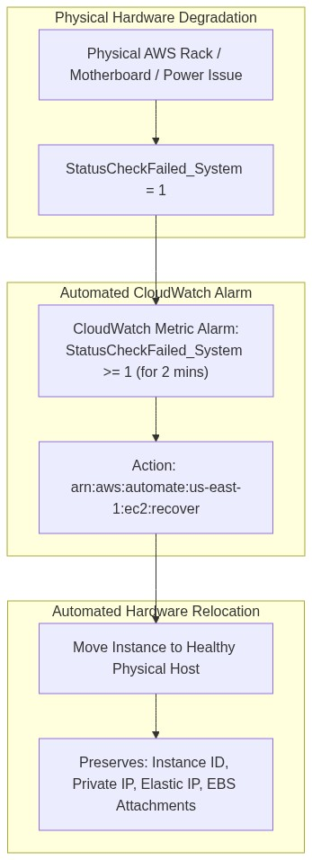
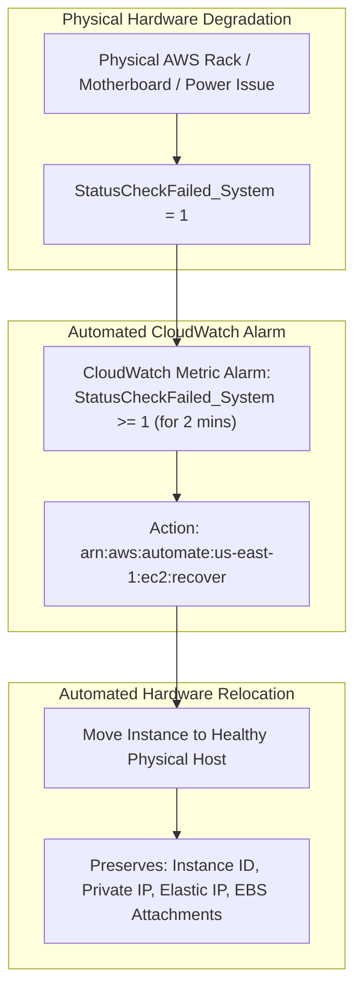

<div align="center">

# 🔬 Lab 7.1: EC2 Status Checks & CloudWatch Automated Hardware Recovery

**[🏠 AWS Labs Root](../../../README.md)** &nbsp;•&nbsp; **[🖥️ EC2 Curriculum](../../README.md)** &nbsp;•&nbsp; **[📂 Module 07](../README.md)**

   

**[⬅️ Previous Lab](../../module-06-purchasing-cost-optimization/lab-03-cost-optimization-rightsizing/README.md)** &nbsp;|&nbsp; **[➡️ Next Lab](../../module-07-monitoring-and-troubleshooting/lab-02-cloudwatch-agent-metrics-logs/README.md)**

</div>

---

## 📌 Lab Objectives

- [x] Understand the technical difference between **System Status Checks** (hypervisor/hardware level) and **Instance Status Checks** (guest OS level).
- [x] Compare **Basic Monitoring** (5-minute intervals) vs **Detailed Monitoring** (1-minute intervals).
- [x] Configure an automated **EC2 Auto-Recovery CloudWatch Alarm** (`arn:aws:automate:<region>:ec2:recover`) to migrate and resurrect instances during physical host failures automatically.

---

## 🏗️ Architecture Diagram



<details>
<summary>📐 <b>View Mermaid Architecture Source (Click to Expand)</b></summary>



</details>

---

## 💡 Key Architectural Concepts

### System Status Check vs Instance Status Check
| Metric | Monitored Layer | Root Causes | Remediation |
| :--- | :--- | :--- | :--- |
| **`StatusCheckFailed_System`** | AWS Physical Hardware & Hypervisor | Loss of rack power, network switches on host, hypervisor crash | **EC2 Auto-Recovery** (migrates instance to a new physical host without changing ID or IPs) |
| **`StatusCheckFailed_Instance`** | Guest Operating System | OS kernel panic, corrupt `/etc/fstab`, memory starvation, driver failure | OS reboot, EBS rescue mount, EC2 Serial Console |

### What is EC2 Auto-Recovery?
- When a physical server suffers hardware degradation, Auto-Recovery stops the instance on the impaired physical server and automatically starts it on a healthy physical host in the same Availability Zone.
- **Retains All Identity**: Same Instance ID, Private IPv4, Elastic IP, and EBS block storage attachments.

---

## ⏱️ Prerequisites & Cost

> [!TIP]
> **AWS Free Tier & Cost Guardrail**
> - **AWS Free Tier Eligible**: Yes (`t3.micro`).
> - **Estimated Duration**: 15 minutes.

---

## 🚀 Step-by-Step Instructions

### Step 1: Launch EC2 Instance with Detailed Monitoring
```bash
export AWS_REGION=$(aws configure get region || echo "us-east-1")
export VPC_ID=$(aws ec2 describe-vpcs \
  --filters "Name=isDefault,Values=true" \
  --query "Vpcs[0].VpcId" \
  --output text)
export SUBNET_ID=$(aws ec2 describe-subnets \
  --filters "Name=vpc-id,Values=${VPC_ID}" \
  --query "Subnets[0].SubnetId" \
  --output text)

AMI_ID=$(aws ssm get-parameter \
  --name "/aws/service/ami-amazon-linux-latest/al2023-ami-kernel-default-x86_64" \
  --query "Parameter.Value" --output text)

# Launch with Detailed Monitoring enabled (1-minute metrics):
INSTANCE_ID=$(aws ec2 run-instances \
  --image-id "${AMI_ID}" \
  --instance-type "t3.micro" \
  --subnet-id "${SUBNET_ID}" \
  --monitoring "Enabled=true" \
  --tag-specifications "ResourceType=instance,Tags=[{Key=Project,Value=ec2-master-labs},{Key=Name,Value=auto-recovery-node}]" \
  --query "Instances[0].InstanceId" --output text)

echo "Launched instance with detailed monitoring: ${INSTANCE_ID}"
aws ec2 wait instance-running --instance-ids "${INSTANCE_ID}"
```

### Step 2: Configure EC2 Auto-Recovery CloudWatch Alarm
Create the alarm that triggers automated recovery when `StatusCheckFailed_System` fails for 2 consecutive minutes:
```bash
aws cloudwatch put-metric-alarm \
  --alarm-name "ec2-hardware-recovery-${INSTANCE_ID}" \
  --alarm-description "Auto-recover instance upon physical hardware failure" \
  --metric-name "StatusCheckFailed_System" \
  --namespace "AWS/EC2" \
  --statistic "Maximum" \
  --dimensions "Name=InstanceId,Value=${INSTANCE_ID}" \
  --period 60 \
  --evaluation-periods 2 \
  --threshold 1 \
  --comparison-operator "GreaterThanOrEqualToThreshold" \
  --alarm-actions "arn:aws:automate:${AWS_REGION}:ec2:recover"

echo "Configured Auto-Recovery Alarm."
```

---

## 🔍 Verification & Telemetry

Query the status check results:
```bash
aws ec2 describe-instance-status \
  --instance-ids "${INSTANCE_ID}" \
  --query "InstanceStatuses[0].[InstanceId,SystemStatus.Status,InstanceStatus.Status]" \
  --output table
```
**Expected Output**:
```text
---------------------------------------------
|           DescribeInstanceStatus          |
+----------------------+---------+----------+
|  i-0123456789abcdef0 |  ok     |  ok      |
+----------------------+---------+----------+
```

Verify the alarm state:
```bash
aws cloudwatch describe-alarms \
  --alarm-names "ec2-hardware-recovery-${INSTANCE_ID}" \
  --query "MetricAlarms[0].[AlarmName,StateValue,MetricName]" \
  --output table
```
State displays `OK`.

---

## 🧹 Teardown & Clean-up


> [!CAUTION]
> **Always Tear Down Lab Resources**: Execute the cleanup commands below immediately after completing the verification steps to prevent unintended AWS billing.

```bash
# 1. Delete CloudWatch Alarm
aws cloudwatch delete-alarms --alarm-names "ec2-hardware-recovery-${INSTANCE_ID}"

# 2. Terminate instance
aws ec2 terminate-instances --instance-ids "${INSTANCE_ID}"
aws ec2 wait instance-terminated --instance-ids "${INSTANCE_ID}"

echo "Lab 7.1 clean-up completed successfully."
```

---

<div align="center">

**[⬅️ Previous Lab](../../module-06-purchasing-cost-optimization/lab-03-cost-optimization-rightsizing/README.md)** &nbsp;•&nbsp; **[⬆️ Back to Module 07](../README.md)** &nbsp;•&nbsp; **[🏠 EC2 Index](../../README.md)** &nbsp;•&nbsp; **[➡️ Next Lab](../../module-07-monitoring-and-troubleshooting/lab-02-cloudwatch-agent-metrics-logs/README.md)**

</div>
