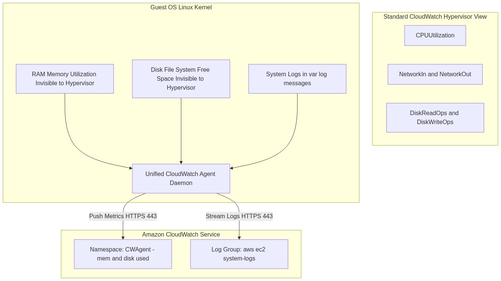
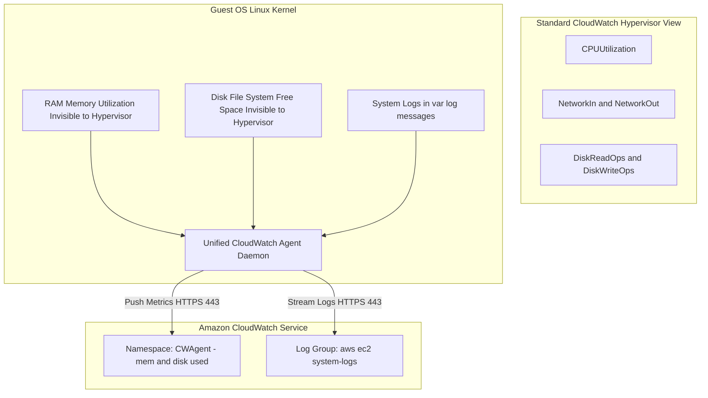

<div align="center">

# 🔬 Lab 7.2: Unified CloudWatch Agent (OS-Level RAM, Disk & Log Streaming)

**[🏠 AWS Labs Root](../../../README.md)** &nbsp;•&nbsp; **[🖥️ EC2 Curriculum](../../README.md)** &nbsp;•&nbsp; **[📂 Module 07](../README.md)**

   

**[⬅️ Previous Lab](../../module-07-monitoring-and-troubleshooting/lab-01-status-checks-autorecovery/README.md)** &nbsp;|&nbsp; **[➡️ Next Lab](../../module-07-monitoring-and-troubleshooting/lab-03-serial-console-ebs-rescue/README.md)**


[](https://cyber-cloud-security.github.io/aws-labs/?lab=lab-02-cloudwatch-agent-metrics-logs)

</div>

---

## 📌 Lab Objectives

- [x] Understand the **Hypervisor Visibility Boundary**: why AWS CloudWatch cannot view internal OS metrics (RAM, swap, disk filesystem usage) by default.
- [x] Deploy the **Unified Amazon CloudWatch Agent** inside an EC2 instance.
- [x] Configure metric collection for `mem_used_percent`, `swap_used_percent`, and `disk_used_percent`.
- [x] Stream local Linux system logs (`/var/log/messages`) into a centralized **Amazon CloudWatch Log Group**.

---

## 🏗️ Architecture Diagram



<details>
<summary>📐 <b>View Mermaid Architecture Source (Click to Expand)</b></summary>



</details>

---

## 💡 Key Architectural Concepts

1. **The Hypervisor Blind Spot**:
   - The AWS hypervisor allocates physical host RAM to virtual machines, but Linux dynamically uses free RAM for buffers and page caches. The hypervisor has no mechanism to differentiate active application memory from reclaimable OS page cache.
   - An OS-level agent is mandatory for RAM alerts.
2. **Unified Agent Architecture**:
   - Replaced the older Python-based CloudWatch Logs and Perl monitoring scripts with a unified, high-performance Go-based daemon.
3. **SSM Parameter Integration**:
   - Best practice is to store the JSON agent configuration centrally in **AWS Systems Manager Parameter Store**, allowing hundreds of instances to pull their config dynamically.

---

## ⏱️ Prerequisites & Cost

> [!TIP]
> **AWS Free Tier & Cost Guardrail**
> - **AWS Free Tier Eligible**: Yes (`t3.micro` + Free tier CloudWatch custom metrics/logs).
> - **Estimated Duration**: 20 minutes.

---

## 🚀 Step-by-Step Instructions

### Step 1: Create IAM Role with CloudWatch Agent Policy
```bash
export AWS_REGION=$(aws configure get region || echo "us-east-1")
export VPC_ID=$(aws ec2 describe-vpcs \
  --filters "Name=isDefault,Values=true" \
  --query "Vpcs[0].VpcId" \
  --output text)
export SUBNET_ID=$(aws ec2 describe-subnets \
  --filters "Name=vpc-id,Values=${VPC_ID}" \
  --query "Subnets[0].SubnetId" \
  --output text)

cat <<JSON > cw-trust.json
{
  "Version": "2012-10-17",
  "Statement": [{
    "Effect": "Allow",
    "Principal": { "Service": "ec2.amazonaws.com" },
    "Action": "sts:AssumeRole"
  }]
}
JSON

aws iam create-role --role-name "ec2-cw-agent-role" --assume-role-policy-document file://cw-trust.json 2>/dev/null || true
aws iam attach-role-policy \
  --role-name "ec2-cw-agent-role" \
  --policy-arn "arn:aws:iam::aws:policy/CloudWatchAgentServerPolicy"

aws iam create-instance-profile --instance-profile-name "ec2-cw-agent-profile" 2>/dev/null || true
aws iam add-role-to-instance-profile --instance-profile-name "ec2-cw-agent-profile" --role-name "ec2-cw-agent-role" 2>/dev/null || true

sleep 10
```

### Step 2: Store Agent Configuration in SSM Parameter Store
```bash
cat <<'JSON' > cw-config.json
{
  "metrics": {
    "metrics_collected": {
      "mem": {
        "measurement": ["mem_used_percent"],
        "metrics_collection_interval": 60
      },
      "disk": {
        "measurement": ["disk_used_percent"],
        "metrics_collection_interval": 60,
        "resources": ["/"]
      }
    },
    "append_dimensions": {
      "InstanceId": "${aws:InstanceId}"
    }
  },
  "logs": {
    "logs_collected": {
      "files": {
        "collect_list": [
          {
            "file_path": "/var/log/messages",
            "log_group_name": "/aws/ec2/system-logs",
            "log_stream_name": "{instance_id}"
          }
        ]
      }
    }
  }
}
JSON

aws ssm put-parameter \
  --name "AmazonCloudWatch-linux-ec2-labs" \
  --type "String" \
  --value file://cw-config.json \
  --overwrite

echo "Saved CloudWatch Agent configuration into SSM Parameter Store."
```

### Step 3: Launch Instance and Install Agent
```bash
AMI_ID=$(aws ssm get-parameter \
  --name "/aws/service/ami-amazon-linux-latest/al2023-ami-kernel-default-x86_64" \
  --query "Parameter.Value" --output text)

INSTANCE_ID=$(aws ec2 run-instances \
  --image-id "${AMI_ID}" \
  --instance-type "t3.micro" \
  --subnet-id "${SUBNET_ID}" \
  --iam-instance-profile "Name=ec2-cw-agent-profile" \
  --user-data "#!/bin/bash
dnf install -y amazon-cloudwatch-agent
/opt/aws/amazon-cloudwatch-agent/bin/amazon-cloudwatch-agent-ctl \
  -a fetch-config \
  -m ec2 \
  -s \
  -c ssm:AmazonCloudWatch-linux-ec2-labs" \
  --tag-specifications "ResourceType=instance,Tags=[{Key=Project,Value=ec2-master-labs},{Key=Name,Value=cw-agent-node}]" \
  --query "Instances[0].InstanceId" --output text)

echo "Launched Node: ${INSTANCE_ID}"
aws ec2 wait instance-running --instance-ids "${INSTANCE_ID}"
echo "Waiting 60 seconds for agent to publish first metric batch..."
sleep 60
```

---

## 🔍 Verification & Telemetry

### 1. Check Custom OS Metrics in CloudWatch
Query the `CWAgent` namespace:
```bash
aws cloudwatch list-metrics \
  --namespace "CWAgent" \
  --dimensions "Name=InstanceId,Value=${INSTANCE_ID}" \
  --query "Metrics[*].MetricName" \
  --output table
```
**Expected Output**:
```text
-------------------------
|      ListMetrics      |
+-----------------------+
|  mem_used_percent     |
|  disk_used_percent    |
+-----------------------+
```

### 2. Verify Centralized Log Ingestion
Query the newly created CloudWatch Log Group:
```bash
aws logs filter-log-events \
  --log-group-name "/aws/ec2/system-logs" \
  --limit 5 \
  --query "events[*].message" \
  --output text
```
You will see live system log entries streamed directly from `/var/log/messages` on your EC2 instance!

---

## 🧹 Teardown & Clean-up


> [!CAUTION]
> **Always Tear Down Lab Resources**: Execute the cleanup commands below immediately after completing the verification steps to prevent unintended AWS billing.

```bash
# 1. Terminate instance
aws ec2 terminate-instances --instance-ids "${INSTANCE_ID}"
aws ec2 wait instance-terminated --instance-ids "${INSTANCE_ID}"

# 2. Delete CloudWatch Log Group
aws logs delete-log-group --log-group-name "/aws/ec2/system-logs" 2>/dev/null || true

# 3. Clean up SSM parameter and IAM roles
aws ssm delete-parameter --name "AmazonCloudWatch-linux-ec2-labs"
aws iam remove-role-from-instance-profile \
  --instance-profile-name "ec2-cw-agent-profile" \
  --role-name "ec2-cw-agent-role"
aws iam delete-instance-profile --instance-profile-name "ec2-cw-agent-profile"
aws iam detach-role-policy \
  --role-name "ec2-cw-agent-role" \
  --policy-arn "arn:aws:iam::aws:policy/CloudWatchAgentServerPolicy"
aws iam delete-role --role-name "ec2-cw-agent-role"
rm -f cw-trust.json cw-config.json

echo "Lab 7.2 clean-up completed successfully."
```

---

<div align="center">

**[⬅️ Previous Lab](../../module-07-monitoring-and-troubleshooting/lab-01-status-checks-autorecovery/README.md)** &nbsp;•&nbsp; **[⬆️ Back to Module 07](../README.md)** &nbsp;•&nbsp; **[🏠 EC2 Index](../../README.md)** &nbsp;•&nbsp; **[➡️ Next Lab](../../module-07-monitoring-and-troubleshooting/lab-03-serial-console-ebs-rescue/README.md)**

</div>
