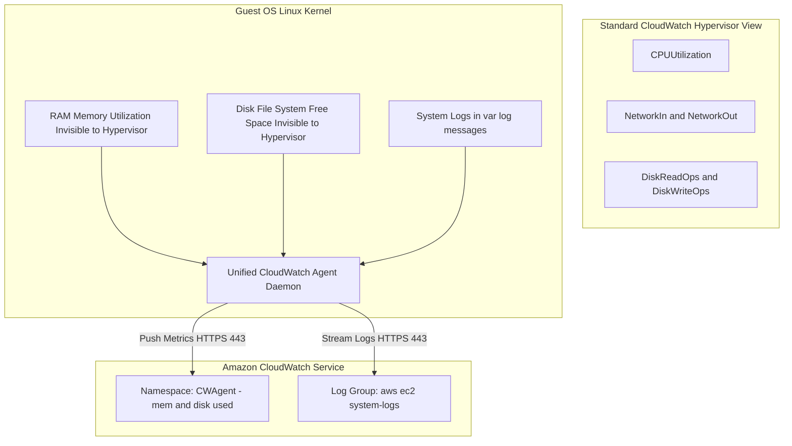

<div align="center">

# 🔬 Lab 7.2: Unified CloudWatch Agent (OS-Level RAM, Disk & Log Streaming)

**[🏠 AWS Labs Root](../../../README.md)** &nbsp;•&nbsp; **[🖥️ EC2 Curriculum](../../README.md)** &nbsp;•&nbsp; **[📂 Module 07](../README.md)**

   

**[⬅️ Previous Lab](../../module-07-monitoring-and-troubleshooting/lab-01-status-checks-autorecovery/README.md)** &nbsp;|&nbsp; **[➡️ Next Lab](../../module-07-monitoring-and-troubleshooting/lab-03-serial-console-ebs-rescue/README.md)**

</div>

---

## 📌 Lab Objectives

- [x] Understand the **Hypervisor Visibility Boundary**: why AWS CloudWatch cannot view internal OS metrics (RAM, swap, disk filesystem usage) by default.
- [x] Deploy the **Unified Amazon CloudWatch Agent** inside an EC2 instance.
- [x] Configure metric collection for `mem_used_percent`, `swap_used_percent`, and `disk_used_percent`.
- [x] Stream local Linux system logs (`/var/log/messages`) into a centralized **Amazon CloudWatch Log Group**.

---

## 🏗️ Architecture Diagram


<details>
<summary>📐 <b>View Mermaid Architecture Source (Click to Expand)</b></summary>



</details>

---

## 💡 Key Architectural Concepts

1. **The Hypervisor Blind Spot**:
   - The AWS hypervisor allocates physical host RAM to virtual machines, but Linux dynamically uses free RAM for buffers and page caches. The hypervisor has no mechanism to differentiate active application memory from reclaimable OS page cache.
   - An OS-level agent is mandatory for RAM alerts.
2. **Unified Agent Architecture**:
   - Replaced the older Python-based CloudWatch Logs and Perl monitoring scripts with a unified, high-performance Go-based daemon.
3. **SSM Parameter Integration**:
   - Best practice is to store the JSON agent configuration centrally in **AWS Systems Manager Parameter Store**, allowing hundreds of instances to pull their config dynamically.

---

## ⏱️ Prerequisites & Cost

> [!TIP]
> **AWS Free Tier & Cost Guardrail**
> - **AWS Free Tier Eligible**: Yes (`t3.micro` + Free tier CloudWatch custom metrics/logs).
> - **Estimated Duration**: 20 minutes.

---

## 🚀 Step-by-Step Instructions

### Step 1: Create IAM Role with CloudWatch Agent Policy
```bash
export AWS_REGION=$(aws configure get region || echo "us-east-1")
export VPC_ID=$(aws ec2 describe-vpcs \
  --filters "Name=isDefault,Values=true" \
  --query "Vpcs[0].VpcId" \
  --output text)
export SUBNET_ID=$(aws ec2 describe-subnets \
  --filters "Name=vpc-id,Values=${VPC_ID}" \
  --query "Subnets[0].SubnetId" \
  --output text)

cat <<JSON > cw-trust.json
{
  "Version": "2012-10-17",
  "Statement": [{
    "Effect": "Allow",
    "Principal": { "Service": "ec2.amazonaws.com" },
    "Action": "sts:AssumeRole"
  }]
}
JSON

aws iam create-role --role-name "ec2-cw-agent-role" --assume-role-policy-document file://cw-trust.json 2>/dev/null || true
aws iam attach-role-policy \
  --role-name "ec2-cw-agent-role" \
  --policy-arn "arn:aws:iam::aws:policy/CloudWatchAgentServerPolicy"

aws iam create-instance-profile --instance-profile-name "ec2-cw-agent-profile" 2>/dev/null || true
aws iam add-role-to-instance-profile --instance-profile-name "ec2-cw-agent-profile" --role-name "ec2-cw-agent-role" 2>/dev/null || true

sleep 10
```

### Step 2: Store Agent Configuration in SSM Parameter Store
```bash
cat <<'JSON' > cw-config.json
{
  "metrics": {
    "metrics_collected": {
      "mem": {
        "measurement": ["mem_used_percent"],
        "metrics_collection_interval": 60
      },
      "disk": {
        "measurement": ["disk_used_percent"],
        "metrics_collection_interval": 60,
        "resources": ["/"]
      }
    },
    "append_dimensions": {
      "InstanceId": "${aws:InstanceId}"
    }
  },
  "logs": {
    "logs_collected": {
      "files": {
        "collect_list": [
          {
            "file_path": "/var/log/messages",
            "log_group_name": "/aws/ec2/system-logs",
            "log_stream_name": "{instance_id}"
          }
        ]
      }
    }
  }
}
JSON

aws ssm put-parameter \
  --name "AmazonCloudWatch-linux-ec2-labs" \
  --type "String" \
  --value file://cw-config.json \
  --overwrite

echo "Saved CloudWatch Agent configuration into SSM Parameter Store."
```

### Step 3: Launch Instance and Install Agent
```bash
AMI_ID=$(aws ssm get-parameter \
  --name "/aws/service/ami-amazon-linux-latest/al2023-ami-kernel-default-x86_64" \
  --query "Parameter.Value" --output text)

INSTANCE_ID=$(aws ec2 run-instances \
  --image-id "${AMI_ID}" \
  --instance-type "t3.micro" \
  --subnet-id "${SUBNET_ID}" \
  --iam-instance-profile "Name=ec2-cw-agent-profile" \
  --user-data "#!/bin/bash
dnf install -y amazon-cloudwatch-agent
/opt/aws/amazon-cloudwatch-agent/bin/amazon-cloudwatch-agent-ctl \
  -a fetch-config \
  -m ec2 \
  -s \
  -c ssm:AmazonCloudWatch-linux-ec2-labs" \
  --tag-specifications "ResourceType=instance,Tags=[{Key=Project,Value=ec2-master-labs},{Key=Name,Value=cw-agent-node}]" \
  --query "Instances[0].InstanceId" --output text)

echo "Launched Node: ${INSTANCE_ID}"
aws ec2 wait instance-running --instance-ids "${INSTANCE_ID}"
echo "Waiting 60 seconds for agent to publish first metric batch..."
sleep 60
```

---

## 🔍 Verification & Telemetry

### 1. Check Custom OS Metrics in CloudWatch
Query the `CWAgent` namespace:
```bash
aws cloudwatch list-metrics \
  --namespace "CWAgent" \
  --dimensions "Name=InstanceId,Value=${INSTANCE_ID}" \
  --query "Metrics[*].MetricName" \
  --output table
```
**Expected Output**:
```text
-------------------------
|      ListMetrics      |
+-----------------------+
|  mem_used_percent     |
|  disk_used_percent    |
+-----------------------+
```

### 2. Verify Centralized Log Ingestion
Query the newly created CloudWatch Log Group:
```bash
aws logs filter-log-events \
  --log-group-name "/aws/ec2/system-logs" \
  --limit 5 \
  --query "events[*].message" \
  --output text
```
You will see live system log entries streamed directly from `/var/log/messages` on your EC2 instance!

---

## 📘 Deep-Dive Command & Flag Reference

> [!TIP]
> **Line-by-Line Production Analysis**: Every command executed in this lab is dissected below, explaining each CLI flag, JMESPath query, Linux kernel parameter, and why it is critical in production automation.

<details open>
<summary>📘 <b>Command 1: Discovering Network Subnets and AWS Region</b></summary>

```bash
export AWS_REGION=$(aws configure get region || echo "us-east-1")
export VPC_ID=$(aws ec2 describe-vpcs \
  --filters "Name=isDefault,Values=true" \
  --query "Vpcs[0].VpcId" \
  --output text)
export SUBNET_ID=$(aws ec2 describe-subnets \
  --filters "Name=vpc-id,Values=${VPC_ID}" \
  --query "Subnets[0].SubnetId" \
  --output text)
```

#### 🔍 Parameter & Component Breakdown
- **`export AWS_REGION=...`** — Identifies target AWS region.
- **`export VPC_ID=...`** — Queries the default VPC ID.
- **`export SUBNET_ID=...`** — Queries the first active subnet in the default VPC for instance placement.

> 🏭 **Why This Matters in Production Automation**
> Ensures reproducible deployment targeting valid subnets with internet gateways or VPC endpoints required to reach CloudWatch APIs.

</details>

<details open>
<summary>📘 <b>Command 2: Creating the IAM Role and Instance Profile for CloudWatch Agent</b></summary>

```bash
cat <<JSON > cw-trust.json
{
  "Version": "2012-10-17",
  "Statement": [{
    "Effect": "Allow",
    "Principal": { "Service": "ec2.amazonaws.com" },
    "Action": "sts:AssumeRole"
  }]
}
JSON

aws iam create-role --role-name "ec2-cw-agent-role" --assume-role-policy-document file://cw-trust.json 2>/dev/null || true
aws iam attach-role-policy \
  --role-name "ec2-cw-agent-role" \
  --policy-arn "arn:aws:iam::aws:policy/CloudWatchAgentServerPolicy"

aws iam create-instance-profile --instance-profile-name "ec2-cw-agent-profile" 2>/dev/null || true
aws iam add-role-to-instance-profile --instance-profile-name "ec2-cw-agent-profile" --role-name "ec2-cw-agent-role" 2>/dev/null || true

sleep 10
```

#### 🔍 Parameter & Component Breakdown
- **`cw-trust.json`** — Defines the trust relationship allowing the EC2 service (`ec2.amazonaws.com`) to assume the role via AWS Security Token Service (`sts:AssumeRole`).
- **`aws iam create-role`** — Provisions the IAM role `ec2-cw-agent-role`.
- **`aws iam attach-role-policy ... --policy-arn "arn:aws:iam::aws:policy/CloudWatchAgentServerPolicy"`** — Grants the managed policy containing exact permissions needed to publish custom metrics (`cloudwatch:PutMetricData`), write logs (`logs:PutLogEvents`, `logs:CreateLogStream`), and pull configuration from SSM Parameter Store (`ssm:GetParameter`).
- **`aws iam create-instance-profile` and `aws iam add-role-to-instance-profile`** — Constructs the instance profile container required to pass IAM roles to EC2 virtual machines.
- **`sleep 10`** — Mitigates IAM global eventual consistency replication delays across AWS regional endpoints.

> 🏭 **Why This Matters in Production Automation**
> Without this role and policy, the CloudWatch Agent daemon running inside the EC2 operating system will receive `AccessDenied` when attempting to push metric samples or stream logs to the AWS CloudWatch control plane.

</details>

<details open>
<summary>📘 <b>Command 3: Centralizing Agent Configuration in SSM Parameter Store</b></summary>

```bash
cat <<'JSON' > cw-config.json
{
  "metrics": {
    "metrics_collected": {
      "mem": {
        "measurement": ["mem_used_percent"],
        "metrics_collection_interval": 60
      },
      "disk": {
        "measurement": ["disk_used_percent"],
        "metrics_collection_interval": 60,
        "resources": ["/"]
      }
    },
    "append_dimensions": {
      "InstanceId": "${aws:InstanceId}"
    }
  },
  "logs": {
    "logs_collected": {
      "files": {
        "collect_list": [
          {
            "file_path": "/var/log/messages",
            "log_group_name": "/aws/ec2/system-logs",
            "log_stream_name": "{instance_id}"
          }
        ]
      }
    }
  }
}
JSON

aws ssm put-parameter \
  --name "AmazonCloudWatch-linux-ec2-labs" \
  --type "String" \
  --value file://cw-config.json \
  --overwrite
```

#### 🔍 Parameter & Component Breakdown
- **`cw-config.json`** — JSON configuration governing the Unified CloudWatch Agent:
  - **`"metrics"`** — Configures OS-level metrics collection. `mem_used_percent` calculates `(total - available) / total * 100`. `disk_used_percent` tracks root filesystem (`/`) consumption. Interval is set to 60 seconds.
  - **`"append_dimensions": {"InstanceId": "${aws:InstanceId}"}`** — Automatically tags every metric point with the host's EC2 instance ID for precise filtering.
  - **`"logs"`** — Specifies OS files to tail and stream. Tails `/var/log/messages` and streams lines into CloudWatch log group `/aws/ec2/system-logs` under an instance-specific stream name.
- **`aws ssm put-parameter`** — Stores the JSON string inside AWS Systems Manager Parameter Store under `AmazonCloudWatch-linux-ec2-labs`.
- **`--overwrite`** — Overwrites existing values if updating.

> 🏭 **Why This Matters in Production Automation**
> Hardcoding configuration files directly into individual AMIs or UserData scripts creates severe configuration drift. Centralizing the agent configuration in SSM Parameter Store enables updating metric collections, log paths, and polling intervals across thousands of production instances centrally without modifying code or rebuilding images.

</details>

<details open>
<summary>📘 <b>Command 4: Launching the Instance and Initializing CloudWatch Agent</b></summary>

```bash
AMI_ID=$(aws ssm get-parameter \
  --name "/aws/service/ami-amazon-linux-latest/al2023-ami-kernel-default-x86_64" \
  --query "Parameter.Value" --output text)

INSTANCE_ID=$(aws ec2 run-instances \
  --image-id "${AMI_ID}" \
  --instance-type "t3.micro" \
  --subnet-id "${SUBNET_ID}" \
  --iam-instance-profile "Name=ec2-cw-agent-profile" \
  --user-data "#!/bin/bash
dnf install -y amazon-cloudwatch-agent
/opt/aws/amazon-cloudwatch-agent/bin/amazon-cloudwatch-agent-ctl \
  -a fetch-config \
  -m ec2 \
  -s \
  -c ssm:AmazonCloudWatch-linux-ec2-labs" \
  --tag-specifications "ResourceType=instance,Tags=[{Key=Project,Value=ec2-master-labs},{Key=Name,Value=cw-agent-node}]" \
  --query "Instances[0].InstanceId" --output text)

echo "Launched Node: ${INSTANCE_ID}"
aws ec2 wait instance-running --instance-ids "${INSTANCE_ID}"
echo "Waiting 60 seconds for agent to publish first metric batch..."
sleep 60
```

#### 🔍 Parameter & Component Breakdown
- **`--iam-instance-profile "Name=ec2-cw-agent-profile"`** — Attaches our IAM instance profile to supply temporary credentials via IMDS.
- **`--user-data`** — Executes the bootstrap script during instance launch:
  - **`dnf install -y amazon-cloudwatch-agent`** — Installs the official unified agent package from Amazon Linux 2023 repositories.
  - **`amazon-cloudwatch-agent-ctl`** — Agent control utility.
  - **`-a fetch-config`** — Action flag instructing the utility to retrieve configuration.
  - **`-m ec2`** — Mode set to EC2.
  - **`-s`** — Starts the agent daemon immediately as a systemd service upon configuration load.
  - **`-c ssm:AmazonCloudWatch-linux-ec2-labs`** — Directs the agent to fetch its JSON configuration directly from the specified SSM Parameter.
- **`sleep 60`** — Grants 60 seconds for the operating system to boot, start the agent, and transmit its first metric payload to AWS.

> 🏭 **Why This Matters in Production Automation**
> Fully automates host telemetry bootstrapping. The instance boots up, queries SSM Parameter Store for its operational blueprint, starts background log ingestion, and immediately reports OS-level health metrics to CloudWatch dashboards without manual SSH access.

</details>

<details open>
<summary>📘 <b>Command 5: Verifying OS-Level Memory and Disk Metrics in CloudWatch</b></summary>

```bash
aws cloudwatch list-metrics \
  --namespace "CWAgent" \
  --dimensions "Name=InstanceId,Value=${INSTANCE_ID}" \
  --query "Metrics[*].MetricName" \
  --output table
```

#### 🔍 Parameter & Component Breakdown
- **`aws cloudwatch list-metrics`** — Queries available metric series.
- **`--namespace "CWAgent"`** — The default CloudWatch namespace used by the Unified Agent for OS-level metrics. Standard EC2 hypervisor metrics live in the separate `AWS/EC2` namespace.
- **`--dimensions "Name=InstanceId,Value=${INSTANCE_ID}"`** — Restricts query to metrics tagged with our instance ID.
- **`--query "Metrics[*].MetricName"`** — Pulls all registered metric names, returning `mem_used_percent` and `disk_used_percent`.

> 🏭 **Why This Matters in Production Automation**
> Hypervisor metrics (`AWS/EC2`) cannot see inside the Linux kernel page cache or filesystem allocation table. Registering metrics in `CWAgent` enables engineering teams to create CloudWatch alarms for out-of-memory (OOM) conditions and root filesystem disk exhaustion before production services crash.

</details>

<details open>
<summary>📘 <b>Command 6: Verifying Centralized Log Streaming</b></summary>

```bash
aws logs filter-log-events \
  --log-group-name "/aws/ec2/system-logs" \
  --limit 5 \
  --query "events[*].message" \
  --output text
```

#### 🔍 Parameter & Component Breakdown
- **`aws logs filter-log-events`** — Queries log events from Amazon CloudWatch Logs.
- **`--log-group-name "/aws/ec2/system-logs"`** — Points to the log group created dynamically by the agent.
- **`--limit 5`** — Retrieves the latest 5 log entries.
- **`--query "events[*].message" --output text`** — Prints the raw log string output from `/var/log/messages`.

> 🏭 **Why This Matters in Production Automation**
> Centralized log streaming decouples telemetry from ephemeral compute. If an EC2 instance crashes, is terminated by Auto Scaling, or suffers catastrophic disk failure, all kernel syslog entries, authentication attempts, and error dumps remain permanently preserved in CloudWatch Logs for post-mortem analysis.

</details>

<details open>
<summary>📘 <b>Command 7: Automated Teardown and Cleanup</b></summary>

```bash
aws ec2 terminate-instances --instance-ids "${INSTANCE_ID}"
aws ec2 wait instance-terminated --instance-ids "${INSTANCE_ID}"

aws logs delete-log-group --log-group-name "/aws/ec2/system-logs" 2>/dev/null || true

aws ssm delete-parameter --name "AmazonCloudWatch-linux-ec2-labs"
aws iam remove-role-from-instance-profile \
  --instance-profile-name "ec2-cw-agent-profile" \
  --role-name "ec2-cw-agent-role"
aws iam delete-instance-profile --instance-profile-name "ec2-cw-agent-profile"
aws iam detach-role-policy \
  --role-name "ec2-cw-agent-role" \
  --policy-arn "arn:aws:iam::aws:policy/CloudWatchAgentServerPolicy"
aws iam delete-role --role-name "ec2-cw-agent-role"
rm -f cw-trust.json cw-config.json
```

#### 🔍 Parameter & Component Breakdown
- **`aws ec2 terminate-instances` and `wait`** — Destroys the worker instance.
- **`aws logs delete-log-group`** — Removes the log group to eliminate ongoing storage costs.
- **`aws ssm delete-parameter`** — Removes the SSM configuration parameter.
- **`aws iam ...`** — Detaches policies, unlinks roles from instance profiles, and destroys IAM entities in strict reverse dependency order.
- **`rm -f ...`** — Removes local temporary configuration files.

> 🏭 **Why This Matters in Production Automation**
> IAM roles, SSM parameters, and CloudWatch log groups linger indefinitely unless explicitly decommissioned. Clean teardown procedures eliminate orphaned assets and reduce clutter in enterprise AWS accounts.

</details>

---

## 🧹 Teardown & Clean-up


> [!CAUTION]
> **Always Tear Down Lab Resources**: Execute the cleanup commands below immediately after completing the verification steps to prevent unintended AWS billing.

```bash
# 1. Terminate instance
aws ec2 terminate-instances --instance-ids "${INSTANCE_ID}"
aws ec2 wait instance-terminated --instance-ids "${INSTANCE_ID}"

# 2. Delete CloudWatch Log Group
aws logs delete-log-group --log-group-name "/aws/ec2/system-logs" 2>/dev/null || true

# 3. Clean up SSM parameter and IAM roles
aws ssm delete-parameter --name "AmazonCloudWatch-linux-ec2-labs"
aws iam remove-role-from-instance-profile \
  --instance-profile-name "ec2-cw-agent-profile" \
  --role-name "ec2-cw-agent-role"
aws iam delete-instance-profile --instance-profile-name "ec2-cw-agent-profile"
aws iam detach-role-policy \
  --role-name "ec2-cw-agent-role" \
  --policy-arn "arn:aws:iam::aws:policy/CloudWatchAgentServerPolicy"
aws iam delete-role --role-name "ec2-cw-agent-role"
rm -f cw-trust.json cw-config.json

echo "Lab 7.2 clean-up completed successfully."
```

---

<div align="center">

**[⬅️ Previous Lab](../../module-07-monitoring-and-troubleshooting/lab-01-status-checks-autorecovery/README.md)** &nbsp;•&nbsp; **[⬆️ Back to Module 07](../README.md)** &nbsp;•&nbsp; **[🏠 EC2 Index](../../README.md)** &nbsp;•&nbsp; **[➡️ Next Lab](../../module-07-monitoring-and-troubleshooting/lab-03-serial-console-ebs-rescue/README.md)**

</div>
