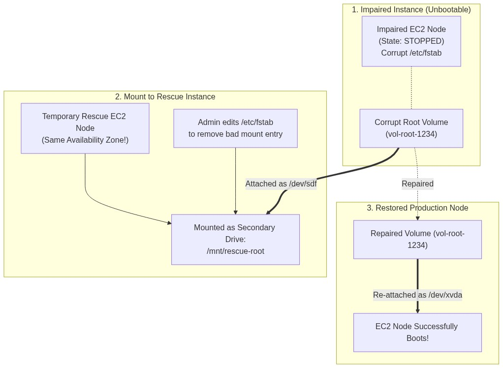
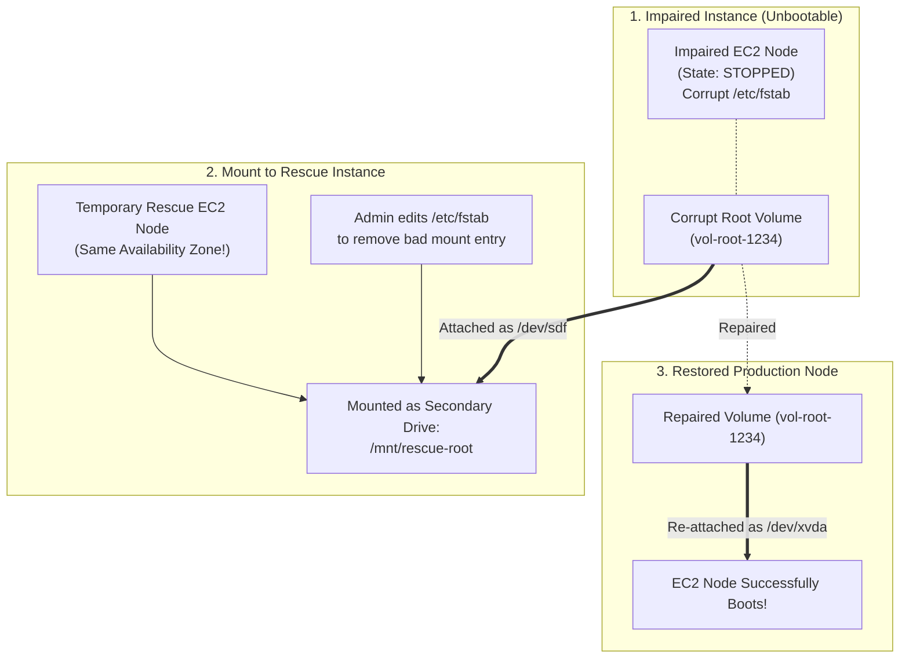

<div align="center">

# 🔬 Lab 7.3: Disaster Recovery: EC2 Serial Console & EBS Root Volume Rescue

**[🏠 AWS Labs Root](../../../README.md)** &nbsp;•&nbsp; **[🖥️ EC2 Curriculum](../../README.md)** &nbsp;•&nbsp; **[📂 Module 07](../README.md)**

   

**[⬅️ Previous Lab](../../module-07-monitoring-and-troubleshooting/lab-02-cloudwatch-agent-metrics-logs/README.md)** &nbsp;|&nbsp; **[➡️ Next Lab](../../module-07-monitoring-and-troubleshooting/lab-04-vpc-flow-logs/README.md)**


[](https://cyber-cloud-security.github.io/aws-labs/?lab=lab-03-serial-console-ebs-rescue)

</div>

---

## 📌 Lab Objectives

- [x] Understand how to recover an EC2 instance rendered completely unreachable by operating system failures (corrupt `/etc/fstab`, broken GRUB kernel, network stack crash).
- [x] Configure and connect to the out-of-band **EC2 Serial Console** on AWS Nitro instances.
- [x] Execute the standard **EBS Root Volume Rescue Procedure**: detaching an unbootable root volume, mounting it to a temporary rescue instance to repair system files, and restoring it to production.

---

## 🏗️ Root Volume Rescue Architecture



<details>
<summary>📐 <b>View Mermaid Architecture Source (Click to Expand)</b></summary>



</details>

---

## 💡 Key Architectural Concepts

1. **Why SSH & SSM Fail**:
   - Both SSH and SSM require an operating system with an active network stack, valid routing tables, running daemons, and cleanly mounted filesystems.
   - If `/etc/fstab` contains an invalid entry without `nofail`, systemd aborts boot and hangs before network services initialize.
2. **EC2 Serial Console**:
   - A direct, virtual serial port (COM1 / ttyS0) connection to the Nitro Hypervisor. It does not require any network connectivity on the instance, allowing keyboard access to GRUB and emergency mode.
3. **EBS Swapping Architecture**:
   - Because EBS volumes are independent networked block devices, you can detach any root volume, repair it from another instance, and reattach it. The original instance retains its identity, private IP, and IAM role.

---

## ⏱️ Prerequisites & Cost

> [!TIP]
> **AWS Free Tier & Cost Guardrail**
> - **AWS Free Tier Eligible**: Yes (`t3.micro`).
> - **Estimated Duration**: 25 minutes.

---

## 🚀 Step-by-Step Instructions

### Part 1: Enable EC2 Serial Console (Account Level)
The EC2 Serial Console is disabled account-wide by default:
```bash
export AWS_REGION=$(aws configure get region || echo "us-east-1")

# Enable account-level serial console access:
aws ec2 enable-serial-console-access --region "${AWS_REGION}"

# Verify:
aws ec2 get-serial-console-access-status --region "${AWS_REGION}"
```

---

### Part 2: The EBS Root Volume Rescue Workflow

#### Step 1: Simulate Broken Node
Assume instance `BROKEN_ID` with root volume `ROOT_VOL_ID` in Availability Zone `AZ`:
```bash
# 1. Fetch instance details
AZ=$(aws ec2 describe-instances \
  --instance-ids "${BROKEN_ID}" \
  --query "Reservations[0].Instances[0].Placement.AvailabilityZone" \
  --output text)
ROOT_VOL_ID=$(aws ec2 describe-instances \
  --instance-ids "${BROKEN_ID}" \
  --query "Reservations[0].Instances[0].BlockDeviceMappings[0].Ebs.VolumeId" \
  --output text)

echo "Target broken volume: ${ROOT_VOL_ID} in ${AZ}"

# 2. Stop the broken instance
aws ec2 stop-instances --instance-ids "${BROKEN_ID}"
aws ec2 wait instance-stopped --instance-ids "${BROKEN_ID}"
```

#### Step 2: Detach the Corrupt Root Volume
```bash
aws ec2 detach-volume --volume-id "${ROOT_VOL_ID}"
aws ec2 wait volume-available --volume-ids "${ROOT_VOL_ID}"
echo "Corrupt root volume detached."
```

#### Step 3: Launch a Temporary Rescue Instance in the SAME AZ
```bash
SUBNET_ID=$(aws ec2 describe-instances \
  --instance-ids "${BROKEN_ID}" \
  --query "Reservations[0].Instances[0].SubnetId" \
  --output text)
AMI_ID=$(aws ssm get-parameter \
  --name "/aws/service/ami-amazon-linux-latest/al2023-ami-kernel-default-x86_64" \
  --query "Parameter.Value" \
  --output text)

RESCUE_ID=$(aws ec2 run-instances \
  --image-id "${AMI_ID}" \
  --instance-type "t3.micro" \
  --subnet-id "${SUBNET_ID}" \
  --tag-specifications "ResourceType=instance,Tags=[{Key=Name,Value=rescue-node}]" \
  --query "Instances[0].InstanceId" --output text)

aws ec2 wait instance-running --instance-ids "${RESCUE_ID}"
echo "Rescue node running: ${RESCUE_ID}"
```

#### Step 4: Attach the Corrupt Volume to the Rescue Instance
Attach as a secondary data volume (`/dev/sdf`):
```bash
aws ec2 attach-volume \
  --volume-id "${ROOT_VOL_ID}" \
  --instance-id "${RESCUE_ID}" \
  --device "/dev/sdf"

aws ec2 wait volume-in-use --volume-ids "${ROOT_VOL_ID}"
```

#### Step 5: Repair Filesystem on Rescue Instance
Log into `RESCUE_ID` via SSM Session Manager or SSH:
```bash
# 1. Identify attached drive (e.g. /dev/nvme1n1p1)
lsblk

# 2. Mount corrupt partition to a repair directory
sudo mkdir -p /mnt/rescue-root
sudo mount -o nouuid /dev/nvme1n1p1 /mnt/rescue-root

# 3. Perform repair (e.g. comment out broken fstab entry or fix configuration)
sudo sed -i 's/^.*bad_mount.*$/# disabled bad mount/' /mnt/rescue-root/etc/fstab

# 4. Safely unmount
sudo umount /mnt/rescue-root
```

#### Step 6: Detach from Rescue Node and Reattach to Production Node
```bash
# 1. Detach from rescue node
aws ec2 detach-volume --volume-id "${ROOT_VOL_ID}"
aws ec2 wait volume-available --volume-ids "${ROOT_VOL_ID}"

# 2. Terminate temporary rescue instance
aws ec2 terminate-instances --instance-ids "${RESCUE_ID}"

# 3. CRITICAL: Reattach to original instance as the ROOT device (/dev/xvda)
aws ec2 attach-volume \
  --volume-id "${ROOT_VOL_ID}" \
  --instance-id "${BROKEN_ID}" \
  --device "/dev/xvda"

aws ec2 wait volume-in-use --volume-ids "${ROOT_VOL_ID}"

# 4. Start the recovered instance!
aws ec2 start-instances --instance-ids "${BROKEN_ID}"
aws ec2 wait instance-running --instance-ids "${BROKEN_ID}"

echo "Instance ${BROKEN_ID} successfully resurrected!"
```

---

## 🧹 Teardown & Clean-up


> [!CAUTION]
> **Always Tear Down Lab Resources**: Execute the cleanup commands below immediately after completing the verification steps to prevent unintended AWS billing.

```bash
aws ec2 terminate-instances --instance-ids "${BROKEN_ID}"
aws ec2 wait instance-terminated --instance-ids "${BROKEN_ID}"
echo "Lab 7.3 clean-up completed successfully."
```

---

<div align="center">

**[⬅️ Previous Lab](../../module-07-monitoring-and-troubleshooting/lab-02-cloudwatch-agent-metrics-logs/README.md)** &nbsp;•&nbsp; **[⬆️ Back to Module 07](../README.md)** &nbsp;•&nbsp; **[🏠 EC2 Index](../../README.md)** &nbsp;•&nbsp; **[➡️ Next Lab](../../module-07-monitoring-and-troubleshooting/lab-04-vpc-flow-logs/README.md)**

</div>
