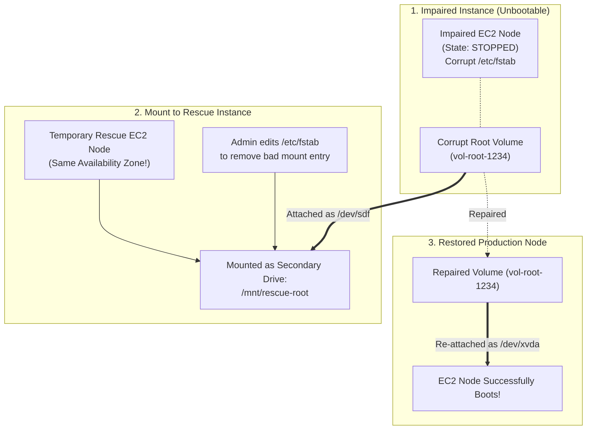

<div align="center">

# 🔬 Lab 7.3: Disaster Recovery: EC2 Serial Console & EBS Root Volume Rescue

**[🏠 AWS Labs Root](../../../README.md)** &nbsp;•&nbsp; **[🖥️ EC2 Curriculum](../../README.md)** &nbsp;•&nbsp; **[📂 Module 07](../README.md)**

   

**[⬅️ Previous Lab](../../module-07-monitoring-and-troubleshooting/lab-02-cloudwatch-agent-metrics-logs/README.md)** &nbsp;|&nbsp; **[➡️ Next Lab](../../module-07-monitoring-and-troubleshooting/lab-04-vpc-flow-logs/README.md)**

</div>

---

## 📌 Lab Objectives

- [x] Understand how to recover an EC2 instance rendered completely unreachable by operating system failures (corrupt `/etc/fstab`, broken GRUB kernel, network stack crash).
- [x] Configure and connect to the out-of-band **EC2 Serial Console** on AWS Nitro instances.
- [x] Execute the standard **EBS Root Volume Rescue Procedure**: detaching an unbootable root volume, mounting it to a temporary rescue instance to repair system files, and restoring it to production.

---

## 🏗️ Root Volume Rescue Architecture


<details>
<summary>📐 <b>View Mermaid Architecture Source (Click to Expand)</b></summary>



</details>

---

## 💡 Key Architectural Concepts

1. **Why SSH & SSM Fail**:
   - Both SSH and SSM require an operating system with an active network stack, valid routing tables, running daemons, and cleanly mounted filesystems.
   - If `/etc/fstab` contains an invalid entry without `nofail`, systemd aborts boot and hangs before network services initialize.
2. **EC2 Serial Console**:
   - A direct, virtual serial port (COM1 / ttyS0) connection to the Nitro Hypervisor. It does not require any network connectivity on the instance, allowing keyboard access to GRUB and emergency mode.
3. **EBS Swapping Architecture**:
   - Because EBS volumes are independent networked block devices, you can detach any root volume, repair it from another instance, and reattach it. The original instance retains its identity, private IP, and IAM role.

---

## ⏱️ Prerequisites & Cost

> [!TIP]
> **AWS Free Tier & Cost Guardrail**
> - **AWS Free Tier Eligible**: Yes (`t3.micro`).
> - **Estimated Duration**: 25 minutes.

---

## 🚀 Step-by-Step Instructions

### Part 1: Enable EC2 Serial Console (Account Level)
The EC2 Serial Console is disabled account-wide by default:
```bash
export AWS_REGION=$(aws configure get region || echo "us-east-1")

# Enable account-level serial console access:
aws ec2 enable-serial-console-access --region "${AWS_REGION}"

# Verify:
aws ec2 get-serial-console-access-status --region "${AWS_REGION}"
```

---

### Part 2: The EBS Root Volume Rescue Workflow

#### Step 1: Simulate Broken Node
Assume instance `BROKEN_ID` with root volume `ROOT_VOL_ID` in Availability Zone `AZ`:
```bash
# 1. Fetch instance details
AZ=$(aws ec2 describe-instances \
  --instance-ids "${BROKEN_ID}" \
  --query "Reservations[0].Instances[0].Placement.AvailabilityZone" \
  --output text)
ROOT_VOL_ID=$(aws ec2 describe-instances \
  --instance-ids "${BROKEN_ID}" \
  --query "Reservations[0].Instances[0].BlockDeviceMappings[0].Ebs.VolumeId" \
  --output text)

echo "Target broken volume: ${ROOT_VOL_ID} in ${AZ}"

# 2. Stop the broken instance
aws ec2 stop-instances --instance-ids "${BROKEN_ID}"
aws ec2 wait instance-stopped --instance-ids "${BROKEN_ID}"
```

#### Step 2: Detach the Corrupt Root Volume
```bash
aws ec2 detach-volume --volume-id "${ROOT_VOL_ID}"
aws ec2 wait volume-available --volume-ids "${ROOT_VOL_ID}"
echo "Corrupt root volume detached."
```

#### Step 3: Launch a Temporary Rescue Instance in the SAME AZ
```bash
SUBNET_ID=$(aws ec2 describe-instances \
  --instance-ids "${BROKEN_ID}" \
  --query "Reservations[0].Instances[0].SubnetId" \
  --output text)
AMI_ID=$(aws ssm get-parameter \
  --name "/aws/service/ami-amazon-linux-latest/al2023-ami-kernel-default-x86_64" \
  --query "Parameter.Value" \
  --output text)

RESCUE_ID=$(aws ec2 run-instances \
  --image-id "${AMI_ID}" \
  --instance-type "t3.micro" \
  --subnet-id "${SUBNET_ID}" \
  --tag-specifications "ResourceType=instance,Tags=[{Key=Name,Value=rescue-node}]" \
  --query "Instances[0].InstanceId" --output text)

aws ec2 wait instance-running --instance-ids "${RESCUE_ID}"
echo "Rescue node running: ${RESCUE_ID}"
```

#### Step 4: Attach the Corrupt Volume to the Rescue Instance
Attach as a secondary data volume (`/dev/sdf`):
```bash
aws ec2 attach-volume \
  --volume-id "${ROOT_VOL_ID}" \
  --instance-id "${RESCUE_ID}" \
  --device "/dev/sdf"

aws ec2 wait volume-in-use --volume-ids "${ROOT_VOL_ID}"
```

#### Step 5: Repair Filesystem on Rescue Instance
Log into `RESCUE_ID` via SSM Session Manager or SSH:
```bash
# 1. Identify attached drive (e.g. /dev/nvme1n1p1)
lsblk

# 2. Mount corrupt partition to a repair directory
sudo mkdir -p /mnt/rescue-root
sudo mount -o nouuid /dev/nvme1n1p1 /mnt/rescue-root

# 3. Perform repair (e.g. comment out broken fstab entry or fix configuration)
sudo sed -i 's/^.*bad_mount.*$/# disabled bad mount/' /mnt/rescue-root/etc/fstab

# 4. Safely unmount
sudo umount /mnt/rescue-root
```

#### Step 6: Detach from Rescue Node and Reattach to Production Node
```bash
# 1. Detach from rescue node
aws ec2 detach-volume --volume-id "${ROOT_VOL_ID}"
aws ec2 wait volume-available --volume-ids "${ROOT_VOL_ID}"

# 2. Terminate temporary rescue instance
aws ec2 terminate-instances --instance-ids "${RESCUE_ID}"

# 3. CRITICAL: Reattach to original instance as the ROOT device (/dev/xvda)
aws ec2 attach-volume \
  --volume-id "${ROOT_VOL_ID}" \
  --instance-id "${BROKEN_ID}" \
  --device "/dev/xvda"

aws ec2 wait volume-in-use --volume-ids "${ROOT_VOL_ID}"

# 4. Start the recovered instance!
aws ec2 start-instances --instance-ids "${BROKEN_ID}"
aws ec2 wait instance-running --instance-ids "${BROKEN_ID}"

echo "Instance ${BROKEN_ID} successfully resurrected!"
```

---

## 📘 Deep-Dive Command & Flag Reference

> [!TIP]
> **Line-by-Line Production Analysis**: Every command executed in this lab is dissected below, explaining each CLI flag, JMESPath query, Linux kernel parameter, and why it is critical in production automation.

<details open>
<summary>📘 <b>Command 1: Enabling Account-Level EC2 Serial Console Access</b></summary>

```bash
export AWS_REGION=$(aws configure get region || echo "us-east-1")

aws ec2 enable-serial-console-access --region "${AWS_REGION}"
aws ec2 get-serial-console-access-status --region "${AWS_REGION}"
```

#### 🔍 Parameter & Component Breakdown
- **`aws ec2 enable-serial-console-access`** — Configures an account-level security toggle. By default, EC2 Serial Console access is globally disabled in every AWS account for security posture isolation.
- **`--region "${AWS_REGION}"`** — Scopes enablement to the target region.
- **`aws ec2 get-serial-console-access-status`** — Queries the current authorization state, returning `{"SerialConsoleAccessEnabled": true}`.

> 🏭 **Why This Matters in Production Automation**
> When an EC2 instance fails to boot due to a kernel panic, misconfigured network script, or corrupt `/etc/fstab`, both SSH and AWS Systems Manager Session Manager are rendered completely dead because the guest operating system network stack never initializes. The EC2 Serial Console provides a direct out-of-band serial port (`ttyS0` / `COM1`) connection directly into the AWS Nitro hypervisor, granting keyboard access to GRUB bootloaders and Linux emergency recovery modes.

</details>

<details open>
<summary>📘 <b>Command 2: Stopping the Impaired Instance and Fetching Topology</b></summary>

```bash
AZ=$(aws ec2 describe-instances \
  --instance-ids "${BROKEN_ID}" \
  --query "Reservations[0].Instances[0].Placement.AvailabilityZone" \
  --output text)
ROOT_VOL_ID=$(aws ec2 describe-instances \
  --instance-ids "${BROKEN_ID}" \
  --query "Reservations[0].Instances[0].BlockDeviceMappings[0].Ebs.VolumeId" \
  --output text)

echo "Target broken volume: ${ROOT_VOL_ID} in ${AZ}"

aws ec2 stop-instances --instance-ids "${BROKEN_ID}"
aws ec2 wait instance-stopped --instance-ids "${BROKEN_ID}"
```

#### 🔍 Parameter & Component Breakdown
- **`AZ=$(aws ec2 describe-instances ...)`** — Extracts the exact Availability Zone (e.g., `us-east-1a`) where the broken instance resides. This is mandatory because EBS volumes cannot be attached across AZ boundaries.
- **`ROOT_VOL_ID=$(aws ec2 describe-instances ...)`** — Extracts the volume ID attached to the root block device (e.g., `vol-0123456789abcdef0`).
- **`aws ec2 stop-instances --instance-ids "${BROKEN_ID}"`** — Issues a clean shutdown signal to the instance. Root EBS volumes cannot be detached while an instance is in the `running` state.
- **`aws ec2 wait instance-stopped`** — Blocks execution until the hypervisor confirms the instance state is `stopped`.

> 🏭 **Why This Matters in Production Automation**
> Attempting to detach an active root volume returns an `IncorrectInstanceState` error. Stopping the instance flushes dirty pages and releases the hypervisor's block device lock on the underlying EBS network attachment.

</details>

<details open>
<summary>📘 <b>Command 3: Detaching the Corrupt Root Volume</b></summary>

```bash
aws ec2 detach-volume --volume-id "${ROOT_VOL_ID}"
aws ec2 wait volume-available --volume-ids "${ROOT_VOL_ID}"
echo "Corrupt root volume detached."
```

#### 🔍 Parameter & Component Breakdown
- **`aws ec2 detach-volume`** — Disconnects the EBS volume from the VM's virtual NVMe/PCIe bus.
- **`--volume-id "${ROOT_VOL_ID}"`** — The target root volume.
- **`aws ec2 wait volume-available`** — Polls until the volume status transitions from `in-use` to `available`.

> 🏭 **Why This Matters in Production Automation**
> Detaching the root volume frees the storage resource so that it can be inspected and repaired by a healthy secondary operating system without altering the damaged instance's configuration or identity.

</details>

<details open>
<summary>📘 <b>Command 4: Launching a Temporary Rescue Node in the Same AZ</b></summary>

```bash
SUBNET_ID=$(aws ec2 describe-instances \
  --instance-ids "${BROKEN_ID}" \
  --query "Reservations[0].Instances[0].SubnetId" \
  --output text)
AMI_ID=$(aws ssm get-parameter \
  --name "/aws/service/ami-amazon-linux-latest/al2023-ami-kernel-default-x86_64" \
  --query "Parameter.Value" \
  --output text)

RESCUE_ID=$(aws ec2 run-instances \
  --image-id "${AMI_ID}" \
  --instance-type "t3.micro" \
  --subnet-id "${SUBNET_ID}" \
  --tag-specifications "ResourceType=instance,Tags=[{Key=Name,Value=rescue-node}]" \
  --query "Instances[0].InstanceId" --output text)

aws ec2 wait instance-running --instance-ids "${RESCUE_ID}"
echo "Rescue node running: ${RESCUE_ID}"
```

#### 🔍 Parameter & Component Breakdown
- **`SUBNET_ID=...`** — Queries the subnet ID belonging to the original impaired instance, guaranteeing that the rescue node is provisioned into the identical Availability Zone as the detached EBS volume.
- **`AMI_ID=...`** — Retrieves a known-good, healthy base AMI.
- **`aws ec2 run-instances`** — Launches the temporary rescue host.
- **`aws ec2 wait instance-running`** — Waits until the rescue node reaches the running state.

> 🏭 **Why This Matters in Production Automation**
> EBS storage volumes are physically connected across local Availability Zone network fabrics. If the rescue node were launched in a different AZ, AWS would reject the subsequent `attach-volume` call with an `InvalidVolume.ZoneMismatch` error.

</details>

<details open>
<summary>📘 <b>Command 5: Attaching the Corrupt Volume to the Rescue Instance</b></summary>

```bash
aws ec2 attach-volume \
  --volume-id "${ROOT_VOL_ID}" \
  --instance-id "${RESCUE_ID}" \
  --device "/dev/sdf"

aws ec2 wait volume-in-use --volume-ids "${ROOT_VOL_ID}"
```

#### 🔍 Parameter & Component Breakdown
- **`aws ec2 attach-volume`** — Attaches the EBS volume to an active virtual machine.
- **`--volume-id "${ROOT_VOL_ID}"`** — The corrupt root volume requiring maintenance.
- **`--instance-id "${RESCUE_ID}"`** — Target rescue host.
- **`--device "/dev/sdf"`** — Defines the target Linux block device node. On Nitro instances, the device appears internally as an NVMe device (e.g. `/dev/nvme1n1`).
- **`aws ec2 wait volume-in-use`** — Waits until the attachment completes.

> 🏭 **Why This Matters in Production Automation**
> Attaching the volume as a secondary data disk avoids boot conflict with the rescue instance's own root device (`/dev/xvda`).

</details>

<details open>
<summary>📘 <b>Command 6: Inspecting and Repairing the Guest Filesystem</b></summary>

```bash
# 1. Identify attached drive (e.g. /dev/nvme1n1p1)
lsblk

# 2. Mount corrupt partition to a repair directory
sudo mkdir -p /mnt/rescue-root
sudo mount -o nouuid /dev/nvme1n1p1 /mnt/rescue-root

# 3. Perform repair (e.g. comment out broken fstab entry or fix configuration)
sudo sed -i 's/^.*bad_mount.*$/# disabled bad mount/' /mnt/rescue-root/etc/fstab

# 4. Safely unmount
sudo umount /mnt/rescue-root
```

#### 🔍 Parameter & Component Breakdown
- **`lsblk`** — Lists block storage devices, partitions, and mountpoints to identify the newly attached device partition (typically `/dev/nvme1n1p1` or `/dev/xvdf1`).
- **`sudo mkdir -p /mnt/rescue-root`** — Creates a clean mount target directory.
- `sudo mount -o nouuid /dev/nvme1n1p1 /mnt/rescue-root`:
  - **`-o nouuid`** — **Critical XFS filesystem parameter**. Both the rescue instance's root disk and the attached damaged volume were created from the same Amazon Linux AMI and therefore share the identical filesystem UUID. Attempting to mount an XFS partition with a duplicate UUID without `nouuid` causes the Linux kernel to immediately abort with `mount: Structure needs cleaning` or duplicate UUID errors.
- **`sudo sed -i 's/^.*bad_mount.*$/# disabled bad mount/' /mnt/rescue-root/etc/fstab`** — Modifies the damaged `/etc/fstab` file directly, commenting out the invalid or unreachable mount entry that halted systemd during boot.
- **`sudo umount /mnt/rescue-root`** — Flushes file buffers to disk and cleanly unmounts the partition.

> 🏭 **Why This Matters in Production Automation**
> A single syntax error or unreachable NFS/EBS target in `/etc/fstab` without the `nofail` option causes systemd to halt the boot process indefinitely into Emergency Mode. Modifying the filesystem directly from a healthy host eliminates the root cause and restores bootability.

</details>

<details open>
<summary>📘 <b>Command 7: Reattaching Volume as Root and Resurrecting Production Node</b></summary>

```bash
# 1. Detach from rescue node
aws ec2 detach-volume --volume-id "${ROOT_VOL_ID}"
aws ec2 wait volume-available --volume-ids "${ROOT_VOL_ID}"

# 2. Terminate temporary rescue instance
aws ec2 terminate-instances --instance-ids "${RESCUE_ID}"

# 3. Reattach to original instance as the ROOT device (/dev/xvda)
aws ec2 attach-volume \
  --volume-id "${ROOT_VOL_ID}" \
  --instance-id "${BROKEN_ID}" \
  --device "/dev/xvda"

aws ec2 wait volume-in-use --volume-ids "${ROOT_VOL_ID}"

# 4. Start the recovered instance
aws ec2 start-instances --instance-ids "${BROKEN_ID}"
aws ec2 wait instance-running --instance-ids "${BROKEN_ID}"

echo "Instance ${BROKEN_ID} successfully resurrected!"
```

#### 🔍 Parameter & Component Breakdown
- **`aws ec2 detach-volume` and `wait`** — Releases the volume from the rescue machine.
- **`aws ec2 terminate-instances --instance-ids "${RESCUE_ID}"`** — Terminates the temporary rescue instance to eliminate compute waste.
- **`aws ec2 attach-volume ... --device "/dev/xvda"`** — **Critical device assignment**. On Linux EC2 instances, the root volume must be explicitly attached as `/dev/xvda` (or `/dev/sda1`). Attaching as any other device name will prevent the hypervisor firmware from locating the boot sector.
- **`aws ec2 start-instances --instance-ids "${BROKEN_ID}"`** — Boots the original instance.
- **`aws ec2 wait instance-running`** — Confirms the instance successfully returns to active service.

> 🏭 **Why This Matters in Production Automation**
> Resurrecting the original instance preserves all existing infrastructure linkages: its Instance ID, Elastic IP, Private IP address, IAM instance profile, Security Group associations, and CloudWatch metrics history remain completely undisturbed.

</details>

<details open>
<summary>📘 <b>Command 8: Automated Teardown and Cleanup</b></summary>

```bash
aws ec2 terminate-instances --instance-ids "${BROKEN_ID}"
aws ec2 wait instance-terminated --instance-ids "${BROKEN_ID}"
echo "Lab 7.3 clean-up completed successfully."
```

#### 🔍 Parameter & Component Breakdown
- **`aws ec2 terminate-instances`** — Terminates the recovered instance and automatically deletes the attached root volume (per `DeleteOnTermination=true`).
- **`aws ec2 wait instance-terminated`** — Blocks until termination is confirmed.

> 🏭 **Why This Matters in Production Automation**
> Concludes the disaster recovery workflow and leaves no orphaned resources in the AWS environment.

</details>

---

## 🧹 Teardown & Clean-up


> [!CAUTION]
> **Always Tear Down Lab Resources**: Execute the cleanup commands below immediately after completing the verification steps to prevent unintended AWS billing.

```bash
aws ec2 terminate-instances --instance-ids "${BROKEN_ID}"
aws ec2 wait instance-terminated --instance-ids "${BROKEN_ID}"
echo "Lab 7.3 clean-up completed successfully."
```

---

<div align="center">

**[⬅️ Previous Lab](../../module-07-monitoring-and-troubleshooting/lab-02-cloudwatch-agent-metrics-logs/README.md)** &nbsp;•&nbsp; **[⬆️ Back to Module 07](../README.md)** &nbsp;•&nbsp; **[🏠 EC2 Index](../../README.md)** &nbsp;•&nbsp; **[➡️ Next Lab](../../module-07-monitoring-and-troubleshooting/lab-04-vpc-flow-logs/README.md)**

</div>
