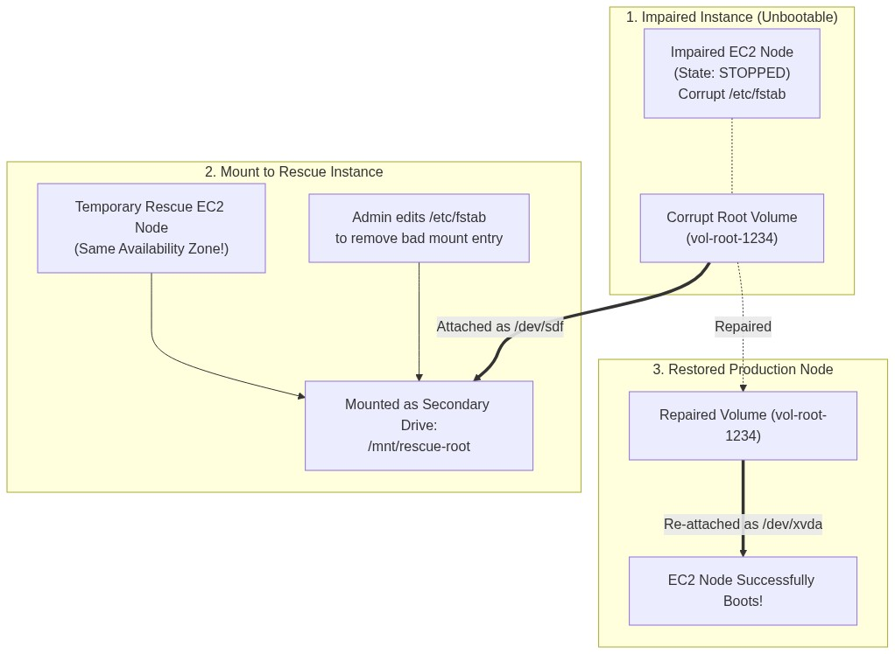
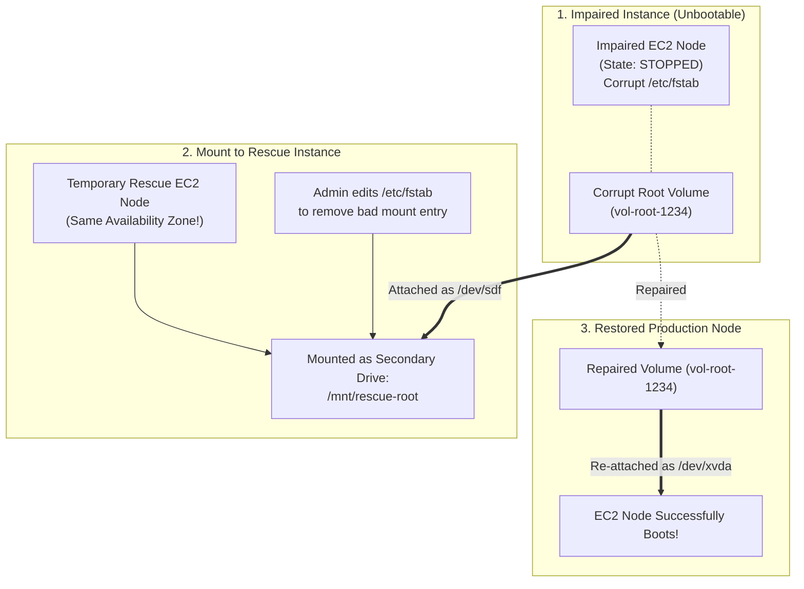

<div align="center">

# 🔬 Lab 7.3: Disaster Recovery: EC2 Serial Console & EBS Root Volume Rescue

**[🏠 AWS Labs Root](../../../README.md)** &nbsp;•&nbsp; **[🖥️ EC2 Curriculum](../../README.md)** &nbsp;•&nbsp; **[📂 Module 07](../README.md)**

    

**[⬅️ Previous Lab](../../module-07-monitoring-and-troubleshooting/lab-02-cloudwatch-agent-metrics-logs/README.md)** &nbsp;|&nbsp; **[➡️ Next Lab](../../module-07-monitoring-and-troubleshooting/lab-04-vpc-flow-logs/README.md)**


<a href="https://cyber-cloud-security.github.io/aws-labs/?lab=lab-03-serial-console-ebs-rescue" target="_blank" rel="noopener noreferrer"></a>

</div>

---

## 📌 Lab Objectives

- [x] Understand how to recover an EC2 instance rendered completely unreachable by operating system failures (corrupt `/etc/fstab`, broken GRUB kernel, network stack crash).
- [x] Configure and connect to the out-of-band **EC2 Serial Console** on AWS Nitro instances.
- [x] Execute the standard **EBS Root Volume Rescue Procedure**: detaching an unbootable root volume, mounting it to a temporary rescue instance to repair system files, and restoring it to production.

---

## 🏗️ Root Volume Rescue Architecture



<details>
<summary>📐 <b>View Mermaid Architecture Source (Click to Expand)</b></summary>


```mermaid
flowchart TD
    subgraph ImpairedState["1. Impaired Instance (Unbootable)"]
        BrokenNode["Impaired EC2 Node\n(State: STOPPED)\nCorrupt /etc/fstab"]
        CorruptEBS["Corrupt Root Volume\n(vol-root-1234)"]
        BrokenNode -.- CorruptEBS
    end

    subgraph RescueState["2. Mount to Rescue Instance"]
        RescueNode["Temporary Rescue EC2 Node\n(Same Availability Zone!)"]
        RescueMount["Mounted as Secondary Drive:\n/mnt/rescue-root"]

        RescueNode --> RescueMount
        CorruptEBS ==>|Attached as /dev/sdf| RescueMount
        AdminRepair["Admin edits /etc/fstab\nto remove bad mount entry"]
        AdminRepair --> RescueMount
    end

    subgraph RestoredState["3. Restored Production Node"]
        CleanEBS["Repaired Volume (vol-root-1234)"]
        CleanNode["EC2 Node Successfully Boots!"]
        CleanEBS ==>|Re-attached as /dev/xvda| CleanNode
    end

    CorruptEBS -.->|Repaired| CleanEBS
```

</details>

---

## 💡 Key Architectural Concepts

1. **Why SSH & SSM Fail**:
   - Both SSH and SSM require an operating system with an active network stack, valid routing tables, running daemons, and cleanly mounted filesystems.
   - If `/etc/fstab` contains an invalid entry without `nofail`, systemd aborts boot and hangs before network services initialize.
2. **EC2 Serial Console**:
   - A direct, virtual serial port (COM1 / ttyS0) connection to the Nitro Hypervisor. It does not require any network connectivity on the instance, allowing keyboard access to GRUB and emergency mode.
3. **EBS Swapping Architecture**:
   - Because EBS volumes are independent networked block devices, you can detach any root volume, repair it from another instance, and reattach it. The original instance retains its identity, private IP, and IAM role.

---

## ⏱️ Prerequisites & Cost

> [!TIP]
> **AWS Free Tier & Cost Guardrail**
> - **AWS Free Tier Eligible**: Yes (`t3.micro`).
> - **Estimated Duration**: 25 minutes.

---

## 🚀 Step-by-Step Instructions

### Part 1: Enable EC2 Serial Console (Account Level)

The EC2 Serial Console is disabled account-wide by default.

1. Enable account-level serial console access in the current region:
```bash
export AWS_REGION=$(aws configure get region || echo "us-east-1")
aws ec2 enable-serial-console-access --region "${AWS_REGION}"
```

2. Verify serial console access status:
```bash
aws ec2 get-serial-console-access-status --region "${AWS_REGION}"
```

---

### Part 2: The EBS Root Volume Rescue Workflow

#### Step 1: Query Broken Instance Details and Stop Instance

1. Fetch instance AZ and root volume ID:
```bash
AZ=$(aws ec2 describe-instances \
  --instance-ids "${BROKEN_ID}" \
  --query "Reservations[0].Instances[0].Placement.AvailabilityZone" \
  --output text)
ROOT_VOL_ID=$(aws ec2 describe-instances \
  --instance-ids "${BROKEN_ID}" \
  --query "Reservations[0].Instances[0].BlockDeviceMappings[0].Ebs.VolumeId" \
  --output text)
```

2. Confirm target volume:
```bash
echo "[INFO] Target broken volume: ${ROOT_VOL_ID} in ${AZ}"
```

3. Stop the impaired instance:
```bash
aws ec2 stop-instances --instance-ids "${BROKEN_ID}"
aws ec2 wait instance-stopped --instance-ids "${BROKEN_ID}"
```

#### Step 2: Detach the Corrupt Root Volume

1. Detach root volume:
```bash
aws ec2 detach-volume --volume-id "${ROOT_VOL_ID}"
aws ec2 wait volume-available --volume-ids "${ROOT_VOL_ID}"
```

2. Confirm detachment:
```bash
echo "[SUCCESS] Corrupt root volume detached."
```

#### Step 3: Launch a Temporary Rescue Instance in the SAME AZ

1. Query subnet ID and latest AMI:
```bash
SUBNET_ID=$(aws ec2 describe-instances \
  --instance-ids "${BROKEN_ID}" \
  --query "Reservations[0].Instances[0].SubnetId" \
  --output text)
AMI_ID=$(aws ssm get-parameter \
  --name "/aws/service/ami-amazon-linux-latest/al2023-ami-kernel-default-x86_64" \
  --query "Parameter.Value" \
  --output text)
```

2. Launch rescue instance:
```bash
RESCUE_ID=$(aws ec2 run-instances \
  --image-id "${AMI_ID}" \
  --instance-type "t3.micro" \
  --subnet-id "${SUBNET_ID}" \
  --tag-specifications "ResourceType=instance,Tags=[{Key=Name,Value=rescue-node}]" \
  --query "Instances[0].InstanceId" --output text)
```

3. Wait for rescue instance boot:
```bash
aws ec2 wait instance-running --instance-ids "${RESCUE_ID}"
echo "[SUCCESS] Rescue node running: ${RESCUE_ID}"
```

#### Step 4: Attach the Corrupt Volume to the Rescue Instance

1. Attach volume as secondary disk (`/dev/sdf`):
```bash
aws ec2 attach-volume \
  --volume-id "${ROOT_VOL_ID}" \
  --instance-id "${RESCUE_ID}" \
  --device "/dev/sdf"
```

2. Wait for attachment:
```bash
aws ec2 wait volume-in-use --volume-ids "${ROOT_VOL_ID}"
```

#### Step 5: Repair Filesystem on Rescue Instance

Log into `RESCUE_ID` via SSM Session Manager or SSH:

1. Identify attached drive partition:
```bash
lsblk
```

2. Mount corrupt partition to a repair mountpoint:
```bash
sudo mkdir -p /mnt/rescue-root
sudo mount -o nouuid /dev/nvme1n1p1 /mnt/rescue-root
```

3. Comment out corrupt or broken mount entries in `/etc/fstab`:
```bash
sudo sed -i 's/^.*bad_mount.*$/# disabled bad mount/' /mnt/rescue-root/etc/fstab
```

4. Safely unmount repaired volume:
```bash
sudo umount /mnt/rescue-root
```

#### Step 6: Detach from Rescue Node and Reattach to Production Node

1. Detach repaired volume from rescue node:
```bash
aws ec2 detach-volume --volume-id "${ROOT_VOL_ID}"
aws ec2 wait volume-available --volume-ids "${ROOT_VOL_ID}"
```

2. Terminate temporary rescue instance:
```bash
aws ec2 terminate-instances --instance-ids "${RESCUE_ID}"
```

3. Reattach volume to original instance as the root device (`/dev/xvda`):
```bash
aws ec2 attach-volume \
  --volume-id "${ROOT_VOL_ID}" \
  --instance-id "${BROKEN_ID}" \
  --device "/dev/xvda"
aws ec2 wait volume-in-use --volume-ids "${ROOT_VOL_ID}"
```

4. Start the recovered instance:
```bash
aws ec2 start-instances --instance-ids "${BROKEN_ID}"
aws ec2 wait instance-running --instance-ids "${BROKEN_ID}"
echo "[SUCCESS] Instance ${BROKEN_ID} successfully resurrected!"
```

---

## 🧹 Teardown & Clean-up

> [!CAUTION]
> **Always Tear Down Lab Resources**: Execute the cleanup commands below immediately after completing the verification steps to prevent unintended AWS billing.

1. Terminate the recovered instance:
```bash
aws ec2 terminate-instances --instance-ids "${BROKEN_ID}"
aws ec2 wait instance-terminated --instance-ids "${BROKEN_ID}"
```

2. Confirm clean-up completion:
```bash
echo "[SUCCESS] Lab 7.3 clean-up completed successfully."
```

---

<div align="center">

**[⬅️ Previous Lab](../../module-07-monitoring-and-troubleshooting/lab-02-cloudwatch-agent-metrics-logs/README.md)** &nbsp;•&nbsp; **[⬆️ Back to Module 07](../README.md)** &nbsp;•&nbsp; **[🏠 EC2 Index](../../README.md)** &nbsp;•&nbsp; **[➡️ Next Lab](../../module-07-monitoring-and-troubleshooting/lab-04-vpc-flow-logs/README.md)**

</div>
