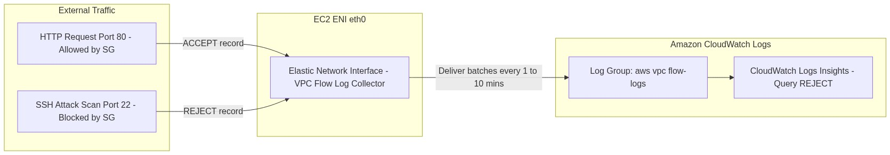
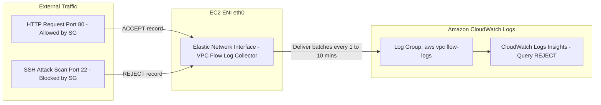

<div align="center">

# 🔬 Lab 7.4: VPC Flow Logs & Network Traffic Forensics

**[🏠 AWS Labs Root](../../../README.md)** &nbsp;•&nbsp; **[🖥️ EC2 Curriculum](../../README.md)** &nbsp;•&nbsp; **[📂 Module 07](../README.md)**

    

**[⬅️ Previous Lab](../../module-07-monitoring-and-troubleshooting/lab-03-serial-console-ebs-rescue/README.md)** &nbsp;|&nbsp; **[➡️ Next Lab](../../module-08-advanced-nitro/lab-01-nitro-architecture/README.md)**


<a href="https://cyber-cloud-security.github.io/aws-labs/?lab=lab-04-vpc-flow-logs" target="_blank" rel="noopener noreferrer"></a>

</div>

---

## 📌 Lab Objectives

- [x] Enable **VPC Flow Logs** targeting an EC2 instance's Elastic Network Interface (ENI).
- [x] Deliver flow logs to an **Amazon CloudWatch Logs** log group.
- [x] Generate intentional network drops (security group block) and inspect the resulting `REJECT` log records.
- [x] Author **CloudWatch Logs Insights** queries to identify top talkers, malicious port scans, and firewall drop anomalies.

---

## 🏗️ Architecture Diagram



<details>
<summary>📐 <b>View Mermaid Architecture Source (Click to Expand)</b></summary>


```mermaid
flowchart LR
    subgraph TrafficSource["External Traffic"]
        AllowedTraffic["HTTP Request Port 80 - Allowed by SG"]
        BlockedTraffic["SSH Attack Scan Port 22 - Blocked by SG"]
    end

    subgraph EC2Bound["EC2 ENI eth0"]
        ENI["Elastic Network Interface - VPC Flow Log Collector"]
    end

    subgraph CloudWatch["Amazon CloudWatch Logs"]
        LG["Log Group: aws vpc flow-logs"]
        Insights["CloudWatch Logs Insights - Query REJECT"]
        LG --> Insights
    end

    AllowedTraffic -->|"ACCEPT record"| ENI
    BlockedTraffic -->|"REJECT record"| ENI
    ENI -->|"Deliver batches every 1 to 10 mins"| LG
```

</details>

---

## 💡 Key Architectural Concepts

### Flow Log Record Format
A standard flow log entry:
```text
2 123456789010 eni-0a1b2c3d4e5f 198.51.100.2 172.31.1.50 54321 80 6 10 840 1695000000 1695000060 ACCEPT OK
```
- `eni-0a1b2c3d...`: The target ENI.
- `198.51.100.2`: Source IP.
- `172.31.1.50`: Destination IP (the EC2 instance).
- `54321`: Source port.
- `80`: Destination port.
- `6`: Protocol (`6` = TCP, `17` = UDP, `1` = ICMP).
- `ACCEPT` / `REJECT`: Action taken by Security Group or NACL.

---

## ⏱️ Prerequisites & Cost

> [!TIP]
> **AWS Free Tier & Cost Guardrail**
> - **AWS Free Tier Eligible**: Yes.
> - **Estimated Duration**: 20 minutes.

---

## 🚀 Step-by-Step Instructions

### Step 1: Create IAM Role for Flow Logs Publishing

1. Query network parameters:
```bash
export AWS_REGION=$(aws configure get region || echo "us-east-1")
export VPC_ID=$(aws ec2 describe-vpcs \
  --filters "Name=isDefault,Values=true" \
  --query "Vpcs[0].VpcId" \
  --output text)
```

2. Create assume role trust policy for VPC Flow Logs:
```bash
cat << 'JSON' > flow-role-trust.json
{
  "Version": "2012-10-17",
  "Statement": [
    {
      "Effect": "Allow",
      "Principal": { "Service": "vpc-flow-logs.amazonaws.com" },
      "Action": "sts:AssumeRole"
    }
  ]
}
JSON
```

3. Create the IAM role:
```bash
FLOW_ROLE_ARN=$(aws iam create-role \
  --role-name "ec2-vpc-flow-logs-publisher" \
  --assume-role-policy-document file://flow-role-trust.json \
  --query "Role.Arn" --output text 2>/dev/null || \
  aws iam get-role \
    --role-name "ec2-vpc-flow-logs-publisher" \
    --query "Role.Arn" \
    --output text)
```

4. Create flow policy document:
```bash
cat << 'JSON' > flow-policy.json
{
  "Version": "2012-10-17",
  "Statement": [
    {
      "Effect": "Allow",
      "Action": [
        "logs:CreateLogGroup",
        "logs:CreateLogStream",
        "logs:PutLogEvents",
        "logs:DescribeLogGroups",
        "logs:DescribeLogStreams"
      ],
      "Resource": "*"
    }
  ]
}
JSON
```

5. Attach policy to the publisher role:
```bash
aws iam put-role-policy \
  --role-name "ec2-vpc-flow-logs-publisher" \
  --policy-name "VPCFlowLogsDelivery" \
  --policy-document file://flow-policy.json
```

### Step 2: Create CloudWatch Log Group & Enable Flow Logs

1. Create CloudWatch Log Group:
```bash
aws logs create-log-group --log-group-name "/aws/vpc/ec2-labs-flowlogs" 2>/dev/null || true
```

2. Enable Flow Logs on the VPC:
```bash
FLOW_LOG_ID=$(aws ec2 create-flow-logs \
  --resource-type "VPC" \
  --resource-ids "${VPC_ID}" \
  --traffic-type "ALL" \
  --log-destination-type "cloud-watch-logs" \
  --log-group-name "/aws/vpc/ec2-labs-flowlogs" \
  --deliver-logs-permission-arn "${FLOW_ROLE_ARN}" \
  --query "FlowLogIds[0]" --output text)
```

3. Confirm Flow Log creation:
```bash
echo "[SUCCESS] Enabled Flow Log: ${FLOW_LOG_ID}"
```

---

## 🔍 Verification & Logs Insights Querying

### 1. Trigger Blocked Connection (Simulated Attack)
Find any running EC2 public IP and send packets to closed port 22 or port 4444:
```bash
nc -z -v -w 2 <EC2_PUBLIC_IP> 22 || true
```

### 2. Query Flow Logs with CloudWatch Logs Insights
Run this CloudWatch Insights query to uncover dropped packets:

1. Initiate the query:
```bash
QUERY_ID=$(aws logs start-query \
  --log-group-name "/aws/vpc/ec2-labs-flowlogs" \
  --start-time $(date -v -1H +%s 2>/dev/null || date -d "1 hour ago" +%s) \
  --end-time $(date +%s) \
  --query-string 'fields @timestamp, srcAddr, dstAddr, dstPort, action
| filter action = "REJECT"
| stats count(*) as dropCount by srcAddr, dstPort
| sort dropCount desc
| limit 10' \
  --query "queryId" --output text)
```

2. Confirm query execution:
```bash
echo "[SUCCESS] Executed query ID: ${QUERY_ID}"
```

3. Retrieve results:
```bash
aws logs get-query-results --query-id "${QUERY_ID}"
```

---

## 🧹 Teardown & Clean-up

> [!CAUTION]
> **Always Tear Down Lab Resources**: Execute the cleanup commands below immediately after completing the verification steps to prevent unintended AWS billing.

1. Delete Flow Log:
```bash
aws ec2 delete-flow-logs --flow-log-ids "${FLOW_LOG_ID}"
```

2. Delete Log Group:
```bash
aws logs delete-log-group --log-group-name "/aws/vpc/ec2-labs-flowlogs" 2>/dev/null || true
```

3. Delete IAM Role policies and role:
```bash
aws iam delete-role-policy \
  --role-name "ec2-vpc-flow-logs-publisher" \
  --policy-name "VPCFlowLogsDelivery"
aws iam delete-role --role-name "ec2-vpc-flow-logs-publisher"
rm -f flow-role-trust.json flow-policy.json
```

4. Confirm clean-up completion:
```bash
echo "[SUCCESS] Lab 7.4 clean-up completed successfully."
```

---

<div align="center">

**[⬅️ Previous Lab](../../module-07-monitoring-and-troubleshooting/lab-03-serial-console-ebs-rescue/README.md)** &nbsp;•&nbsp; **[⬆️ Back to Module 07](../README.md)** &nbsp;•&nbsp; **[🏠 EC2 Index](../../README.md)** &nbsp;•&nbsp; **[➡️ Next Lab](../../module-08-advanced-nitro/lab-01-nitro-architecture/README.md)**

</div>
