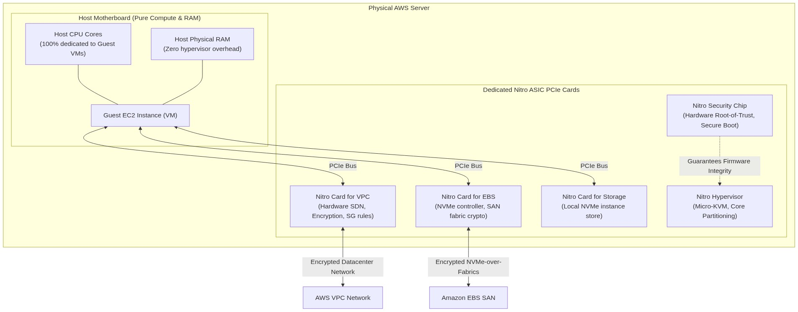
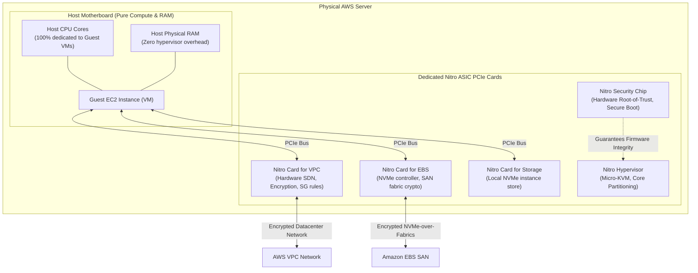

<div align="center">

# 🔬 Lab 8.1: AWS Nitro System Architecture & Hardware Offloading

**[🏠 AWS Labs Root](../../../README.md)** &nbsp;•&nbsp; **[🖥️ EC2 Curriculum](../../README.md)** &nbsp;•&nbsp; **[📂 Module 08](../README.md)**

   

**[⬅️ Previous Lab](../../module-07-monitoring-and-troubleshooting/lab-04-vpc-flow-logs/README.md)** &nbsp;|&nbsp; **[➡️ Next Lab](../../module-08-advanced-nitro/lab-02-nitro-enclaves/README.md)**

</div>

---

## 📌 Lab Objectives

- [x] Understand the technical architecture of the **AWS Nitro System** and why it marked the end of traditional Xen software hypervisors.
- [x] Deconstruct the 5 core Nitro components:
  1. Nitro Card for VPC
  2. Nitro Card for EBS
  3. Nitro Card for Storage (Instance Store)
  4. Nitro Security Chip
  5. Nitro Hypervisor
- [x] Inspect virtualized PCIe devices, NVMe controllers, and hardware queues directly from the Linux guest OS.

---

## 🏗️ AWS Nitro System Architecture



<details>
<summary>📐 <b>View Mermaid Architecture Source (Click to Expand)</b></summary>



</details>

---

## 💡 Key Architectural Concepts

### Why Nitro Changed Cloud Computing
1. **Zero "Hypervisor Tax"**:
   - In legacy cloud virtualization (Xen), ~10–20% of host CPU and memory was consumed by `Dom0` handling network packets, storage I/O, and management daemons.
   - Nitro offloads **all I/O processing** to dedicated PCIe ASIC cards. Almost 100% of host CPU and RAM is allocated directly to customer workloads.
2. **True Bare-Metal Performance**:
   - Because EBS is exposed via standard PCIe NVMe controllers and VPC networking is exposed via standard PCIe ENA devices, the guest OS talks directly to hardware controllers.
3. **Hardware Root of Trust**:
   - The Nitro Security Chip continuously checks firmware signatures on boot, preventing malicious hypervisor tampering or unauthorized firmware modification.

---

## ⏱️ Prerequisites & Cost

> [!TIP]
> **AWS Free Tier & Cost Guardrail**
> - **AWS Free Tier Eligible**: Yes (`t3.micro` or any Nitro-based instance).
> - **Estimated Duration**: 15 minutes.

---

## 🚀 Step-by-Step Instructions

### Step 1: Launch a Nitro-Based Instance
```bash
export AWS_REGION=$(aws configure get region || echo "us-east-1")
export VPC_ID=$(aws ec2 describe-vpcs \
  --filters "Name=isDefault,Values=true" \
  --query "Vpcs[0].VpcId" \
  --output text)
export SUBNET_ID=$(aws ec2 describe-subnets \
  --filters "Name=vpc-id,Values=${VPC_ID}" \
  --query "Subnets[0].SubnetId" \
  --output text)

AMI_ID=$(aws ssm get-parameter \
  --name "/aws/service/ami-amazon-linux-latest/al2023-ami-kernel-default-x86_64" \
  --query "Parameter.Value" --output text)

INSTANCE_ID=$(aws ec2 run-instances \
  --image-id "${AMI_ID}" \
  --instance-type "t3.micro" \
  --subnet-id "${SUBNET_ID}" \
  --tag-specifications "ResourceType=instance,Tags=[{Key=Project,Value=ec2-master-labs},{Key=Name,Value=nitro-explorer}]" \
  --query "Instances[0].InstanceId" --output text)

echo "Launched Nitro Explorer Node: ${INSTANCE_ID}"
aws ec2 wait instance-running --instance-ids "${INSTANCE_ID}"
```

---

## 🔍 Verification & Hardware Telemetry (Guest OS)

Connect to the instance via SSM Session Manager or SSH:

### 1. Inspect PCIe Devices Offloaded to Nitro
Install `pciutils` and inspect the PCIe bus:
```bash
sudo dnf install -y pciutils nvme-cli

lspci -nn
```
**Sample Output**:
```text
00:00.0 Host bridge [0600]: Intel Corporation 440FX ...
00:04.0 Ethernet controller [0200]: Amazon.com, Inc. Elastic Network Adapter (ENA) [1d0f:ec20]
00:1f.0 Non-Volatile memory controller [0108]: Amazon.com, Inc. NVMe Controller [1d0f:8061]
```
Notice vendor ID `[1d0f]`—**Amazon's custom PCI vendor identifier** for Nitro ASIC hardware controllers.

### 2. Inspect NVMe Controllers and EBS Volume Serialization
Query the NVMe subsystem:
```bash
sudo nvme list
```
**Sample Output**:
```text
Node             SN                   Model               Namespace Usage
/dev/nvme0n1     vol0123456789abcdef0 Amazon Elastic Block Store 1    8.59 GB / 8.59 GB
```
Notice the Serial Number (`SN`) of the NVMe disk is the **exact AWS EBS Volume ID** (`vol-xxxx`) passed straight through from the Nitro Card for EBS!

### 3. Check Hypervisor Features in `/proc/cpuinfo`
```bash
grep -E "hypervisor|flags" /proc/cpuinfo | head -n 2
```
On Nitro instances, flags reveal modern hardware virtualization extensions without legacy Xen paravirtualization hooks.

---

## 🧹 Teardown & Clean-up


> [!CAUTION]
> **Always Tear Down Lab Resources**: Execute the cleanup commands below immediately after completing the verification steps to prevent unintended AWS billing.

```bash
aws ec2 terminate-instances --instance-ids "${INSTANCE_ID}"
aws ec2 wait instance-terminated --instance-ids "${INSTANCE_ID}"
echo "Lab 8.1 clean-up completed successfully."
```

---

<div align="center">

**[⬅️ Previous Lab](../../module-07-monitoring-and-troubleshooting/lab-04-vpc-flow-logs/README.md)** &nbsp;•&nbsp; **[⬆️ Back to Module 08](../README.md)** &nbsp;•&nbsp; **[🏠 EC2 Index](../../README.md)** &nbsp;•&nbsp; **[➡️ Next Lab](../../module-08-advanced-nitro/lab-02-nitro-enclaves/README.md)**

</div>
