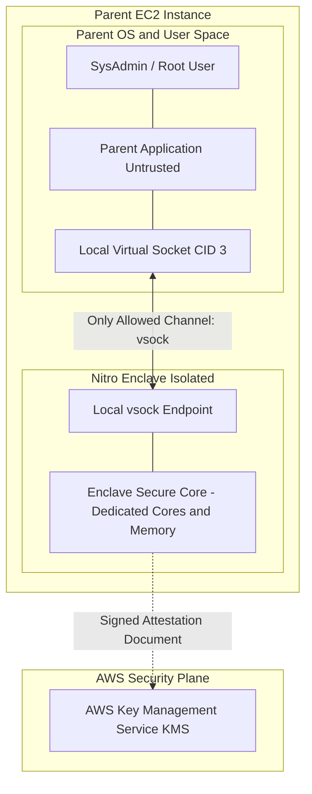

<div align="center">

# 🔬 Lab 8.2: AWS Nitro Enclaves & Cryptographic Confidential Computing

**[🏠 AWS Labs Root](../../../README.md)** &nbsp;•&nbsp; **[🖥️ EC2 Curriculum](../../README.md)** &nbsp;•&nbsp; **[📂 Module 08](../README.md)**

   

**[⬅️ Previous Lab](../../module-08-advanced-nitro/lab-01-nitro-architecture/README.md)** &nbsp;|&nbsp; **➡️ Next Lab (Completed! 🎉)**

</div>

---

## 📌 Lab Objectives

- [x] Understand the security architecture of **AWS Nitro Enclaves** for confidential computing.
- [x] Launch an EC2 instance configured with `--enclave-options Enabled=true`.
- [x] Install the **Nitro Enclaves CLI** (`nitro-cli`) and allocate dedicated CPU cores and RAM to the enclave subsystem.
- [x] Build an **Enclave Image File (`.eif`)** from a minimal container and execute it.
- [x] Understand how **Cryptographic Attestation** allows AWS KMS to conditionally release cryptographic secrets directly inside the enclave via local `vsock`.

---

## 🏗️ Architecture Diagram


<details>
<summary>📐 <b>View Mermaid Architecture Source (Click to Expand)</b></summary>



</details>

---

## 💡 Key Architectural Concepts

### What Makes Nitro Enclaves Confidential?
1. **Zero External Surface Area**:
   - The enclave has **no IP network interface**, no storage disks, no admin console, and no access to the parent OS filesystem.
2. **Untrusted Host Protection**:
   - Even a rogue root administrator or compromised kernel on the parent EC2 instance cannot inspect, debug (`ptrace`), or dump memory pages allocated to the Enclave. The Nitro Hypervisor physically carves out and isolates the memory.
3. **Local `vsock` Protocol**:
   - Communication between parent and enclave occurs strictly over bidirectional point-to-point virtual sockets (`AF_VSOCK`).
4. **KMS Cryptographic Attestation**:
   - The Nitro hypervisor generates a hardware-signed attestation document containing cryptographic hashes (Platform Configuration Registers - PCRs) of the Enclave image.
   - AWS KMS evaluates this document before releasing decrypt keys, ensuring plaintext sensitive data (e.g., cryptocurrency wallet keys, TLS certificates, PII) only exists in enclave RAM.

---

## ⏱️ Prerequisites & Cost

> [!WARNING]
> **Paid Instance / Storage Notice**
> - **Instance Requirement**: Requires an instance type with at least 4 vCPUs (e.g., `c5.xlarge`, `c6i.xlarge`, or `m5.xlarge`) because Nitro Enclaves requires dedicating at least 2 vCPUs and 512 MB RAM to the enclave.
> - **Cost**: ~$0.17/hour. Run the exercise and terminate immediately (< $0.10).
> - **Estimated Duration**: 20 minutes.

---

## 🚀 Step-by-Step Instructions

### Step 1: Launch EC2 Instance with Enclaves Enabled
```bash
export AWS_REGION=$(aws configure get region || echo "us-east-1")
export VPC_ID=$(aws ec2 describe-vpcs \
  --filters "Name=isDefault,Values=true" \
  --query "Vpcs[0].VpcId" \
  --output text)
export SUBNET_ID=$(aws ec2 describe-subnets \
  --filters "Name=vpc-id,Values=${VPC_ID}" \
  --query "Subnets[0].SubnetId" \
  --output text)

AMI_ID=$(aws ssm get-parameter \
  --name "/aws/service/ami-amazon-linux-latest/al2023-ami-kernel-default-x86_64" \
  --query "Parameter.Value" --output text)

# Launch c5.xlarge with Enclaves enabled:
INSTANCE_ID=$(aws ec2 run-instances \
  --image-id "${AMI_ID}" \
  --instance-type "c5.xlarge" \
  --subnet-id "${SUBNET_ID}" \
  --enclave-options Enabled=true \
  --tag-specifications "ResourceType=instance,Tags=[{Key=Project,Value=ec2-master-labs},{Key=Name,Value=nitro-enclave-host}]" \
  --query "Instances[0].InstanceId" --output text)

echo "Launched Enclave Host: ${INSTANCE_ID}"
aws ec2 wait instance-running --instance-ids "${INSTANCE_ID}"
```

### Step 2: Install Nitro CLI & Docker (Guest OS)
Connect to the instance via Session Manager or SSH:
```bash
# 1. Install Nitro Enclaves CLI and Docker
sudo dnf install -y aws-nitro-enclaves-cli aws-nitro-enclaves-cli-devel docker

# 2. Add user to groups and start services
sudo usermod -aG ne-users ec2-user
sudo usermod -aG docker ec2-user
sudo systemctl start docker
sudo systemctl enable docker
sudo systemctl start nitro-enclaves-allocator.service
sudo systemctl enable nitro-enclaves-allocator.service
```

### Step 3: Configure Enclave Resource Allocator
Edit `/etc/nitro_enclaves/allocator.yaml` to reserve 2 vCPUs and 1024 MB RAM for the enclave:
```bash
sudo sed -i 's/memory_mib: .*/memory_mib: 1024/' /etc/nitro_enclaves/allocator.yaml
sudo sed -i 's/cpu_count: .*/cpu_count: 2/' /etc/nitro_enclaves/allocator.yaml

# Restart allocator service
sudo systemctl restart nitro-enclaves-allocator.service
```

---

## 🔍 Verification: Build & Run a Nitro Enclave

### 1. Build a Minimal Docker Container
```bash
mkdir -p ~/hello-enclave && cd ~/hello-enclave

cat <<'DOCKERFILE' > Dockerfile
FROM alpine:latest
CMD while true; do echo "Hello from inside Secure Nitro Enclave at $(date)"; sleep 5; done
DOCKERFILE

sudo docker build -t hello-enclave:latest .
```

### 2. Convert Container to Enclave Image File (`.eif`)
```bash
nitro-cli build-enclave \
  --docker-uri hello-enclave:latest \
  --output-file hello-enclave.eif
```
Notice the cryptographic measurement output:
- `PCR0`: Hash of the kernel and enclave image.
- `PCR1`: Hash of the OS kernel and boot parameters.
- `PCR2`: Hash of the application code.

### 3. Run the Enclave
```bash
nitro-cli run-enclave \
  --eif-path hello-enclave.eif \
  --cpu-count 2 \
  --memory-mib 1024 \
  --debug-mode
```

### 4. Inspect Enclave Status & Console
Query running enclaves:
```bash
nitro-cli describe-enclaves
```
View the enclave console output:
```bash
ENCLAVE_ID=$(nitro-cli describe-enclaves | grep -oP '(?<="EnclaveID": ")[^"]*')
nitro-cli console --enclave-id "${ENCLAVE_ID}"
```
**Output**:
```text
Hello from inside Secure Nitro Enclave at ...
Hello from inside Secure Nitro Enclave at ...
```
Terminate the console stream with `Ctrl + C`.

---

## 📘 Deep-Dive Command & Flag Reference

> [!TIP]
> **Line-by-Line Production Analysis**: Every command executed in this lab is dissected below, explaining each CLI flag, JMESPath query, Linux kernel parameter, and why it is critical in production automation.

<details open>
<summary>📘 <b>Command 1 & 2: Launching an EC2 Instance with Enclaves Enabled</b></summary>

```bash
export AWS_REGION=$(aws configure get region || echo "us-east-1")
export VPC_ID=$(aws ec2 describe-vpcs \
  --filters "Name=isDefault,Values=true" \
  --query "Vpcs[0].VpcId" \
  --output text)
export SUBNET_ID=$(aws ec2 describe-subnets \
  --filters "Name=vpc-id,Values=${VPC_ID}" \
  --query "Subnets[0].SubnetId" \
  --output text)

AMI_ID=$(aws ssm get-parameter \
  --name "/aws/service/ami-amazon-linux-latest/al2023-ami-kernel-default-x86_64" \
  --query "Parameter.Value" --output text)

INSTANCE_ID=$(aws ec2 run-instances \
  --image-id "${AMI_ID}" \
  --instance-type "c5.xlarge" \
  --subnet-id "${SUBNET_ID}" \
  --enclave-options Enabled=true \
  --tag-specifications "ResourceType=instance,Tags=[{Key=Project,Value=ec2-master-labs},{Key=Name,Value=nitro-enclave-host}]" \
  --query "Instances[0].InstanceId" --output text)

echo "Launched Enclave Host: ${INSTANCE_ID}"
aws ec2 wait instance-running --instance-ids "${INSTANCE_ID}"
```

#### 🔍 Parameter & Component Breakdown
- **`export AWS_REGION=...`, `VPC_ID=...`, `SUBNET_ID=...`** — Identifies network deployment target.
- **`AMI_ID=...`** — Queries the Amazon Linux 2023 base AMI.
- **`aws ec2 run-instances`** — Launches the host compute instance.
- **`--instance-type "c5.xlarge"`** — Nitro Enclaves requires an instance type with at least 4 vCPUs (e.g. `c5.xlarge`, `m5.xlarge`) because carving out an enclave requires dedicating at least 2 physical vCPU threads away from the parent operating system.
- **`--enclave-options Enabled=true`** — **Crucial parameter**. Instructs the AWS Nitro hypervisor to reserve CPU core partitioning and memory isolation features for this instance. This cannot be enabled on an instance after it is launched without stopping it first.
- **`aws ec2 wait instance-running`** — Waits until the instance is fully initialized.

> 🏭 **Why This Matters in Production Automation**
> Nitro Enclaves provides isolated compute environments to protect highly sensitive data (e.g., blockchain private keys, credit card numbers, confidential AI models). Setting `--enclave-options Enabled=true` flags the hypervisor to allocate the hardware security mechanisms before the kernel boots.

</details>

<details open>
<summary>📘 <b>Command 3: Installing the Nitro CLI and Enabling System Services</b></summary>

```bash
sudo dnf install -y aws-nitro-enclaves-cli aws-nitro-enclaves-cli-devel docker

sudo usermod -aG ne-users ec2-user
sudo usermod -aG docker ec2-user
sudo systemctl start docker
sudo systemctl enable docker
sudo systemctl start nitro-enclaves-allocator.service
sudo systemctl enable nitro-enclaves-allocator.service
```

#### 🔍 Parameter & Component Breakdown
- **`sudo dnf install -y aws-nitro-enclaves-cli ...`** — Installs the CLI binaries (`nitro-cli`), development headers, and the Docker container engine required to package applications into enclave images.
- **`sudo usermod -aG ne-users ec2-user`** — Adds the non-root user `ec2-user` to the `ne-users` group, granting permissions to communicate with the local enclave hypervisor device `/dev/nitro_enclaves`.
- **`sudo systemctl start/enable docker`** — Starts and enables the container runtime daemon across reboots.
- **`sudo systemctl start/enable nitro-enclaves-allocator.service`** — Activates the Linux systemd service responsible for reserving and locking physical memory and CPU cores for the enclave subsystem.

> 🏭 **Why This Matters in Production Automation**
> The Nitro CLI relies on the local kernel allocator daemon to carve out contiguous physical memory regions that are strictly shielded from the parent Linux operating system.

</details>

<details open>
<summary>📘 <b>Command 4: Configuring the Enclave Resource Allocator</b></summary>

```bash
sudo sed -i 's/memory_mib: .*/memory_mib: 1024/' /etc/nitro_enclaves/allocator.yaml
sudo sed -i 's/cpu_count: .*/cpu_count: 2/' /etc/nitro_enclaves/allocator.yaml

sudo systemctl restart nitro-enclaves-allocator.service
```

#### 🔍 Parameter & Component Breakdown
- **`/etc/nitro_enclaves/allocator.yaml`** — The static configuration file governing resource reservation on the parent OS.
- **`sed -i 's/memory_mib: .../memory_mib: 1024/'`** — Reserves exactly 1024 MiB (1 GiB) of hugepages memory for enclave execution.
- **`sed -i 's/cpu_count: .../cpu_count: 2/'`** — Reserves 2 vCPUs exclusively for the enclave. These vCPUs are completely detached from the parent OS scheduler.
- **`sudo systemctl restart nitro-enclaves-allocator.service`** — Re-applies the kernel memory reservation.

> 🏭 **Why This Matters in Production Automation**
> Unlike standard containers (Docker, Kubernetes) that dynamically share host memory and CPU schedulers, a Nitro Enclave requires dedicated hardware resource reservation. Once allocated, the parent OS cannot access or page out this memory.

</details>

<details open>
<summary>📘 <b>Command 5: Authoring and Building the Minimal Enclave Container</b></summary>

```bash
mkdir -p ~/hello-enclave && cd ~/hello-enclave

cat <<'DOCKERFILE' > Dockerfile
FROM alpine:latest
CMD while true; do echo "Hello from inside Secure Nitro Enclave at $(date)"; sleep 5; done
DOCKERFILE

sudo docker build -t hello-enclave:latest .
```

#### 🔍 Parameter & Component Breakdown
- **`mkdir -p ~/hello-enclave && cd ~/hello-enclave`** — Creates the build workspace.
- **`cat <<'DOCKERFILE' > Dockerfile`** — Simple Alpine Linux container definition containing a loop that prints a heartbeat message.
- **`sudo docker build -t hello-enclave:latest .`** — Assembles the base container image.

> 🏭 **Why This Matters in Production Automation**
> Nitro Enclaves use standard OCI Docker container images as their application packaging format. Any containerized application (Python, Go, Java, Rust) can be converted into a Nitro Enclave image without rewriting application code.

</details>

<details open>
<summary>📘 <b>Command 6: Converting Container to an Enclave Image File (.eif)</b></summary>

```bash
nitro-cli build-enclave \
  --docker-uri hello-enclave:latest \
  --output-file hello-enclave.eif
```

#### 🔍 Parameter & Component Breakdown
- **`nitro-cli build-enclave`** — Packaging compiler that takes a Docker container image and wraps it into an encrypted, signed AWS Enclave Image File (`.eif`).
- **`--docker-uri hello-enclave:latest`** — Source container image.
- **`--output-file hello-enclave.eif`** — The compiled output file containing a stripped-down Linux kernel, initrd, and the application layers.
- Output Cryptographic Measurements (PCRs):
  - **`PCR0`** — SHA384 hash of the entire enclave image (kernel, initrd, application).
  - **`PCR1`** — SHA384 hash of the OS kernel and boot arguments.
  - **`PCR2`** — SHA384 hash of the application code and libraries.

> 🏭 **Why This Matters in Production Automation**
> These Platform Configuration Register (PCR) measurements form the foundation of **Cryptographic Attestation**. When the enclave requests decryption keys from AWS KMS, the enclave's Nitro hypervisor presents a hardware-signed attestation document proving that the code running inside the enclave exactly matches these PCR hashes. If an attacker tampers with even a single byte of the image, the PCR hash changes and KMS refuses to release the decryption keys.

</details>

<details open>
<summary>📘 <b>Command 7: Running the Enclave</b></summary>

```bash
nitro-cli run-enclave \
  --eif-path hello-enclave.eif \
  --cpu-count 2 \
  --memory-mib 1024 \
  --debug-mode
```

#### 🔍 Parameter & Component Breakdown
- **`nitro-cli run-enclave`** — Commands the Nitro hypervisor to boot the `.eif` image into the isolated CPU and RAM partitions.
- **`--eif-path hello-enclave.eif`** — Path to the compiled enclave binary.
- **`--cpu-count 2`** — Assigns the 2 reserved vCPUs.
- **`--memory-mib 1024`** — Allocates the 1024 MiB of isolated memory.
- **`--debug-mode`** — Enables console output streaming for development and debugging. (In strict production mode, `--debug-mode` is disabled, meaning PCR0 changes and no console output is exposed to the parent OS).

> 🏭 **Why This Matters in Production Automation**
> Launches the secure confidential enclave. Once running, the enclave has **zero external network connectivity** (no IP, no Ethernet card), **no local disk storage**, and **no administrative shell**. The parent OS cannot inspect its memory space.

</details>

<details open>
<summary>📘 <b>Command 8: Monitoring Enclave Health and Inspecting Console Stream</b></summary>

```bash
nitro-cli describe-enclaves

ENCLAVE_ID=$(nitro-cli describe-enclaves | grep -oP '(?<="EnclaveID": ")[^"]*')
nitro-cli console --enclave-id "${ENCLAVE_ID}"
```

#### 🔍 Parameter & Component Breakdown
- **`nitro-cli describe-enclaves`** — Returns JSON metadata for all active enclaves on the host (EnclaveID, ProcessID, EnclaveCID, MemoryMiB, CPUS).
- **`ENCLAVE_ID=...`** — Extracts the active enclave identifier string (e.g., `enc-0123456789abcdef0`).
- **`nitro-cli console --enclave-id "${ENCLAVE_ID}"`** — Attaches a read-only stream to the enclave's virtual serial console, displaying stdout/stderr logs emitted from within the enclave.

> 🏭 **Why This Matters in Production Automation**
> Validates that the enclave booted successfully and is executing its workload. Communication with the enclave in production is handled strictly via local virtual sockets (`AF_VSOCK`) over the host's Context ID (`CID`).

</details>

<details open>
<summary>📘 <b>Command 9: Automated Teardown and Cleanup</b></summary>

```bash
nitro-cli terminate-enclave --enclave-id "${ENCLAVE_ID}" 2>/dev/null || true

aws ec2 terminate-instances --instance-ids "${INSTANCE_ID}"
aws ec2 wait instance-terminated --instance-ids "${INSTANCE_ID}"
echo "Lab 8.2 clean-up completed successfully."
```

#### 🔍 Parameter & Component Breakdown
- **`nitro-cli terminate-enclave`** — Destroys the enclave instance and securely zeroes out its isolated memory partition.
- **`aws ec2 terminate-instances` and `wait`** — Terminates the parent host EC2 instance.

> 🏭 **Why This Matters in Production Automation**
> Immediately halts charges for the larger compute instance (`c5.xlarge`) used for the enclave lab, maintaining cost efficiency.

</details>

---

## 🧹 Teardown & Clean-up


> [!CAUTION]
> **Always Tear Down Lab Resources**: Execute the cleanup commands below immediately after completing the verification steps to prevent unintended AWS billing.

```bash
# Inside instance:
nitro-cli terminate-enclave --enclave-id "${ENCLAVE_ID}" 2>/dev/null || true

# From local terminal:
aws ec2 terminate-instances --instance-ids "${INSTANCE_ID}"
aws ec2 wait instance-terminated --instance-ids "${INSTANCE_ID}"
echo "Lab 8.2 clean-up completed successfully."
```

---

<div align="center">

**[⬅️ Previous Lab](../../module-08-advanced-nitro/lab-01-nitro-architecture/README.md)** &nbsp;•&nbsp; **[⬆️ Back to Module 08](../README.md)** &nbsp;•&nbsp; **[🏠 EC2 Index](../../README.md)** &nbsp;•&nbsp; **➡️ Next Lab (Completed! 🎉)**

</div>
