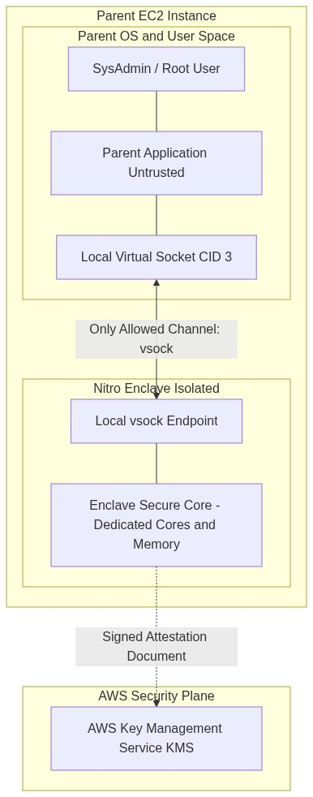
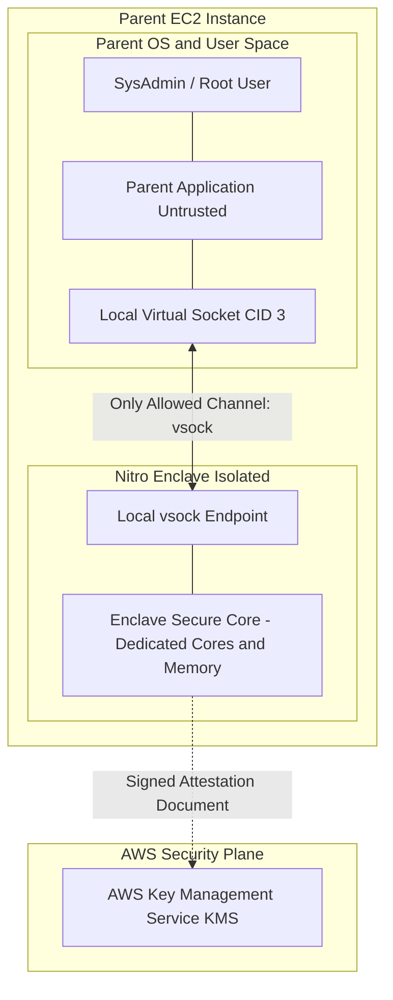

<div align="center">

# 🔬 Lab 8.2: AWS Nitro Enclaves & Cryptographic Confidential Computing

**[🏠 AWS Labs Root](../../../README.md)** &nbsp;•&nbsp; **[🖥️ EC2 Curriculum](../../README.md)** &nbsp;•&nbsp; **[📂 Module 08](../README.md)**

   

**[⬅️ Previous Lab](../../module-08-advanced-nitro/lab-01-nitro-architecture/README.md)** &nbsp;|&nbsp; **➡️ Next Lab (Completed! 🎉)**

</div>

---

## 📌 Lab Objectives

- [x] Understand the security architecture of **AWS Nitro Enclaves** for confidential computing.
- [x] Launch an EC2 instance configured with `--enclave-options Enabled=true`.
- [x] Install the **Nitro Enclaves CLI** (`nitro-cli`) and allocate dedicated CPU cores and RAM to the enclave subsystem.
- [x] Build an **Enclave Image File (`.eif`)** from a minimal container and execute it.
- [x] Understand how **Cryptographic Attestation** allows AWS KMS to conditionally release cryptographic secrets directly inside the enclave via local `vsock`.

---

## 🏗️ Architecture Diagram



<details>
<summary>📐 <b>View Mermaid Architecture Source (Click to Expand)</b></summary>



</details>

---

## 💡 Key Architectural Concepts

### What Makes Nitro Enclaves Confidential?
1. **Zero External Surface Area**:
   - The enclave has **no IP network interface**, no storage disks, no admin console, and no access to the parent OS filesystem.
2. **Untrusted Host Protection**:
   - Even a rogue root administrator or compromised kernel on the parent EC2 instance cannot inspect, debug (`ptrace`), or dump memory pages allocated to the Enclave. The Nitro Hypervisor physically carves out and isolates the memory.
3. **Local `vsock` Protocol**:
   - Communication between parent and enclave occurs strictly over bidirectional point-to-point virtual sockets (`AF_VSOCK`).
4. **KMS Cryptographic Attestation**:
   - The Nitro hypervisor generates a hardware-signed attestation document containing cryptographic hashes (Platform Configuration Registers - PCRs) of the Enclave image.
   - AWS KMS evaluates this document before releasing decrypt keys, ensuring plaintext sensitive data (e.g., cryptocurrency wallet keys, TLS certificates, PII) only exists in enclave RAM.

---

## ⏱️ Prerequisites & Cost

> [!WARNING]
> **Paid Instance / Storage Notice**
> - **Instance Requirement**: Requires an instance type with at least 4 vCPUs (e.g., `c5.xlarge`, `c6i.xlarge`, or `m5.xlarge`) because Nitro Enclaves requires dedicating at least 2 vCPUs and 512 MB RAM to the enclave.
> - **Cost**: ~$0.17/hour. Run the exercise and terminate immediately (< $0.10).
> - **Estimated Duration**: 20 minutes.

---

## 🚀 Step-by-Step Instructions

### Step 1: Launch EC2 Instance with Enclaves Enabled
```bash
export AWS_REGION=$(aws configure get region || echo "us-east-1")
export VPC_ID=$(aws ec2 describe-vpcs \
  --filters "Name=isDefault,Values=true" \
  --query "Vpcs[0].VpcId" \
  --output text)
export SUBNET_ID=$(aws ec2 describe-subnets \
  --filters "Name=vpc-id,Values=${VPC_ID}" \
  --query "Subnets[0].SubnetId" \
  --output text)

AMI_ID=$(aws ssm get-parameter \
  --name "/aws/service/ami-amazon-linux-latest/al2023-ami-kernel-default-x86_64" \
  --query "Parameter.Value" --output text)

# Launch c5.xlarge with Enclaves enabled:
INSTANCE_ID=$(aws ec2 run-instances \
  --image-id "${AMI_ID}" \
  --instance-type "c5.xlarge" \
  --subnet-id "${SUBNET_ID}" \
  --enclave-options Enabled=true \
  --tag-specifications "ResourceType=instance,Tags=[{Key=Project,Value=ec2-master-labs},{Key=Name,Value=nitro-enclave-host}]" \
  --query "Instances[0].InstanceId" --output text)

echo "Launched Enclave Host: ${INSTANCE_ID}"
aws ec2 wait instance-running --instance-ids "${INSTANCE_ID}"
```

### Step 2: Install Nitro CLI & Docker (Guest OS)
Connect to the instance via Session Manager or SSH:
```bash
# 1. Install Nitro Enclaves CLI and Docker
sudo dnf install -y aws-nitro-enclaves-cli aws-nitro-enclaves-cli-devel docker

# 2. Add user to groups and start services
sudo usermod -aG ne-users ec2-user
sudo usermod -aG docker ec2-user
sudo systemctl start docker
sudo systemctl enable docker
sudo systemctl start nitro-enclaves-allocator.service
sudo systemctl enable nitro-enclaves-allocator.service
```

### Step 3: Configure Enclave Resource Allocator
Edit `/etc/nitro_enclaves/allocator.yaml` to reserve 2 vCPUs and 1024 MB RAM for the enclave:
```bash
sudo sed -i 's/memory_mib: .*/memory_mib: 1024/' /etc/nitro_enclaves/allocator.yaml
sudo sed -i 's/cpu_count: .*/cpu_count: 2/' /etc/nitro_enclaves/allocator.yaml

# Restart allocator service
sudo systemctl restart nitro-enclaves-allocator.service
```

---

## 🔍 Verification: Build & Run a Nitro Enclave

### 1. Build a Minimal Docker Container
```bash
mkdir -p ~/hello-enclave && cd ~/hello-enclave

cat <<'DOCKERFILE' > Dockerfile
FROM alpine:latest
CMD while true; do echo "Hello from inside Secure Nitro Enclave at $(date)"; sleep 5; done
DOCKERFILE

sudo docker build -t hello-enclave:latest .
```

### 2. Convert Container to Enclave Image File (`.eif`)
```bash
nitro-cli build-enclave \
  --docker-uri hello-enclave:latest \
  --output-file hello-enclave.eif
```
Notice the cryptographic measurement output:
- `PCR0`: Hash of the kernel and enclave image.
- `PCR1`: Hash of the OS kernel and boot parameters.
- `PCR2`: Hash of the application code.

### 3. Run the Enclave
```bash
nitro-cli run-enclave \
  --eif-path hello-enclave.eif \
  --cpu-count 2 \
  --memory-mib 1024 \
  --debug-mode
```

### 4. Inspect Enclave Status & Console
Query running enclaves:
```bash
nitro-cli describe-enclaves
```
View the enclave console output:
```bash
ENCLAVE_ID=$(nitro-cli describe-enclaves | grep -oP '(?<="EnclaveID": ")[^"]*')
nitro-cli console --enclave-id "${ENCLAVE_ID}"
```
**Output**:
```text
Hello from inside Secure Nitro Enclave at ...
Hello from inside Secure Nitro Enclave at ...
```
Terminate the console stream with `Ctrl + C`.

---

## 🧹 Teardown & Clean-up


> [!CAUTION]
> **Always Tear Down Lab Resources**: Execute the cleanup commands below immediately after completing the verification steps to prevent unintended AWS billing.

```bash
# Inside instance:
nitro-cli terminate-enclave --enclave-id "${ENCLAVE_ID}" 2>/dev/null || true

# From local terminal:
aws ec2 terminate-instances --instance-ids "${INSTANCE_ID}"
aws ec2 wait instance-terminated --instance-ids "${INSTANCE_ID}"
echo "Lab 8.2 clean-up completed successfully."
```

---

<div align="center">

**[⬅️ Previous Lab](../../module-08-advanced-nitro/lab-01-nitro-architecture/README.md)** &nbsp;•&nbsp; **[⬆️ Back to Module 08](../README.md)** &nbsp;•&nbsp; **[🏠 EC2 Index](../../README.md)** &nbsp;•&nbsp; **➡️ Next Lab (Completed! 🎉)**

</div>
